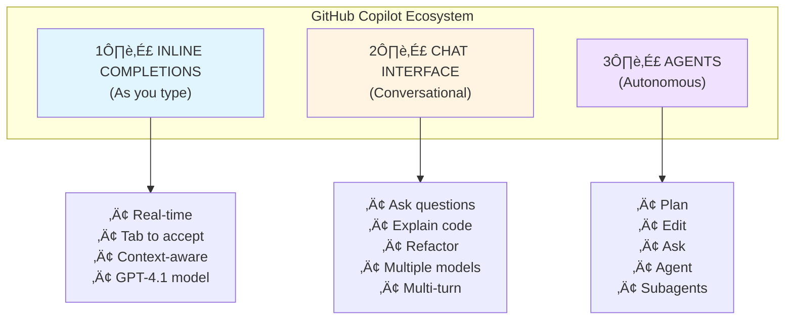
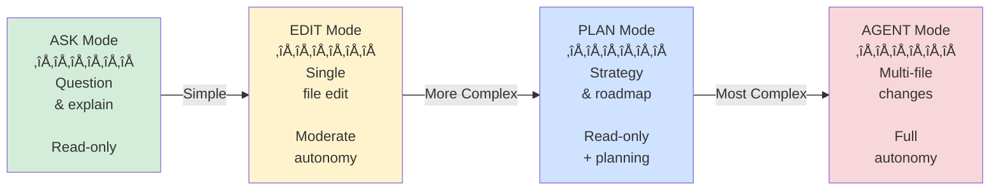
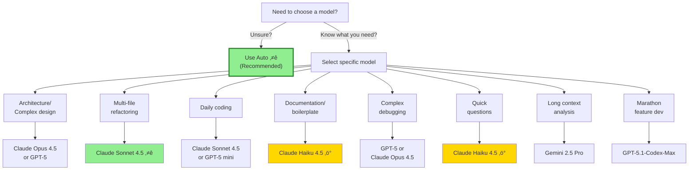
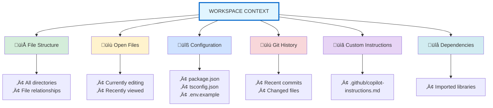
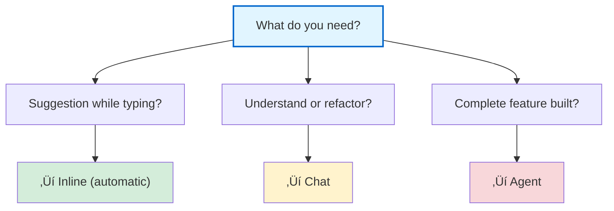
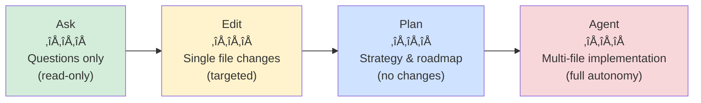
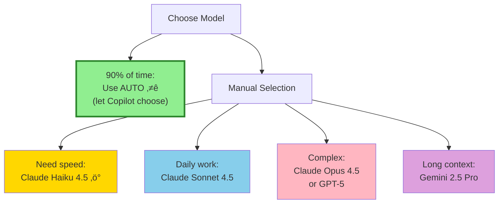

# Part 1, Section 1: Mental Models & Architecture

**Part of**: [VS Code & GitHub Copilot: Complete Technical Guide](../../README.md)  
**Estimated reading time**: 30 minutes  
**Prerequisites**: None - start here!

---

## üìã Overview

Before diving into GitHub Copilot, you need to understand **how it thinks** and **how you should think about it**. This section builds the mental models that will make everything else click.

**What you'll learn:**
- The GitHub Copilot ecosystem and its components
- How different AI models work and when to use each
- The architecture of inline completions, chat, and agents
- How workspace context powers intelligent suggestions

**Why this matters:** Understanding these concepts prevents frustration and unlocks Copilot's full potential. You'll know *why* something works, not just *how* to use it.

---

## 🧠 The GitHub Copilot Ecosystem

### Three Interaction Modes

Think of GitHub Copilot as having **three distinct personalities**, each optimized for different tasks:



### 1️⃣ Inline Completions: Your Coding Copilot

**What it is:** Real-time code suggestions as you type, like an extremely intelligent autocomplete.

**How it works:**
- Analyzes your current file, cursor position, and surrounding code
- Predicts what you're likely to write next
- Shows suggestions in ghost text (gray text)
- Accept with `Tab`, reject with `Esc`

**Powered by:** GPT-4.1 (optimized for code completions, trained on high-quality GitHub repositories)

**Best for:**
- ‚úÖ Writing function implementations
- ‚úÖ Completing boilerplate code
- ‚úÖ Generating repetitive patterns
- ‚úÖ Writing tests following existing patterns
- ‚úÖ Implementing standard algorithms

**Example:**

```typescript
// You type this function signature:
function calculateCompoundInterest(principal: number, rate: number, years: number) {
  // Copilot suggests the entire implementation:
  const amount = principal * Math.pow(1 + rate, years);
  return amount - principal;
}
```

**Mental model:** Think of it as **pair programming with someone who's seen millions of code examples** and knows what usually comes next.

---

### 2️⃣ Chat Interface: Your AI Pair Programmer

**What it is:** Conversational AI assistant that understands your entire codebase and can explain, refactor, and generate code through dialogue.

**Three ways to access it:**

| Interface | Shortcut | Best For | Context |
|-----------|----------|----------|---------|
| **Quick Chat** | `Ctrl+Shift+Alt+L` | Fast questions, syntax help | Current file |
| **Inline Chat** | `Ctrl+I` | Edit current file, refactor | Current selection |
| **Chat View** | `Ctrl+Alt+I` | Complex features, planning | Full workspace |

**Powered by:** Multiple AI models (you can choose or use Auto selection)

**Best for:**
- ‚úÖ Understanding unfamiliar code
- ‚úÖ Planning feature implementation
- ‚úÖ Refactoring complex logic
- ‚úÖ Debugging issues
- ‚úÖ Generating documentation
- ‚úÖ Code reviews

**Example:**

```
You: "@workspace How does authentication work in this app?"

Copilot: "Based on your workspace, authentication uses JWT tokens:

1. User logs in via POST /api/auth/login (src/routes/auth.ts)
2. Server validates credentials (src/services/auth-service.ts)
3. JWT token generated with 24h expiry (src/utils/jwt.ts)
4. Token stored in httpOnly cookie
5. Protected routes verify token via middleware (src/middleware/auth.ts)

The flow uses bcrypt for password hashing and includes rate limiting."
```

**Mental model:** Think of it as **having a senior developer who's already read your entire codebase** and can answer questions or help implement features.

---

### 3️⃣ Agents: Your Autonomous Development Team

**What it is:** AI agents that can autonomously plan, read files, make changes, and execute multi-step tasks across your entire workspace.

**Four built-in agent modes:**



**Agent mode details:**

| Mode | Autonomy | Capabilities | Use Case Example |
|------|----------|--------------|------------------|
| **Ask** | Read-only | Answers questions, explains code | "Explain this authentication flow" |
| **Edit** | Single file | Targeted code changes | "Add error handling to this function" |
| **Plan** | Read-only | Creates implementation roadmap | "Plan OAuth2 implementation strategy" |
| **Agent** | Full | Multi-file changes, testing, refactoring | "Implement OAuth2 across all controllers" |

**Subagents:** For complex tasks, agents can spawn **subagents** to handle subtasks in isolation, preventing context pollution.

**Mental model:** Think of it as **having a junior developer you can delegate complete features to**, with the ability to read your codebase, make changes, and even test their work.

---

## 🤖 AI Model Family: Choose Your Brain

GitHub Copilot supports **multiple AI models** with different strengths. Understanding them helps you work smarter and faster.

### ⭐ The Easy Choice: AUTO Mode

**Recommendation for 90% of tasks:** Use **Auto** and let Copilot choose the best model.

**Auto mode automatically selects based on:**
- Task complexity
- Available models and rate limits
- Cost optimization
- Performance requirements

**When to use Auto:**
- ‚úÖ You're unsure which model to choose
- ‚úÖ You want automatic cost optimization
- ‚úÖ You want to avoid rate limiting
- ‚úÖ You trust Copilot to make the right choice

**When to manually select:**
- You need specific model capabilities (e.g., Gemini 2.5 Pro for massive context)
- You're comparing model outputs
- You have specific requirements ("must use Claude only")

---

### 🎯 The Model Lineup (December 2025)

**Quick reference table:**

| Model | Speed | Quality | Cost | Best For |
|-------|-------|---------|------|----------|
| **Auto** | Varies | Adaptive | Optimized | Let Copilot decide ⭐ |
| **Claude Opus 4.5** | Slower | Highest | Premium | Architecture, complex reasoning |
| **Claude Sonnet 4.5** | Medium | High | Standard | Multi-file work, daily coding ⭐ |
| **Claude Haiku 4.5** | Fastest | Good | Lower | Quick tasks, docs, boilerplate ‚ö° |
| **GPT-5.1-Codex-Max** | Slow | Highest | Premium | Marathon coding sessions |
| **GPT-5** | Slow | Very High | Premium | Complex analysis, deep reasoning |
| **GPT-5 mini** | Fast | High | Standard | Fast deep reasoning |
| **GPT-4.1** | Fast | High | Included | Inline suggestions (default) |
| **Gemini 2.5 Pro** | Medium | High | Premium | Long context (1M+ tokens) |

---

### üìä Model Deep Dive

#### 🏆 Claude Opus 4.5 - The Architect
```
Strengths: Deepest reasoning, complex problem-solving
Speed:     ‚ö´‚ö´‚ö™‚ö™‚ö™ (Slow but thorough)
Quality:   ‚ö´‚ö´‚ö´‚ö´‚ö´ (Highest)
Cost:      💰💰💰 (Premium)
```

**Use when:**
- Designing system architecture
- Solving complex algorithmic problems
- Debugging intricate issues
- Making critical technical decisions

**Example task:** "Design a scalable microservices architecture for a real-time trading platform with eventual consistency guarantees."

---

#### ⚖️ Claude Sonnet 4.5 - The Workhorse ⭐
```
Strengths: Balanced speed + quality, excellent multi-file context
Speed:     ‚ö´‚ö´‚ö´‚ö™‚ö™ (Medium)
Quality:   ‚ö´‚ö´‚ö´‚ö´‚ö™ (High)
Cost:      💰💰 (Standard)
```

**Use when:**
- Daily development work (most common choice)
- Multi-file refactoring
- Code reviews
- Understanding large codebases
- Implementing features

**Why it's popular:** Perfect balance of speed and quality. Can switch between quick answers and deep problem-solving.

**Example task:** "Refactor the authentication module to use dependency injection and add comprehensive error handling."

---

#### ‚ö° Claude Haiku 4.5 - The Sprinter
```
Strengths: Fastest responses, cost-effective, solid quality
Speed:     ‚ö´‚ö´‚ö´‚ö´‚ö´ (Fastest)
Quality:   ‚ö´‚ö´‚ö´‚ö™‚ö™ (Good)
Cost:      üí∞ (Lower)
```

**Use when:**
- Writing documentation
- Generating boilerplate
- Simple refactoring
- Quick questions
- Test generation
- Scaffolding code

**Cost saver:** Use this for 40-50% of daily tasks to significantly reduce costs.

**Example task:** "Generate JSDoc comments for all functions in this file" or "Create a Jest test suite for this utility module."

---

#### 🧠 GPT-5 - The Deep Thinker
```
Strengths: Step-by-step reasoning, complex analysis
Speed:     ‚ö´‚ö´‚ö™‚ö™‚ö™ (Slow)
Quality:   ‚ö´‚ö´‚ö´‚ö´‚ö´ (Very High)
Cost:      💰💰💰 (Premium)
```

**Use when:**
- Multi-step debugging
- Complex code analysis
- Understanding intricate systems
- Research tasks

**Example task:** "Analyze why this distributed system is experiencing race conditions and propose a comprehensive solution."

---

#### ⚡🧠 GPT-5 mini - Fast + Smart
```
Strengths: Fast responses with good reasoning
Speed:     ‚ö´‚ö´‚ö´‚ö´‚ö™ (Fast)
Quality:   ‚ö´‚ö´‚ö´‚ö´‚ö™ (High)
Cost:      💰💰 (Standard)
```

**Use when:**
- Need reasoning but want speed
- Daily development with quality
- Balanced performance

**Example task:** "Optimize this database query and explain the performance improvements."

---

#### üí™ GPT-5.1-Codex-Max - The Marathon Runner
```
Strengths: Optimized for long coding sessions, cybersecurity
Speed:     ‚ö´‚ö´‚ö™‚ö™‚ö™ (Slow for complex work)
Quality:   ‚ö´‚ö´‚ö´‚ö´‚ö´ (Highest for sustained work)
Cost:      💰💰💰 (Premium)
```

**Use when:**
- Implementing large features
- Security-critical code
- Extended development sessions
- Complex system implementation

**Example task:** "Implement a complete OAuth2 flow with PKCE, token rotation, and security hardening."

---

#### 📄 Gemini 2.5 Pro - The Context King
```
Strengths: Massive context window (1M+ tokens), advanced reasoning
Speed:     ‚ö´‚ö´‚ö´‚ö™‚ö™ (Medium)
Quality:   ‚ö´‚ö´‚ö´‚ö´‚ö™ (High)
Cost:      💰💰💰 (Premium)
```

**Use when:**
- Analyzing entire modules
- Reviewing large logs
- Understanding massive codebases
- Working with very long documents

**Example task:** "Analyze all API endpoints in this workspace and identify security vulnerabilities and performance bottlenecks."

---

#### 🎯 GPT-4.1 - The Inline Specialist
```
Strengths: Optimized for autocomplete, trained on quality GitHub code
Speed:     ‚ö´‚ö´‚ö´‚ö´‚ö™ (Fast)
Quality:   ‚ö´‚ö´‚ö´‚ö´‚ö™ (High for completions)
Cost:      ‚úÖ Included in all plans
```

**Use when:**
- Inline code completions (automatic)
- Quick coding tasks
- General development

**Note:** This is the **default model for inline autocomplete** - you don't manually select it.

---

### 🎯 Model Selection Strategy

**Decision tree:**



---

### üí∞ Model Availability by Subscription

| Subscription | Model Access | Manual Selection | Default |
|--------------|--------------|------------------|---------|
| **Free** | Limited | ‚ùå No | GPT-4.1 (inline) |
| **Individual** ($10/mo) | Standard | ‚ùå No | GPT-4.1 (inline) |
| **Pro** ($20/mo) | All models | ‚úÖ Yes | Auto (recommended) |
| **Pro+** ($40/mo) | All + priority | ‚úÖ Yes | Auto (recommended) |
| **Business** ($19/user/mo) | Standard | Coming soon | Claude Sonnet 4.5 |
| **Enterprise** ($39/user/mo) | Standard | Coming soon | Claude Sonnet 4.5 |

**Cost optimization tip:** Premium models (Opus, GPT-5, Gemini Pro) incur additional per-request fees. Use Auto to let Copilot optimize costs automatically, or use Claude Haiku 4.5 for simple tasks.

---

## 🔄 Agent Architecture: Four Modes Explained

### Mental Model: Delegation Hierarchy

Think of agent modes as **different levels of delegation** you'd give to a team member:


---

### Ask Mode: The Consultant

**When to use:**
- Understanding unfamiliar code
- Explaining architectural decisions
- Learning how systems work
- Getting recommendations

**Capabilities:**
- ‚úÖ Read files across workspace
- ‚úÖ Explain code and architecture
- ‚úÖ Answer technical questions
- ‚ùå Cannot make changes

**Example interaction:**

```
You: "@workspace Explain how user permissions are enforced"

Ask mode response:
"Permission enforcement uses a middleware-based approach:

1. AuthMiddleware (src/middleware/auth.ts) verifies JWT token
2. PermissionsMiddleware (src/middleware/permissions.ts) checks user role
3. Role definitions in src/models/Role.ts (Admin, User, Guest)
4. Each route declares required permissions via decorator
5. Database queries filtered by user permissions via Prisma middleware

Critical files:
- src/middleware/permissions.ts (enforcement logic)
- src/decorators/require-permission.ts (route declarations)
- prisma/schema.prisma (Permission model)"
```

---

### Edit Mode: The Focused Developer

**When to use:**
- Refactoring a single function
- Adding features to one file
- Fixing bugs in specific code
- Targeted improvements

**Capabilities:**
- ‚úÖ Read context from workspace
- ‚úÖ Edit single file efficiently
- ‚úÖ Suggest improvements
- ⚠️ Limited to focused changes

**Example interaction:**

```
You (in auth.ts): "Add comprehensive error handling and input validation"

Edit mode:
- Reads current function
- Adds try-catch blocks
- Validates all inputs with Zod schemas
- Handles edge cases
- Updates return types
- Makes changes directly to the file
```

---

### Plan Mode: The Architect

**When to use:**
- Starting complex features
- Refactoring large systems
- Strategic technical decisions
- Before making major changes

**Capabilities:**
- ‚úÖ Read entire workspace
- ‚úÖ Create step-by-step roadmap
- ‚úÖ Identify dependencies
- ‚úÖ Estimate complexity
- ‚ùå Does not make code changes

**Example interaction:**

```
You: "Plan implementation of two-factor authentication"

Plan mode response:
"## 2FA Implementation Plan

### Phase 1: Infrastructure (2 hours)
1. Add TOTP library (speakeasy)
2. Database migration for 2FA fields
3. Update User model with 2FA properties

### Phase 2: Backend API (3 hours)
1. POST /api/2fa/setup - Generate QR code
2. POST /api/2fa/verify - Verify TOTP code
3. POST /api/2fa/disable - Disable 2FA
4. Modify login flow to check 2FA

### Phase 3: Frontend UI (3 hours)
1. 2FA setup page with QR code
2. TOTP verification input
3. Backup codes display
4. Settings toggle

### Phase 4: Testing (2 hours)
1. Unit tests for TOTP generation/verification
2. Integration tests for API endpoints
3. E2E test for complete flow

Files to modify:
- prisma/schema.prisma
- src/routes/auth.ts
- src/services/two-factor-auth.ts (new)
- src/components/TwoFactorSetup.tsx (new)

Dependencies:
- speakeasy (TOTP library)
- qrcode (QR generation)

Estimated total: 10 hours"
```

**Pro tip:** Always use Plan mode first for complex features, review the plan, then switch to Agent mode for implementation.

---

### Agent Mode: The Autonomous Developer

**When to use:**
- Implementing complete features
- Multi-file refactoring
- Complex bug fixes
- System-wide changes

**Capabilities:**
- ‚úÖ Read entire workspace
- ‚úÖ Create and modify multiple files
- ‚úÖ Execute multi-step tasks
- ‚úÖ Generate tests
- ‚úÖ Update documentation
- ‚úÖ Self-correct if errors occur

**Example interaction:**

```
You: "Implement two-factor authentication as planned"

Agent mode:
1. ‚úÖ Creates database migration
2. ‚úÖ Installs dependencies (speakeasy, qrcode)
3. ‚úÖ Creates TwoFactorAuthService class
4. ‚úÖ Updates auth routes with 2FA endpoints
5. ‚úÖ Modifies login flow
6. ‚úÖ Creates React components
7. ‚úÖ Generates unit tests
8. ‚úÖ Generates integration tests
9. ‚úÖ Updates API documentation
10. ‚úÖ Reports completion

(Agent makes 15 file changes autonomously)
```

**Autonomy level:** High - Agent can make decisions, but you should review all changes.

---

### Subagents: Isolated Task Execution

**What are subagents?**
- Spawned by main agent for complex subtasks
- Run in isolated context (prevents pollution)
- Return results to main agent
- Automatically managed

**When agents use subagents:**
- Task has distinct phases
- Need to focus on specific module
- Prevent context overload
- Parallel execution possible

**Example:**


**Mental model:** Subagents are like **delegating subtasks to specialists** who focus only on their area.

---

## üåç Workspace Context Model

### What is Workspace Context?

**Definition:** All the information Copilot knows about your project to provide intelligent suggestions.



---

### The @workspace Command

**Most powerful context reference:** `@workspace` gives Copilot access to your entire codebase.

**Without @workspace:**
```
You: "How does authentication work?"
Copilot: [Generic OAuth2 explanation from training data]
```

**With @workspace:**
```
You: "@workspace How does authentication work?"
Copilot: [Detailed explanation of YOUR specific implementation, 
         referencing actual files, your database schema, 
         your middleware, your configuration]
```

**What @workspace includes:**
- ‚úÖ All files in workspace (respects .gitignore)
- ‚úÖ File structure and organization
- ‚úÖ Dependencies and imports
- ‚úÖ Configuration files
- ‚úÖ Custom instructions
- ‚úÖ Recent Git changes
- ‚ùå Does NOT include node_modules, build artifacts

---

### Context Optimization

**Key insight:** Workspace context is FREE (included in subscription) but affects response speed.

**Optimization strategies:**

1. **Exclude unnecessary files:**
   ```
   # Add to .gitignore (Copilot respects it)
   node_modules/
   dist/
   build/
   .next/
   *.log
   ```

2. **Use .copilotignore for sensitive files:**
   ```
   # .copilotignore
   .env
   secrets/
   *.key
   *.pem
   ```

3. **Scope your questions:**
   ```
   ‚ùå Vague: "@workspace Find bugs"
   ‚úÖ Specific: "@workspace Review src/auth/ for security issues"
   ```

4. **Workspace size guidelines:**
   - **Small** (<100 files): Optimal performance
   - **Medium** (100-1000 files): Good performance
   - **Large** (1000-10000 files): Slower, use scoped questions
   - **Massive** (10000+ files): Consider multi-root workspace

---

### Context References

**Other context references beyond @workspace:**

| Reference | Scope | Example |
|-----------|-------|---------|
| `@workspace` | Entire workspace | `@workspace Find all API endpoints` |
| `@file:path/to/file` | Specific file | `@file:src/auth.ts Explain this module` |
| `@selection` | Selected code | `@selection Refactor this function` |
| `@terminal` | Terminal output | `@terminal Why did this command fail?` |

---

## üîå MCP (Model Context Protocol) Integration

### What is MCP?

**Definition:** Model Context Protocol (MCP) is a standard protocol for connecting AI models to external tools and data sources.


**Why MCP matters:**
- Extends Copilot beyond code
- Connects to APIs, databases, external services
- Enables custom integrations
- Standardized protocol (works across AI tools)

**Example use cases:**
- Query GitHub issues directly from Chat
- Read production database for debugging
- Call internal APIs for documentation
- Integrate with Jira, Linear, etc.

**Configuration:** MCP servers are configured in VS Code settings and appear as tools in Chat.

---

## üìè Token Limits & Context Windows

### Understanding Tokens

**What is a token?**
- Roughly 4 characters of text
- 100 tokens ≈ 75 words
- Code uses more tokens than prose

**Why it matters:** Each model has a maximum context window (how much it can "remember" in one conversation).

---

### Context Windows by Model (December 2025)

| Model | Context Window | Practical Meaning |
|-------|---------------|-------------------|
| **GPT-4.1** | ~128K tokens | ~96,000 words or ~3,000 lines of code |
| **GPT-5 / GPT-5 mini** | ~128-200K tokens | ~150,000 words or ~5,000 lines of code |
| **GPT-5.1-Codex-Max** | Extended | Optimized for long tasks |
| **Claude Sonnet 4.5** | ~200K tokens | ~150,000 words or ~5,000 lines of code |
| **Claude Opus 4.5** | ~200K tokens | ~150,000 words or ~5,000 lines of code |
| **Claude Haiku 4.5** | ~200K tokens | ~150,000 words or ~5,000 lines of code |
| **Gemini 2.5 Pro** | **~1M+ tokens** | ~750,000 words or ~25,000 lines of code |

**Visual comparison:**


**Winner for long context:** Gemini 2.5 Pro (1M+ tokens)

---

### Practical Implications

**What fits in context:**

**Small workspace (GPT-4.1, ~128K tokens):**
- ‚úÖ 50-100 average-sized files
- ‚úÖ Full conversation history
- ‚úÖ All open files + workspace structure

**Medium workspace (Claude models, ~200K tokens):**
- ‚úÖ 100-200 files
- ‚úÖ Complex multi-file features
- ‚úÖ Extensive conversation history

**Large workspace (Gemini 2.5 Pro, ~1M tokens):**
- ‚úÖ Entire medium-sized codebase
- ‚úÖ Multiple related projects
- ‚úÖ Very long analysis tasks

**When you exceed context:**
- Older messages are automatically removed
- Use subagents for isolated tasks
- Scope questions with `@file:` instead of `@workspace`

---

## 🎯 Key Takeaways

### 1. Three Interaction Modes


**Rule of thumb:**



---

### 2. Agent Mode Hierarchy



**Best practice:** Plan first, then Agent. Review everything before committing.

---

### 3. Workspace Context is Free

- ‚úÖ `@workspace` gives Copilot access to entire codebase
- ‚úÖ No cost penalty (included in subscription)
- ‚úÖ Automatically includes files, structure, config, Git history
- ⚠️ Affects response speed (optimize by excluding node_modules, build artifacts)

**Golden rule:** Always use `@workspace` for project-specific questions.

---

### 4. Model Selection Made Easy



**Don't overthink it:** Auto mode is excellent and optimizes automatically.

---

### 5. MCP Extends Copilot

- MCP = External tool integration
- Connects Copilot to APIs, databases, services
- Configured in VS Code settings
- Enables custom workflows

**Explore later:** You don't need MCP to start - it's advanced.

---

### 6. Token Limits Matter for Large Projects

- Most models: 128-200K tokens (~5,000 lines of code)
- Gemini 2.5 Pro: 1M+ tokens (massive context)
- Exceeded context? Use `@file:` instead of `@workspace`

---

## ⚠️ Common Pitfalls

### ‚ùå Pitfall 1: Not Using @workspace
**Problem:** Generic answers instead of project-specific ones  
**Solution:** Always start with `@workspace` for code questions

### ‚ùå Pitfall 2: Using Agent Mode for Simple Tasks
**Problem:** Overkill, slower, more expensive  
**Solution:** Use Inline Chat (Ctrl+I) for single-file edits

### ‚ùå Pitfall 3: Not Reviewing Generated Code
**Problem:** Bugs, security issues, incorrect logic  
**Solution:** **Always review and test** AI-generated code

### ‚ùå Pitfall 4: Vague Prompts
**Problem:** "Make this better" ‚Üí generic suggestions  
**Solution:** "Add error handling, input validation, and logging with specific error messages"

### ‚ùå Pitfall 5: Wrong Model for Task
**Problem:** Using premium Claude Opus 4.5 for simple docs (costly)  
**Solution:** Use Auto, or Claude Haiku 4.5 for simple tasks

---

## üöÄ Next Steps

Now that you understand **how Copilot thinks**, you're ready to:

1. **[Part 1, Section 2: Environment & Project Setup](02-environment-project-setup.md)**
   - Install VS Code and Copilot extension
   - Configure workspace for optimal performance
   - Set up custom instructions

2. **[Quick Start: First 5 Minutes](../../README.md#-get-your-first-win-in-5-minutes)**
   - Get immediate productivity wins
   - Try inline completions, chat, and agents

3. **[Learning Paths](../../README.md#-learning-paths)**
   - Choose your journey: 15-minute quick start, 4-hour mastery, or team enablement

---

## üìö References

- [GitHub Copilot Official Docs](https://docs.github.com/copilot)
- [VS Code Copilot Documentation](https://code.visualstudio.com/docs/copilot)
- [Model Context Protocol (MCP)](https://modelcontextprotocol.io)
- [VS Code Extension API](https://code.visualstudio.com/api)

---

**Next:** [Section 2: Environment & Project Setup ‚Üí](02-environment-project-setup.md)

**Back to:** [Guide Home](../../README.md)

