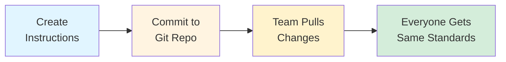

# Part 1, Section 2: Environment & Project Setup

**Part of:** [Part 1: Fundamentals & Core Concepts](./README.md)  
**Time to complete:** 30-45 minutes  
**Prerequisites:** None - start here for fresh setup

---

## 📋 Overview

This section walks you through setting up GitHub Copilot in VS Code from scratch. Whether you're an individual developer or setting up for your entire team, you'll have a fully configured environment ready to boost your productivity.

**What you'll accomplish:**
- ✅ Install VS Code and GitHub Copilot extension
- ✅ Authenticate with GitHub account
- ✅ Choose the right subscription tier
- ✅ Configure workspace settings
- ✅ Set up custom instructions for consistent code generation
- ✅ Configure MCP servers (optional, advanced)

---

## 🚀 Quick Start (5 Minutes)

**Already have VS Code? Jump straight to the essentials:**


**Keyboard shortcuts to memorize now:**
- `Tab` - Accept suggestion
- `Ctrl+I` (Cmd+I on Mac) - Inline chat
- `Ctrl+Alt+I` (Cmd+Option+I on Mac) - Chat view

---

## 1️⃣ VS Code Installation

### System Requirements

**Minimum requirements:**
- **VS Code version:** Latest stable version recommended (updates frequently)
- **OS:** Windows 10+, macOS 10.15+, or Linux (64-bit)
- **RAM:** 4GB minimum, 8GB+ recommended
- **Disk space:** 500MB for VS Code, 2GB+ recommended for workspaces
- **GitHub account:** Required for authentication

**Note:** GitHub Copilot extensions install automatically during first setup - no manual installation needed.

### Installation Steps

#### Windows:

```powershell
# Option 1: Download installer
# Visit: https://code.visualstudio.com/Download

# Option 2: Winget (if available)
winget install Microsoft.VisualStudioCode
```

#### macOS:

```bash
# Option 1: Download installer
# Visit: https://code.visualstudio.com/Download

# Option 2: Homebrew
brew install --cask visual-studio-code
```

#### Linux (Ubuntu/Debian):

```bash
# Add Microsoft GPG key and repository
wget -qO- https://packages.microsoft.com/keys/microsoft.asc | gpg --dearmor > packages.microsoft.gpg
sudo install -D -o root -g root -m 644 packages.microsoft.gpg /etc/apt/keyrings/packages.microsoft.gpg
sudo sh -c 'echo "deb [arch=amd64,arm64,armhf signed-by=/etc/apt/keyrings/packages.microsoft.gpg] https://packages.microsoft.com/repos/code stable main" > /etc/apt/sources.list.d/vscode.list'

# Install VS Code
sudo apt update
sudo apt install code
```

### Verify Installation

```bash
# Check VS Code version (should be 1.98.0+)
code --version
```

**Expected output:**
```
1.98.0
abcdef123456
x64
```

---

## 2️⃣ GitHub Account & Subscription Setup

### Choosing Your Subscription Tier


### Subscription Tier Details

| Feature | Free | Pro | Pro+ | Business | Enterprise |
|---------|------|-----|------|----------|------------|
| **Price** | $0/mo | $10/mo | $40/mo | $19/user/mo | $39/user/mo |
| **Completions/month** | 2,000 | ✅ Unlimited | ✅ Unlimited | ✅ Unlimited | ✅ Unlimited |
| **Premium requests** | 50/mo | Allowance | Higher allowance | Allowance | Higher allowance |
| **Chat access** | Basic | ✅ Full | ✅ Full | ✅ Full | ✅ Full |
| **Model selection** | No | ✅ All models | ✅ All models | Standard | Standard |
| **Auto discount** | No | ✅ 10% off | ✅ 10% off | ✅ 10% off | ✅ 10% off |
| **Usage analytics** | No | No | No | ✅ Yes | ✅ Yes |
| **SSO/SAML** | No | No | No | No | ✅ Yes |
| **Audit logs** | No | No | No | No | ✅ Yes |
| **Policy controls** | No | No | No | Limited | ✅ Full |
| **Best for** | Trying out | Solo devs | Power users | Teams | Enterprise |

### Sign Up Process

**1. Create GitHub Account (if needed):**

Visit: https://github.com/signup


**2. Subscribe to Copilot:**

Visit: https://github.com/features/copilot/plans

- **Free:** Sign up with GitHub account (no payment required)
- **Copilot Pro ($10/mo):** Click "Buy now" → Add payment method → Confirm
- **Copilot Pro+ ($40/mo):** For power users needing highest premium request allowance
- **Business ($19/user/mo):** Click "Contact sales" → Provide organization details
- **Enterprise ($39/user/mo):** Click "Contact sales" → Enterprise account manager

**3. Free Tier & Trials:**

- **Free tier:** 2,000 completions/month + 50 premium requests/month (no credit card)
- **Paid plans:** 30-day free trial available
- **Note:** Premium requests over allowance cost $0.04 USD per request

---

## 3️⃣ GitHub Copilot Extension Installation

### Install Extension in VS Code

**Method 1: VS Code Marketplace (Recommended)**

1. Open VS Code
2. Press `Ctrl+Shift+X` (Cmd+Shift+X on Mac) to open Extensions view
3. Search for "GitHub Copilot"
4. Click **Install** on "GitHub Copilot" (by GitHub)

**Method 2: Command Line**

```bash
code --install-extension GitHub.copilot
```

**Method 3: Extensions Marketplace Website**

Visit: https://marketplace.visualstudio.com/items?itemName=GitHub.copilot

### Recommended Companion Extensions

```bash
# Install Copilot Chat (usually bundled, but verify)
code --install-extension GitHub.copilot-chat

# Optional but useful
code --install-extension ms-vscode.vscode-typescript-next  # TypeScript support
code --install-extension dbaeumer.vscode-eslint            # Linting
code --install-extension esbenp.prettier-vscode            # Code formatting
```

### Verify Extension Installation

1. Check status bar (bottom right) for Copilot icon
2. Should show: `GitHub Copilot: Active`

```mermaid
graph LR
    A["Extension<br/>Installed"] --> B["Status Bar<br/>Icon Visible?"]
    B -->|Yes| C["✅ Ready"]
    B -->|No| D["❌ Troubleshoot"]
    
    style A fill:#e1f5ff
    style B fill:#fff4e1
    style C fill:#d4edda
    style D fill:#f8d7da
```



---

## 4️⃣ Authentication & Authorization

### Sign In to GitHub

**Step 1: Trigger Authentication**

- Click the GitHub Copilot icon in the status bar (bottom right)
- OR: Press `Ctrl+Shift+P` → Type "Copilot: Sign In"

**Step 2: Authorize in Browser**

1. VS Code opens your default browser
2. GitHub authorization page appears
3. Click **Authorize GitHub Copilot**
4. Enter GitHub password (if prompted)
5. Complete 2FA (if enabled)

**Step 3: Return to VS Code**

- Browser shows "Success! You may close this tab"
- VS Code automatically connects
- Status bar updates to show your GitHub username

### Authentication Flow Diagram

```mermaid
graph TD
    START["Click Copilot<br/>Status Bar Icon"]
    
    START --> BROWSER["Browser Opens<br/>GitHub Auth Page"]
    BROWSER --> AUTH["Authorize<br/>VS Code"]
    AUTH --> 2FA{"2FA<br/>Enabled?"}
    
    2FA -->|Yes| CODE["Enter 2FA Code"]
    2FA -->|No| SUCCESS["✅ Authenticated"]
    CODE --> SUCCESS
    
    SUCCESS --> VSCODE["Return to<br/>VS Code"]
    VSCODE --> READY["Status: Active"]
    
    style START fill:#e1f5ff
    style BROWSER fill:#fff4e1
    style AUTH fill:#fff4e1
    style SUCCESS fill:#d4edda
    style READY fill:#d4edda
```



### Verify Authentication Status

```bash
# Open VS Code Command Palette
# Ctrl+Shift+P (Windows/Linux) or Cmd+Shift+P (macOS)
# Type: "Copilot: Check Status"
```

**Expected output in Output panel:**
```
GitHub Copilot: Status
✓ Authenticated as: yourusername
✓ Subscription: Individual (Active)
✓ Model: Auto (recommended)
✓ Connection: Healthy
```

### Troubleshooting Authentication

| Issue | Solution |
|-------|----------|
| "Not authorized" | Verify GitHub subscription is active at github.com/settings/copilot |
| "Connection failed" | Check firewall/proxy settings, ensure *.github.com is allowed |
| "Extension not loading" | Reload VS Code window: `Ctrl+Shift+P` → "Reload Window" |
| "Wrong account" | Sign out: `Ctrl+Shift+P` → "Copilot: Sign Out", then sign in again |

---

## 5️⃣ Workspace Configuration Best Practices

### User Settings vs Workspace Settings

**Understanding the hierarchy:**

```mermaid
graph TB
    DEFAULT["VS Code<br/>Default Settings"]
    USER["User Settings<br/>~/.vscode/settings.json"]
    WORKSPACE["Workspace Settings<br/>.vscode/settings.json"]
    
    DEFAULT --> USER
    USER --> WORKSPACE
    
    WORKSPACE --> RESULT["✅ Final<br/>Configuration"]
    
    style DEFAULT fill:#e1f5ff
    style USER fill:#fff4e1
    style WORKSPACE fill:#90EE90,stroke:#2d862d,stroke-width:3px
    style RESULT fill:#d4edda
```



**Rule:** Workspace settings override User settings override Defaults

**Best practice for teams:** Always use Workspace settings for consistency

### Creating Workspace Settings

**Step 1: Create `.vscode` folder in project root**

```bash
# In your project directory
mkdir .vscode
```

**Step 2: Create `settings.json`**

**.vscode/settings.json** (Copy-paste template):

```json
{
  "github.copilot.enable": {
    "*": true,
    "markdown": true,
    "plaintext": false
  },
  "github.copilot.editor.enableAutoCompletions": true,
  "github.copilot.chat.localeOverride": "en",
  
  "editor.inlineSuggest.enabled": true,
  "editor.suggestSelection": "first",
  "editor.tabCompletion": "on",
  
  "files.exclude": {
    "**/node_modules": true,
    "**/dist": true,
    "**/.git": true,
    "**/build": true
  }
}
```

**Key settings explained:**

- `github.copilot.enable`: Enable/disable per language
- `enableAutoCompletions`: Show inline suggestions automatically
- `editor.inlineSuggest.enabled`: Required for inline completions
- `files.exclude`: Exclude folders from context (improves performance)

### Recommended Extensions Configuration

**.vscode/extensions.json** (Team recommendations):

```json
{
  "recommendations": [
    "github.copilot",
    "github.copilot-chat",
    "dbaeumer.vscode-eslint",
    "esbenp.prettier-vscode",
    "ms-vscode.vscode-typescript-next"
  ],
  "unwantedRecommendations": []
}
```

**Benefits:**
- Team members get prompted to install required extensions
- Consistent tooling across the team
- One-click setup for new developers

### Multi-Root Workspace Setup

**Use case:** Working on multiple related projects (e.g., frontend + backend)

**Step 1: Create workspace file**

**my-project.code-workspace:**

```json
{
  "folders": [
    {
      "name": "Backend API",
      "path": "./backend"
    },
    {
      "name": "Frontend React",
      "path": "./frontend"
    },
    {
      "name": "Shared Types",
      "path": "./shared"
    }
  ],
  "settings": {
    "github.copilot.enable": {
      "*": true
    },
    "files.exclude": {
      "**/node_modules": true
    }
  }
}
```

**Step 2: Open workspace**

```bash
code my-project.code-workspace
```

**Benefits:**
- Copilot understands context across all folders
- Unified search and navigation
- Single Copilot configuration for entire monorepo

---

## 6️⃣ Custom Instructions Setup

### What Are Custom Instructions?

Custom instructions tell Copilot about your team's coding standards, preferences, and project-specific context. This ensures **consistent code generation** across your entire team.


### Creating Custom Instructions

**Step 1: Create `.github` folder in project root**

```bash
mkdir .github
```

**Step 2: Create instructions file**

**.github/copilot-instructions.md** (Starter template):

```markdown
# GitHub Copilot Instructions for [Project Name]

**Project Type:** [Web app / API / Library / CLI tool]  
**Tech Stack:** [List main technologies]  
**Last Updated:** [Date]

---

## Tech Stack & Versions

- **Language:** TypeScript 5.3+
- **Runtime:** Node.js 20 LTS
- **Framework:** React 18 with Next.js 14
- **Database:** PostgreSQL 15 with Prisma ORM
- **Testing:** Jest + React Testing Library
- **Styling:** Tailwind CSS 3.4

---

## Coding Standards

### TypeScript
- Use strict mode (`"strict": true` in tsconfig.json)
- Prefer `interface` over `type` for object shapes
- Always specify return types for functions
- Use `unknown` instead of `any` when type is unclear

### React
- Functional components only (no class components)
- Use hooks for state management
- Prop drilling max 2 levels, then use Context
- All components must have TypeScript interfaces for props

### Naming Conventions
- **Files:** kebab-case (e.g., `user-profile.tsx`)
- **Components:** PascalCase (e.g., `UserProfile`)
- **Functions:** camelCase (e.g., `getUserById`)
- **Constants:** UPPER_SNAKE_CASE (e.g., `API_BASE_URL`)

### Code Organization
```
src/
├── app/              # Next.js app directory
├── components/       # React components
│   ├── ui/          # Reusable UI components
│   └── features/    # Feature-specific components
├── lib/             # Utility functions
├── hooks/           # Custom React hooks
└── types/           # TypeScript type definitions
```

---

## Error Handling

**All async functions must use try-catch:**

```typescript
async function fetchUser(id: string) {
  try {
    const user = await db.user.findUnique({ where: { id } });
    if (!user) throw new NotFoundError(`User ${id} not found`);
    return user;
  } catch (error) {
    logger.error('Failed to fetch user', { id, error });
    throw error;
  }
}
```

**API routes must return structured errors:**

```typescript
return NextResponse.json(
  { error: 'Invalid request', code: 'VALIDATION_ERROR' },
  { status: 400 }
);
```

---

## Testing Requirements

### Unit Tests
- Every business logic function must have unit tests
- Use `describe` blocks to group related tests
- Test file naming: `[filename].test.ts`

### Integration Tests
- All API endpoints must have integration tests
- Use test database (never production)
- Clean up test data after each test

### Test Coverage
- Minimum 80% code coverage
- 100% coverage for critical paths (auth, payments)

---

## Security Requirements

### Input Validation
- **All** user inputs must be validated with Zod schemas
- Never trust client-side validation alone
- Sanitize HTML output with DOMPurify

### Authentication
- Use NextAuth.js for authentication
- Check authentication on all protected routes
- Use middleware for route protection

### Database
- **Always** use Prisma parameterized queries (never raw SQL)
- Enable row-level security where applicable
- Hash passwords with bcrypt (min 12 rounds)

### Secrets Management
- No hardcoded secrets in code
- Use environment variables for all secrets
- Verify `.env` is in `.gitignore`

---

## API Design

### RESTful Endpoints
- Use standard HTTP methods: GET, POST, PUT, PATCH, DELETE
- Plural resource names: `/api/users` not `/api/user`
- Use HTTP status codes correctly:
  - 200: Success
  - 201: Created
  - 400: Bad request
  - 401: Unauthorized
  - 403: Forbidden
  - 404: Not found
  - 500: Server error

### Response Format
```typescript
// Success response
{
  "data": { /* resource */ },
  "meta": { "timestamp": "2024-01-15T10:30:00Z" }
}

// Error response
{
  "error": "Error message",
  "code": "ERROR_CODE",
  "details": { /* additional context */ }
}
```

---

## Documentation

### JSDoc Comments
All exported functions must have JSDoc:

```typescript
/**
 * Fetches a user by ID from the database
 * @param id - The unique user identifier
 * @returns User object if found
 * @throws {NotFoundError} If user doesn't exist
 */
export async function getUserById(id: string): Promise<User> {
  // ...
}
```

### README Requirements
Each feature directory should have a README.md explaining:
- Purpose and responsibility
- Key files and their roles
- Usage examples
- Testing instructions

---

## Performance

### Database Queries
- Always select only needed fields (no `select: *`)
- Use indexes for frequently queried columns
- Implement pagination for list endpoints (max 100 items)

### React Performance
- Use `React.memo` for expensive components
- Implement code splitting for large routes
- Lazy load images and heavy components

---

## Git Workflow

### Commit Messages
Follow Conventional Commits:
- `feat:` - New feature
- `fix:` - Bug fix
- `docs:` - Documentation only
- `refactor:` - Code restructuring
- `test:` - Test additions/changes
- `chore:` - Maintenance tasks

Example: `feat: add user profile page with avatar upload`

### Branch Naming
- `feature/[description]` - New features
- `fix/[description]` - Bug fixes
- `refactor/[description]` - Refactoring

---

## Important Conventions

- **Never** commit `console.log` statements
- **Never** commit commented-out code (delete it)
- **Always** run linter before committing
- **Always** write tests for new features
- **Always** update documentation when changing APIs

---

**End of Instructions**
```

### Using Custom Instructions

**Once created, Copilot automatically:**
- ✅ Reads `.github/copilot-instructions.md` in your workspace
- ✅ Applies these rules to all suggestions
- ✅ Uses instructions in Chat conversations
- ✅ Maintains consistency across team members

**No additional configuration needed!**

### Team Workflow



**Best practices:**
- Version control instructions file
- Update when coding standards change
- Review in PR process
- Keep instructions concise (aim for <500 lines)

---

## 7️⃣ MCP Server Configuration (Optional)

### What is MCP?

**Model Context Protocol (MCP)** extends Copilot Chat with external tools and data sources.

**Use cases:**
- Connect to external APIs
- Query databases directly
- Integrate with project management tools
- Custom code analysis tools


### Installing MCP Server

**Step 1: Configure MCP in settings**

**.vscode/settings.json:**

```json
{
  "github.copilot.chat.mcp.servers": {
    "example-api": {
      "command": "npx",
      "args": ["-y", "@example/mcp-server"],
      "env": {
        "API_KEY": "${env:API_KEY}"
      }
    }
  }
}
```

**Step 2: Set environment variables**

Create `.env` file:

```bash
API_KEY=your-api-key-here
```

**Step 3: Restart VS Code**

MCP servers load on startup.

### Common MCP Servers

| Server | Purpose | Install Command |
|--------|---------|-----------------|
| **Context7** | Up-to-date library docs | Via VS Code extension |
| **Browser** | Web browsing | Via Cursor extension |
| **GitHub** | GitHub API access | `npx @modelcontextprotocol/server-github` |
| **PostgreSQL** | Database queries | `npx @modelcontextprotocol/server-postgres` |

**Note:** MCP is an advanced feature. Skip this section if you're just getting started.

---

### 💡 Pro Tip: Auto Model Selection

**Save 10% on premium requests** by using Auto model selection in Copilot Chat (available on paid plans). Auto intelligently chooses from models like GPT-4.1, GPT-5 mini, Claude Haiku 4.5, and Claude Sonnet 4.5 based on your task complexity and availability. This helps you:

- ✅ Avoid rate limiting
- ✅ Get 10% discount on premium request multipliers
- ✅ No mental overhead of choosing models
- ✅ Automatic optimization for cost and performance

**How to enable:** In VS Code Copilot Chat, select **Auto** from the model picker dropdown.

---

## 8️⃣ Verification & First Test

### Complete Setup Checklist

Before proceeding, verify:

- [ ] VS Code latest version installed
- [ ] GitHub Copilot extension installed and active
- [ ] Authenticated with GitHub account
- [ ] Status bar shows "GitHub Copilot: Active"
- [ ] Understand your plan limits (Free: 2,000/month, Pro: unlimited)
- [ ] Workspace settings configured (`.vscode/settings.json`)
- [ ] Custom instructions created (`.github/copilot-instructions.md`)
- [ ] Team extensions recommended (`.vscode/extensions.json`)

### First Copilot Test

**Test 1: Inline Completion**

1. Create new file: `test.js`
2. Type: `function calculateTotal(items) {`
3. Press Enter and wait
4. **Expected:** Copilot suggests function implementation
5. Press `Tab` to accept

**Test 2: Inline Chat**

1. In any file, press `Ctrl+I` (Cmd+I on Mac)
2. Type: `Create a function that sorts an array of numbers`
3. Press Enter
4. **Expected:** Copilot generates code inline
5. Click "Accept" if code looks good

**Test 3: Chat View**

1. Press `Ctrl+Alt+I` (Cmd+Option+I on Mac)
2. Type: `@workspace What files are in this project?`
3. Press Enter
4. **Expected:** Copilot lists files with descriptions

### If Tests Fail


---

## 🎯 Key Takeaways

### Critical Points to Remember:

1. **Latest VS Code recommended** - Keep updated for best Copilot compatibility
2. **Understand plan limits** - Free: 2,000 completions/month, Pro: unlimited, premium requests billed at $0.04 each over allowance
3. **Auto model selection saves money** - Get 10% discount on premium requests with Auto mode (paid plans)
4. **Workspace settings override user settings** - Always configure at workspace level for teams
5. **Custom instructions are automatic** - Create `.github/copilot-instructions.md` and Copilot reads it
6. **Authentication is per-account** - Each team member needs their own GitHub subscription
7. **Test immediately** - Verify setup works before starting real work

### Configuration Hierarchy:

```
VS Code Defaults
    ↓ (overridden by)
User Settings (~/.config/Code/User/settings.json)
    ↓ (overridden by)
Workspace Settings (.vscode/settings.json)
    ↓ (enhanced by)
Custom Instructions (.github/copilot-instructions.md)
```

### Recommended Setup for Teams:

```
project-root/
├── .vscode/
│   ├── settings.json          # Workspace configuration
│   └── extensions.json        # Recommended extensions
├── .github/
│   └── copilot-instructions.md  # Custom instructions
├── .gitignore                 # Exclude .env, node_modules
└── .env.example               # Template for secrets
```

---

## 🚧 Common Setup Issues & Solutions

### Issue 1: "Copilot not providing suggestions"

**Causes & fixes:**

| Symptom | Cause | Solution |
|---------|-------|----------|
| No suggestions at all | Extension not active | Check status bar, click icon to activate |
| Suggestions in some files only | File type disabled | Check `github.copilot.enable` setting |
| Slow/delayed suggestions | Large workspace | Exclude build folders in settings |
| Suggestions then stop | Rate limit hit (Free tier) | Upgrade to Copilot Pro ($10/mo) for unlimited |

### Issue 2: "Authentication failed"

**Solutions:**
1. **Clear credentials:**
   - `Ctrl+Shift+P` → "Copilot: Sign Out"
   - Sign in again
2. **Check subscription:** Visit https://github.com/settings/copilot
3. **Firewall/proxy:** Ensure `*.github.com` and `*.githubusercontent.com` are allowed

### Issue 3: "Custom instructions not working"

**Checklist:**
- [ ] File is named exactly `.github/copilot-instructions.md`
- [ ] File is in project root (not subfolder)
- [ ] File is committed to git (if sharing with team)
- [ ] Reload VS Code window after creating file

### Issue 4: "Wrong code style generated"

**Fix:** Your custom instructions might be too vague. Be specific:

**❌ Vague:**
```markdown
Use good coding practices
```

**✅ Specific:**
```markdown
## TypeScript Style
- Use `interface` for object shapes
- Always specify function return types
- Prefer `const` over `let`
- Use arrow functions for callbacks
```

---

## 📚 Next Steps

### You're now ready to:

1. **[Part 1, Section 3: Core Workflows](./03-core-workflows.md)** - Learn the 7-phase development workflow
2. **[Part 2: VS Code Integration](../02-vscode-integration/)** - Deep dive into keyboard shortcuts and productivity
3. **[Quick Reference](../07-reference-advanced/01-complete-reference.md)** - Bookmark for daily use

### Quick wins to try next:

```bash
# In VS Code:
# 1. Try inline completion (just start typing a function)
# 2. Use Ctrl+I to refactor existing code
# 3. Open Chat (Ctrl+Alt+I) and ask about your codebase
# 4. Generate tests for a function
```

### Team setup next steps:

- [ ] Share workspace settings with team (commit `.vscode/` to git)
- [ ] Customize `.github/copilot-instructions.md` for your project
- [ ] Add team-specific agents (Part 3, Section 2)
- [ ] Schedule training session using "First 5 Minutes" examples

---

## 📖 Additional Resources

- **Official Setup Guide:** https://docs.github.com/copilot/getting-started-with-github-copilot
- **VS Code Copilot Docs:** https://code.visualstudio.com/docs/copilot/overview
- **Troubleshooting:** https://docs.github.com/copilot/troubleshooting
- **Subscription Management:** https://github.com/settings/copilot

---

**Section Complete!** ✅

You now have a fully configured GitHub Copilot environment. Move to [Section 3: Core Workflows](./03-core-workflows.md) to learn the development patterns that will 10x your productivity.

---

**Updated:** December 2025  
**Part:** 1 of 7 - Fundamentals & Core Concepts  
**Section:** 2 of 3 - Environment & Project Setup

