# Part 1, Section 3: Core Workflows

**Part of**: [Part 1: Fundamentals & Core Concepts](./README.md)  
**Time to complete:** 45 minutes  
**Prerequisites:** [Section 1: Mental Models](01-mental-models-architecture.md), [Section 2: Setup](02-environment-project-setup.md)

---

## 📋 Overview

Now that you understand how Copilot works and have your environment configured, it's time to learn the **workflows that will transform your daily development**. This section teaches you proven patterns for building features, debugging issues, and maintaining code quality with AI assistance.

**What you'll master:**
- The 7-phase feature development workflow
- Debugging patterns (explain → diagnose → fix)
- Code navigation and understanding techniques
- Refactoring strategies with Copilot
- Test-driven development patterns
- Git workflow integration

**Why this matters:** These workflows are battle-tested patterns that leverage Copilot's strengths while maintaining code quality and team collaboration.

---

## 🔄 The 7-Phase Feature Development Workflow

This workflow guides you from idea to production-ready code using Copilot at each stage.

```mermaid
graph TB
    START["Feature Request"] --> PHASE1["1️⃣ PLANNING<br/>Plan mode"]
    
    PHASE1 --> PHASE2["2️⃣ SCAFFOLDING<br/>Agent mode"]
    PHASE2 --> PHASE3["3️⃣ IMPLEMENTATION<br/>Inline + Chat"]
    PHASE3 --> PHASE4["4️⃣ TESTING<br/>Test generation"]
    PHASE4 --> PHASE5["5️⃣ DOCUMENTATION<br/>Auto-docs"]
    PHASE5 --> PHASE6["6️⃣ REVIEW<br/>Security check"]
    PHASE6 --> PHASE7["7️⃣ REFINEMENT<br/>Iteration"]
    
    PHASE7 --> DONE["✅ Production Ready"]
    
    style PHASE1 fill:#cfe2ff
    style PHASE2 fill:#e1f5ff
    style PHASE3 fill:#d4edda
    style PHASE4 fill:#fff3cd
    style PHASE5 fill:#f8d7da
    style PHASE6 fill:#e7d4f5
    style PHASE7 fill:#d1ecf1
    style DONE fill:#90EE90,stroke:#2d862d,stroke-width:3px
```



---

### Phase 1: Planning 🎯

**Goal:** Create a detailed implementation roadmap before writing code.

**Use:** Plan mode in Chat (`Ctrl+Alt+I`, switch to Plan mode)

**What Plan mode does:**
- ✅ Analyzes feature requirements
- ✅ Breaks down into actionable tasks
- ✅ Identifies dependencies and risks
- ✅ Estimates complexity
- ❌ **Does not make code changes** (read-only)

**Example workflow:**

```plaintext
# You (in Chat, Plan mode):
Plan implementation of user authentication with email/password and OAuth (Google + GitHub)

# Plan mode response:
## Authentication Implementation Plan

### Phase 1: Infrastructure Setup (2-3 hours)
1. **Database Schema**
   - Add `users` table with email, password_hash, oauth_provider, oauth_id
   - Create indexes on email and oauth_id
   - Add `sessions` table for token management
   
2. **Dependencies**
   - Install: bcrypt, jsonwebtoken, passport, passport-google-oauth20, passport-github2
   - Add environment variables for OAuth credentials
   
3. **Files to create:**
   - `src/models/User.ts` - User model
   - `src/models/Session.ts` - Session model
   - `src/config/passport.ts` - Passport configuration

### Phase 2: Email/Password Auth (3-4 hours)
1. **Registration endpoint** (`POST /api/auth/register`)
   - Input validation (Zod schema)
   - Email uniqueness check
   - Password hashing with bcrypt (12 rounds)
   - Create user record
   
2. **Login endpoint** (`POST /api/auth/login`)
   - Credential validation
   - Password verification
   - JWT token generation (24h expiry)
   - Session creation
   
3. **Files to modify:**
   - `src/routes/auth.ts` - Add endpoints
   - `src/services/auth-service.ts` - Business logic
   - `src/middleware/auth.ts` - JWT verification

### Phase 3: OAuth Integration (4-5 hours)
1. **Google OAuth**
   - Configure Google Developer Console
   - Implement callback route (`/api/auth/google/callback`)
   - User creation/lookup on successful OAuth
   
2. **GitHub OAuth**
   - Configure GitHub OAuth App
   - Implement callback route (`/api/auth/github/callback`)
   
3. **Files to create:**
   - `src/controllers/oauth-controller.ts`
   - `src/services/oauth-service.ts`

### Phase 4: Security & Middleware (2 hours)
1. **Protected routes middleware**
   - JWT verification from Authorization header
   - Session validation
   - User loading
   
2. **Security measures**
   - Rate limiting (5 login attempts per 15 min)
   - CORS configuration
   - CSRF protection
   
3. **Files to modify:**
   - `src/middleware/auth.ts` - Add auth checks
   - `src/middleware/rate-limit.ts` - Rate limiting

### Phase 5: Testing (3-4 hours)
1. **Unit tests**
   - Password hashing/verification
   - JWT token generation/validation
   - Input validation schemas
   
2. **Integration tests**
   - Registration flow (success + failures)
   - Login flow (valid + invalid credentials)
   - OAuth callbacks
   - Protected route access
   
3. **Files to create:**
   - `tests/unit/auth-service.test.ts`
   - `tests/integration/auth-endpoints.test.ts`

### Phase 6: Frontend Integration (2-3 hours)
1. **Login/Registration forms**
2. **OAuth buttons**
3. **Auth state management**
4. **Protected route guards**

---

**Total estimated time:** 16-21 hours

**Critical dependencies:**
- PostgreSQL database setup
- OAuth app credentials from Google/GitHub
- Environment variables configured

**Risk factors:**
- OAuth callback URLs must match exactly
- Session management complexity
- Token refresh strategy needed for production

**Recommended approach:**
1. Start with Phase 1 (infrastructure)
2. Implement Phase 2 (email/password) completely and test
3. Add Phase 3 (OAuth) incrementally
4. Don't skip Phase 4 (security) - critical for production
```

**Pro tip:** Save this plan! You'll reference it during implementation.

---

### Phase 2: Scaffolding 🏗️

**Goal:** Generate boilerplate code structure based on the plan.

**Use:** Agent mode in Chat

**What Agent mode does:**
- ✅ Creates new files and directories
- ✅ Generates boilerplate code
- ✅ Sets up basic structure
- ✅ Installs dependencies
- ⚠️ **Review all changes** before accepting

**Example workflow:**

```plaintext
# You (in Chat, Agent mode):
Based on the plan above, create the database schema, models, and basic route structure for the authentication system. Don't implement the logic yet, just the scaffolding.

# Agent mode actions:
✅ Created prisma/migrations/001_add_users_and_sessions.sql
✅ Created src/models/User.ts
✅ Created src/models/Session.ts
✅ Created src/routes/auth.ts (with empty route handlers)
✅ Created src/services/auth-service.ts (with method signatures)
✅ Created src/middleware/auth.ts (with TODO comments)
✅ Updated package.json with dependencies
✅ Created tests/unit/auth-service.test.ts (skeleton)

Ready for review. Run `npm install` to install new dependencies.
```

**Key point:** Agent creates structure, you implement business logic.

---

### Phase 3: Implementation 💻

**Goal:** Write the actual business logic using inline completions and Chat.

**Use:** Combination of Inline completions, Inline Chat, and Chat view

**Workflow pattern:**


**Example: Implementing registration endpoint**

**Step 1: Start typing, let inline completions help**

```typescript
// src/services/auth-service.ts
import bcrypt from 'bcrypt';
import { prisma } from '../lib/prisma';

export class AuthService {
  async registerUser(email: string, password: string) {
    // Copilot suggests the entire implementation:
    // 1. Validate email format
    // 2. Check if user exists
    // 3. Hash password
    // 4. Create user record
    // Press Tab to accept
  }
}
```

**Step 2: If you need to refine, use Inline Chat (Ctrl+I)**

```plaintext
# Select the function, press Ctrl+I:
Add comprehensive error handling, input validation with Zod, and proper TypeScript types. Return detailed error messages.
```

**Step 3: For complex logic, use Chat view**

```plaintext
# In Chat (Ctrl+Alt+I):
@workspace Show me how to implement secure password hashing with bcrypt in our auth service. Use 12 rounds and include error handling.
```

**Implementation tips:**

1. **Let Copilot handle boilerplate**
   - Type the function signature and let it suggest the body
   - Accept good suggestions with Tab
   - Skip bad suggestions with Esc

2. **Use Inline Chat for refinements**
   - Select code → Ctrl+I → Describe changes
   - "Add error handling"
   - "Add input validation"
   - "Add logging statements"

3. **Use Chat for architecture questions**
   - "@workspace How should I structure error handling?"
   - "@workspace Show examples of JWT token generation in this codebase"

---

### Phase 4: Testing 🧪

**Goal:** Generate comprehensive test coverage.

**Use:** Chat view with `/tests` command

**Test generation workflow:**


**Example: Generate tests**

```plaintext
# Method 1: Slash command
/tests
# (with auth-service.ts open, generates tests for visible code)

# Method 2: Explicit request
@workspace Generate comprehensive Jest tests for the AuthService class with:
1. Happy path tests for registration and login
2. Error cases: duplicate email, invalid credentials, weak password
3. Edge cases: SQL injection attempts, XSS in inputs
4. Mock Prisma client for database operations
```

**Generated test example:**

```typescript
// tests/unit/auth-service.test.ts
import { AuthService } from '../../src/services/auth-service';
import { prisma } from '../../src/lib/prisma';

jest.mock('../../src/lib/prisma');

describe('AuthService', () => {
  let authService: AuthService;

  beforeEach(() => {
    authService = new AuthService();
    jest.clearAllMocks();
  });

  describe('registerUser', () => {
    it('should successfully register a new user', async () => {
      // Happy path test
      const mockUser = {
        id: '1',
        email: 'test@example.com',
        password_hash: 'hashed_password',
      };

      (prisma.user.findUnique as jest.Mock).mockResolvedValue(null);
      (prisma.user.create as jest.Mock).mockResolvedValue(mockUser);

      const result = await authService.registerUser(
        'test@example.com',
        'SecurePass123!'
      );

      expect(result).toEqual({ id: '1', email: 'test@example.com' });
      expect(prisma.user.create).toHaveBeenCalledWith(
        expect.objectContaining({
          data: expect.objectContaining({
            email: 'test@example.com',
          }),
        })
      );
    });

    it('should throw error for duplicate email', async () => {
      (prisma.user.findUnique as jest.Mock).mockResolvedValue({
        id: '1',
        email: 'test@example.com',
      });

      await expect(
        authService.registerUser('test@example.com', 'password')
      ).rejects.toThrow('User already exists');
    });

    it('should throw error for weak password', async () => {
      await expect(
        authService.registerUser('test@example.com', '123')
      ).rejects.toThrow('Password too weak');
    });

    // More test cases...
  });
});
```

**Ask for edge cases:**

```plaintext
@workspace What edge cases am I missing in the auth tests? Include security concerns.

# Copilot suggests:
- SQL injection attempts in email/password
- XSS payloads in user inputs
- Rate limiting validation
- Session fixation attacks
- Password timing attacks (bcrypt comparison)
- Unicode edge cases in email
- Very long input strings (DOS prevention)
```

---

### Phase 5: Documentation 📝

**Goal:** Generate clear, comprehensive documentation.

**Use:** `/doc` command or Chat

**Documentation workflow:**

```plaintext
# Method 1: Inline documentation
# Select function → Type /doc in inline chat

# Method 2: Module documentation
@workspace Generate comprehensive documentation for the auth module including:
1. JSDoc for all public methods
2. README.md with usage examples
3. API endpoint documentation
4. Authentication flow diagram

# Method 3: Update existing docs
@workspace Update README.md to reflect the new authentication system. Include setup instructions and examples.
```

**Generated JSDoc example:**

```typescript
/**
 * Registers a new user in the system with email and password authentication.
 * 
 * @param email - User's email address (must be valid format and unique)
 * @param password - User's password (minimum 8 characters, must include uppercase, lowercase, number)
 * @returns Promise resolving to user object (without password_hash)
 * 
 * @throws {ValidationError} If email or password doesn't meet requirements
 * @throws {ConflictError} If user with email already exists
 * @throws {DatabaseError} If database operation fails
 * 
 * @example
 * ```typescript
 * const authService = new AuthService();
 * try {
 *   const user = await authService.registerUser(
 *     'user@example.com',
 *     'SecurePass123!'
 *   );
 *   console.log('User registered:', user.id);
 * } catch (error) {
 *   console.error('Registration failed:', error.message);
 * }
 * ```
 */
async registerUser(email: string, password: string): Promise<User> {
  // Implementation...
}
```

**API documentation example:**

```markdown
# Authentication API

## POST /api/auth/register

Register a new user with email and password.

**Request Body:**
```json
{
  "email": "user@example.com",
  "password": "SecurePass123!"
}
```

**Success Response (201):**
```json
{
  "user": {
    "id": "uuid",
    "email": "user@example.com",
    "created_at": "2025-01-15T10:30:00Z"
  },
  "token": "jwt_token_here"
}
```

**Error Responses:**
- `400 Bad Request` - Invalid input (weak password, invalid email)
- `409 Conflict` - User already exists
- `500 Internal Server Error` - Server error

**Example:**
```bash
curl -X POST https://api.example.com/api/auth/register \
  -H "Content-Type: application/json" \
  -d '{"email":"user@example.com","password":"SecurePass123!"}'
```
```

---

### Phase 6: Review 🔍

**Goal:** Security audit and code quality check before committing.

**Use:** Custom security agent or Chat

**Review workflow:**

```mermaid
graph TD
    A["Code complete"] --> B["Run security<br/>review agent"]
    B --> C["Check findings"]
    C --> D{"Issues<br/>found?"}
    D -->|Critical 🔴| E["Fix immediately"]
    D -->|Warning 🟡| F["Assess and fix"]
    D -->|Good 🟢| G["Continue"]
    E --> B
    F --> B
    G --> H["Code quality<br/>check"]
    H --> I["Performance<br/>review"]
    I --> DONE["✅ Ready to commit"]
    
    style A fill:#e1f5ff
    style B fill:#fff4e1
    style D fill:#fff3cd
    style E fill:#f8d7da
    style F fill:#fff3cd
    style G fill:#d4edda
    style DONE fill:#90EE90,stroke:#2d862d,stroke-width:3px
```



**Security review prompt:**

```plaintext
# In Chat (Ctrl+Alt+I):
@workspace Perform comprehensive security review of the authentication implementation:
1. SQL injection vulnerabilities
2. XSS vulnerabilities
3. Authentication bypass possibilities
4. Session management security
5. Password storage security
6. Rate limiting effectiveness
7. CSRF protection
8. Secrets in code or config

Format findings as:
- 🔴 Critical: Immediate security risk
- 🟡 Warning: Potential security issue
- 🟢 Good: Security best practice followed
```

**Example security review output:**

```markdown
# Security Review: Authentication System

## 🔴 Critical Issues

### 1. Hardcoded JWT Secret
**File:** `src/config/jwt.ts:5`
**Issue:** JWT secret is hardcoded in source code
**Code:**
```typescript
const JWT_SECRET = 'my-super-secret-key';
```
**Risk:** Secret exposed in version control, could lead to token forgery
**Fix:** Move to environment variable
```typescript
const JWT_SECRET = process.env.JWT_SECRET;
if (!JWT_SECRET) throw new Error('JWT_SECRET not configured');
```

---

## 🟡 Warnings

### 1. Missing Rate Limiting on Registration
**File:** `src/routes/auth.ts:15`
**Issue:** No rate limiting on registration endpoint
**Risk:** Account creation spam, resource exhaustion
**Fix:** Add rate limiting middleware
```typescript
router.post('/register', 
  rateLimiter({ max: 5, windowMs: 15 * 60 * 1000 }),
  registerHandler
);
```

### 2. Password Complexity Not Enforced
**File:** `src/services/auth-service.ts:25`
**Issue:** Password validation only checks length, not complexity
**Risk:** Users can create weak passwords
**Fix:** Add complexity requirements
```typescript
const passwordRegex = /^(?=.*[a-z])(?=.*[A-Z])(?=.*\d).{8,}$/;
if (!passwordRegex.test(password)) {
  throw new ValidationError('Password must include uppercase, lowercase, and number');
}
```

---

## 🟢 Good Practices

✅ **Passwords hashed with bcrypt** (12 rounds) - Excellent  
✅ **Parameterized queries** via Prisma - Prevents SQL injection  
✅ **Input validation** with Zod schemas - Good defense  
✅ **JWT tokens** with reasonable expiry (24h) - Acceptable  
✅ **HTTPS enforcement** in middleware - Good  
✅ **CORS configured** properly - Good  

---

**Overall Assessment:** Fix critical issues before deploying. Address warnings based on risk tolerance.
```

**Code quality check:**

```plaintext
@workspace Review code quality of auth implementation:
- Adherence to coding standards
- TypeScript type safety
- Error handling completeness
- Code duplication
- Function complexity
- Maintainability
```

---

### Phase 7: Refinement ✨

**Goal:** Iterate based on feedback and testing.

**Use:** Inline Chat for targeted improvements

**Refinement patterns:**

**Pattern 1: Performance optimization**

```plaintext
# Select slow function → Ctrl+I:
Optimize this function for performance. Use caching where appropriate and reduce database queries.
```

**Pattern 2: Error handling improvement**

```plaintext
# Select error-prone code → Ctrl+I:
Add comprehensive error handling with specific error types and helpful error messages.
```

**Pattern 3: Code clarity**

```plaintext
# Select complex code → Ctrl+I:
Refactor this code to be more readable. Add comments for complex logic and use descriptive variable names.
```

**Pattern 4: Accessibility improvements**

```plaintext
# Select UI component → Ctrl+I:
Improve accessibility: add ARIA labels, keyboard navigation, and screen reader support.
```

**Example refinement:**

```typescript
// Before (from Phase 3):
async loginUser(email: string, password: string) {
  const user = await prisma.user.findUnique({ where: { email } });
  if (!user) throw new Error('Invalid credentials');
  const valid = await bcrypt.compare(password, user.password_hash);
  if (!valid) throw new Error('Invalid credentials');
  const token = jwt.sign({ userId: user.id }, JWT_SECRET);
  return { user, token };
}

// After refinement (Ctrl+I: "Add rate limiting awareness, logging, and proper error types"):
async loginUser(email: string, password: string): Promise<LoginResult> {
  this.logger.info('Login attempt', { email });
  
  try {
    // Check rate limit
    const rateLimitKey = `login:${email}`;
    const attempts = await this.redis.get(rateLimitKey);
    if (attempts && parseInt(attempts) >= 5) {
      this.logger.warn('Rate limit exceeded', { email });
      throw new RateLimitError('Too many login attempts. Try again in 15 minutes.');
    }

    // Find user
    const user = await prisma.user.findUnique({ 
      where: { email },
      select: { id: true, email: true, password_hash: true }
    });
    
    if (!user) {
      await this.incrementFailedAttempts(email);
      this.logger.warn('Login failed - user not found', { email });
      throw new AuthenticationError('Invalid email or password');
    }

    // Verify password (timing-safe comparison)
    const valid = await bcrypt.compare(password, user.password_hash);
    if (!valid) {
      await this.incrementFailedAttempts(email);
      this.logger.warn('Login failed - invalid password', { email });
      throw new AuthenticationError('Invalid email or password');
    }

    // Reset failed attempts on success
    await this.redis.del(rateLimitKey);

    // Generate token with appropriate claims
    const token = jwt.sign(
      { userId: user.id, email: user.email },
      JWT_SECRET,
      { expiresIn: '24h', issuer: 'auth-service' }
    );

    this.logger.info('Login successful', { userId: user.id });
    
    return {
      user: { id: user.id, email: user.email },
      token,
      expiresIn: 86400 // 24 hours in seconds
    };
  } catch (error) {
    if (error instanceof AuthenticationError || error instanceof RateLimitError) {
      throw error;
    }
    this.logger.error('Login error', { email, error });
    throw new InternalServerError('An error occurred during login');
  }
}
```

**Refinement checklist:**
- [ ] Performance optimized
- [ ] Error handling comprehensive
- [ ] Logging added for debugging
- [ ] Security hardened
- [ ] Code readable and maintainable
- [ ] Edge cases handled
- [ ] Tests updated

---

## 🐛 Debugging Workflow: Explain → Diagnose → Fix

When bugs appear, follow this three-step pattern with Copilot.

```mermaid
graph LR
    BUG["🐛 Bug Found"] --> EXPLAIN["1️⃣ EXPLAIN<br/>Understand code"]
    EXPLAIN --> DIAGNOSE["2️⃣ DIAGNOSE<br/>Find root cause"]
    DIAGNOSE --> FIX["3️⃣ FIX<br/>Resolve issue"]
    FIX --> TEST["✅ Test fix"]
    
    style BUG fill:#f8d7da
    style EXPLAIN fill:#fff3cd
    style DIAGNOSE fill:#cfe2ff
    style FIX fill:#d4edda
    style TEST fill:#90EE90,stroke:#2d862d,stroke-width:3px
```



---

### Step 1: Explain 📖

**Goal:** Understand what the code is supposed to do.

**Use:** Quick Chat (`Ctrl+Shift+Alt+L`) or right-click → "Copilot: Explain This"

**Example:**

```plaintext
# Select buggy function → Right-click → "Copilot: Explain This"

# Or in Quick Chat:
@selection Explain what this function does step by step
```

**Copilot explanation:**

```markdown
This `calculateDiscount` function determines the final price after applying a percentage discount:

1. **Takes parameters:** 
   - `originalPrice` (number): The starting price
   - `discountPercent` (number): Discount percentage (0-100)

2. **Calculates discount amount:**
   - Multiplies original price by discount percent
   - Example: $100 × 0.20 = $20 discount

3. **Subtracts discount:**
   - Original price minus discount amount
   - Example: $100 - $20 = $80 final price

4. **Returns:** Final discounted price

**Potential issue:** If `discountPercent` is passed as a whole number (e.g., 20 instead of 0.20), the discount calculation will be incorrect (20× instead of 0.20×).
```

---

### Step 2: Diagnose 🔍

**Goal:** Identify root cause of the bug.

**Use:** Chat view with terminal output or error messages

**Example:**

```plaintext
# In terminal:
npm test

# Copy error output, paste in Chat (Ctrl+Alt+I):
@terminal Why is this test failing?

# Error output:
Expected: 80
Received: -1900

# Copilot diagnosis:
The test is failing because `calculateDiscount` is receiving `discountPercent` as a whole number (20) but treating it as a decimal (0.20).

**Bug location:** Line 15 in `src/utils/pricing.ts`

**Current code:**
```typescript
const discountAmount = originalPrice * discountPercent;
```

**With discountPercent=20 instead of 0.20:**
- Calculation: 100 * 20 = 2000 (should be 100 * 0.20 = 20)
- Final: 100 - 2000 = -1900 (should be 80)

**Root cause:** Inconsistent discount format. Function expects decimal (0-1) but receives percentage (0-100).
```

---

### Step 3: Fix 🔧

**Goal:** Resolve the bug correctly and prevent regression.

**Use:** Inline Chat (`Ctrl+I`) with specific fix request

**Example:**

```plaintext
# Select buggy function → Ctrl+I:
Fix the discount calculation to handle both decimal (0.20) and percentage (20) formats. Add input validation and update tests.
```

**Copilot fix:**

```typescript
/**
 * Calculates final price after discount
 * @param originalPrice - Original price in dollars
 * @param discountPercent - Discount as percentage (0-100) or decimal (0-1)
 * @returns Final discounted price
 * @throws {ValidationError} If inputs are invalid
 */
function calculateDiscount(originalPrice: number, discountPercent: number): number {
  // Input validation
  if (originalPrice < 0) {
    throw new ValidationError('Original price cannot be negative');
  }
  
  if (discountPercent < 0 || discountPercent > 100) {
    throw new ValidationError('Discount must be between 0 and 100');
  }

  // Convert percentage to decimal if needed (20 → 0.20)
  const discountDecimal = discountPercent > 1 
    ? discountPercent / 100 
    : discountPercent;

  const discountAmount = originalPrice * discountDecimal;
  const finalPrice = originalPrice - discountAmount;
  
  // Round to 2 decimal places
  return Math.round(finalPrice * 100) / 100;
}
```

**Generated tests:**

```typescript
describe('calculateDiscount', () => {
  it('should handle decimal format (0.20)', () => {
    expect(calculateDiscount(100, 0.20)).toBe(80);
  });

  it('should handle percentage format (20)', () => {
    expect(calculateDiscount(100, 20)).toBe(80);
  });

  it('should throw error for negative price', () => {
    expect(() => calculateDiscount(-100, 20)).toThrow('Original price cannot be negative');
  });

  it('should throw error for invalid discount', () => {
    expect(() => calculateDiscount(100, 150)).toThrow('Discount must be between 0 and 100');
  });

  it('should round to 2 decimal places', () => {
    expect(calculateDiscount(99.99, 33.33)).toBe(66.66);
  });
});
```

**Verification:**

```bash
npm test -- calculateDiscount
# ✅ All tests pass
```

---

### Advanced Debugging: Agent Mode

For complex bugs spanning multiple files, use Agent mode:

```plaintext
# In Chat, Agent mode:
This function returns undefined for certain inputs. Debug the issue across all related files and fix it. Include tests for the edge cases.

# Agent mode:
✅ Analyzed call chain across 5 files
✅ Identified missing null check in data transformation layer
✅ Fixed bug in src/utils/transform.ts
✅ Added defensive checks in src/services/data-service.ts
✅ Generated regression tests
✅ All 47 tests passing
```

---

## 🧭 Code Navigation & Understanding

Use Copilot to quickly understand unfamiliar codebases.

### Pattern 1: High-Level Overview

```plaintext
@workspace Give me a high-level overview of how this application works. Explain the architecture, key components, and data flow.
```

### Pattern 2: Find Specific Functionality

```plaintext
@workspace Where is the payment processing logic implemented? Show me all related files.
```

### Pattern 3: Understand Dependencies

```plaintext
@workspace Explain the relationship between UserService and AuthService. Show me how they interact.
```

### Pattern 4: Trace Execution Flow

```plaintext
@workspace Trace the execution flow when a user submits the registration form. Show me every file and function involved.
```

**Example output:**

```markdown
## Registration Flow

### 1. Frontend Form Submission
**File:** `src/components/RegistrationForm.tsx:45`
- User clicks "Register" button
- `handleSubmit` function triggered
- Validates form data with Zod schema
- Calls `authApi.register(email, password)`

### 2. API Client Request
**File:** `src/api/auth-api.ts:22`
- `authApi.register` sends POST request
- Endpoint: `/api/auth/register`
- Headers: `Content-Type: application/json`
- Body: `{ email, password }`

### 3. Express Route Handler
**File:** `src/routes/auth.ts:30`
- Route matched: `POST /api/auth/register`
- Middleware executed:
  - `validateInput` (line 15) - Zod validation
  - `rateLimiter` (line 18) - Rate limiting
- Calls `authController.register(req, res)`

### 4. Controller Layer
**File:** `src/controllers/auth-controller.ts:50`
- Extracts email/password from request body
- Calls `authService.registerUser(email, password)`
- Handles success/error responses
- Returns appropriate HTTP status codes

### 5. Service Layer (Business Logic)
**File:** `src/services/auth-service.ts:80`
- Checks if user exists in database
- Hashes password with bcrypt (12 rounds)
- Creates user record via Prisma
- Generates JWT token
- Creates session record
- Returns user object + token

### 6. Database Operation
**File:** `prisma/schema.prisma:15`
- Prisma inserts into `users` table
- Auto-generates UUID for user ID
- Sets created_at timestamp
- Returns created user

### 7. Response to Frontend
**File:** `src/controllers/auth-controller.ts:65`
- Formats response: `{ user, token }`
- Sets HTTP status 201 (Created)
- Frontend receives response
- Stores token in localStorage
- Redirects to dashboard
```

---

## 🔄 Refactoring Patterns

Use Copilot to modernize and improve existing code.

### Pattern 1: Modernize Legacy Code

```plaintext
# Select old code → Ctrl+I:
Refactor this to use modern TypeScript with async/await, proper types, and error handling
```

**Before:**

```javascript
function getUser(id, callback) {
  db.query("SELECT * FROM users WHERE id = " + id, function(err, result) {
    if (err) {
      callback(err, null);
    } else {
      callback(null, result[0]);
    }
  });
}
```

**After (Copilot refactored):**

```typescript
async function getUser(id: string): Promise<User> {
  try {
    const user = await prisma.user.findUnique({
      where: { id },
      select: {
        id: true,
        email: true,
        name: true,
        created_at: true,
      },
    });

    if (!user) {
      throw new NotFoundError(`User with ID ${id} not found`);
    }

    return user;
  } catch (error) {
    if (error instanceof NotFoundError) {
      throw error;
    }
    logger.error('Failed to fetch user', { id, error });
    throw new DatabaseError('Failed to retrieve user');
  }
}
```

### Pattern 2: Extract Reusable Logic

```plaintext
# Select duplicate code → Ctrl+I:
Extract this duplicated logic into a reusable utility function with proper types
```

### Pattern 3: Improve Performance

```plaintext
# Select slow code → Ctrl+I:
Optimize this code for performance. Use caching, reduce database queries, and minimize iterations.
```

### Pattern 4: Add Design Patterns

```plaintext
# Select service class → Ctrl+I:
Refactor this service to use the Repository pattern for better testability and separation of concerns
```

---

## 🧪 Test-Driven Development with Copilot

Copilot excels at TDD workflows.

### TDD Workflow

```mermaid
graph TD
    START["Feature requirement"] --> TEST["1️⃣ Write test<br/>(describe expected behavior)"]
    TEST --> RUN1["2️⃣ Run test<br/>(should fail - red)"]
    RUN1 --> IMPL["3️⃣ Implement<br/>(minimal code to pass)"]
    IMPL --> RUN2["4️⃣ Run test<br/>(should pass - green)"]
    RUN2 --> REFACTOR["5️⃣ Refactor<br/>(improve code)"]
    REFACTOR --> RUN3["6️⃣ Run tests<br/>(still pass?)"]
    RUN3 --> NEXT{"More<br/>tests?"}
    NEXT -->|Yes| TEST
    NEXT -->|No| DONE["✅ Feature complete"]
    
    style TEST fill:#f8d7da
    style IMPL fill:#d4edda
    style REFACTOR fill:#fff3cd
    style DONE fill:#90EE90,stroke:#2d862d,stroke-width:3px
```



### Example: TDD with Copilot

**Requirement:** Build a shopping cart that calculates total with tax

**Step 1: Write test first**

```typescript
// tests/unit/cart.test.ts
describe('ShoppingCart', () => {
  it('should calculate total with tax', () => {
    const cart = new ShoppingCart();
    cart.addItem({ name: 'Book', price: 20 });
    cart.addItem({ name: 'Pen', price: 5 });
    
    const total = cart.calculateTotal(0.10); // 10% tax
    
    expect(total).toBe(27.50); // (20 + 5) * 1.10
  });
});
```

**Step 2: Run test (fails - class doesn't exist)**

```bash
npm test
# ❌ ShoppingCart is not defined
```

**Step 3: Ask Copilot to implement**

```plaintext
# In Chat:
@workspace Implement the ShoppingCart class to pass the test in cart.test.ts. Use TypeScript with proper types.
```

**Copilot generates:**

```typescript
// src/models/ShoppingCart.ts
interface CartItem {
  name: string;
  price: number;
}

export class ShoppingCart {
  private items: CartItem[] = [];

  addItem(item: CartItem): void {
    this.items.push(item);
  }

  calculateTotal(taxRate: number): number {
    const subtotal = this.items.reduce((sum, item) => sum + item.price, 0);
    const total = subtotal * (1 + taxRate);
    return Math.round(total * 100) / 100; // Round to 2 decimals
  }
}
```

**Step 4: Run test (passes - green)**

```bash
npm test
# ✅ should calculate total with tax
```

**Step 5: Add more test cases**

```plaintext
# In Chat:
@workspace Add test cases for:
- Empty cart
- Negative prices (should throw error)
- Multiple quantities of same item
- Tax rate validation
```

**Step 6: Iterate**

Continue the TDD cycle for each new requirement.

---

## 🔀 Git Workflow Integration

Use Copilot throughout your Git workflow.

### Pattern 1: Generate Commit Messages

```plaintext
# After staging changes:
@workspace Generate a conventional commit message for staged changes

# Copilot suggests:
feat(auth): add OAuth2 authentication with Google and GitHub

- Implement OAuth2 flow for Google and GitHub providers
- Add passport.js integration with strategies
- Create callback routes for OAuth providers
- Add session management for authenticated users
- Update user model to support OAuth providers
- Add tests for OAuth flows

Breaking changes: None
Closes: #123
```

### Pattern 2: Review Changes Before Committing

```plaintext
# In Chat:
@workspace Review my staged changes for:
- Security issues
- Missing tests
- Breaking changes
- Documentation updates needed

# Copilot provides checklist:
## Pre-Commit Review

### ✅ Looks Good
- OAuth implementation follows best practices
- Password hashing uses bcrypt with 12 rounds
- Input validation with Zod schemas
- Rate limiting on auth endpoints

### ⚠️ Needs Attention
- Missing tests for OAuth failure scenarios
- No rate limiting on OAuth callback routes
- Environment variables not documented in .env.example

### 📝 Documentation
- Update README.md with OAuth setup instructions
- Add API documentation for new endpoints
- Document required environment variables
```

### Pattern 3: Generate PR Descriptions

```plaintext
@workspace Generate a comprehensive PR description for my changes including:
- Summary of changes
- Testing done
- Breaking changes
- Migration steps if any
```

**Generated PR description:**

```markdown
## Add OAuth2 Authentication

### Summary
Implements OAuth2 authentication support for Google and GitHub providers using Passport.js. Users can now sign up and log in using their existing accounts on these platforms.

### Changes
- ✅ OAuth2 flow implementation for Google and GitHub
- ✅ Passport.js integration with provider strategies
- ✅ Callback routes for OAuth providers
- ✅ Session management for authenticated users
- ✅ Database schema updates for OAuth fields
- ✅ Unit and integration tests

### Files Changed
- `src/routes/auth.ts` - Added OAuth callback routes
- `src/services/oauth-service.ts` - OAuth business logic
- `src/models/User.ts` - Added OAuth provider fields
- `prisma/schema.prisma` - Updated user schema
- `tests/integration/oauth.test.ts` - OAuth flow tests

### Testing
- ✅ All existing tests passing
- ✅ New OAuth flow tests added (coverage: 95%)
- ✅ Manual testing with Google and GitHub OAuth apps
- ✅ Tested error scenarios (invalid tokens, denied permissions)

### Breaking Changes
None. OAuth is additive feature, existing email/password auth unchanged.

### Setup Required
Requires OAuth app credentials:
1. Create OAuth app on Google Cloud Console
2. Create OAuth app on GitHub
3. Add credentials to `.env`:
   ```
   GOOGLE_CLIENT_ID=your_client_id
   GOOGLE_CLIENT_SECRET=your_secret
   GITHUB_CLIENT_ID=your_client_id
   GITHUB_CLIENT_SECRET=your_secret
   ```
4. Update callback URLs in OAuth apps:
   - Google: `http://localhost:3000/api/auth/google/callback`
   - GitHub: `http://localhost:3000/api/auth/github/callback`

### Closes
Closes #123

### Screenshots
[Add screenshots of OAuth flow if applicable]
```

### Pattern 4: Understand Git History

```plaintext
@workspace Summarize the changes to the authentication system over the last month

@workspace Who modified the user service and why?

@workspace What changed in this file between the last two commits?
```

---

## 🎯 Key Takeaways

### The 7-Phase Workflow


1. **Always plan first** - Use Plan mode to create roadmap
2. **Let Agent scaffold** - Generate boilerplate structure
3. **Inline for implementation** - Use completions + inline chat
4. **Generate tests** - Don't skip testing phase
5. **Document as you go** - Use `/doc` command
6. **Security review mandatory** - Check before committing
7. **Refine iteratively** - Improve based on feedback

### Debugging Pattern

```
🐛 Bug → 📖 Explain → 🔍 Diagnose → 🔧 Fix → ✅ Test
```

Always understand before fixing.

### Code Navigation

- Use `@workspace` for project-specific questions
- Ask for architecture overviews
- Trace execution flows
- Understand dependencies

### TDD with Copilot

1. Write test describing behavior
2. Run test (should fail)
3. Use Copilot to implement minimal passing code
4. Refactor with confidence

### Git Integration

- Generate conventional commit messages
- Review changes before committing
- Create comprehensive PR descriptions
- Understand project history

---

## ⚠️ Common Pitfalls

### ❌ Pitfall 1: Skipping the Planning Phase
**Problem:** Jumping straight to coding without a plan  
**Result:** Scattered implementation, missed requirements  
**Solution:** Always start with Plan mode for complex features

### ❌ Pitfall 2: Accepting All Suggestions Blindly
**Problem:** Pressing Tab without reviewing generated code  
**Result:** Bugs, security issues, incorrect logic  
**Solution:** **Review every suggestion** before accepting

### ❌ Pitfall 3: Not Testing AI-Generated Code
**Problem:** Assuming Copilot's code is perfect  
**Result:** Production bugs, security vulnerabilities  
**Solution:** Write tests for all generated code

### ❌ Pitfall 4: Vague Refactoring Requests
**Problem:** "Make this better" → generic changes  
**Solution:** Be specific: "Add error handling, input validation, and logging"

### ❌ Pitfall 5: Ignoring Security Review
**Problem:** Skipping Phase 6 (Review)  
**Result:** Security vulnerabilities in production  
**Solution:** Always run security review before committing

---

## 🚀 Next Steps

You now have the core workflows that make you highly productive with Copilot!

### Continue Learning:

1. **[Part 2: Mastering VS Code Integration](../02-vscode-integration/)**
   - Keyboard shortcuts mastery
   - Workspace optimization
   - Context management
   - Productivity hacks

2. **[Part 3: Advanced Chat & Agent Development](../03-advanced-chat-agents/)**
   - Custom agents creation
   - Prompt engineering
   - MCP server integration
   - Subagents for complex tasks

3. **[Part 4: Enterprise & Team Collaboration](../04-enterprise-team/)**
   - Team adoption patterns
   - Shared configurations
   - Usage analytics
   - ROI measurement

### Practice Exercises:

**Exercise 1: Complete Feature (30 minutes)**
Build a "forgot password" feature using the 7-phase workflow:
1. Plan with Plan mode
2. Scaffold with Agent mode
3. Implement password reset flow
4. Generate tests
5. Document the API
6. Security review
7. Refine based on feedback

**Exercise 2: Debug a Bug (15 minutes)**
Find a bug in your codebase and use the Explain → Diagnose → Fix pattern

**Exercise 3: TDD Practice (20 minutes)**
Build a "shopping cart discount" feature test-first with Copilot

**Exercise 4: Refactoring (15 minutes)**
Find legacy code and refactor it to modern patterns using Copilot

---

## 📚 Additional Resources

### Official Workflow Guides
- [GitHub Copilot Best Practices](https://docs.github.com/copilot/using-github-copilot/best-practices-for-using-github-copilot)
- [VS Code Copilot Chat Guide](https://code.visualstudio.com/docs/copilot/copilot-chat)
- [Copilot Agent Workflows](https://docs.github.com/copilot/using-github-copilot/coding-agent/best-practices-for-using-copilot-to-work-on-tasks)

### From This Guide
- [Mental Models & Architecture](01-mental-models-architecture.md) - Core concepts
- [Environment Setup](02-environment-project-setup.md) - Configuration
- [Complete Reference](../07-reference-advanced/01-complete-reference.md) - Command cheat sheet

---

## ✅ Section Completion Checklist

Before moving to Part 2, ensure you've:

- [ ] **Understand** the 7-phase feature development workflow
- [ ] **Practiced** Plan → Agent → Implementation flow at least once
- [ ] **Used** the Explain → Diagnose → Fix debugging pattern
- [ ] **Generated** tests with Chat or `/tests` command
- [ ] **Reviewed** code with security agent or comprehensive prompts
- [ ] **Created** at least one commit message with Copilot
- [ ] **Can explain** when to use each phase of the workflow
- [ ] **Tried** TDD pattern with Copilot

**Success metric:** You can independently build a complete feature from planning to production using Copilot assistance at each phase.

---

**Section Complete!** ✅

You've mastered the core workflows. These patterns will make you 2-3x more productive. Continue to [Part 2: Mastering VS Code Integration](../02-vscode-integration/) to unlock even more productivity gains.

---

**Updated:** December 2025  
**Part:** 1 of 7 - Fundamentals & Core Concepts  
**Section:** 3 of 3 - Core Workflows  
**Next:** [Part 2: Mastering VS Code Integration →](../02-vscode-integration/)

