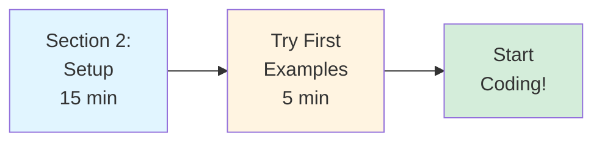
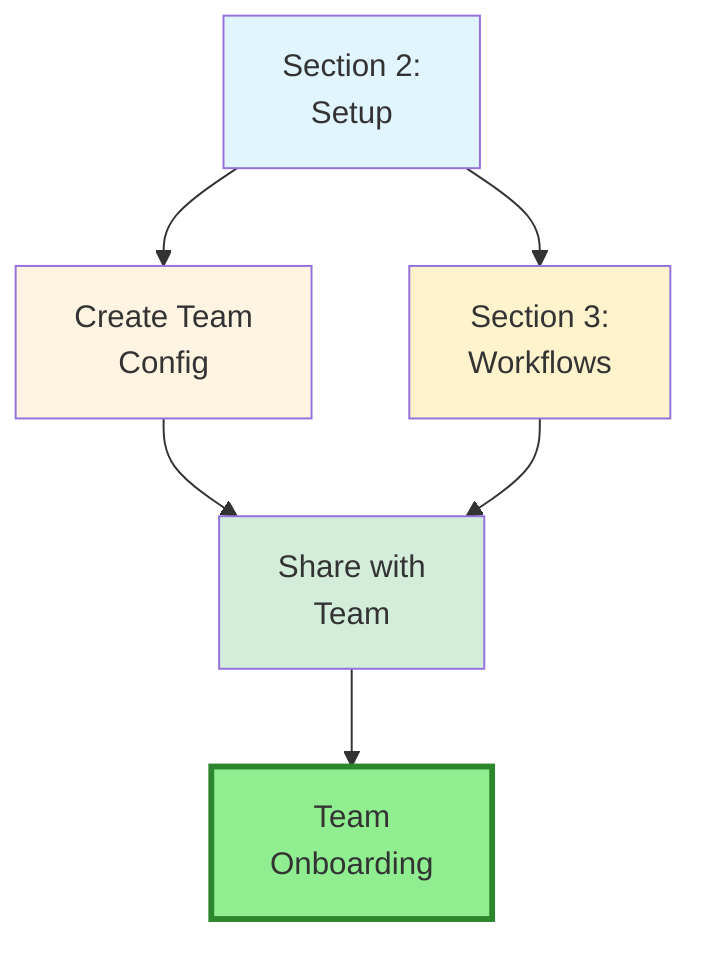
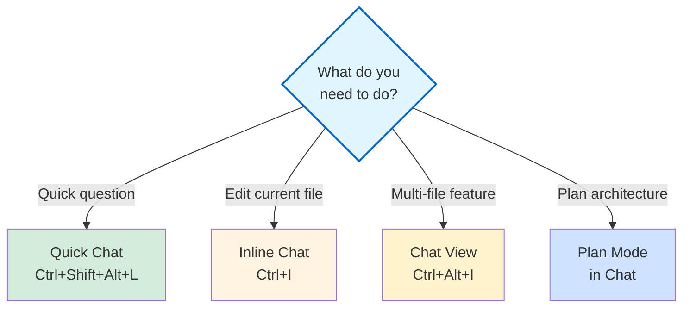

# Part 1: Fundamentals & Core Concepts

**Target Audience:** Essential foundations for all users  
**Time to Complete:** 2 hours (can be split across multiple sessions)  
**Prerequisites:** None - start here if you're new to GitHub Copilot

---

## 📋 Overview

Part 1 establishes the foundational knowledge you need to use GitHub Copilot effectively. Whether you're a solo developer or part of a team, these sections will get you from zero to productive in hours, not days.

**What you'll learn:**
- How GitHub Copilot works and when to use each feature
- Setting up your development environment correctly
- Essential workflows for daily development
- Best practices for team collaboration

---

## 📚 Sections

### [Section 1: Mental Models & Architecture](./01-mental-models-architecture.md) ✅
**Status:** ✅ Complete  
**Time:** 45 minutes  
**What you'll learn:**
- How Copilot's AI models work
- The difference between inline completions, Chat, and agents
- When to use Auto model selection vs manual
- Understanding context windows and workspace optimization
- Model Context Protocol (MCP) basics

**Key concepts:**
- Claude 4.5 series (Opus, Sonnet, Haiku)
- GPT-5 series and GPT-4.1
- Gemini 2.5 Pro for long context
- Auto mode for automatic optimization
- Agent modes (Ask, Edit, Plan, Agent)

---

### [Section 2: Environment & Project Setup](./02-environment-project-setup.md) ✅
**Status:** ✅ Complete  
**Time:** 30-45 minutes  
**What you'll learn:**
- Installing VS Code and Copilot extension
- Choosing the right subscription tier
- Authenticating with GitHub
- Workspace configuration best practices
- Creating custom instructions for team consistency
- MCP server setup (optional)

**Key takeaways:**
- Minimum VS Code 1.98.0 required
- Workspace settings override user settings
- Custom instructions provide team consistency
- Test your setup before proceeding

**Quick setup checklist:**
```bash
✅ Install VS Code 1.98.0+
✅ Install GitHub Copilot extension
✅ Sign in to GitHub account
✅ Create .vscode/settings.json
✅ Create .github/copilot-instructions.md
✅ Test inline completion and Chat
```

---

### [Section 3: Core Workflows](./03-core-workflows.md) ✅
**Status:** ✅ Complete  
**Time:** 45 minutes  
**What you'll learn:**
- 7-phase feature development workflow
- Debugging patterns with Copilot
- Code navigation and understanding
- Refactoring techniques
- Test-driven development with AI
- Git workflow integration

**Workflows covered:**
1. **Planning** - Using Plan mode for feature design
2. **Scaffolding** - Agent mode for boilerplate
3. **Implementation** - Inline completions and Chat
4. **Testing** - Test generation and TDD
5. **Documentation** - Automated doc generation
6. **Review** - Security and quality checks
7. **Refinement** - Iterative improvements

**Key takeaways:**
- Always plan before implementing
- Use Explain → Diagnose → Fix for debugging
- Generate tests with Chat
- Review security before committing

---

## 🎯 Learning Paths

### Path A: "I Want to Start Coding Now" (15 minutes)
**Goal:** Get productive immediately



**Steps:**
1. Complete [Section 2: Environment & Project Setup](./02-environment-project-setup.md)
2. Try the "First 5 Minutes" examples from the guide plan
3. Start using inline completions in your work

**When to come back:** After a few hours of use, complete Sections 1 and 3 to deepen understanding.

---

### Path B: "I Want Complete Mastery" (2 hours)
**Goal:** Understand everything deeply


**Steps:**
1. Read Section 1 to understand how Copilot works
2. Complete Section 2 setup with custom instructions
3. Learn Section 3 workflows and practice each one
4. Move to [Part 2: VS Code Integration](../02-vscode-integration/) for advanced features

---

### Path C: "I'm Setting Up My Team" (1 hour)
**Goal:** Team enablement and consistency



**Focus areas:**
1. **Section 2:** 
   - Workspace settings (`.vscode/settings.json`)
   - Custom instructions (`.github/copilot-instructions.md`)
   - Recommended extensions (`.vscode/extensions.json`)
2. **Section 3:** 
   - Core workflows everyone should follow
   - Git workflow integration
3. **Team enablement:**
   - Commit configurations to git
   - Schedule training session
   - Create team prompt library

---

## 🎓 After Completing Part 1

### You'll be able to:

✅ **Understand** how Copilot's AI models work and when to use each  
✅ **Choose** the right model for each task (or use Auto)  
✅ **Configure** VS Code and Copilot optimally  
✅ **Write** custom instructions for team consistency  
✅ **Use** the 7-phase development workflow  
✅ **Debug** and refactor with AI assistance  
✅ **Generate** tests automatically  
✅ **Navigate** unfamiliar codebases faster  

### Next steps:

- **[Part 2: Mastering VS Code Integration](../02-vscode-integration/)** - Deep dive into keyboard shortcuts, workspace optimization, and productivity hacks
- **[Part 3: Advanced Chat & Agent Development](../03-advanced-chat-agents/)** - Create custom agents and master prompt engineering
- **[Part 4: Enterprise & Team Collaboration](../04-enterprise-team/)** - Team adoption and enterprise deployment

---

## 🚀 Quick Reference

### Essential Keyboard Shortcuts

| Action | Windows/Linux | macOS |
|--------|---------------|-------|
| Accept suggestion | `Tab` | `Tab` |
| Inline chat | `Ctrl+I` | `Cmd+I` |
| Chat view | `Ctrl+Alt+I` | `Cmd+Option+I` |
| Quick chat | `Ctrl+Shift+Alt+L` | `Cmd+Shift+Option+L` |

### When to Use Each Feature



### Agent Mode Quick Reference

| Mode | Use For | Autonomy |
|------|---------|----------|
| **Ask** | Questions, explanations | Read-only |
| **Edit** | Single-file changes | Moderate |
| **Plan** | Feature planning | Read-only + planning |
| **Agent** | Multi-file implementation | Full autonomy |

---

## 💡 Pro Tips for Part 1

### Tip 1: Start with Auto Model Selection
Don't overthink model choice. Use **Auto** and let Copilot optimize:
- Automatically selects best model for each task
- Optimizes cost and performance
- Adapts to complexity

### Tip 2: Workspace Settings First
Always configure at workspace level (`.vscode/settings.json`) for team consistency:
```json
{
  "github.copilot.enable": {
    "*": true
  },
  "editor.inlineSuggest.enabled": true
}
```

### Tip 3: Custom Instructions = Team Superpower
Create `.github/copilot-instructions.md` with your coding standards:
- Consistent code style
- Security requirements
- Testing expectations
- API patterns

### Tip 4: Test Immediately
After setup, test all three interfaces:
1. Type a function and wait for inline completion
2. Press `Ctrl+I` and ask to refactor code
3. Open Chat (`Ctrl+Alt+I`) and ask about your codebase

### Tip 5: Iterate on Prompts
Don't accept first result - refine your requests:
- ❌ "Fix this code"
- ✅ "Refactor this function to use async/await and add error handling"

---

## 📖 Additional Resources

### Official Documentation
- [GitHub Copilot Getting Started](https://docs.github.com/copilot/getting-started-with-github-copilot)
- [VS Code Copilot Documentation](https://code.visualstudio.com/docs/copilot/overview)
- [Model Context Protocol](https://modelcontextprotocol.io)

### Community
- [GitHub Copilot Community Forum](https://github.community)
- [VS Code Community](https://code.visualstudio.com/community)

### From This Guide
- [Master Plan](../../copilot-guide-plan.md) - Full guide structure
- [Mermaid Diagram Guide](../MERMAID_GUIDE.md) - For contributors
- [Quick Reference](../07-reference-advanced/01-complete-reference.md) - Command cheat sheet

---

## ✅ Part 1 Completion Checklist

Before moving to Part 2, ensure you've:

- [ ] **Understand** the different Copilot features (completions, Chat, agents)
- [ ] **Installed** VS Code 1.98.0+ and Copilot extension
- [ ] **Authenticated** with GitHub account
- [ ] **Created** workspace settings (`.vscode/settings.json`)
- [ ] **Written** custom instructions (`.github/copilot-instructions.md`)
- [ ] **Tested** inline completion, inline chat, and Chat view
- [ ] **Practiced** at least 3 examples from "First 5 Minutes"
- [ ] **Can explain** when to use Ask, Edit, Plan, and Agent modes

**Success metric:** You can confidently use Copilot for daily coding tasks and understand which feature to use when.

---

**Part 1 Status:** ✅ Complete (All sections finished)  
**Last Updated:** December 2025  
**Next Part:** [Part 2: Mastering VS Code Integration](../02-vscode-integration/)

---

**Ready to continue?** Start with [Section 2: Environment & Project Setup](./02-environment-project-setup.md) →

