# Section 1: VS Code Copilot Extension Deep Dive

**Part 2 > Section 1 of 4**  
**Time to Complete:** 45 minutes  
**Prerequisites:** Part 1 completed, VS Code 1.98.0+, Copilot extension installed

---

## 🎯 Learning Objectives

By the end of this section, you will:
- ✅ Master all three Copilot chat interfaces and know when to use each
- ✅ Understand the extension architecture and how it integrates with VS Code
- ✅ Configure extension settings for your specific workflow
- ✅ Navigate all Copilot features using keyboard shortcuts
- ✅ Manage privacy, telemetry, and security settings

---

## 📋 Table of Contents

1. [Extension Architecture Overview](#extension-architecture-overview)
2. [The Three Chat Interfaces](#the-three-chat-interfaces)
3. [Status Bar & Controls](#status-bar--controls)
4. [Extension Settings Deep Dive](#extension-settings-deep-dive)
5. [Keyboard Shortcuts Mastery](#keyboard-shortcuts-mastery)
6. [Privacy & Telemetry](#privacy--telemetry)
7. [Offline Capabilities & Limitations](#offline-capabilities--limitations)
8. [Troubleshooting Common Issues](#troubleshooting-common-issues)

---

## Extension Architecture Overview

### How GitHub Copilot Integrates with VS Code

GitHub Copilot consists of **two primary extensions** that work together:

```mermaid
graph TB
    VSCODE["VS Code Editor"]
    
    VSCODE --> COPILOT["GitHub Copilot<br/>━━━━━<br/>Core Extension"]
    VSCODE --> CHAT["GitHub Copilot Chat<br/>━━━━━<br/>Chat Extension"]
    
    COPILOT --> INLINE["Inline Suggestions<br/>• As-you-type completions<br/>• Function generation<br/>• Comment-to-code"]
    
    CHAT --> QUICK["Quick Chat<br/>• Overlay interface"]
    CHAT --> IC["Inline Chat<br/>• Editor integration"]
    CHAT --> VIEW["Chat View<br/>• Sidebar panel"]
    
    COPILOT --> API["GitHub Copilot API"]
    CHAT --> API
    
    API --> MODELS["AI Models<br/>• GPT-4.1 (inline)<br/>• Claude 4.5 series<br/>• GPT-5 series<br/>• Gemini 2.5 Pro<br/>• Auto selection"]
    
    style VSCODE fill:#0066cc,color:#fff,stroke:#003d7a,stroke-width:3px
    style COPILOT fill:#90EE90,stroke:#2d862d,stroke-width:3px
    style CHAT fill:#90EE90,stroke:#2d862d,stroke-width:3px
    style MODELS fill:#cfe2ff
```



### Extension Components

| Component | Function | User-Facing Feature |
|-----------|----------|-------------------|
| **Language Service** | Code analysis & context | Understands your code structure |
| **Suggestion Engine** | Inline completions | Tab-to-accept suggestions |
| **Chat Service** | Conversational AI | Three chat interfaces |
| **Agent System** | Autonomous actions | Agent mode for multi-file work |
| **Context Provider** | Workspace awareness | @workspace, @file references |
| **Tools Integration** | External capabilities | MCP servers, extension tools |

### Installation & Activation

**Extension IDs:**
- `GitHub.copilot` - Core extension
- `GitHub.copilot-chat` - Chat functionality

**Verify installation:**

```bash
# Via Command Palette (Ctrl+Shift+P)
> Extensions: Show Installed Extensions
# Search for "Copilot"
```

**Check activation:**
- ✅ Status bar shows Copilot icon (bottom right)
- ✅ Inline suggestions appear when typing
- ✅ Chat interfaces accessible via shortcuts

---

## The Three Chat Interfaces

Understanding when to use each interface is key to maximizing productivity.

### 1. Quick Chat (Overlay)

**Keyboard Shortcut:** `Ctrl+Shift+Alt+L` (Windows/Linux) | `Cmd+Shift+Option+L` (macOS)

**What it is:** A temporary overlay that appears without taking up screen space.

**When to use:**
- ✅ Quick questions: "What does this function do?"
- ✅ Syntax lookups: "How do I format dates in JavaScript?"
- ✅ API references: "Show me Express.js middleware syntax"
- ✅ Fast explanations: "Explain this error message"

**Limitations:**
- ❌ Single-turn conversations (no follow-ups)
- ❌ Cannot edit code directly
- ❌ Disappears when clicking elsewhere

**Example workflow:**

```typescript
// You're writing code and see an unfamiliar API
fetch('https://api.example.com/data')
  .then(response => response.json())
  
// Press Ctrl+Shift+Alt+L
// Ask: "What are the error handling best practices for fetch?"
// Read answer, press Esc, continue coding
```

**Pro tip:** Use Quick Chat when you don't want to lose focus on your current task.

---

### 2. Inline Chat (Editor-Embedded)

**Keyboard Shortcut:** `Ctrl+I` (Windows/Linux) | `Cmd+I` (macOS)

**What it is:** A chat interface that appears directly in your editor, at the cursor position.

**When to use:**
- ✅ Refactoring code: "Convert this to async/await"
- ✅ Adding features: "Add error handling to this function"
- ✅ Code generation: "Create a test for this function"
- ✅ Inline explanations: "Explain this regex pattern"
- ✅ Terminal commands: Ctrl+I in terminal for command help

**Capabilities:**
- ✅ Direct code editing with preview
- ✅ Accept/reject changes
- ✅ Multi-turn conversations (limited)
- ✅ Context-aware (understands surrounding code)

**Example workflow:**

```typescript
// You have a function that needs refactoring
function calculateTotal(items) {
  let total = 0;
  for (let i = 0; i < items.length; i++) {
    total += items[i].price;
  }
  return total;
}

// Select the function, press Ctrl+I
// Type: "Refactor to use reduce and add TypeScript types"
// Preview changes, press Ctrl+Enter to accept
```

**Result:**

```typescript
function calculateTotal(items: { price: number }[]): number {
  return items.reduce((total, item) => total + item.price, 0);
}
```

### Inline Chat Settings

Configure inline chat behavior in `settings.json`:

```json
{
  // Automatically end inline chat when typing outside modified regions
  "inlineChat.finishOnType": false,
  
  // Enable speech-to-text when holding Ctrl+I
  "inlineChat.holdToSpeech": true,
  
  // Show hint for inline chat on empty lines
  "inlineChat.lineEmptyHint": true,
  
  // Trigger inline chat when line contains mostly natural language
  "inlineChat.lineNaturalLanguageHint": true,
  
  // Enable syntax highlighting in inline suggestions
  "editor.inlineSuggest.syntaxHighlightingEnabled": true,
  
  // Customize inline suggestion font
  "editor.inlineSuggest.fontFamily": "Consolas, 'Courier New', monospace",
  
  // Show/hide inline suggestion toolbar
  "editor.inlineSuggest.showToolbar": true
}
```

**Pro tip:** Enable `inlineChat.holdToSpeech` for hands-free coding!

---

### 3. Chat View (Sidebar Panel)

**Keyboard Shortcut:** `Ctrl+Alt+I` (Windows/Linux) | `Cmd+Option+I` (macOS)

**What it is:** A dedicated sidebar panel for full-featured AI conversations.

**When to use:**
- ✅ Complex features: "Implement OAuth2 authentication"
- ✅ Multi-file changes: Agent mode edits
- ✅ Planning: "Create a plan for this feature"
- ✅ Code review: "@workspace Review this PR for security issues"
- ✅ Learning: "Explain the authentication flow in this app"
- ✅ Debugging: "Why is this function returning undefined?"

**Unique features:**
- ✅ Multi-turn conversations with full history
- ✅ Agent mode switching (Ask, Edit, Plan, Agent)
- ✅ Subagents for complex tasks
- ✅ Custom agent selection
- ✅ Tool integration (MCP servers)
- ✅ @workspace, @file, @selection references
- ✅ Slash commands (/fix, /tests, /doc, etc.)
- ✅ Model selection (Pro/Pro+ users)

**Example workflow:**

```plaintext
# Open Chat View (Ctrl+Alt+I)

# Multi-turn conversation for complex task
You: @workspace How does our authentication system work?

Copilot: [Explains auth flow based on your code]

You: Add two-factor authentication support

# Switch to Agent mode
Copilot: [Creates plan, asks for confirmation]

You: Yes, proceed

Copilot: [Autonomously creates auth middleware, updates routes, adds tests]
```

### Chat View Interface Elements

```mermaid
graph TB
    CHATVIEW["Chat View Panel"]
    
    CHATVIEW --> HEADER["Header<br/>━━━━━<br/>• Model selector<br/>• Agent mode picker<br/>• New chat button"]
    CHATVIEW --> MESSAGES["Message History<br/>━━━━━<br/>• Conversations<br/>• Code blocks<br/>• File references"]
    CHATVIEW --> INPUT["Input Box<br/>━━━━━<br/>• @ mentions<br/>• / commands<br/>• Attach files/context"]
    CHATVIEW --> TOOLS["Tools Panel<br/>━━━━━<br/>• MCP servers<br/>• Extension tools<br/>• Built-in tools"]
    
    style CHATVIEW fill:#0066cc,color:#fff,stroke:#003d7a,stroke-width:3px
    style HEADER fill:#cfe2ff
    style MESSAGES fill:#e1f5ff
    style INPUT fill:#fff4e1
    style TOOLS fill:#f0e1ff
```



---

## Choosing the Right Interface

### Decision Matrix


### Real-World Examples

| Scenario | Best Interface | Why |
|----------|----------------|-----|
| "What's the syntax for async/await?" | Quick Chat ⚡ | Fast lookup, no code changes |
| "Add error handling to this function" | Inline Chat ✏️ | Single function, direct edit |
| "Convert all class components to functional" | Chat View + Agent 🤖 | Multi-file refactoring |
| "Explain this authentication flow" | Chat View 💬 | Multi-turn discussion |
| "Fix this bug in the current function" | Inline Chat ✏️ | Focused, single-file fix |
| "Generate tests for the auth module" | Chat View 💬 | Multiple test files |
| "How do I center a div in CSS?" | Quick Chat ⚡ | One-line answer |

---

## Status Bar & Controls

### Status Bar Icon

The Copilot icon in the status bar (bottom right) provides quick access to extension controls.

**Status Indicators:**

| Icon State | Meaning | Action |
|------------|---------|--------|
| ✅ `$(copilot)` | Active and ready | Click for menu |
| 🔄 `$(loading~spin)` | Processing suggestion | Wait for completion |
| ⚠️ `$(warning)` | Authentication issue | Click to sign in |
| ❌ `$(error)` | Extension error | Check logs |
| 🚫 `$(copilot-disabled)` | Disabled for file type | Enable in settings |

### Status Bar Menu

Click the Copilot icon to access:

```
GitHub Copilot
├─ Enable/Disable Completions
├─ Enable Globally
├─ Disable for [language]
├─ Disable for [workspace]
├─ Open Settings
├─ Open Logs
├─ Send Feedback
└─ Sign Out
```

### Quick Actions

**Enable/Disable Copilot:**
- Globally: Click icon → "Enable/Disable Globally"
- For file type: Click icon → "Disable for [TypeScript]"
- For workspace: Click icon → "Disable for [current workspace]"

**Check authentication:**
- Icon shows ⚠️ if not signed in
- Click icon → "Sign in to GitHub"

---

## Extension Settings Deep Dive

### Essential Settings

Configure Copilot behavior in `settings.json` (File > Preferences > Settings, or `Ctrl+,`):

```json
{
  // ===== Core Copilot Settings =====
  
  // Enable/disable Copilot globally or by language
  "github.copilot.enable": {
    "*": true,              // All languages
    "markdown": true,
    "plaintext": false      // Disable for plain text
  },
  
  // Enable inline completions
  "github.copilot.editor.enableAutoCompletions": true,
  
  // ===== Inline Suggestions =====
  
  // Enable inline suggestions
  "editor.inlineSuggest.enabled": true,
  
  // Show inline suggestion toolbar (Accept, Reject buttons)
  "editor.inlineSuggest.showToolbar": true,
  
  // Syntax highlighting for suggestions
  "editor.inlineSuggest.syntaxHighlightingEnabled": true,
  
  // Custom font for suggestions
  "editor.inlineSuggest.fontFamily": "Consolas, 'Courier New', monospace",
  
  // ===== Inline Chat Settings =====
  
  // Auto-finish inline chat when typing elsewhere
  "inlineChat.finishOnType": false,
  
  // Hold Ctrl+I for speech-to-text
  "inlineChat.holdToSpeech": true,
  
  // Show hint on empty lines
  "inlineChat.lineEmptyHint": true,
  
  // Trigger on natural language detection
  "inlineChat.lineNaturalLanguageHint": true,
  
  // ===== Chat View Settings =====
  
  // Include recently viewed files in context (experimental)
  "github.copilot.chat.editor.temporalContext.enabled": true,
  
  // Summarize long agent conversations (experimental)
  "github.copilot.chat.summarizeAgentConversationHistory.enabled": true,
  
  // Enable #installExtension tool in chat
  "github.copilot.chat.installExtensionEnabled": true,
  
  // ===== Custom Instructions =====
  
  // Configure pull request description generation
  "github.copilot.chat.pullRequestDescriptionGeneration.instructions": [
    { "text": "Always include a list of key changes." },
    { "text": "Follow conventional commit format." }
  ],
  
  // Configure code review instructions
  "github.copilot.chat.reviewSelection.instructions": [
    { "file": "guidance/backend-review-guidelines.md" },
    { "file": "guidance/frontend-review-guidelines.md" }
  ],
  
  // ===== Performance =====
  
  // Suggestion delay (milliseconds)
  "editor.quickSuggestionsDelay": 10,
  
  // ===== Privacy =====
  
  // Disable telemetry (see Privacy section below)
  "github.copilot.telemetry.enable": false
}
```

### Language-Specific Settings

Enable/disable Copilot for specific languages:

```json
{
  "github.copilot.enable": {
    "*": true,                      // Enable by default
    "yaml": true,
    "plaintext": false,             // Disable for plain text
    "markdown": true,
    "scminput": false,              // Disable in git commit messages
    "python": true,
    "javascript": true,
    "typescript": true,
    "go": true,
    "rust": true
  }
}
```

### Workspace-Specific Settings

Override user settings at the workspace level (`.vscode/settings.json`):

```json
{
  // Enable Copilot for this workspace
  "github.copilot.enable": {
    "*": true
  },
  
  // Workspace-specific instructions
  "github.copilot.chat.pullRequestDescriptionGeneration.instructions": [
    { "text": "Include Jira ticket reference in format: [PROJ-123]" },
    { "text": "Add test coverage metrics if available" }
  ]
}
```

---

## Keyboard Shortcuts Mastery

### Essential Shortcuts

| Action | Windows/Linux | macOS | Description |
|--------|---------------|-------|-------------|
| **Accept suggestion** | `Tab` | `Tab` | Accept entire inline suggestion |
| **Accept word** | `Ctrl+→` | `Cmd+→` | Accept next word only |
| **Reject suggestion** | `Esc` | `Esc` | Dismiss current suggestion |
| **Next suggestion** | `Alt+]` | `Option+]` | Cycle to next suggestion |
| **Previous suggestion** | `Alt+[` | `Option+[` | Cycle to previous |
| **Show all suggestions** | `Ctrl+Enter` | `Cmd+Enter` | Open suggestions panel |
| **Inline chat** | `Ctrl+I` | `Cmd+I` | Open inline chat |
| **Chat view** | `Ctrl+Alt+I` | `Cmd+Option+I` | Open/focus chat view |
| **Quick chat** | `Ctrl+Shift+Alt+L` | `Cmd+Shift+Option+L` | Open quick chat overlay |

### Advanced Shortcuts

| Action | Windows/Linux | macOS | Use Case |
|--------|---------------|-------|----------|
| **Terminal inline chat** | `Ctrl+I` (in terminal) | `Cmd+I` (in terminal) | Get command suggestions |
| **Explain selection** | Select code → Right-click → "Copilot: Explain" | Understand code |
| **Fix problem** | On error → `Ctrl+.` → "Copilot: Fix" | Quick error fixes |
| **Generate tests** | `/tests` in chat | Create test cases |
| **Generate docs** | `/doc` in chat | Add documentation |

### Custom Keybindings

Add custom shortcuts in `keybindings.json` (File > Preferences > Keyboard Shortcuts, or `Ctrl+K Ctrl+S`):

```json
[
  // Quick access to specific chat commands
  {
    "key": "ctrl+shift+t",
    "command": "workbench.action.chat.open",
    "args": { "query": "/tests" }
  },
  {
    "key": "ctrl+shift+d",
    "command": "workbench.action.chat.open",
    "args": { "query": "/doc" }
  },
  {
    "key": "ctrl+shift+e",
    "command": "workbench.action.chat.open",
    "args": { "query": "/explain" }
  },
  
  // Toggle Copilot on/off quickly
  {
    "key": "ctrl+shift+alt+c",
    "command": "github.copilot.toggleCopilot"
  },
  
  // Open Copilot settings
  {
    "key": "ctrl+shift+alt+s",
    "command": "workbench.action.openSettings",
    "args": { "query": "copilot" }
  }
]
```

### Keyboard-Only Workflow

**Goal:** Code without touching the mouse

```plaintext
1. Start typing → Copilot suggests
2. Tab → Accept suggestion
3. Alt+] → See alternative
4. Ctrl+I → Refactor inline
5. Type instruction → Preview change
6. Ctrl+Enter → Accept change
7. Ctrl+Alt+I → Open chat for complex task
8. Type @workspace query
9. Review response
10. Alt+Tab → Back to editor
```

**Practice challenge:** Complete a feature implementation using only keyboard. Time yourself and aim for <5 seconds per decision.

---

## Privacy & Telemetry

### What Data Does Copilot Collect?

**Copilot sends to GitHub:**
- ✅ Code snippets (surrounding context for suggestions)
- ✅ User prompts in chat
- ✅ File type and language
- ✅ Timestamp of request

**Copilot does NOT send:**
- ❌ Entire files (only relevant snippets)
- ❌ Files excluded by .gitignore
- ❌ Files in .copilotignore
- ❌ Credentials or secrets (filtered)

### Telemetry Settings

**Disable all telemetry:**

```json
{
  // Disable Copilot telemetry
  "github.copilot.telemetry.enable": false,
  
  // Disable VS Code telemetry (optional)
  "telemetry.telemetryLevel": "off"
}
```

### Disabling AI Features Completely

**To remove Copilot from VS Code entirely:**

```json
{
  // Disable all AI features
  "chat.disableAIFeatures": true
}
```

Or via UI:
1. Click Chat menu in title bar
2. Select **"Learn How to Hide AI Features"**
3. Enable setting

**This will:**
- ✅ Hide chat interfaces
- ✅ Disable inline suggestions
- ✅ Disable Copilot extensions
- ✅ Preserve setting across updates

### Enterprise Privacy Controls

**For Business/Enterprise plans:**

1. **Organization settings** (GitHub.com):
   - Block public code suggestions
   - Disable telemetry org-wide
   - Audit logs (Enterprise only)

2. **Workspace Trust:**
   - Disable Copilot in untrusted workspaces
   - Settings → Workspace Trust → Configure

### Sensitive File Exclusion

Create `.copilotignore` in project root:

```gitignore
# Exclude secrets
.env
.env.*
secrets/
credentials/

# Exclude sensitive configs
**/config/production.js
**/database.yml

# Exclude large generated files
dist/
build/
node_modules/
```

---

## Offline Capabilities & Limitations

### What Works Offline?

| Feature | Offline Support | Notes |
|---------|----------------|-------|
| **Inline suggestions** | ❌ No | Requires API connection |
| **Chat interfaces** | ❌ No | Cloud-based processing |
| **Agent mode** | ❌ No | Requires API access |
| **Previous suggestions** | ⚠️ Cached | Recently shown suggestions may persist |
| **Extension UI** | ✅ Yes | Status bar and menus remain |
| **Settings** | ✅ Yes | Configure while offline |

### Connection Status

**Check connection:**
- Status bar icon shows ⚠️ when offline
- Chat returns "Unable to connect" error

**Fallback strategy when offline:**
1. Use IDE's built-in IntelliSense
2. Rely on snippets and templates
3. Document questions to ask when online
4. Use local documentation

### Network Requirements

- **Bandwidth:** ~100KB per suggestion request
- **Latency:** <500ms for best experience
- **Firewall:** Allow `*.github.com` and `api.github.com`
- **Proxy:** Configure in VS Code settings if needed

---

## Troubleshooting Common Issues

### Issue 1: No Suggestions Appearing

**Symptoms:**
- Typing code but no inline suggestions show
- Status bar icon shows ❌ or ⚠️

**Solutions:**

1. **Check authentication:**
   ```
   Click Copilot icon → Ensure signed in
   ```

2. **Verify file type is enabled:**
   ```json
   {
     "github.copilot.enable": {
       "*": true  // or specific language
     }
   }
   ```

3. **Check inline suggestions are enabled:**
   ```json
   {
     "editor.inlineSuggest.enabled": true,
     "github.copilot.editor.enableAutoCompletions": true
   }
   ```

4. **Restart extension:**
   ```
   Command Palette (Ctrl+Shift+P)
   > Developer: Reload Window
   ```

5. **Check logs:**
   ```
   Click Copilot icon → Open Logs
   Look for errors or authentication issues
   ```

---

### Issue 2: Chat Not Responding

**Symptoms:**
- Chat interfaces open but don't respond
- Spinning indicator never stops

**Solutions:**

1. **Check network connection:**
   - Visit github.com in browser
   - Verify proxy settings if behind corporate firewall

2. **Clear chat history:**
   ```
   Chat View → Click "..." menu → Clear chat history
   ```

3. **Check MCP servers:**
   ```
   Command Palette → MCP: List Servers
   Ensure all servers are running
   ```

4. **Restart VS Code:**
   ```
   File → Exit (not just close window)
   Reopen VS Code
   ```

---

### Issue 3: Slow Suggestions

**Symptoms:**
- Suggestions take >3 seconds
- Typing feels laggy

**Solutions:**

1. **Reduce context scope:**
   ```json
   {
     "github.copilot.chat.editor.temporalContext.enabled": false
   }
   ```

2. **Exclude large files:** (See Part 2, Section 3)
   ```gitignore
   # .copilotignore
   node_modules/
   dist/
   build/
   *.min.js
   ```

3. **Check VS Code performance:**
   ```
   Command Palette → Developer: Show Running Extensions
   Disable unused extensions
   ```

4. **Update extensions:**
   ```
   Extensions view → Update all
   ```

---

### Issue 4: Authentication Failures

**Symptoms:**
- "Authentication required" errors
- Can't sign in

**Solutions:**

1. **Sign out and back in:**
   ```
   Click Copilot icon → Sign Out
   Wait 10 seconds
   Click icon → Sign in to GitHub
   ```

2. **Check GitHub account:**
   - Verify Copilot subscription is active at github.com/settings/copilot
   - Ensure not expired or suspended

3. **Clear VS Code credentials:**
   ```
   Command Palette → Developer: Reload Window
   ```

4. **Check firewall/proxy:**
   - Ensure *.github.com and api.github.com are accessible
   - Configure proxy in VS Code settings if needed

---

### Issue 5: Extension Not Activating

**Symptoms:**
- No Copilot icon in status bar
- Extensions show as installed but not running

**Solutions:**

1. **Check VS Code version:**
   ```
   Help → About
   Ensure VS Code >= 1.98.0
   ```

2. **Reinstall extensions:**
   ```
   Extensions view → Uninstall GitHub Copilot
   Reload window
   Reinstall from Marketplace
   ```

3. **Check extension conflicts:**
   ```
   Disable all other extensions
   Test Copilot
   Re-enable extensions one by one
   ```

4. **Check logs for errors:**
   ```
   Command Palette → Developer: Show Logs
   Select "Extension Host"
   Look for Copilot errors
   ```

---

## 📊 Quick Reference: Settings Checklist

### Minimum Configuration (5 minutes)

```json
{
  "github.copilot.enable": { "*": true },
  "editor.inlineSuggest.enabled": true,
  "github.copilot.editor.enableAutoCompletions": true
}
```

### Recommended Configuration (15 minutes)

```json
{
  // Core
  "github.copilot.enable": { "*": true },
  "editor.inlineSuggest.enabled": true,
  "github.copilot.editor.enableAutoCompletions": true,
  
  // UI
  "editor.inlineSuggest.showToolbar": true,
  "editor.inlineSuggest.syntaxHighlightingEnabled": true,
  
  // Inline Chat
  "inlineChat.finishOnType": false,
  "inlineChat.holdToSpeech": true,
  
  // Privacy
  "github.copilot.telemetry.enable": false
}
```

### Power User Configuration (30 minutes)

See [complete settings](#extension-settings-deep-dive) section above.

---

## 🎯 Workshop: Master the Extension

### Part 1: Interface Practice (15 minutes)

1. **Quick Chat:**
   - Press `Ctrl+Shift+Alt+L`
   - Ask: "What's the difference between let and const?"
   - Read answer, press Esc

2. **Inline Chat:**
   - Write a simple function
   - Select it, press `Ctrl+I`
   - Type: "Add JSDoc comments"
   - Accept changes

3. **Chat View:**
   - Press `Ctrl+Alt+I`
   - Type: "@workspace Summarize the main files in this project"
   - Review response

**Goal:** Use each interface at least once

### Part 2: Configure Settings (15 minutes)

1. Open settings (`Ctrl+,`)
2. Search for "copilot"
3. Configure:
   - Enable inline suggestions
   - Set language preferences
   - Disable telemetry (if desired)
4. Test: Type code and verify suggestions appear

### Part 3: Keyboard Shortcuts (15 minutes)

1. Create a new file
2. Practice this sequence 5 times:
   - Type function signature
   - `Tab` to accept suggestion
   - `Alt+]` to see alternatives
   - `Ctrl+I` to refactor
   - `Esc` to dismiss

3. **Goal:** Complete sequence in <30 seconds

---

## 🎓 Key Takeaways

✅ **Three interfaces, three use cases:**
- Quick Chat for fast answers
- Inline Chat for single-file edits  
- Chat View for complex, multi-file work

✅ **Status bar is your control center:**
- Click icon for quick enable/disable
- Check authentication status
- Access logs for troubleshooting

✅ **Configuration hierarchy:**
- User settings (global)
- Workspace settings (project-specific)
- Language settings (file type overrides)

✅ **Privacy controls exist:**
- Disable telemetry
- Use .copilotignore
- Enterprise audit logs available

✅ **Keyboard shortcuts save seconds per action:**
- Tab to accept
- Ctrl+I for inline chat
- Ctrl+Alt+I for chat view

---

## 📖 Additional Resources

**Official Documentation:**
- [VS Code Copilot Settings Reference](https://code.visualstudio.com/docs/copilot/reference/copilot-settings)
- [GitHub Copilot Extension](https://marketplace.visualstudio.com/items?itemName=GitHub.copilot)
- [VS Code Keyboard Shortcuts](https://code.visualstudio.com/docs/getstarted/keybindings)

**Community:**
- [Copilot Extension Issues](https://github.com/community/community/discussions/categories/copilot)
- [VS Code Copilot Discussions](https://github.com/microsoft/vscode-discussions)

---

## ✅ Section Complete!

You now understand:
- ✅ Extension architecture and components
- ✅ When to use each chat interface
- ✅ How to configure settings for your workflow
- ✅ Essential keyboard shortcuts
- ✅ Privacy and security controls
- ✅ Troubleshooting common issues

**Next:** [Section 2: Workspace Optimization Patterns →](02-workspace-optimization.md)

---

**Part 2 Navigation:**
- [← Back to Part 2 Overview](README.md)
- [Next: Section 2 - Workspace Optimization →](02-workspace-optimization.md)
- [↑ Back to Guide Home](../../README.md)

---

**Last Updated:** December 2025  
**Sources:** Official VS Code and GitHub Copilot documentation via Context7 MCP

