# Section 2: Workspace Optimization Patterns

**Part 2 > Section 2 of 4**  
**Time to Complete:** 45 minutes  
**Prerequisites:** Section 1 completed

---

## 🎯 Learning Objectives

By the end of this section, you will:
- ✅ Create and configure multi-root workspaces for complex projects
- ✅ Set up team-shared configuration files for consistency
- ✅ Implement workspace recommendations for extensions
- ✅ Organize .vscode folder structure effectively
- ✅ Manage settings hierarchy (User → Workspace → Folder)
- ✅ Configure Workspace Trust for security

---

## 📋 Table of Contents

1. [Workspace Fundamentals](#workspace-fundamentals)
2. [Multi-Root Workspace Configuration](#multi-root-workspace-configuration)
3. [Workspace Recommendations](#workspace-recommendations)
4. [Custom Instructions Hierarchy](#custom-instructions-hierarchy)
5. [.vscode Folder Organization](#vscode-folder-organization)
6. [Settings Sync Across Teams](#settings-sync-across-teams)
7. [Workspace Trust & Security](#workspace-trust--security)
8. [Team Collaboration Patterns](#team-collaboration-patterns)

---

## Workspace Fundamentals

### What is a VS Code Workspace?

A **workspace** is a collection of one or more folders that VS Code treats as a unified project. Workspaces enable:

- ✅ Shared settings across multiple folders
- ✅ Extension configuration specific to the project
- ✅ Custom instructions for Copilot
- ✅ Team collaboration with consistent environment
- ✅ Multi-root projects (monorepos, microservices)

### Workspace Types

```mermaid
graph TB
    WORKSPACE["Workspace Types"]
    
    WORKSPACE --> SINGLE["Single-Folder Workspace<br/>━━━━━<br/>• One folder<br/>• Settings in .vscode/<br/>• Common for small projects"]
    WORKSPACE --> MULTI["Multi-Root Workspace<br/>━━━━━<br/>• Multiple folders<br/>• Settings in .code-workspace<br/>• For monorepos, microservices"]
    WORKSPACE --> EMPTY["Empty Workspace<br/>━━━━━<br/>• No folders<br/>• User settings only<br/>• Rare use case"]
    
    SINGLE --> SINGLE_USE["Use Cases<br/>• Single repository<br/>• Simple applications<br/>• Individual projects"]
    
    MULTI --> MULTI_USE["Use Cases<br/>• Monorepos<br/>• Frontend + Backend<br/>• Microservices<br/>• Related projects"]
    
    style WORKSPACE fill:#0066cc,color:#fff,stroke:#003d7a,stroke-width:3px
    style SINGLE fill:#d4edda
    style MULTI fill:#90EE90,stroke:#2d862d,stroke-width:3px
    style EMPTY fill:#fff3cd
```



### Single-Folder vs Multi-Root

| Feature | Single-Folder | Multi-Root |
|---------|--------------|------------|
| **Folder count** | 1 | 2+ |
| **Settings location** | `.vscode/settings.json` | `.code-workspace` file |
| **Ideal for** | Simple projects | Monorepos, microservices |
| **Configuration complexity** | Low | Medium |
| **Team sharing** | Via Git | Via .code-workspace file |
| **Copilot context** | Single folder | All folders |

---

## Multi-Root Workspace Configuration

### When to Use Multi-Root Workspaces

**Use multi-root when:**
- ✅ Frontend + Backend in separate repositories
- ✅ Monorepo with multiple packages
- ✅ Microservices architecture
- ✅ Related projects that share dependencies
- ✅ Documentation + Code in separate folders

**Example architectures:**

```
# E-Commerce Platform (Multi-Root)
workspace-root/
├── frontend/          # React app
├── backend/           # Node.js API
├── mobile/            # React Native
└── shared/            # Shared utilities
```

### Creating a Multi-Root Workspace

#### Method 1: Via UI

1. Open first folder: `File → Open Folder`
2. Add second folder: `File → Add Folder to Workspace`
3. Save workspace: `File → Save Workspace As...`
4. Name: `my-project.code-workspace`

#### Method 2: Manual Creation

Create `my-project.code-workspace`:

```json
{
  "folders": [
    {
      "name": "Frontend",
      "path": "frontend"
    },
    {
      "name": "Backend",
      "path": "backend"
    },
    {
      "name": "Shared Libraries",
      "path": "shared"
    }
  ],
  "settings": {
    // Workspace-wide settings here
  },
  "extensions": {
    // Recommended extensions here
  }
}
```

### Workspace File Structure

**Complete .code-workspace example:**

```json
{
  "folders": [
    {
      "name": "🎨 Frontend (React)",
      "path": "./packages/frontend"
    },
    {
      "name": "⚙️ Backend (Node.js)",
      "path": "./packages/backend"
    },
    {
      "name": "📱 Mobile (React Native)",
      "path": "./packages/mobile"
    },
    {
      "name": "📚 Documentation",
      "path": "./docs"
    }
  ],
  "settings": {
    // ===== GitHub Copilot Settings =====
    "github.copilot.enable": {
      "*": true
    },
    "github.copilot.editor.enableAutoCompletions": true,
    
    // ===== Editor Settings =====
    "editor.formatOnSave": true,
    "editor.codeActionsOnSave": {
      "source.fixAll.eslint": "explicit"
    },
    "editor.tabSize": 2,
    "editor.insertSpaces": true,
    
    // ===== File Settings =====
    "files.autoSave": "afterDelay",
    "files.autoSaveDelay": 1000,
    "files.trimTrailingWhitespace": true,
    "files.insertFinalNewline": true,
    
    // ===== Search Settings =====
    "search.exclude": {
      "**/node_modules": true,
      "**/dist": true,
      "**/build": true,
      "**/.next": true,
      "**/coverage": true
    },
    
    // ===== Workspace Display =====
    "workbench.editor.labelFormat": "medium",
    
    // ===== TypeScript Settings =====
    "typescript.tsdk": "node_modules/typescript/lib",
    "typescript.enablePromptUseWorkspaceTsdk": true
  },
  "extensions": {
    "recommendations": [
      // Copilot
      "github.copilot",
      "github.copilot-chat",
      
      // Formatters
      "esbenp.prettier-vscode",
      "dbaeumer.vscode-eslint",
      
      // Language Support
      "bradlc.vscode-tailwindcss",
      "prisma.prisma",
      
      // Utilities
      "usernamehw.errorlens",
      "eamodio.gitlens"
    ],
    "unwantedRecommendations": [
      "ms-vscode.vscode-typescript-tslint-plugin"
    ]
  },
  "launch": {
    "version": "0.2.0",
    "configurations": [
      {
        "name": "Launch Frontend",
        "type": "chrome",
        "request": "launch",
        "url": "http://localhost:3000",
        "webRoot": "${workspaceFolder:Frontend}/src"
      },
      {
        "name": "Launch Backend",
        "type": "node",
        "request": "launch",
        "program": "${workspaceFolder:Backend}/src/index.js"
      }
    ],
    "compounds": [
      {
        "name": "Launch Full Stack",
        "configurations": [
          "Launch Backend",
          "Launch Frontend"
        ],
        "stopAll": true
      }
    ]
  },
  "tasks": {
    "version": "2.0.0",
    "tasks": [
      {
        "label": "Install All Dependencies",
        "type": "shell",
        "command": "npm install",
        "options": {
          "cwd": "${workspaceFolder}"
        },
        "problemMatcher": []
      },
      {
        "label": "Build All",
        "dependsOrder": "sequence",
        "dependsOn": [
          "Build Backend",
          "Build Frontend"
        ]
      }
    ]
  }
}
```

### Folder-Specific Settings

Override global workspace settings per folder:

**frontend/.vscode/settings.json:**

```json
{
  "editor.tabSize": 2,
  "eslint.workingDirectories": ["./"],
  "typescript.tsdk": "node_modules/typescript/lib",
  
  // Frontend-specific Copilot instructions
  "github.copilot.chat.reviewSelection.instructions": [
    { "file": "../.github/frontend-review-guidelines.md" }
  ]
}
```

**backend/.vscode/settings.json:**

```json
{
  "editor.tabSize": 4,
  "eslint.workingDirectories": ["./"],
  
  // Backend-specific Copilot instructions
  "github.copilot.chat.reviewSelection.instructions": [
    { "file": "../.github/backend-review-guidelines.md" }
  ]
}
```

### Working with Multi-Root Workspaces

**Open a multi-root workspace:**

```bash
# Via command line
code my-project.code-workspace

# Or double-click the .code-workspace file
```

**Navigate between folders:**

```
# Quick Open (Ctrl+P)
Type folder name to filter files by folder

# Explorer view
Folders shown with custom names/icons
```

**Context-aware commands:**

- File operations apply to folder of active file
- Terminal opens in active file's folder
- Search scoped to selected folder or all folders

---

## Workspace Recommendations

### Extension Recommendations

**Why recommend extensions:**
- ✅ Team consistency (everyone uses same tools)
- ✅ Automatic prompts to install on workspace open
- ✅ Onboarding acceleration (new members get right tools)
- ✅ Copilot works better with complementary extensions

### Single-Folder Recommendations

**.vscode/extensions.json:**

```json
{
  "recommendations": [
    // ===== GitHub Copilot =====
    "github.copilot",
    "github.copilot-chat",
    
    // ===== Essential Development =====
    "dbaeumer.vscode-eslint",
    "esbenp.prettier-vscode",
    "usernamehw.errorlens",
    
    // ===== Language-Specific =====
    "bradlc.vscode-tailwindcss",
    "prisma.prisma",
    "graphql.vscode-graphql",
    
    // ===== Git & Collaboration =====
    "eamodio.gitlens",
    "github.vscode-pull-request-github",
    
    // ===== Testing & Debugging =====
    "orta.vscode-jest",
    "ms-playwright.playwright",
    
    // ===== Productivity =====
    "formulahendry.auto-rename-tag",
    "christian-kohler.path-intellisense",
    "streetsidesoftware.code-spell-checker"
  ],
  "unwantedRecommendations": [
    // Extensions known to conflict or are outdated
    "ms-vscode.vscode-typescript-tslint-plugin",
    "hookyqr.beautify"
  ]
}
```

### Multi-Root Recommendations

**In .code-workspace file:**

```json
{
  "folders": [...],
  "extensions": {
    "recommendations": [
      // All folders
      "github.copilot",
      "github.copilot-chat",
      "eamodio.gitlens",
      
      // Specific to project type
      "dbaeumer.vscode-eslint",
      "esbenp.prettier-vscode"
    ]
  }
}
```

### Recommendation Categories

Organize by purpose:

```json
{
  "recommendations": [
    // === Core: Must-have for this project ===
    "github.copilot",
    "github.copilot-chat",
    "dbaeumer.vscode-eslint",
    
    // === Productivity: Highly recommended ===
    "eamodio.gitlens",
    "usernamehw.errorlens",
    
    // === Optional: Nice to have ===
    "streetsidesoftware.code-spell-checker",
    "gruntfuggly.todo-tree"
  ]
}
```

### Installing Recommended Extensions

**User experience:**

1. Open workspace
2. VS Code shows notification: "This workspace has extension recommendations"
3. Click "Install All" or "Show Recommendations"
4. Extensions install automatically

**Via command palette:**

```
Ctrl+Shift+P → Extensions: Show Recommended Extensions
```

---

## Custom Instructions Hierarchy

### Settings Hierarchy (Priority Order)

```mermaid
graph TB
    START["VS Code Settings Hierarchy<br/>(Highest to Lowest Priority)"]
    
    START --> FOLDER["1. Folder Settings<br/>━━━━━<br/>folder/.vscode/settings.json<br/><br/>Highest Priority"]
    FOLDER --> WORKSPACE["2. Workspace Settings<br/>━━━━━<br/>.code-workspace file<br/><br/>Medium Priority"]
    WORKSPACE --> USER["3. User Settings<br/>━━━━━<br/>~/.config/Code/User/settings.json<br/><br/>Lowest Priority"]
    USER --> DEFAULT["4. Default Settings<br/>━━━━━<br/>VS Code defaults<br/><br/>Fallback"]
    
    style START fill:#0066cc,color:#fff,stroke:#003d7a,stroke-width:3px
    style FOLDER fill:#f8d7da,stroke:#842029,stroke-width:3px
    style WORKSPACE fill:#fff3cd
    style USER fill:#cfe2ff
    style DEFAULT fill:#e2e3e5
```



### Copilot Custom Instructions Hierarchy

**Priority order (highest first):**

1. **Folder-level** `.github/copilot-instructions.md` (most specific)
2. **Workspace settings** (`.code-workspace` or `.vscode/settings.json`)
3. **User settings** (global config)

### Example: Multi-Level Instructions

**Project root: `.github/copilot-instructions.md`**

```markdown
# Project: E-Commerce Platform

## Global Conventions
- Use TypeScript for all new code
- Follow Airbnb style guide
- Write tests for all business logic
- Use Prettier for formatting

## Architecture
- Clean Architecture principles
- Repository pattern for data access
- Dependency injection via constructor

## Error Handling
- Use custom error classes
- Always log errors to monitoring service
- Return user-friendly messages to client
```

**Frontend: `packages/frontend/.github/copilot-instructions.md`**

```markdown
# Frontend-Specific Instructions

## React Patterns
- Use functional components only (no classes)
- Hooks for state management (useState, useEffect, useContext)
- Custom hooks for reusable logic

## Component Structure
```typescript
// MyComponent.tsx
import React from 'react';
import { ComponentProps } from './MyComponent.types';
import styles from './MyComponent.module.css';

export const MyComponent: React.FC<ComponentProps> = ({ prop1, prop2 }) => {
  // Component logic
  return (
    <div className={styles.container}>
      {/* JSX */}
    </div>
  );
};
```

## Styling
- Use CSS Modules (not styled-components)
- Tailwind for utility classes
- BEM naming for custom CSS

## State Management
- React Context for global state
- Zustand for complex state (if needed)
- React Query for server state
```

**Backend: `packages/backend/.github/copilot-instructions.md`**

```markdown
# Backend-Specific Instructions

## API Design
- RESTful endpoints
- OpenAPI 3.0 documentation required
- Versioned APIs (/api/v1/)

## Controller Pattern
```typescript
// UserController.ts
export class UserController {
  constructor(
    private userService: UserService,
    private logger: Logger
  ) {}
  
  async createUser(req: Request, res: Response): Promise<void> {
    try {
      const user = await this.userService.create(req.body);
      res.status(201).json(user);
    } catch (error) {
      this.logger.error('User creation failed', error);
      throw new ApiError('Failed to create user', 500);
    }
  }
}
```

## Database
- Prisma ORM only
- Migrations via `prisma migrate`
- No raw SQL unless absolutely necessary
```

### Settings-Based Instructions

**In settings.json:**

```json
{
  "github.copilot.chat.pullRequestDescriptionGeneration.instructions": [
    { "text": "Always include Jira ticket reference: [PROJ-123]" },
    { "text": "Add test coverage percentage if available" },
    { "text": "List breaking changes in ## Breaking Changes section" }
  ],
  
  "github.copilot.chat.reviewSelection.instructions": [
    { "file": ".github/code-review-checklist.md" },
    { "text": "Check for proper error handling in all async functions" },
    { "text": "Verify TypeScript types are used (no 'any')" }
  ]
}
```

---

## .vscode Folder Organization

### Recommended Structure

```
project-root/
├── .vscode/
│   ├── settings.json          # Workspace settings
│   ├── extensions.json        # Recommended extensions
│   ├── launch.json            # Debug configurations
│   ├── tasks.json             # Task runner configs
│   ├── snippets/              # Custom code snippets
│   │   ├── typescript.json
│   │   └── javascript.json
│   └── agents/                # Custom Copilot agents
│       ├── security-reviewer.agent.md
│       └── performance-auditor.agent.md
├── .github/
│   ├── copilot-instructions.md
│   ├── prompts/               # Custom prompts
│   │   ├── plan-tdd.prompt.md
│   │   └── review-security.prompt.md
│   └── workflows/             # GitHub Actions
└── [project files]
```

### Essential Files

#### 1. settings.json (Core Configuration)

```json
{
  // ===== Editor =====
  "editor.formatOnSave": true,
  "editor.defaultFormatter": "esbenp.prettier-vscode",
  "editor.codeActionsOnSave": {
    "source.fixAll.eslint": "explicit",
    "source.organizeImports": "explicit"
  },
  
  // ===== Copilot =====
  "github.copilot.enable": {
    "*": true
  },
  "github.copilot.editor.enableAutoCompletions": true,
  
  // ===== Language Specific =====
  "[typescript]": {
    "editor.defaultFormatter": "esbenp.prettier-vscode",
    "editor.tabSize": 2
  },
  "[python]": {
    "editor.defaultFormatter": "ms-python.black-formatter",
    "editor.tabSize": 4
  },
  
  // ===== Files =====
  "files.associations": {
    "*.env.*": "dotenv",
    "*.md": "markdown"
  },
  "files.exclude": {
    "**/.git": true,
    "**/node_modules": true,
    "**/.DS_Store": true
  },
  
  // ===== Search =====
  "search.exclude": {
    "**/node_modules": true,
    "**/dist": true,
    "**/build": true,
    "**/.next": true,
    "**/coverage": true
  }
}
```

#### 2. extensions.json (Team Extensions)

See [Workspace Recommendations](#workspace-recommendations) section above.

#### 3. launch.json (Debug Configurations)

```json
{
  "version": "0.2.0",
  "configurations": [
    {
      "name": "Debug Current File",
      "type": "node",
      "request": "launch",
      "program": "${file}",
      "skipFiles": ["<node_internals>/**"]
    },
    {
      "name": "Debug Tests",
      "type": "node",
      "request": "launch",
      "program": "${workspaceFolder}/node_modules/jest/bin/jest",
      "args": ["--runInBand", "--no-cache"],
      "console": "integratedTerminal"
    },
    {
      "name": "Attach to Chrome",
      "type": "chrome",
      "request": "attach",
      "port": 9222,
      "webRoot": "${workspaceFolder}/src"
    }
  ]
}
```

#### 4. tasks.json (Build & Test Tasks)

```json
{
  "version": "2.0.0",
  "tasks": [
    {
      "label": "Install Dependencies",
      "type": "shell",
      "command": "npm install",
      "group": "build",
      "presentation": {
        "reveal": "always",
        "panel": "new"
      }
    },
    {
      "label": "Run Tests",
      "type": "shell",
      "command": "npm test",
      "group": "test",
      "problemMatcher": ["$eslint-compact"]
    },
    {
      "label": "Build",
      "type": "shell",
      "command": "npm run build",
      "group": {
        "kind": "build",
        "isDefault": true
      },
      "problemMatcher": ["$tsc"]
    },
    {
      "label": "Lint & Fix",
      "type": "shell",
      "command": "npm run lint:fix",
      "problemMatcher": ["$eslint-compact"]
    }
  ]
}
```

### Version Control

**What to commit:**

✅ **Commit to Git:**
- `.vscode/settings.json` (shared workspace settings)
- `.vscode/extensions.json` (team recommendations)
- `.vscode/launch.json` (debug configurations)
- `.vscode/tasks.json` (build tasks)
- `.github/copilot-instructions.md` (team instructions)
- `*.code-workspace` (multi-root workspace file)

❌ **Don't commit (add to .gitignore):**
- `.vscode/*.log` (log files)
- `.vscode/.history/` (local history)
- User-specific settings (if any)

**.gitignore:**

```gitignore
# VS Code
.vscode/*.log
.vscode/.history/

# But keep these:
!.vscode/settings.json
!.vscode/extensions.json
!.vscode/launch.json
!.vscode/tasks.json
```

---

## Settings Sync Across Teams

### Git-Based Sync (Recommended)

**Best practice for teams:**

1. **Commit workspace configuration:**
   ```bash
   git add .vscode/ .github/copilot-instructions.md
   git commit -m "Add workspace configuration"
   git push
   ```

2. **Team members clone and open:**
   ```bash
   git clone <repo-url>
   code project-root/
   # VS Code prompts to install recommended extensions
   ```

### VS Code Settings Sync (Personal)

**For personal settings across machines:**

1. Enable Settings Sync: `File → Preferences → Settings Sync is On/Off`
2. Sign in with GitHub or Microsoft account
3. Select what to sync:
   - ✅ Settings
   - ✅ Keyboard Shortcuts
   - ✅ Extensions
   - ✅ Snippets
   - ⚪ UI State (optional)

**Note:** Settings Sync is for personal use. Use Git for team configuration.

### Onboarding New Team Members

**Checklist for new developers:**

```markdown
# Welcome to [Project Name]!

## Setup (15 minutes)

1. **Install VS Code** (1.98.0+)
   - Download from https://code.visualstudio.com

2. **Clone repository**
   ```bash
   git clone https://github.com/company/project.git
   cd project
   ```

3. **Open workspace**
   ```bash
   code project.code-workspace
   ```

4. **Install recommended extensions**
   - VS Code will prompt: "This workspace has extension recommendations"
   - Click "Install All" (includes GitHub Copilot)

5. **Sign in to GitHub Copilot**
   - Click Copilot icon in status bar
   - Sign in with GitHub account
   - Verify subscription is active

6. **Test Copilot**
   - Open any .ts file
   - Start typing a function
   - Press Tab to accept suggestions
   - Press Ctrl+Alt+I to open Chat

7. **Install dependencies**
   ```bash
   npm install
   ```

8. **Run tests to verify setup**
   ```bash
   npm test
   ```

✅ **Success!** You're ready to code with Copilot.
```

---

## Workspace Trust & Security

### What is Workspace Trust?

**Workspace Trust** prevents untrusted code from executing automatically when you open a project.

**Security risks it prevents:**
- Malicious tasks running on workspace open
- Harmful settings executing code
- Untrusted extensions activating
- Debug configurations launching processes

### Trust Levels


### Configuring Trust

**Trust a workspace:**

```
1. Open untrusted workspace
2. Banner appears: "Do you trust the authors of files in this folder?"
3. Options:
   - "Yes, I trust the authors" → Full features
   - "No, I don't trust the authors" → Restricted mode
   - "Manage..." → Configure trust settings
```

**Trust settings:**

```json
{
  // Automatically trust certain folders
  "security.workspace.trust.untrustedFiles": "prompt", // or "open", "newWindow"
  
  // Trust parent folder and all children
  "security.workspace.trust.enabled": true,
  
  // Always trust workspaces in these folders
  "security.workspace.trust.banner": "untrusted" // or "never"
}
```

### Trust Best Practices

**For individual developers:**
- ✅ Only trust code from known sources
- ✅ Review workspace settings before trusting
- ✅ Check `.vscode/tasks.json` for suspicious commands
- ✅ Inspect `launch.json` configurations

**For teams:**
- ✅ Add workspace to trusted locations via settings
- ✅ Document workspace security in README
- ✅ Use organization-wide trust policies (Enterprise)
- ✅ Code review workspace configuration changes

### Copilot in Untrusted Workspaces

**What works in Restricted Mode:**
- ✅ Inline completions (still active)
- ✅ Chat interfaces (functional)
- ✅ Custom instructions (if trusted)
- ⚠️ MCP servers (may be disabled)
- ⚠️ Extension tools (limited)

---

## Team Collaboration Patterns

### Pattern 1: Centralized Configuration

**Structure:**

```
project-root/
├── .vscode/
│   └── settings.json          # Shared team settings
├── .github/
│   └── copilot-instructions.md  # Team coding standards
└── README.md                  # Setup instructions
```

**Workflow:**

1. All configuration in version control
2. Team members clone and open
3. VS Code applies settings automatically
4. Copilot uses team instructions
5. Everyone has consistent environment

**Best for:** Small to medium teams, single repository

---

### Pattern 2: Modular Configuration

**Structure:**

```
project-root/
├── .vscode/
│   ├── settings.json          # Base settings
│   ├── settings.frontend.json # Frontend overrides
│   └── settings.backend.json  # Backend overrides
├── .github/
│   ├── copilot-instructions.md     # Global instructions
│   ├── frontend-guidelines.md      # Frontend-specific
│   └── backend-guidelines.md       # Backend-specific
└── README.md
```

**Usage:**

Developers manually load appropriate settings:

```
Command Palette → Preferences: Open Workspace Settings (JSON)
# Manually merge relevant sections
```

**Best for:** Large teams with specialized roles

---

### Pattern 3: Multi-Root with Per-Folder Config

**Structure:**

```
monorepo/
├── my-project.code-workspace  # Multi-root workspace file
├── packages/
│   ├── frontend/
│   │   ├── .vscode/
│   │   │   └── settings.json  # Frontend settings
│   │   └── .github/
│   │       └── copilot-instructions.md
│   └── backend/
│       ├── .vscode/
│       │   └── settings.json  # Backend settings
│       └── .github/
│           └── copilot-instructions.md
└── README.md
```

**Best for:** Monorepos, microservices, multi-language projects

---

### Pattern 4: Template-Based Onboarding

**Repository template with pre-configured workspace:**

```
template-repo/
├── .vscode/
│   ├── settings.template.json
│   ├── extensions.json
│   └── tasks.template.json
├── .github/
│   └── copilot-instructions.template.md
├── scripts/
│   └── setup-workspace.sh
└── README.md
```

**Setup script:**

```bash
#!/bin/bash
# setup-workspace.sh

echo "Setting up workspace..."

# Copy templates
cp .vscode/settings.template.json .vscode/settings.json
cp .github/copilot-instructions.template.md .github/copilot-instructions.md

# Customize with project name
PROJECT_NAME=$(basename "$PWD")
sed -i "s/PROJECT_NAME/$PROJECT_NAME/g" .github/copilot-instructions.md

echo "✅ Workspace configured!"
echo "Open in VS Code: code ."
```

**Best for:** Organizations with many projects, consistent standards

---

## 🎯 Workshop: Configure Your Workspace

### Part 1: Create Multi-Root Workspace (15 min)

**Scenario:** You have a frontend and backend in separate folders.

1. Create directory structure:
   ```bash
   mkdir -p my-app/{frontend,backend}
   cd my-app
   ```

2. Create `.code-workspace`:
   ```bash
   cat > my-app.code-workspace << 'EOF'
   {
     "folders": [
       { "name": "Frontend", "path": "frontend" },
       { "name": "Backend", "path": "backend" }
     ],
     "settings": {
       "github.copilot.enable": { "*": true }
     }
   }
   EOF
   ```

3. Open workspace:
   ```bash
   code my-app.code-workspace
   ```

### Part 2: Add Team Configuration (15 min)

1. **Create extensions recommendations:**
   ```bash
   mkdir -p .vscode
   cat > .vscode/extensions.json << 'EOF'
   {
     "recommendations": [
       "github.copilot",
       "github.copilot-chat",
       "dbaeumer.vscode-eslint",
       "esbenp.prettier-vscode"
     ]
   }
   EOF
   ```

2. **Create Copilot instructions:**
   ```bash
   mkdir -p .github
   cat > .github/copilot-instructions.md << 'EOF'
   # My App - Coding Standards
   
   - Use TypeScript for all new code
   - Follow Prettier formatting
   - Write tests for all business logic
   - Use async/await (no .then)
   EOF
   ```

3. **Commit to Git:**
   ```bash
   git add .vscode/ .github/ my-app.code-workspace
   git commit -m "Add workspace configuration"
   ```

### Part 3: Test Copilot Integration (15 min)

1. Create a test file:
   ```bash
   cd frontend
   touch src/utils/helpers.ts
   ```

2. Open in VS Code and type:
   ```typescript
   // Function to format currency
   function formatCurrency
   ```

3. **Verify:**
   - ✅ Copilot suggests implementation
   - ✅ Uses TypeScript (per instructions)
   - ✅ Follows team conventions

**Success criteria:** Copilot respects your custom instructions!

---

## 🎓 Key Takeaways

✅ **Use multi-root workspaces for:**
- Monorepos
- Frontend + Backend
- Related projects

✅ **Commit to Git:**
- .vscode/settings.json
- .vscode/extensions.json
- .github/copilot-instructions.md
- *.code-workspace files

✅ **Settings hierarchy:**
1. Folder settings (highest priority)
2. Workspace settings
3. User settings (lowest priority)

✅ **Workspace Trust matters:**
- Review untrusted workspaces
- Trust only known sources
- Configure trust policies for teams

✅ **Recommendation extensions accelerate onboarding:**
- New team members get right tools automatically
- Copilot + complementary extensions

---

## 📖 Additional Resources

- [VS Code Multi-Root Workspaces Docs](https://code.visualstudio.com/docs/editor/multi-root-workspaces)
- [VS Code Workspace Settings](https://code.visualstudio.com/docs/getstarted/settings)
- [Workspace Trust Documentation](https://code.visualstudio.com/docs/editor/workspace-trust)
- [Extension Recommendations](https://code.visualstudio.com/docs/editor/extension-marketplace#_workspace-recommended-extensions)

---

## ✅ Section Complete!

You now understand:
- ✅ Single-folder vs multi-root workspaces
- ✅ Workspace configuration and settings hierarchy
- ✅ Extension recommendations for teams
- ✅ Custom instructions at multiple levels
- ✅ .vscode folder organization
- ✅ Workspace Trust and security
- ✅ Team collaboration patterns

**Next:** [Section 3: Context Management & Performance →](03-context-performance.md)

---

**Part 2 Navigation:**
- [← Section 1: Extension Deep Dive](01-extension-deep-dive.md)
- [Next: Section 3 - Context & Performance →](03-context-performance.md)
- [↑ Back to Part 2 Overview](README.md)

---

**Last Updated:** December 2025  
**Sources:** Official VS Code and GitHub Copilot documentation via Context7 MCP

