# Section 3: Context Management & Performance

**Part 2 > Section 3 of 4**  
**Time to Complete:** 45 minutes  
**Prerequisites:** Sections 1-2 completed

---

## 🎯 Learning Objectives

By the end of this section, you will:
- ✅ Understand how @workspace context works internally
- ✅ Optimize workspace structure for faster Copilot responses
- ✅ Configure .gitignore and .copilotignore effectively
- ✅ Implement context scope strategies for large codebases
- ✅ Tune performance for different project sizes
- ✅ Monitor and troubleshoot context issues

---

## 📋 Table of Contents

1. [How @workspace Context Works](#how-workspace-context-works)
2. [Optimizing Workspace Structure](#optimizing-workspace-structure)
3. [Content Exclusion Strategies](#content-exclusion-strategies)
4. [Context Scope Optimization](#context-scope-optimization)
5. [Performance Tuning by Project Size](#performance-tuning-by-project-size)
6. [Monitoring & Troubleshooting](#monitoring--troubleshooting)
7. [Advanced Context Patterns](#advanced-context-patterns)

---

## How @workspace Context Works

### What is @workspace?

The `@workspace` context reference gives Copilot access to your entire codebase for answering questions and generating code.

**When you use `@workspace`:**

```plaintext
Chat: @workspace How does authentication work in this app?

Copilot reads:
├── All open files (highest priority)
├── File structure and organization
├── Configuration files (package.json, tsconfig.json, etc.)
├── Custom instructions (.github/copilot-instructions.md)
├── Recently modified files
└── Files matching your query semantically
```

### Context Processing Flow

```mermaid
graph TB
    USER["User Query<br/>━━━━━<br/>@workspace How does auth work?"]
    
    USER --> PARSE["Parse Query<br/>━━━━━<br/>Extract intent & keywords"]
    
    PARSE --> GATHER["Gather Context<br/>━━━━━"]
    
    GATHER --> OPEN["1. Open Files<br/>(Highest Priority)"]
    GATHER --> RECENT["2. Recently Viewed<br/>(if enabled)"]
    GATHER --> SEMANTIC["3. Semantic Search<br/>(relevant files)"]
    GATHER --> CONFIG["4. Config Files<br/>(package.json, etc.)"]
    GATHER --> INSTRUCTIONS["5. Custom Instructions<br/>(.github/*.md)"]
    
    OPEN --> FILTER["Filter & Rank<br/>━━━━━<br/>• Exclude ignored files<br/>• Prioritize relevance<br/>• Respect token limits"]
    RECENT --> FILTER
    SEMANTIC --> FILTER
    CONFIG --> FILTER
    INSTRUCTIONS --> FILTER
    
    FILTER --> LLM["Send to AI Model<br/>━━━━━<br/>Claude / GPT / Gemini"]
    
    LLM --> RESPONSE["Generate Response<br/>━━━━━<br/>Code + Explanation"]
    
    style USER fill:#e1f5ff,stroke:#0066cc,stroke-width:2px
    style GATHER fill:#0066cc,color:#fff,stroke:#003d7a,stroke-width:3px
    style FILTER fill:#fff3cd
    style RESPONSE fill:#90EE90,stroke:#2d862d,stroke-width:3px
```



### Context Priority Hierarchy

| Priority | Context Source | Token Budget | When Used |
|----------|---------------|--------------|-----------|
| **1. Highest** | Open/Active Files | ~30% | Always included |
| **2. High** | Recently Edited (if enabled) | ~20% | Temporal context on |
| **3. Medium** | Semantically Relevant Files | ~40% | Matched via query |
| **4. Low** | Configuration Files | ~5% | package.json, tsconfig.json |
| **5. Lowest** | Custom Instructions | ~5% | .github/copilot-instructions.md |

**Note:** Token budgets are approximate and vary by model. See [Model Context Windows](#model-context-windows).

### Model Context Windows

Different models have different context capacities:

| Model | Context Window | Best For |
|-------|----------------|----------|
| **GPT-4.1** | ~128K tokens | Inline suggestions, daily work |
| **Claude Sonnet 4.5** | ~200K tokens | Multi-file refactoring |
| **Claude Opus 4.5** | ~200K tokens | Complex architecture |
| **GPT-5/GPT-5 mini** | ~128K-200K tokens | Advanced reasoning |
| **Gemini 2.5 Pro** | ~1M+ tokens | Entire codebases |

**Tokens to files ratio:**

- Small file (~100 lines): ~2K-4K tokens
- Medium file (~500 lines): ~10K-15K tokens
- Large file (~2000 lines): ~40K-60K tokens

**Example:** With Claude Sonnet 4.5 (200K tokens), you can include ~50 medium-sized files in context.

---

## Optimizing Workspace Structure

### Project Organization Best Practices

**Principle:** Structure affects Copilot's ability to understand your codebase.

### ✅ Good Structure (Copilot-Friendly)

```
my-app/
├── src/
│   ├── components/
│   │   ├── Button/
│   │   │   ├── Button.tsx
│   │   │   ├── Button.test.tsx
│   │   │   └── Button.module.css
│   │   └── Card/
│   │       ├── Card.tsx
│   │       ├── Card.test.tsx
│   │       └── Card.module.css
│   ├── utils/
│   │   ├── formatters.ts
│   │   ├── validators.ts
│   │   └── helpers.ts
│   ├── services/
│   │   ├── api.ts
│   │   └── auth.ts
│   └── types/
│       ├── user.ts
│       └── product.ts
├── tests/
│   ├── unit/
│   └── integration/
├── docs/
│   └── API.md
├── package.json
├── tsconfig.json
└── README.md

**Why this works:**
- ✅ Clear module boundaries
- ✅ Consistent naming conventions
- ✅ Tests colocated with code
- ✅ Documentation accessible
- ✅ Configuration at root
```

### ❌ Poor Structure (Confusing for Copilot)

```
my-app/
├── stuff/
│   ├── thing1.js
│   ├── thing2_OLD.js
│   ├── thing2_OLD_2.js
│   └── temp/
│       ├── test.js
│       └── backup.js
├── misc/
│   └── utils.js
├── new-folder/
├── old-folder/
└── src (conflicting with stuff)/

**Why this is bad:**
- ❌ Unclear organization
- ❌ Multiple versions of same file
- ❌ Ambiguous names ("stuff", "misc")
- ❌ Empty folders
- ❌ Copilot can't determine intent
```

### Naming Conventions Matter

**File naming:**

✅ **Good:**
- `UserService.ts` → Clear purpose
- `formatCurrency.ts` → Descriptive function
- `Button.test.tsx` → Obvious it's a test

❌ **Bad:**
- `utils.ts` → Too generic (what utils?)
- `helpers.js` → Vague
- `temp2.tsx` → No information

### Modular Architecture

**Break large files into smaller modules:**

```typescript
// ❌ Bad: One 2000-line file
// UserManager.ts (2000 lines)
// - Copilot struggles with large files
// - Hard to find relevant context

// ✅ Good: Split into modules
// users/
//   ├── UserService.ts      (100 lines)
//   ├── UserRepository.ts   (80 lines)
//   ├── UserValidator.ts    (50 lines)
//   └── UserTypes.ts        (30 lines)
```

**Benefits:**
- ✅ Faster context loading
- ✅ More precise suggestions
- ✅ Easier to maintain
- ✅ Better semantic matching

---

## Content Exclusion Strategies

### Why Exclude Content?

**Exclude irrelevant files to:**
- ⚡ Speed up Copilot responses
- 🎯 Improve suggestion accuracy
- 🔒 Protect sensitive information
- 💾 Reduce token usage

### Exclusion Mechanisms

```mermaid
graph LR
    COPILOT["Copilot Context"]
    
    COPILOT --> GIT[".gitignore<br/>━━━━━<br/>Excluded by default"]
    COPILOT --> COPILOT_IGNORE[".copilotignore<br/>━━━━━<br/>Additional exclusions"]
    COPILOT --> ORG["Organization Settings<br/>━━━━━<br/>Enterprise exclusions"]
    
    GIT --> EX1["node_modules/<br/>dist/<br/>.git/"]
    COPILOT_IGNORE --> EX2["secrets/<br/>*.log<br/>temp/"]
    ORG --> EX3["**/production.config<br/>**/secrets/**<br/>Org-wide policies"]
    
    style COPILOT fill:#0066cc,color:#fff,stroke:#003d7a,stroke-width:3px
    style GIT fill:#d4edda
    style COPILOT_IGNORE fill:#fff3cd
    style ORG fill:#f8d7da
```



### 1. .gitignore (Automatic Exclusion)

**Copilot automatically respects .gitignore patterns.**

**Example .gitignore:**

```gitignore
# Dependencies
node_modules/
vendor/
.pnp
.pnp.js

# Build outputs
/build
/dist
/.next
/out
*.min.js
*.min.css

# Logs
logs/
*.log
npm-debug.log*

# Environment variables
.env
.env.local
.env.*.local

# IDE
.vscode/*
!.vscode/settings.json
!.vscode/extensions.json
.idea/
*.swp

# OS
.DS_Store
Thumbs.db

# Testing
/coverage
.nyc_output

# Caches
.cache/
.parcel-cache/
.eslintcache
```

**Why these files are excluded:**
- `node_modules/` - Too large, irrelevant
- `dist/` - Generated code, not source
- `.env` - Sensitive credentials
- `.log` - Debug output, no value

### 2. .copilotignore (Additional Exclusion)

**Create `.copilotignore` for Copilot-specific exclusions (files not in .gitignore).**

**Location:** Project root (same level as .gitignore)

**Example .copilotignore:**

```gitignore
# Large data files (not in Git, but on filesystem)
data/
*.csv
*.json.gz
*.parquet

# Generated documentation
docs/api-reference/generated/

# Legacy code (keep in repo, but don't use for suggestions)
legacy/
deprecated/
old/

# Sensitive configurations
config/production.js
config/staging.js
secrets/

# Test fixtures (large, repetitive)
tests/fixtures/
__fixtures__/

# Temporary development files
scratch/
playground/
experiments/

# Third-party vendored code
vendor/
third_party/

# Large binary assets
assets/videos/
assets/images/originals/

# Machine-generated files
*.generated.ts
*.g.dart
*.pb.go

# Database migrations (historical, not current code)
migrations/archive/
```

**Pattern syntax (fnmatch):**

| Pattern | Matches | Example |
|---------|---------|---------|
| `*` | Any characters | `*.log` → all .log files |
| `**` | Any directories | `**/temp` → temp in any folder |
| `?` | Single character | `test?.js` → test1.js, testA.js |
| `[abc]` | One of characters | `file[123].txt` → file1.txt, file2.txt |
| `[!abc]` | Not these characters | `file[!0-9].txt` → fileA.txt, but not file1.txt |

**Common patterns:**

```gitignore
# Exclude all .env files anywhere
**/.env
**/.env.*

# Exclude specific folder
node_modules/

# Exclude all log files
*.log
**/*.log

# Exclude build artifacts
/build
/dist
**/dist
**/build

# Exclude test files (if you don't want them in context)
**/*.test.ts
**/*.spec.js
```

### 3. Organization-Level Exclusions (Enterprise)

**For GitHub Copilot Business/Enterprise organizations:**

Admins can set organization-wide content exclusions at:
`https://github.com/organizations/[org-name]/settings/copilot/content_exclusion`

**Syntax:**

```yaml
# Exclude files from any repository
"*":
  - "**/.env"
  - "**/secrets/**"
  - "**/config/production.*"

# Exclude from specific repository
"https://github.com/my-org/my-repo.git":
  - "/src/legacy/**"
  - "/internal/proprietary.ts"

# Wildcard repository exclusions
"git@github.com:*/copilot:":
  - "secrets.json"
  - "/src/**/temp.rb"
```

**Testing exclusions:**

In VS Code, excluded files show a Copilot icon with a slash through it in the editor.

---

## Context Scope Optimization

### Strategy 1: Focused Workspaces

**Principle:** Smaller, focused workspaces = faster responses.

**Instead of opening entire monorepo:**

```bash
# ❌ Slow: Open entire monorepo (50K files)
code /path/to/monorepo

# ✅ Fast: Open specific package
code /path/to/monorepo/packages/frontend
```

**For multi-root workspaces:**

```json
{
  "folders": [
    // Only include folders you're actively working on
    { "name": "Frontend", "path": "packages/frontend" },
    { "name": "Shared", "path": "packages/shared" }
    // Don't include: backend, mobile, docs (if not needed)
  ]
}
```

### Strategy 2: Temporal Context Control

**Disable temporal context for better performance:**

```json
{
  // Disable recently viewed files in context (faster, less memory)
  "github.copilot.chat.editor.temporalContext.enabled": false
}
```

**When to disable:**
- Large codebases (>10K files)
- Limited RAM (<8GB)
- Working on isolated features

**When to keep enabled:**
- Small/medium projects
- Multi-file refactoring
- Exploring unfamiliar code

### Strategy 3: Explicit File References

**Instead of relying on @workspace, reference specific files:**

```plaintext
# ❌ Slow: Searches entire workspace
@workspace How does authentication work?

# ✅ Fast: Explicit files
@file:src/auth/AuthService.ts @file:src/middleware/auth.ts
How does our authentication flow work?
```

**Benefits:**
- ⚡ Faster response (no search phase)
- 🎯 More accurate (specific context)
- 💾 Lower token usage

### Strategy 4: Scope by File Type

**Use language-specific queries:**

```plaintext
# Instead of:
@workspace Find all API endpoints

# Try:
@workspace #typescript Find all Express.js route handlers
```

**Supported language filters:**
- `#typescript`
- `#javascript`
- `#python`
- `#java`
- `#csharp`
- `#go`
- And more...

---

## Performance Tuning by Project Size

### Small Projects (<1K files)

**Characteristics:**
- ✅ Fast responses (<1s)
- ✅ Full workspace context works well
- ✅ No special optimization needed

**Recommended settings:**

```json
{
  "github.copilot.enable": { "*": true },
  "github.copilot.chat.editor.temporalContext.enabled": true,
  "editor.inlineSuggest.enabled": true
}
```

**No .copilotignore needed** (unless sensitive files).

---

### Medium Projects (1K-10K files)

**Characteristics:**
- ⚠️ Response time: 1-3 seconds
- ⚠️ Context loading noticeable
- ⚠️ Benefit from exclusions

**Optimization checklist:**

- [ ] Create .copilotignore for build artifacts
- [ ] Exclude test fixtures
- [ ] Disable temporal context if RAM < 16GB
- [ ] Use explicit file references for large queries

**Example .copilotignore:**

```gitignore
# Build outputs
/dist
/build
**/*.min.js

# Test fixtures
**/__fixtures__/
**/test-data/

# Large assets
assets/images/
assets/videos/
```

**Recommended settings:**

```json
{
  "github.copilot.chat.editor.temporalContext.enabled": false,
  "search.exclude": {
    "**/node_modules": true,
    "**/dist": true,
    "**/build": true
  }
}
```

---

### Large Projects (10K-50K files)

**Characteristics:**
- ⚠️ Response time: 2-5 seconds
- ⚠️ Context loading slow
- ⚠️ RAM usage high
- ⚠️ Requires aggressive exclusions

**Optimization strategy:**

1. **Split into focused workspaces:**

   ```json
   // my-project-frontend.code-workspace
   {
     "folders": [
       { "path": "packages/frontend" },
       { "path": "packages/shared" }
     ]
   }
   
   // my-project-backend.code-workspace
   {
     "folders": [
       { "path": "packages/backend" },
       { "path": "packages/shared" }
     ]
   }
   ```

2. **Aggressive .copilotignore:**

   ```gitignore
   # Exclude everything except core src/
   /docs
   /scripts
   /tools
   /examples
   
   # Build artifacts
   **/dist
   **/build
   **/.next
   
   # Tests (include only when testing)
   **/*.test.*
   **/*.spec.*
   **/test/
   
   # Legacy code
   /legacy
   /deprecated
   ```

3. **Optimize VS Code:**

   ```json
   {
     "github.copilot.chat.editor.temporalContext.enabled": false,
     "search.followSymlinks": false,
     "files.watcherExclude": {
       "**/node_modules": true,
       "**/.git": true,
       "**/dist": true,
       "**/build": true
     }
   }
   ```

---

### Massive Projects (>50K files)

**Characteristics:**
- 🔴 Response time: 3-10+ seconds
- 🔴 Context loading very slow
- 🔴 High RAM usage (>8GB for VS Code process)
- 🔴 Requires architectural changes

**Optimization strategy:**

1. **Use multi-root with minimal folders:**

   ```json
   {
     "folders": [
       // Only current work area
       { "name": "Current Module", "path": "packages/feature-x" }
     ]
   }
   ```

2. **Disable workspace-wide features:**

   ```json
   {
     "github.copilot.chat.editor.temporalContext.enabled": false,
     "search.useIgnoreFiles": true,
     "search.useParentIgnoreFiles": true,
     "files.watcherExclude": {
       "**": true  // Disable file watching
     }
   }
   ```

3. **Use explicit references only:**

   ```plaintext
   # Don't use @workspace (too slow)
   # Always use @file:path/to/file.ts
   ```

4. **Consider splitting the repository:**

   If possible, use monorepo tools (Nx, Turborepo, Lerna) and work on one package at a time.

---

## Monitoring & Troubleshooting

### Measuring Response Time

**Benchmark Copilot performance:**

1. Open Chat View (Ctrl+Alt+I)
2. Run query:
   ```
   @workspace List the main entry points in this project
   ```
3. Note response time

**Target response times:**

| Project Size | Target | Acceptable | Slow |
|--------------|--------|------------|------|
| Small (<1K) | <1s | 1-2s | >2s |
| Medium (1K-10K) | <2s | 2-4s | >4s |
| Large (10K-50K) | <4s | 4-8s | >8s |
| Massive (>50K) | <8s | 8-15s | >15s |

### Diagnosing Slow Performance

**Checklist:**

1. **Check project size:**
   ```bash
   # Count files in workspace
   find . -type f | wc -l
   
   # Exclude typical ignored folders
   find . -type f -not -path "*/node_modules/*" -not -path "*/.git/*" | wc -l
   ```

2. **Check exclusions:**
   ```bash
   # Verify .gitignore and .copilotignore exist
   ls -la .gitignore .copilotignore
   
   # Count files after exclusions
   git ls-files | wc -l
   ```

3. **Check RAM usage:**
   - Open Task Manager / Activity Monitor
   - Find "Code Helper" or "VSCode" process
   - Target: <4GB for medium projects, <8GB for large

4. **Check network latency:**
   - Copilot requires internet connection
   - Test: `ping api.github.com`
   - Slow network = slow responses

### Common Issues & Fixes

#### Issue 1: Copilot reads ignored files

**Symptom:** Suggestions include code from `node_modules/` or `dist/`

**Fix:**

1. Verify .gitignore patterns:
   ```bash
   git check-ignore -v node_modules/some-file.js
   ```

2. Create .copilotignore if needed:
   ```gitignore
   node_modules/
   dist/
   build/
   ```

3. Reload VS Code:
   ```
   Ctrl+Shift+P → Developer: Reload Window
   ```

#### Issue 2: Slow @workspace queries

**Symptom:** @workspace queries take >10 seconds

**Fix:**

1. **Reduce workspace scope:**
   - Close unnecessary folders in multi-root workspace
   - Open only the folder you're working on

2. **Disable temporal context:**
   ```json
   {
     "github.copilot.chat.editor.temporalContext.enabled": false
   }
   ```

3. **Use explicit references:**
   ```plaintext
   @file:src/main.ts instead of @workspace
   ```

#### Issue 3: Out of memory errors

**Symptom:** VS Code crashes or becomes unresponsive

**Fix:**

1. **Increase Node.js memory limit:**
   
   Add to VS Code settings:
   ```json
   {
     "extensions.experimental.affinity": {
       "github.copilot": 1,
       "github.copilot-chat": 1
     }
   }
   ```

2. **Exclude large files:**
   ```gitignore
   # .copilotignore
   **/*.csv
   **/*.json
   **/*.log
   data/
   ```

3. **Restart VS Code regularly:**
   - Close all editors
   - File → Exit (not just close window)
   - Reopen

---

## Advanced Context Patterns

### Pattern 1: Context Layering

**Provide context at multiple levels:**

```markdown
# .github/copilot-instructions.md (Global)
- Use TypeScript
- Follow Airbnb style guide

# packages/frontend/.github/copilot-instructions.md (Module)
- Use React functional components
- Tailwind for styling

# packages/frontend/src/components/.github/copilot-instructions.md (Component)
- All components must export types
- Include Storybook stories
```

**Copilot reads all layers (most specific wins).**

### Pattern 2: Prompt Files for Reusable Context

**Create reusable prompts with context:**

**.github/prompts/plan-feature.prompt.md:**

```markdown
---
description: 'Plan implementation of a new feature with TDD approach'
---
# Feature Planning with TDD

Plan the implementation of the requested feature using Test-Driven Development.

## Context Files
- [Architecture Guide](../docs/architecture.md)
- [Testing Standards](../docs/testing-standards.md)
- [API Conventions](../docs/api-conventions.md)

## Requirements
1. Create test cases first
2. Define interfaces
3. Implementation plan
4. Integration points
5. Rollout strategy

## Output Format
- Step-by-step plan
- Test scenarios
- Code structure
- Timeline estimate
```

**Usage:**

```plaintext
# In Chat View
/plan-feature Add OAuth2 authentication
```

### Pattern 3: Semantic File Organization

**Name files to improve semantic matching:**

✅ **Good:**

```
src/
├── auth/
│   ├── AuthService.ts        # "auth" keyword
│   ├── AuthMiddleware.ts
│   └── AuthTypes.ts
├── users/
│   ├── UserRepository.ts     # "user" keyword
│   └── UserService.ts
└── payments/
    ├── PaymentGateway.ts     # "payment" keyword
    └── PaymentProcessor.ts
```

**Why:** When you ask "@workspace How does authentication work?", Copilot finds files with "auth" in the name/path first.

---

## 🎯 Workshop: Optimize Your Workspace

### Part 1: Measure Baseline (10 min)

1. **Count files:**
   ```bash
   find . -type f -not -path "*/node_modules/*" -not -path "*/.git/*" | wc -l
   ```

2. **Benchmark response time:**
   - Open Chat (Ctrl+Alt+I)
   - Run: `@workspace Summarize this project's architecture`
   - Record time: ______ seconds

3. **Check RAM usage:**
   - Task Manager / Activity Monitor
   - VS Code process RAM: ______ MB

### Part 2: Apply Optimizations (20 min)

1. **Create .copilotignore:**
   ```bash
   cat > .copilotignore << 'EOF'
   # Build artifacts
   dist/
   build/
   *.min.js
   
   # Test fixtures
   **/__fixtures__/
   **/test-data/
   
   # Large assets
   assets/videos/
   EOF
   ```

2. **Update settings:**
   ```json
   {
     "github.copilot.chat.editor.temporalContext.enabled": false,
     "search.exclude": {
       "**/dist": true,
       "**/build": true
     }
   }
   ```

3. **Reload VS Code:**
   ```
   Ctrl+Shift+P → Developer: Reload Window
   ```

### Part 3: Re-measure Performance (10 min)

1. **Re-run benchmark:**
   - Same query: `@workspace Summarize this project's architecture`
   - Record new time: ______ seconds

2. **Calculate improvement:**
   - Before: ______ s
   - After: ______ s
   - Improvement: ______ % faster

**Target:** 20-50% improvement in response time

---

## 🎓 Key Takeaways

✅ **Context priority:**
1. Open files (highest)
2. Recently edited
3. Semantically relevant
4. Configuration
5. Custom instructions (lowest)

✅ **Exclusion hierarchy:**
- .gitignore (automatic)
- .copilotignore (project-specific)
- Organization settings (enterprise)

✅ **Performance optimization:**
- Small projects: No optimization needed
- Medium projects: Basic exclusions + disable temporal context
- Large projects: Aggressive exclusions + focused workspaces
- Massive projects: Multi-root with single folder + explicit references only

✅ **Best practices:**
- Organize code semantically
- Exclude build artifacts and dependencies
- Use explicit file references for speed
- Monitor response times
- Adjust strategy based on project size

---

## 📖 Additional Resources

- [GitHub Copilot Content Exclusions](https://docs.github.com/en/copilot/managing-copilot/managing-github-copilot-in-your-organization/managing-github-copilot-features-in-your-organization/about-content-exclusions-for-github-copilot)
- [VS Code Performance](https://code.visualstudio.com/docs/getstarted/performance)
- [fnmatch Pattern Syntax](https://docs.python.org/3/library/fnmatch.html)

---

## ✅ Section Complete!

You now understand:
- ✅ How @workspace context works internally
- ✅ Context priority and token budgets
- ✅ Content exclusion strategies (.gitignore, .copilotignore, org settings)
- ✅ Performance optimization by project size
- ✅ Monitoring and troubleshooting context issues
- ✅ Advanced context patterns

**Next:** [Section 4: Keyboard Shortcuts & Productivity Hacks →](04-keyboard-productivity.md)

---

**Part 2 Navigation:**
- [← Section 2: Workspace Optimization](02-workspace-optimization.md)
- [Next: Section 4 - Keyboard Shortcuts →](04-keyboard-productivity.md)
- [↑ Back to Part 2 Overview](README.md)

---

**Last Updated:** December 2025  
**Sources:** Official GitHub Copilot and VS Code documentation via Context7 MCP

