# Section 5: Command & Context Patterns

**Part 2 > Section 5 of 5**  
**Time to Complete:** 60 minutes  
**Prerequisites:** Sections 1-4 completed

---

## 🎯 Learning Objectives

By the end of this section, you will:
- ✅ Choose appropriate slash commands vs natural language for tasks
- ✅ Select optimal context references (`@` and `#`) for your queries
- ✅ Combine commands and context effectively for better results
- ✅ Implement common workflow patterns with examples
- ✅ Create keyboard shortcuts for frequent command patterns
- ✅ Avoid anti-patterns that reduce response quality

---

## 📋 Table of Contents

1. [Introduction: Why Patterns Matter](#introduction-why-patterns-matter)
2. [Slash Commands Deep Dive](#slash-commands-deep-dive)
3. [Context References Deep Dive](#context-references-deep-dive)
4. [Combination Patterns](#combination-patterns)
5. [Real-World Workflows](#real-world-workflows)
6. [Chat Interface Considerations](#chat-interface-considerations)
7. [Performance Optimization](#performance-optimization)
8. [Custom Keyboard Shortcuts](#custom-keyboard-shortcuts)
9. [Troubleshooting Common Issues](#troubleshooting-common-issues)
10. [Quick Reference Tables](#quick-reference-tables)

---

## Introduction: Why Patterns Matter

### What This Section Covers

This section teaches you **practical patterns** for combining slash commands and context references to maximize Copilot's effectiveness. It's not just about knowing what commands exist—it's about **when and how** to use them.

**Think of it like learning a language:**
- **Reference documentation** = vocabulary and grammar rules
- **This section** = conversational patterns and idioms that native speakers use

### Quick Reference vs This Guide

| Use This Section | Use Reference Section |
|------------------|----------------------|
| Learn **when** to use `/tests` vs "generate tests" | Find syntax for all slash commands |
| Discover **patterns** for combining `@workspace` with `#file` | Look up what `#codebase` does |
| See **real workflows** (TDD, debugging, refactoring) | Copy-paste command syntax |
| Understand **decision trees** for context selection | Check all available `#` references |

**Recommendation:** Bookmark [Part 7: Complete Reference](../../07-reference-advanced/01-complete-reference.md) for syntax lookup. Use this section to learn effective usage patterns.

---

## Slash Commands Deep Dive

### What Are Slash Commands?

**Slash commands** are shortcuts that trigger specific Copilot behaviors. Type `/` in any chat interface to see available commands.

**Source:** All commands in this section are from the official [VS Code Copilot Features documentation](https://code.visualstudio.com/docs/copilot/reference/copilot-vscode-features) (accessed January 2026).

### Command Categories


### A. Code Generation Commands

#### `/doc` - Generate Documentation

**Purpose:** Generate code documentation comments from inline chat.

**When to use:**
- ✅ Documenting a single function/method
- ✅ Adding JSDoc/TSDoc comments
- ✅ Following existing documentation style

**Example:**

```typescript
// Select this function, press Ctrl+I, type:
/doc

function calculateTotal(items: CartItem[]): number {
  return items.reduce((sum, item) => sum + item.price * item.quantity, 0);
}

// Copilot generates:
/**
 * Calculates the total cost of all items in a shopping cart.
 * 
 * @param items - Array of cart items with price and quantity
 * @returns The total cost of all items
 * 
 * @example
 * const total = calculateTotal([
 *   { price: 10, quantity: 2 },
 *   { price: 5, quantity: 3 }
 * ]); // returns 35
 */
```

**When NOT to use:**
- ❌ Documenting an entire file (use natural language instead)
- ❌ Need custom documentation format (specify format explicitly)

#### `/new` - Scaffold New Project or File

**Purpose:** Create a new workspace or file using natural language description.

**When to use:**
- ✅ Starting a new project from scratch
- ✅ Creating a specific file type (component, API endpoint, etc.)
- ✅ Want to preview before creating

**Example:**

```plaintext
# In Chat View (Ctrl+Alt+I):
/new Express REST API with TypeScript, error handling, and JWT authentication

# Copilot will:
1. Show project structure preview
2. List files to be created
3. Wait for your approval
4. Create workspace with all files
```

**Real workflow:**

```plaintext
/new React component for user profile with avatar, bio, and edit button
```

Generates:

```typescript
// UserProfile.tsx
import React from 'react';
import './UserProfile.css';

interface UserProfileProps {
  user: {
    name: string;
    bio: string;
    avatarUrl: string;
  };
  onEdit: () => void;
}

export const UserProfile: React.FC<UserProfileProps> = ({ user, onEdit }) => {
  return (
    <div className="user-profile">
      
      <div className="user-info">
        <h2>{user.name}</h2>
        <p className="bio">{user.bio}</p>
      </div>
      <button onClick={onEdit} className="edit-button">
        Edit Profile
      </button>
    </div>
  );
};
```

#### `/newNotebook` - Create Jupyter Notebook

**Purpose:** Generate a Jupyter notebook based on requirements.

**When to use:**
- ✅ Data analysis workflows
- ✅ Machine learning experiments
- ✅ Exploratory data analysis

**Example:**

```plaintext
/newNotebook analyze customer churn data with pandas and scikit-learn. 
Include data loading, EDA, feature engineering, model training, and evaluation
```

### B. Code Modification Commands

#### `/fix` - Fix Code Problems

**Purpose:** Resolve compiler errors, linter warnings, or bugs in code.

**When to use:**
- ✅ Have linting/compiler errors
- ✅ Bug in specific code block
- ✅ Want targeted fix (not full refactor)

**Example:**

```typescript
// Code with error (select it, Ctrl+I):
/fix #problems

const user: User = {
  name: "John",
  email: "john@example.com"
  // TS Error: Type 'string' is not assignable to type 'number'
  age: "30"
};

// Copilot fixes:
const user: User = {
  name: "John",
  email: "john@example.com",
  age: 30  // Fixed: converted string to number
};
```

**Power pattern - Combining with context:**

```plaintext
# Inline chat (Ctrl+I):
/fix #problems The email validation is failing for valid emails

# This tells Copilot:
# 1. Fix the problems (/fix)
# 2. Look at linter errors (#problems)
# 3. Focus on email validation (natural language context)
```

#### `/explain` - Explain Code or Concepts

**Purpose:** Get explanations of code blocks, files, or programming concepts.

**When to use:**
- ✅ Unfamiliar code or pattern
- ✅ Complex algorithm
- ✅ Understanding legacy code

**Example:**

```javascript
// Select code, press Ctrl+I:
/explain

function memoize(fn) {
  const cache = new Map();
  return function(...args) {
    const key = JSON.stringify(args);
    if (cache.has(key)) return cache.get(key);
    const result = fn.apply(this, args);
    cache.set(key, result);
    return result;
  };
}

// Copilot explains:
// "This is a memoization function that caches function results..."
```

**vs Natural Language:**

```plaintext
# When `/explain` is better:
Select code → Ctrl+I → /explain
↳ Fast, focused explanation of selected code

# When natural language is better:
@workspace Explain how memoization is used across this project
↳ Broader context, multiple files
```

### C. Testing Commands

#### `/tests` - Generate Test Cases

**Purpose:** Generate unit tests for functions/methods in the editor.

**When to use:**
- ✅ Have a function that needs tests
- ✅ Want standard test structure
- ✅ Following TDD workflow

**Example:**

```typescript
// Select function, open Chat View (Ctrl+Alt+I):
/tests using Jest with describe/it blocks

// Function to test:
export function validateEmail(email: string): boolean {
  const emailRegex = /^[^\s@]+@[^\s@]+\.[^\s@]+$/;
  return emailRegex.test(email);
}

// Copilot generates tests file:
```

```typescript
// validateEmail.test.ts
import { validateEmail } from './validateEmail';

describe('validateEmail', () => {
  it('should return true for valid email addresses', () => {
    expect(validateEmail('user@example.com')).toBe(true);
    expect(validateEmail('test.user@subdomain.example.co.uk')).toBe(true);
  });

  it('should return false for invalid email addresses', () => {
    expect(validateEmail('invalid')).toBe(false);
    expect(validateEmail('@example.com')).toBe(false);
    expect(validateEmail('user@')).toBe(false);
    expect(validateEmail('user @example.com')).toBe(false);
  });

  it('should return false for empty string', () => {
    expect(validateEmail('')).toBe(false);
  });
});
```

**Power pattern:**

```plaintext
/tests #file:src/utils/auth.ts using Jest with mocking for API calls

# This combines:
# - /tests command
# - Specific file context (#file)
# - Testing framework (Jest)
# - Special requirement (mocking)
```

#### `/setupTests` - Setup Testing Framework

**Purpose:** Get help setting up a testing framework for your project.

**When to use:**
- ✅ New project without tests
- ✅ Need framework recommendations
- ✅ Want setup automation

**Example:**

```plaintext
# In Chat View:
/setupTests

# Copilot provides:
# 1. Recommended framework (Jest, Vitest, Pytest, etc.)
# 2. Installation commands
# 3. Configuration files
# 4. Example test structure
# 5. VS Code extension recommendations
```

#### `/fixTestFailure` - Fix Failing Tests

**Purpose:** Get help fixing tests that are failing.

**When to use:**
- ✅ Tests failing after code changes
- ✅ Need diagnosis of test failure
- ✅ Want specific fix suggestions

**Example:**

```plaintext
# After running tests (with failures visible):
/fixTestFailure #testFailure

# Copilot analyzes:
# - Test failure output (#testFailure context)
# - Code under test
# - Test expectations
# - Suggests fixes
```

### D. Workflow Commands

#### `/clear` - Start Fresh Conversation

**Purpose:** Clear chat history and start a new session.

**When to use:**
- ✅ Switching to unrelated task
- ✅ Context is getting too large
- ✅ Previous conversation is irrelevant

**Example:**

```plaintext
# You've been debugging authentication...
# Now want to work on UI components

/clear

# Fresh conversation with no prior context
Now, let's build a navigation menu component
```

#### `/search` - Generate Search Query

**Purpose:** Generate a search query for the Search view using natural language.

**When to use:**
- ✅ Complex search across workspace
- ✅ Want regex/pattern help
- ✅ Semantic search intent

**Example:**

```plaintext
/search Find all API endpoints that use the deprecated authentication method

# Copilot generates search query for Search view
# Might include regex patterns, file type filters, etc.
```

#### `/startDebugging` - Start Debug Session

**Purpose:** Generate `launch.json` configuration and start debugging.

**When to use:**
- ✅ Need debug configuration
- ✅ First time debugging project
- ✅ Want automated setup

**Example:**

```plaintext
# In Chat View:
/startDebugging

# Copilot:
# 1. Detects project type (Node.js, Python, etc.)
# 2. Generates launch.json
# 3. Starts debugging session
```

### Decision Matrix: Slash Command vs Natural Language


### When to Use Slash Commands

✅ **Use Slash Command When:**
- Task is standard and well-defined (`/tests`, `/doc`, `/fix`)
- You want consistent output format
- Creating keyboard shortcuts for frequency
- Working with specific file/selection

❌ **Use Natural Language When:**
- Task requires custom specifications
- Need to combine multiple operations
- Task is project-specific or nuanced
- Exploring options or getting recommendations

**Examples:**

```plaintext
# ✅ Good use of slash command
/tests

# ✅ Good combination
/tests using Vitest with TypeScript and React Testing Library

# ❌ Bad use (too custom for slash command alone)
/new
(Should be: /new Express API with PostgreSQL, Redis cache, JWT auth, and rate limiting)

# ✅ Better natural language
@workspace Create a GraphQL API with authentication, file uploads, and real-time subscriptions
```

---

## Context References Deep Dive

### What Are Context References?

**Context references** give Copilot access to specific information when generating responses. There are two types:

- **`@` references** - Chat participants and workspace scopes
- **`#` references** - Specific context types and tools

**Source:** [VS Code Copilot Context Documentation](https://code.visualstudio.com/docs/copilot/chat/copilot-chat-context)

### @ References: Chat Participants

Chat participants handle domain-specific requests. They're prefixed with `@`.

#### `@workspace` - Entire Codebase Context

**Scope:** Full workspace with intelligent file selection

**When to use:**
- ✅ Questions about project architecture
- ✅ Finding functionality across files
- ✅ Understanding cross-file dependencies
- ✅ "How does X work in this project?"

**When NOT to use:**
- ❌ Simple file-specific questions (use `#file` instead)
- ❌ Very large codebases (slow)
- ❌ You know exactly which file to reference

**Example:**

```plaintext
# ✅ Good use of @workspace
@workspace How is user authentication implemented across the application?

@workspace Where do we handle payment processing? Show me all related files.

@workspace What's the data flow from user login to dashboard rendering?

# ❌ Bad use of @workspace
@workspace What does this function do? [with a function selected]
↳ Use: /explain (with selection implied)

@workspace How do I center a div?
↳ General question, doesn't need workspace context
```

**Performance tip:** See [Section 3: Context Performance](03-context-performance.md) for `@workspace` optimization strategies.

#### `@terminal` - Terminal Integration

**Scope:** Integrated terminal and shell commands

**When to use:**
- ✅ Shell command help
- ✅ Terminal error diagnosis
- ✅ Script generation

**Example:**

```plaintext
@terminal List the 5 largest files in this workspace

@terminal How do I find all TODO comments in TypeScript files?

@terminal What command removes node_modules from all subdirectories?
```

#### `@vscode` - VS Code Settings & APIs

**Scope:** VS Code features, settings, and extension development

**When to use:**
- ✅ Questions about VS Code features
- ✅ Settings configuration
- ✅ Extension API usage

**Example:**

```plaintext
@vscode How do I enable word wrapping?

@vscode What's the keybinding for opening settings?

@vscode How to create a custom code snippet?
```

#### `@github` - GitHub Integration

**Scope:** GitHub repositories, issues, pull requests

**When to use:**
- ✅ Querying GitHub data
- ✅ Issue/PR management
- ✅ Repository exploration

**Example:**

```plaintext
@github What are all of the open PRs assigned to me?

@github Show me recent issues labeled "bug" in this repo

@github Summarize the last 5 commits on main branch
```

### # References: Specific Context Types

Type `#` in chat to see all available context references. These provide precise context to your prompts.

#### File & Folder References

| Reference | Scope | Example |
|-----------|-------|---------|
| `#file:path` | Specific file content | `#file:src/api/users.ts Review this endpoint` |
| `#folder:path` | Directory files | `#folder:src/components Generate index file` |
| `#selection` | Selected code (often implicit) | `#selection Refactor to async/await` |

**Example - File Reference:**

```plaintext
#file:src/utils/validation.ts Does this handle all edge cases?

#file:package.json What testing framework are we using?

#file:README.md Summarize the setup instructions
```

**Example - Folder Reference:**

```plaintext
#folder:src/api Generate OpenAPI documentation for all endpoints

#folder:src/components/ui Create a storybook index file
```

#### Workspace & Codebase References

| Reference | Scope | When to Use |
|-----------|-------|-------------|
| `#codebase` | All indexed files (explicit search) | Finding patterns across entire codebase |
| `#selection` | Currently selected text | Refactoring or explaining specific code |

**Difference: `@workspace` vs `#codebase`:**

```plaintext
# @workspace (intelligent context)
@workspace How is authentication implemented?
↳ Copilot decides which files are relevant

# #codebase (explicit full search)
#codebase Find all files that import React
↳ Forces search across all files
```

#### Development Context References

These references pull in dynamic development context:

| Reference | Description | Use Case |
|-----------|-------------|----------|
| `#terminalSelection` | Selected terminal output | Analyzing error messages |
| `#terminalLastCommand` | Last command + output | Debugging failed commands |
| `#testFailure` | Failed test information | Fixing test failures |
| `#problems` | Linter/compiler errors | Batch fixing errors |
| `#changes` | Source control changes | Pre-commit review |

**Example - Development Context:**

```plaintext
# After build fails:
@terminal #terminalLastCommand Why did this build fail?

# After test failure:
/fixTestFailure #testFailure

# With linter errors:
/fix #problems Clean up all TypeScript errors

# Before committing:
#changes Review my uncommitted changes for bugs
```

#### Tool References

| Reference | Description | Example |
|-----------|-------------|---------|
| `#fetch <url>` | Retrieve web page content | `#fetch https://api.example.com/docs` |
| `#githubRepo <owner/repo>` | Search public GitHub repo | `#githubRepo vercel/next.js` |
| `#listDirectory <path>` | List directory files | `#listDirectory src/api` |

**Example - Tool References:**

```plaintext
How does routing work? #githubRepo vercel/next.js

Summarize the latest features #fetch https://code.visualstudio.com/updates

What files are in my components folder? #listDirectory src/components
```

### Decision Flowchart: Which Context Reference?


---

## Combination Patterns

Now that you understand commands and context individually, let's combine them for maximum effectiveness.

### Power Pattern 1: Targeted Test Generation

**Pattern:**
```plaintext
/tests #file:<path> using <framework> with <specific requirements>
```

**Example:**

```plaintext
/tests #file:src/services/PaymentService.ts using Jest with mocking for Stripe API

# Result:
# - Tests for PaymentService specifically
# - Jest framework
# - Mocked Stripe API calls
# - Comprehensive test coverage
```

**Why this works:**
- `/tests` = command for test generation
- `#file` = precise scope
- Framework specification = consistent style
- Requirements = tailored output

### Power Pattern 2: Context-Aware Fixes

**Pattern:**
```plaintext
/fix #problems #file:<path> <additional context>
```

**Example:**

```plaintext
/fix #problems #file:src/components/UserCard.tsx 
The TypeScript errors are due to the new User interface changes

# Result:
# - Fixes specific file errors
# - Uses #problems for exact errors
# - Considers User interface changes
```

### Power Pattern 3: Workspace-Scoped Documentation

**Pattern:**
```plaintext
/doc @workspace following <project style>
```

**Example:**

```plaintext
Select function → Ctrl+I:
/doc @workspace following the existing JSDoc style in this project

# Result:
# - Documentation for selected function
# - Matches existing JSDoc patterns in workspace
# - Consistent with team conventions
```

### Power Pattern 4: Multi-Context Problem Solving

**Pattern:**
```plaintext
@workspace /fix #terminalLastCommand <problem description>
```

**Example:**

```plaintext
@workspace /fix #terminalLastCommand 
The build is failing with module resolution errors

# Result:
# - Analyzes build error from terminal
# - Searches workspace for configuration
# - Suggests fixes to package.json, tsconfig.json, etc.
```

### Power Pattern 5: Folder-Level Operations

**Pattern:**
```plaintext
/tests #folder:<path> for <scope> using <framework>
```

**Example:**

```plaintext
/tests #folder:src/api for all endpoint files using Supertest

# Result:
# - Generates tests for entire API folder
# - Uses Supertest for HTTP testing
# - Covers all endpoints systematically
```

### Power Pattern 6: Debugging with Context

**Pattern:**
```plaintext
@workspace #file:<path> #terminalLastCommand <debug request>
```

**Example:**

```plaintext
@workspace #file:src/server.ts #terminalLastCommand 
Why is the server crashing on startup?

# Result:
# - Analyzes server file
# - Looks at crash logs
# - Searches workspace for related issues
# - Provides diagnosis + fix
```

### Pattern Summary Table

| Pattern | Structure | Best For |
|---------|-----------|----------|
| **Targeted Test** | `/tests #file` + framework | Single file testing |
| **Context-Aware Fix** | `/fix #problems #file` | Specific file errors |
| **Workspace Doc** | `/doc @workspace` + style | Consistent documentation |
| **Multi-Context** | `@workspace /command #context` | Complex debugging |
| **Folder-Level** | `/tests #folder` + scope | Batch operations |

---

## Real-World Workflows

Let's see how these patterns work in complete development workflows.

### Workflow 1: Test-Driven Development (TDD)

**Scenario:** Building a new feature using TDD approach.

**Steps:**

```plaintext
Step 1: Generate test skeleton
────────────────────────────
Chat View (Ctrl+Alt+I):
/tests #file:src/utils/formatCurrency.ts using Jest

Step 2: Review generated tests
────────────────────────────────
[Review test cases, customize as needed]

Step 3: Implement function to pass tests
──────────────────────────────────────────
[Write implementation]

Step 4: When tests fail, fix with context
───────────────────────────────────────────
/fixTestFailure #testFailure

Step 5: Iterate until green
────────────────────────────
[Repeat steps 3-4 until all tests pass]

Step 6: Refactor with confidence
──────────────────────────────────
Select code → Ctrl+I:
Refactor for performance while keeping tests passing
```

**Complete Example:**

```typescript
// Step 1: Generate tests first
/tests #file:src/utils/formatCurrency.ts using Jest

// Generated test:
describe('formatCurrency', () => {
  it('should format US currency correctly', () => {
    expect(formatCurrency(1234.56, 'USD')).toBe('$1,234.56');
  });
  
  it('should handle zero amount', () => {
    expect(formatCurrency(0, 'USD')).toBe('$0.00');
  });
  
  it('should handle negative amounts', () => {
    expect(formatCurrency(-100, 'USD')).toBe('-$100.00');
  });
});

// Step 2: Implement function
export function formatCurrency(amount: number, currency: string): string {
  return new Intl.NumberFormat('en-US', {
    style: 'currency',
    currency: currency
  }).format(amount);
}

// Step 3: Tests fail? Fix with:
/fixTestFailure #testFailure
```

### Workflow 2: Debugging Production Issue

**Scenario:** User reports error, you need to diagnose and fix.

**Steps:**

```plaintext
Step 1: Analyze error logs
────────────────────────────
@terminal #terminalLastCommand
Analyze this error log and identify the root cause

Step 2: Find error origin in codebase
───────────────────────────────────────
@workspace Where does "Cannot read property 'id' of undefined" originate?

Step 3: Fix the identified file
─────────────────────────────────
#file:src/services/UserService.ts
/fix Add null checking and proper error handling

Step 4: Add regression tests
──────────────────────────────
/tests #file:src/services/UserService.ts
Include test case for the bug we just fixed
```

**Complete Example:**

```plaintext
# Step 1: Error in terminal
$ npm start
TypeError: Cannot read property 'id' of undefined
    at UserService.getUserProfile (src/services/UserService.ts:45:23)

# Step 2: Analyze with Copilot
@terminal #terminalLastCommand
What's causing this error and where should I look?

# Copilot response:
# "The error occurs in UserService.getUserProfile when accessing 'id' 
#  on a user object that is undefined. Check if the user is properly 
#  retrieved before accessing properties."

# Step 3: Fix the file
#file:src/services/UserService.ts
/fix Add null checking before accessing user.id

# Step 4: Add test
/tests #file:src/services/UserService.ts
Add test for getUserProfile when user is not found
```

### Workflow 3: Code Review Preparation

**Scenario:** Preparing code for team review before committing.

**Steps:**

```plaintext
Step 1: Review your changes
────────────────────────────
#changes
Review my uncommitted changes for bugs and code quality issues

Step 2: Document new public methods
─────────────────────────────────────
Select new methods → Ctrl+I:
/doc @workspace following project JSDoc conventions

Step 3: Check consistency with project patterns
─────────────────────────────────────────────────
@workspace
Do these changes follow our existing patterns for [feature area]?

Step 4: Generate tests for new functionality
──────────────────────────────────────────────
/tests #changes
Generate tests for all modified and new functions
```

**Complete Example:**

```plaintext
# Step 1: Pre-commit review
#changes Review my changes
# Focus on:
# - Security issues
# - Performance problems
# - Code duplication
# - Missing error handling

# Step 2: Document new API
Select new method:
/doc @workspace
# Generates documentation matching existing style

# Step 3: Pattern consistency check
@workspace #file:src/api/products.ts
Does this new endpoint follow our API patterns?

# Step 4: Add tests
/tests #changes using Jest
# Tests for all new/modified code
```

### Workflow 4: Refactoring with Safety

**Scenario:** Refactoring legacy code while ensuring behavior doesn't change.

**Steps:**

```plaintext
Step 1: Understand current implementation
───────────────────────────────────────────
#file:src/legacy/UserManager.ts
/explain current implementation and identify issues

Step 2: Find similar patterns in codebase
───────────────────────────────────────────
@workspace
Show me similar patterns and how they're implemented elsewhere

Step 3: Generate tests for current behavior
─────────────────────────────────────────────
/tests #file:src/legacy/UserManager.ts
Generate comprehensive tests to lock in current behavior

Step 4: Refactor with confidence
──────────────────────────────────
Select code → Ctrl+I:
Refactor to modern patterns while maintaining behavior tested above

Step 5: Verify tests still pass
─────────────────────────────────
/fixTestFailure #testFailure
(if any tests fail after refactoring)
```

**Complete Example:**

```typescript
// Step 1: Understand legacy code
#file:src/legacy/UserManager.ts
/explain

// Step 2: Find modern patterns
@workspace How do we handle user management in newer code?

// Step 3: Generate tests BEFORE refactoring
/tests #file:src/legacy/UserManager.ts using Jest
// This locks in current behavior

// Step 4: Refactor
Select UserManager class:
Refactor to use:
- Async/await instead of callbacks
- TypeScript strict types
- Dependency injection
- Modern class syntax

// Step 5: Ensure tests pass
# Run tests
# If failures: /fixTestFailure #testFailure
```

---

## Chat Interface Considerations

Different chat interfaces work best with different command patterns. Choose the right interface for your task.

### Quick Chat (Ctrl+Shift+Alt+L)

**Best for:**
- ✅ Quick questions
- ✅ `/explain` commands
- ✅ `@workspace` queries
- ✅ No code editing needed

**Context:**
- Current file is implied
- Single-turn interaction
- Overlay (doesn't take screen space)

**Limitations:**
- ❌ No multi-turn conversations
- ❌ Can't apply code edits
- ❌ No streaming for large responses

**Example Usage:**

```plaintext
# Quick explanation
Ctrl+Shift+Alt+L:
/explain What does this regex do?

# Workspace query
Ctrl+Shift+Alt+L:
@workspace How is error logging implemented?

# Fast lookup
Ctrl+Shift+Alt+L:
@vscode What's the keybinding for formatting?
```

### Inline Chat (Ctrl+I)

**Best for:**
- ✅ `/fix` with selection
- ✅ `/doc` for current code
- ✅ Refactoring tasks
- ✅ Direct code edits

**Context:**
- Selection is implied
- Current file context
- Code can be edited inline

**Limitations:**
- ❌ Single file focus
- ❌ Complex multi-file operations
- ❌ Long conversations

**Example Usage:**

```plaintext
# Document selected function
Select function → Ctrl+I:
/doc

# Fix selected code
Select error → Ctrl+I:
/fix

# Refactor selection
Select code block → Ctrl+I:
Convert this to use async/await
```

### Chat View (Ctrl+Alt+I)

**Best for:**
- ✅ `/tests` generation
- ✅ `/new` project scaffolding
- ✅ Multi-step tasks
- ✅ Complex queries with multiple context

**Context:**
- Explicit references needed
- Full conversation history
- Multi-turn dialogue

**Advantages:**
- ✅ Multi-turn conversations
- ✅ Multiple file operations
- ✅ Full tool access (MCP, etc.)
- ✅ History and checkpoints

**Example Usage:**

```plaintext
# Test generation
Ctrl+Alt+I:
/tests #file:src/api/users.ts using Supertest and Jest

# Project scaffolding
Ctrl+Alt+I:
/new React TypeScript app with Vite, TailwindCSS, and React Router

# Complex multi-context query
Ctrl+Alt+I:
@workspace #file:src/api/auth.ts #terminalLastCommand
The authentication endpoint is failing. Debug and fix.
```

### Decision Matrix: Which Interface?


---

## Performance Optimization

Different context references have different performance impacts. Choose wisely for faster responses.

### Context Reference Performance Impact

```mermaid
graph LR
    FAST["Fast ⚡<br/>< 1 second"]
    MEDIUM["Medium ⚠️<br/>1-3 seconds"]
    SLOW["Slow 🐌<br/>3-10 seconds"]
    
    FAST --> F1["#file:specific-path"]
    FAST --> F2["#selection"]
    FAST --> F3["#terminalLastCommand"]
    
    MEDIUM --> M1["#folder:path"]
    MEDIUM --> M2["#problems"]
    MEDIUM --> M3["@terminal"]
    
    SLOW --> S1["@workspace"]
    SLOW --> S2["#codebase"]
    SLOW --> S3["#githubRepo"]
    
    style FAST fill:#90EE90,stroke:#2d862d,stroke-width:2px
    style MEDIUM fill:#fff3cd,stroke:#997404,stroke-width:2px
    style SLOW fill:#f8d7da,stroke:#842029,stroke-width:2px
```



### Performance Best Practices

#### 1. Start Specific, Broaden if Needed

```plaintext
# ❌ Slow approach
@workspace How does the user profile component work?

# ✅ Fast approach
#file:src/components/UserProfile.tsx
Explain this component

# If that's insufficient, THEN broaden:
@workspace Show me how UserProfile integrates with the rest of the app
```

#### 2. Use @workspace Only When Cross-File Context Required

```plaintext
# ✅ Good use of @workspace
@workspace How do authentication tokens flow from login to protected routes?
↳ Requires understanding multiple files

# ❌ Bad use of @workspace
@workspace What does this function return?
↳ Select function and use /explain instead
```

#### 3. Clear Chat History for Fresh Context

```plaintext
# Long conversation about Feature A...
# Now working on unrelated Feature B

/clear

# Fresh start = faster responses
Now working on Feature B...
```

#### 4. Combine Specific References vs Multiple Queries

```plaintext
# ❌ Slow: Multiple queries
Query 1: #file:src/api/users.ts Review this
Query 2: #file:src/models/User.ts And this
Query 3: @workspace How do they work together?

# ✅ Fast: Single combined query
#file:src/api/users.ts #file:src/models/User.ts
How do these files work together?
```

### Performance Timing Reference

| Context Type | Response Time | When to Use |
|--------------|---------------|-------------|
| **Fast (<1s)** | | |
| `#file:path` | 0.3-0.8s | Single file questions |
| `#selection` | 0.2-0.5s | Selected code (implied in Inline Chat) |
| `#terminalLastCommand` | 0.4-0.9s | Recent terminal output |
| **Medium (1-3s)** | | |
| `#folder:path` | 1-2s | Directory-level operations |
| `#problems` | 1-3s | Depends on number of issues |
| `@terminal` | 1-2s | Terminal command help |
| **Slow (3-10s)** | | |
| `@workspace` | 3-8s | Cross-file understanding |
| `#codebase` | 4-10s | Full codebase search |
| `#githubRepo` | 5-15s | Network request + analysis |

**Note:** Timing varies by project size. See [Section 3: Context Performance](03-context-performance.md) for optimization.

---

## Custom Keyboard Shortcuts

Create keyboard shortcuts for frequently used command patterns.

### Setting Up Custom Keybindings

**File:** `.vscode/keybindings.json` (workspace) or `~/Library/Application Support/Code/User/keybindings.json` (user)

**Access:** `Ctrl+K Ctrl+S` (open Keyboard Shortcuts editor)

### Example Keybindings for Command Patterns

```json
[
  {
    "key": "ctrl+shift+alt+t",
    "command": "workbench.action.chat.open",
    "args": {
      "query": "@workspace /tests "
    },
    "when": "editorTextFocus"
  },
  {
    "key": "ctrl+shift+alt+f",
    "command": "workbench.action.chat.open",
    "args": {
      "query": "/fix #problems "
    },
    "when": "editorTextFocus"
  },
  {
    "key": "ctrl+shift+alt+d",
    "command": "workbench.action.chat.open",
    "args": {
      "query": "/doc @workspace "
    },
    "when": "editorTextFocus"
  },
  {
    "key": "ctrl+shift+alt+e",
    "command": "workbench.action.chat.open",
    "args": {
      "query": "@workspace #terminalLastCommand "
    },
    "when": "terminalFocus"
  }
]
```

### Recommended Shortcut Patterns

| Shortcut | Command Pattern | Use Case |
|----------|----------------|----------|
| `Ctrl+Shift+Alt+T` | `@workspace /tests` | Generate tests for current file |
| `Ctrl+Shift+Alt+F` | `/fix #problems` | Fix linting errors |
| `Ctrl+Shift+Alt+D` | `/doc @workspace` | Document with project style |
| `Ctrl+Shift+Alt+E` | `@workspace #terminalLastCommand` | Explain terminal error |
| `Ctrl+Shift+Alt+R` | `#changes` | Review uncommitted changes |

### Creating Your Own

**Pattern:**

```json
{
  "key": "<your-shortcut>",
  "command": "workbench.action.chat.open",
  "args": {
    "query": "<your-command-pattern> "
  },
  "when": "<context-condition>"
}
```

**Context conditions (`when` clause):**

| Condition | Meaning |
|-----------|---------|
| `editorTextFocus` | Editor has focus |
| `terminalFocus` | Terminal has focus |
| `filesExplorerFocus` | File explorer has focus |
| `editorHasSelection` | Text is selected |
| `resourceExtname == .ts` | TypeScript file |

**Example - Custom pattern for security review:**

```json
{
  "key": "ctrl+shift+alt+s",
  "command": "workbench.action.chat.open",
  "args": {
    "query": "#file:${file} Review for security vulnerabilities (SQL injection, XSS, secrets) "
  },
  "when": "editorTextFocus"
}
```

---

## Troubleshooting Common Issues

### Issue 1: Slash Command Not Working

**Symptoms:**
- Command doesn't execute
- No suggestions appear
- Error message

**Solutions:**

1. **Check spelling and syntax:**
   ```plaintext
   ❌ /test (wrong)
   ✅ /tests (correct)
   ```

2. **Ensure space after command:**
   ```plaintext
   ❌ /testsfor this file (no space)
   ✅ /tests for this file (space after /tests)
   ```

3. **Verify Chat interface:**
   ```plaintext
   ✅ Chat View (Ctrl+Alt+I): All commands work
   ✅ Inline Chat (Ctrl+I): Most commands work
   ❌ Some commands only work in Chat View (/new, /startDebugging)
   ```

4. **Check command availability:**
   - Type `/` in Chat view to see all available commands
   - Some commands require specific extensions

### Issue 2: Context Not Being Used

**Symptoms:**
- Generic responses
- Ignores referenced files
- Doesn't use workspace knowledge

**Solutions:**

1. **Verify file paths:**
   ```plaintext
   ❌ #file:UserService.ts (relative path without folder)
   ✅ #file:src/services/UserService.ts (correct path)
   ```

2. **Check .copilotignore:**
   ```bash
   # Verify file isn't excluded
   cat .copilotignore
   
   # Check .gitignore (Copilot respects it)
   git check-ignore -v src/api/users.ts
   ```

3. **Confirm files are indexed:**
   - Recently added files may not be indexed yet
   - Reload VS Code: `Ctrl+Shift+P` → "Developer: Reload Window"

4. **Use explicit context:**
   ```plaintext
   # Instead of relying on implicit context:
   @workspace How does auth work?
   
   # Be explicit:
   @workspace #file:src/middleware/auth.ts #file:src/services/AuthService.ts
   How do these files implement authentication?
   ```

### Issue 3: Responses Too Generic

**Symptoms:**
- Answers don't match your codebase
- Suggestions use different patterns
- Ignores project conventions

**Solutions:**

1. **Add specific file references:**
   ```plaintext
   ❌ @workspace Generate a new API endpoint
   ✅ @workspace #file:src/api/users.ts
      Generate a products endpoint following this pattern
   ```

2. **Reference custom instructions:**
   ```plaintext
   ✅ @workspace Create component following .github/copilot-instructions.md
   ```

3. **Provide examples:**
   ```plaintext
   @workspace #file:src/components/Button.tsx
   Create a Card component following the same patterns as Button
   ```

### Issue 4: Response Too Slow

**Symptoms:**
- Queries take >10 seconds
- VS Code becomes unresponsive
- Timeout errors

**Solutions:**

1. **Reduce context scope:**
   ```plaintext
   # Instead of:
   @workspace Explain everything
   
   # Use:
   #file:src/main.ts Explain the entry point
   ```

2. **Use `#file` instead of `@workspace`:**
   ```plaintext
   ❌ @workspace What does UserService do? (slow)
   ✅ #file:src/services/UserService.ts Explain this (fast)
   ```

3. **Clear chat history:**
   ```plaintext
   /clear
   ```

4. **Optimize workspace:**
   - See [Section 3: Context Performance](03-context-performance.md)
   - Add `.copilotignore` for large files
   - Disable temporal context (Settings: `github.copilot.chat.editor.temporalContext.enabled`: `false`)

### Issue 5: Wrong Files in Context

**Symptoms:**
- References unrelated files
- Includes build artifacts
- Uses deprecated code

**Solutions:**

1. **Create/update .copilotignore:**
   ```gitignore
   # .copilotignore
   dist/
   build/
   node_modules/
   legacy/
   deprecated/
   *.min.js
   ```

2. **Use explicit file references:**
   ```plaintext
   # Don't rely on automatic selection:
   @workspace How does API routing work?
   
   # Be explicit:
   #file:src/api/routes.ts #file:src/api/middleware.ts
   Explain how routing and middleware work together
   ```

3. **Close irrelevant files:**
   - Copilot prioritizes open files
   - Close files you're not working with

---

## Quick Reference Tables

### Slash Commands Quick Reference

| Command | Purpose | Example |
|---------|---------|---------|
| `/doc` | Generate documentation | Select function → `/doc` |
| `/explain` | Explain code/concept | `/explain` (with selection) |
| `/fix` | Fix code problems | `/fix #problems` |
| `/tests` | Generate tests | `/tests #file:src/utils.ts` |
| `/setupTests` | Setup test framework | `/setupTests` |
| `/fixTestFailure` | Fix failing tests | `/fixTestFailure #testFailure` |
| `/new` | Scaffold project/file | `/new React app with TypeScript` |
| `/newNotebook` | Create Jupyter notebook | `/newNotebook analyze sales data` |
| `/clear` | Clear chat history | `/clear` |
| `/search` | Generate search query | `/search Find all API routes` |
| `/startDebugging` | Start debug session | `/startDebugging` |

### Context References Quick Reference

#### @ Participants

| Reference | Scope | Performance | Example |
|-----------|-------|-------------|---------|
| `@workspace` | Entire codebase | Slow (3-8s) | `@workspace How is auth implemented?` |
| `@terminal` | Terminal/shell | Medium (1-2s) | `@terminal List largest files` |
| `@vscode` | VS Code features | Fast (0.5-1s) | `@vscode Enable word wrap` |
| `@github` | GitHub data | Slow (5-15s) | `@github Open PRs assigned to me` |

#### # Context Types

| Reference | Scope | Performance | Example |
|-----------|-------|-------------|---------|
| `#file:path` | Specific file | Fast (0.3-0.8s) | `#file:src/api.ts Review this` |
| `#folder:path` | Directory | Medium (1-2s) | `#folder:src/api Generate docs` |
| `#selection` | Selected text | Fast (0.2-0.5s) | `#selection Optimize` |
| `#codebase` | Full workspace | Slow (4-10s) | `#codebase Find all imports` |
| `#problems` | Linter errors | Medium (1-3s) | `#problems Fix all errors` |
| `#changes` | SCM changes | Fast (0.5-1s) | `#changes Review my commits` |
| `#terminalLastCommand` | Last terminal output | Fast (0.4-0.9s) | `#terminalLastCommand Explain error` |
| `#testFailure` | Failed test info | Fast (0.5-1s) | `#testFailure Fix this test` |

### Combination Patterns Cheat Sheet

Copy-paste these patterns for common tasks:

```plaintext
# ──────────────────────────────────────
# Testing Patterns
# ──────────────────────────────────────

# Generate tests for specific file
/tests #file:src/utils/helpers.ts using Jest

# Generate tests with mocking
/tests #file:src/services/UserService.ts using Jest with mocked database

# Fix failing tests
/fixTestFailure #testFailure

# Setup testing framework
/setupTests

# ──────────────────────────────────────
# Debugging Patterns
# ──────────────────────────────────────

# Debug terminal error
@workspace #terminalLastCommand
Why did this command fail?

# Fix code with context
/fix #problems #file:src/api/users.ts

# Explain error
@terminal #terminalLastCommand Explain this error

# ──────────────────────────────────────
# Documentation Patterns
# ──────────────────────────────────────

# Document with project style
/doc @workspace

# Document specific file
#file:src/api/users.ts
/doc Generate JSDoc comments

# ──────────────────────────────────────
# Code Review Patterns
# ──────────────────────────────────────

# Review uncommitted changes
#changes Review for bugs and security issues

# Pre-commit check
#changes
Does this follow project conventions?

# ──────────────────────────────────────
# Workspace Understanding
# ──────────────────────────────────────

# Architecture overview
@workspace Explain the project architecture

# Find functionality
@workspace Where is user authentication implemented?

# Pattern consistency
@workspace #file:src/components/NewComponent.tsx
Does this follow our component patterns?

# ──────────────────────────────────────
# Refactoring Patterns
# ──────────────────────────────────────

# Explain before refactoring
#file:src/legacy/OldCode.ts
/explain current implementation

# Refactor with tests
/tests #file:src/legacy/OldCode.ts
(then refactor after tests are in place)

# ──────────────────────────────────────
# Project Scaffolding
# ──────────────────────────────────────

# New project
/new Express TypeScript API with PostgreSQL and JWT

# New component
/new React component for user dashboard with charts

# New notebook
/newNotebook analyze customer data with pandas and matplotlib
```

---

## 🎯 Key Takeaways

### Decision Guidelines

1. **Slash Command vs Natural Language:**
   - Use `/command` for standard, well-defined tasks
   - Use natural language for custom, nuanced tasks
   - Combine both for precise, customized results

2. **Context Reference Selection:**
   - Start specific (`#file`) → broaden if needed (`@workspace`)
   - Use `@workspace` only when cross-file context is required
   - Explicit context (`#file`) is faster than implicit (`@workspace`)

3. **Chat Interface Choice:**
   - **Quick Chat:** Fast queries, no editing
   - **Inline Chat:** Single-file edits, refactoring
   - **Chat View:** Complex tasks, multi-file operations

4. **Performance Optimization:**
   - Fast: `#file`, `#selection`, `#terminalLastCommand`
   - Medium: `#folder`, `#problems`, `@terminal`
   - Slow: `@workspace`, `#codebase`, `#githubRepo`
   - Use `/clear` to reset context

5. **Combination Patterns:**
   - `/tests` + `#file` + framework = targeted test generation
   - `/fix` + `#problems` + `#file` = context-aware fixes
   - `@workspace` + `/command` + `#context` = complex multi-context operations

### Anti-Patterns to Avoid

❌ **Don't:**
- Overload with too many context references at once
- Use `@workspace` for simple file-specific questions
- Forget implicit context (current file in Inline Chat)
- Use slash commands when custom instructions are needed
- Ignore performance implications of context choices

✅ **Do:**
- Start specific, broaden gradually
- Combine commands with relevant context
- Choose appropriate chat interface for task
- Clear chat history when switching contexts
- Use keyboard shortcuts for frequent patterns

---

## 📚 Additional Resources

### Official Documentation

- [VS Code Copilot Features (Official)](https://code.visualstudio.com/docs/copilot/reference/copilot-vscode-features)
- [Copilot Chat Context](https://code.visualstudio.com/docs/copilot/chat/copilot-chat-context)
- [Chat Tools](https://code.visualstudio.com/docs/copilot/chat/chat-tools)

### Related Sections in This Guide

- [Part 1, Section 3: Core Workflows](../../01-fundamentals-core-concepts/03-core-workflows.md) - Basic workflow examples
- [Part 2, Section 3: Context Performance](03-context-performance.md) - Deep dive on `@workspace` optimization
- [Part 2, Section 4: Keyboard Productivity](04-keyboard-productivity.md) - Keyboard shortcuts for commands
- [Part 3, Section 3: Prompt Engineering](../../03-advanced-chat-agents/03-prompt-engineering.md) - Advanced prompt patterns
- [Part 7, Section 1: Complete Reference](../../07-reference-advanced/01-complete-reference.md) - Full command syntax reference

---

## ✅ Section Complete!

You now understand:
- ✅ When to use slash commands vs natural language
- ✅ How to select optimal context references (`@` and `#`)
- ✅ Power patterns for combining commands and context
- ✅ Real-world workflows (TDD, debugging, code review, refactoring)
- ✅ Chat interface selection for different tasks
- ✅ Performance optimization for faster responses
- ✅ Custom keyboard shortcuts for frequent patterns
- ✅ Troubleshooting common issues

**Next Steps:**
1. Practice the patterns in your daily coding
2. Create keyboard shortcuts for your most frequent tasks
3. Build your own workflow patterns
4. Share successful patterns with your team

---

**Part 2 Navigation:**
- [← Section 4: Keyboard Shortcuts](04-keyboard-productivity.md)
- [Next: Part 3 - Advanced Chat & Agents →](../../03-advanced-chat-agents/README.md)
- [↑ Back to Part 2 Overview](README.md)

---

**Last Updated:** January 2026  
**Maintained by:** GitHub Copilot Guide Contributors  
**Primary Source:** [VS Code Copilot Features Documentation](https://code.visualstudio.com/docs/copilot/reference/copilot-vscode-features)
