# Part 2: Mastering VS Code Integration

**Target Audience:** Developers ready to optimize their VS Code + Copilot workflow  
**Time to Complete:** 3 hours  
**Prerequisites:** Part 1 (Fundamentals & Core Concepts)

---

## 🎯 What You'll Learn

This part focuses on deep integration between Visual Studio Code and GitHub Copilot. You'll learn how to configure, optimize, and master the VS Code environment for maximum productivity with Copilot.

**By the end of this part, you will:**
- ✅ Master all three Copilot chat interfaces (Quick, Inline, View)
- ✅ Configure workspace settings for team consistency
- ✅ Optimize context management for faster, more accurate suggestions
- ✅ Memorize essential keyboard shortcuts for 2-3x faster workflow
- ✅ Set up multi-root workspaces for complex projects
- ✅ Tune performance for large codebases

---

## 📚 Sections

### [Section 1: VS Code Copilot Extension Deep Dive](01-extension-deep-dive.md)
**Time:** 45 minutes

Comprehensive exploration of the GitHub Copilot extension architecture, three chat interfaces, status bar controls, and configuration options.

**Key Topics:**
- Extension architecture and capabilities
- Three chat interfaces: Quick Chat, Inline Chat, Chat View
- Keyboard shortcuts and productivity patterns
- Extension settings and configuration
- Telemetry and privacy settings

---

### [Section 2: Workspace Optimization Patterns](02-workspace-optimization.md)
**Time:** 45 minutes

Learn how to structure and configure workspaces for team collaboration, consistency, and optimal Copilot performance.

**Key Topics:**
- Multi-root workspace configuration
- Workspace recommendations (extensions.json)
- Custom instructions hierarchy
- .vscode folder organization
- Settings sync across teams
- Workspace Trust and security

---

### [Section 3: Context Management & Performance](03-context-performance.md)
**Time:** 45 minutes

Understand how Copilot uses workspace context and optimize it for speed and accuracy.

**Key Topics:**
- @workspace context mechanics
- Performance optimization strategies
- .gitignore and .copilotignore patterns
- Context scope strategies
- Large codebase optimization
- Memory and CPU tuning

---

### [Section 4: Keyboard Shortcuts & Productivity Hacks](04-keyboard-productivity.md)
**Time:** 45 minutes

Master keyboard-driven workflows to maximize speed and minimize context switching.

**Key Topics:**
- Essential shortcuts reference
- Custom keybindings for Copilot
- Multi-cursor with suggestions
- Snippet integration
- Vim mode patterns
- Accessibility features

---

## 🎯 Learning Objectives

### After Section 1 (Extension Deep Dive)
- [ ] Explain the three chat interfaces and when to use each
- [ ] Configure extension settings for your workflow
- [ ] Navigate Copilot features using keyboard shortcuts
- [ ] Understand privacy and telemetry options

### After Section 2 (Workspace Optimization)
- [ ] Create and configure multi-root workspaces
- [ ] Set up team-shared configuration files
- [ ] Implement workspace recommendations
- [ ] Organize .vscode folder structure

### After Section 3 (Context & Performance)
- [ ] Explain how @workspace context works
- [ ] Configure .copilotignore for sensitive files
- [ ] Optimize workspace for faster responses
- [ ] Tune performance for large projects

### After Section 4 (Keyboard & Productivity)
- [ ] Use Copilot without touching the mouse
- [ ] Create custom keybindings for frequent tasks
- [ ] Combine multi-cursor with Copilot suggestions
- [ ] Set up accessibility features if needed

---

## 🚀 Quick Start: 5-Minute Setup

Before diving into the sections, set up your VS Code environment:

### 1. Verify Extension Installation

```bash
# Check Copilot extension is installed and active
# Status bar (bottom right) should show Copilot icon
```

### 2. Test Three Chat Interfaces

```
Quick Chat:    Ctrl+Shift+Alt+L (Windows/Linux) / Cmd+Shift+Option+L (macOS)
Inline Chat:   Ctrl+I (Windows/Linux) / Cmd+I (macOS)
Chat View:     Ctrl+Alt+I (Windows/Linux) / Cmd+Option+I (macOS)
```

### 3. Create Workspace Settings

Create `.vscode/settings.json` in your project:

```json
{
  "github.copilot.enable": {
    "*": true
  },
  "github.copilot.editor.enableAutoCompletions": true,
  "editor.inlineSuggest.enabled": true
}
```

### 4. Test @workspace Context

Open Chat View (Ctrl+Alt+I) and try:
```
@workspace What are the main files in this project?
```

✅ **Success:** All three interfaces work and @workspace returns relevant information

---

## 💡 Key Concepts Preview

### The Three Chat Interfaces

```mermaid
graph TD
    START["Need AI Assistance?"]
    
    START -->|Quick question| QUICK["Quick Chat<br/>━━━━━<br/>Ctrl+Shift+Alt+L<br/><br/>• Overlay interface<br/>• Single-turn<br/>• No screen space"]
    START -->|Edit current file| INLINE["Inline Chat<br/>━━━━━<br/>Ctrl+I<br/><br/>• In-editor<br/>• Direct code editing<br/>• Context-aware"]
    START -->|Complex/Multi-file| VIEW["Chat View<br/>━━━━━<br/>Ctrl+Alt+I<br/><br/>• Full sidebar<br/>• Multi-turn conversations<br/>• Agent modes"]
    
    style QUICK fill:#fff4e1
    style INLINE fill:#e1f5ff
    style VIEW fill:#f0e1ff
    style START fill:#0066cc,color:#fff,stroke:#003d7a,stroke-width:3px
```



### Workspace Context Hierarchy


---

## 📊 Performance Optimization Matrix

| Codebase Size | Context Strategy | Expected Response Time | Optimization Priority |
|---------------|------------------|------------------------|----------------------|
| **Small** (<1K files) | Full workspace | <1 second | ⭐ Low - works out of box |
| **Medium** (1K-10K files) | Selective folders | 1-2 seconds | ⭐⭐ Use .copilotignore |
| **Large** (10K-50K files) | Active folder only | 2-3 seconds | ⭐⭐⭐ Exclude build artifacts |
| **Massive** (>50K files) | Current file + explicit | 3-5 seconds | ⭐⭐⭐ Multi-root workspace split |

---

## 🎓 Recommended Learning Path

### Linear Path (Comprehensive)
Follow sections 1 → 2 → 3 → 4 for complete mastery

### Fast Track (2 hours)
1. Section 1: Read "Three Chat Interfaces" and "Essential Shortcuts"
2. Section 2: Complete "Workspace Setup" workshop
3. Section 3: Read "Context Optimization" strategies
4. Section 4: Memorize "Top 10 Shortcuts"

### Team Lead Path
1. Section 2: Full section (workspace patterns for teams)
2. Section 3: "Context Management" for large codebases
3. Section 1: "Privacy Settings" for compliance
4. Section 4: "Custom Keybindings" for team consistency

---

## 🛠️ Prerequisites & Setup

### Required
- ✅ VS Code 1.98.0 or higher
- ✅ GitHub Copilot extension installed
- ✅ Active GitHub Copilot subscription
- ✅ Completed Part 1 of this guide

### Recommended
- ✅ Multiple projects to practice workspace configurations
- ✅ Team repository to test shared settings
- ✅ Admin access to configure organization settings (for team leads)

### Optional
- ⚪ GitHub Copilot Pro/Pro+ for model selection
- ⚪ MCP servers for extended functionality (covered in Part 3)

---

## 📈 Success Metrics

Track your progress with these measurable goals:

### Individual Productivity
- [ ] Reduced from 5 seconds to <1 second to open chat (keyboard shortcuts)
- [ ] 50% reduction in mouse usage during coding sessions
- [ ] Workspace context provides relevant suggestions 80%+ of the time
- [ ] Can switch between chat interfaces without thinking

### Team Collaboration
- [ ] Shared workspace configuration in version control
- [ ] 100% team using consistent keybindings
- [ ] Custom instructions applied automatically
- [ ] New team members productive within first hour

### Performance
- [ ] Copilot response time <3 seconds for 90% of queries
- [ ] @workspace queries complete within 5 seconds
- [ ] VS Code remains responsive with Copilot active
- [ ] Memory usage stable over 8-hour coding session

---

## 🎯 Part 2 Workshops

Each section includes hands-on workshops. Here's what you'll build:

### Workshop 1: Configure Your Perfect Workspace
**Time:** 30 minutes  
Create a team-ready workspace configuration with custom instructions, recommended extensions, and optimized settings.

**Deliverables:**
- `.vscode/settings.json` with team preferences
- `.vscode/extensions.json` with Copilot + required tools
- `.github/copilot-instructions.md` with project conventions

### Workshop 2: Optimize for Your Codebase
**Time:** 30 minutes  
Tune context and performance for your specific project size and structure.

**Deliverables:**
- `.copilotignore` file excluding irrelevant paths
- Performance baseline measurements
- Context optimization strategy document

### Workshop 3: Master Keyboard Workflows
**Time:** 20 minutes  
Set up custom keybindings and practice keyboard-only development.

**Deliverables:**
- `keybindings.json` with custom Copilot shortcuts
- Cheat sheet printed/displayed for reference
- 5-minute coding exercise using only keyboard

---

## 📖 Additional Resources

### Official Documentation
- [VS Code Copilot Docs](https://code.visualstudio.com/docs/copilot)
- [VS Code Workspaces](https://code.visualstudio.com/docs/editor/workspaces)
- [VS Code Settings](https://code.visualstudio.com/docs/getstarted/settings)
- [VS Code Keybindings](https://code.visualstudio.com/docs/getstarted/keybindings)

### Community Resources
- [VS Code Copilot Settings Reference](https://code.visualstudio.com/docs/copilot/reference/copilot-settings)
- [VS Code Extension API](https://code.visualstudio.com/api)
- [GitHub Copilot Changelog](https://github.blog/changelog/label/copilot)

### Video Tutorials
- VS Code Copilot Tour (10 min)
- Workspace Configuration Deep Dive (15 min)
- Keyboard Ninja: Copilot Edition (8 min)

---

## ❓ Common Questions

### Q: Do I need to read all sections in order?
**A:** Section 1 is foundational, but Sections 2-4 can be read independently based on your needs. Team leads should prioritize Section 2.

### Q: How long do the workshops take?
**A:** Plan 1-1.5 hours total for all three workshops. You can spread them across multiple sessions.

### Q: Will this work with VS Code alternatives (Cursor, Windsurf)?
**A:** This guide is specific to official VS Code. While concepts transfer, specific settings and paths may differ in VS Code forks.

### Q: Do I need GitHub Copilot Pro for these features?
**A:** No. All features in Part 2 work with Free, Individual, Business, and Enterprise plans. Pro/Pro+ adds model selection (covered in Part 1).

---

## 🚦 Ready to Start?

Choose your path:

1. **Comprehensive Learner** → Start with [Section 1: Extension Deep Dive](01-extension-deep-dive.md)
2. **Team Lead** → Jump to [Section 2: Workspace Optimization](02-workspace-optimization.md)
3. **Performance Focused** → Go to [Section 3: Context & Performance](03-context-performance.md)
4. **Keyboard Ninja** → Begin with [Section 4: Keyboard Shortcuts](04-keyboard-productivity.md)

---

**Part 2 Navigation:**
- [← Back to Part 1: Fundamentals](../01-fundamentals-core-concepts/README.md)
- [Next: Section 1 - Extension Deep Dive →](01-extension-deep-dive.md)
- [↑ Back to Guide Home](../../README.md)

---

**Last Updated:** December 2025  
**Maintained by:** GitHub Copilot Guide Contributors  
**Sources:** Official VS Code and GitHub Copilot documentation via Context7 MCP

