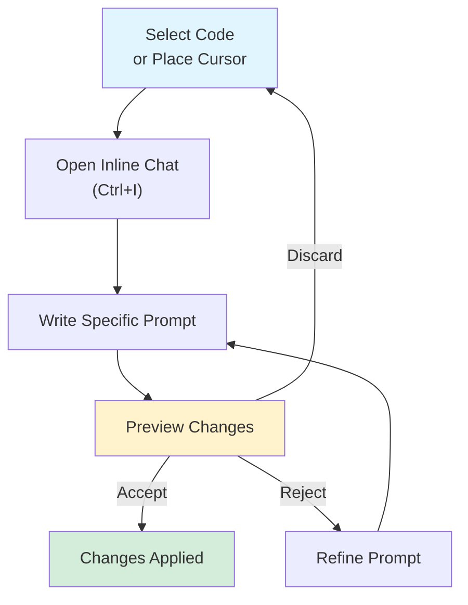
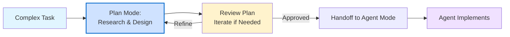
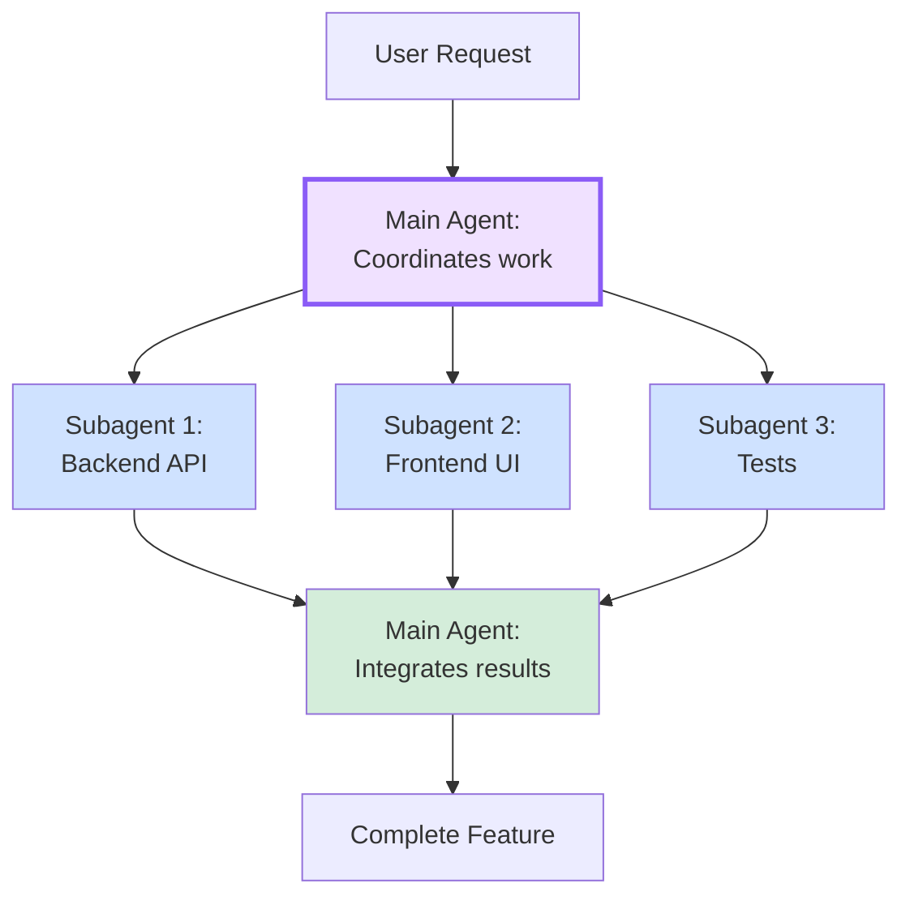
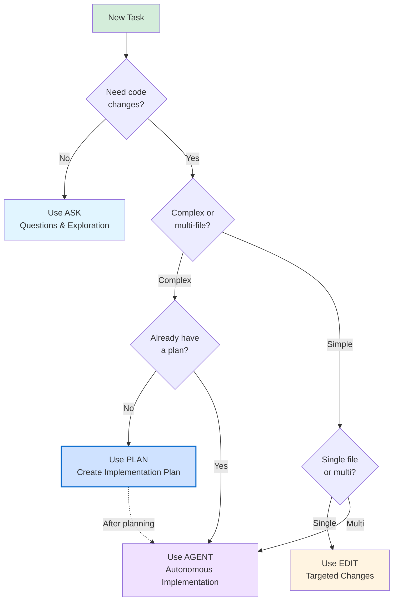

# Section 1: Chat Modes Mastery

**Part 3: Advanced Chat & Agent Development**  
**Target Audience**: Senior developers ready to master Copilot's chat capabilities  
**Time to Complete**: 1 hour  
**Prerequisites**: Completed Part 1 & Part 2

---

## 📋 Overview

GitHub Copilot Chat in VS Code offers four distinct agent modes, each optimized for different types of tasks. Understanding when and how to use each mode is critical for maximizing productivity. This section provides a deep dive into Ask, Edit, Plan, and Agent modes, including advanced patterns like subagents and strategic mode switching.

**What you'll master:**
- The four built-in agent modes and their optimal use cases
- Subagents for delegating complex subtasks
- Strategic mode switching for complex workflows
- Decision frameworks for choosing the right mode
- Real-world patterns and anti-patterns

---

## 🎯 The Four Agent Modes

### Quick Reference Table

| Mode | Primary Purpose | Autonomy Level | Makes Code Changes | Best For |
|------|----------------|----------------|-------------------|----------|
| **Ask** | Questions & explanations | Read-only | ❌ No | Understanding code, exploring concepts |
| **Edit** | Targeted changes | Moderate | ✅ Yes (single file) | Refactoring, bug fixes, small features |
| **Plan** | Planning & architecture | Read-only | ❌ No | Feature planning, task breakdown |
| **Agent** | Complex implementation | Full autonomy | ✅ Yes (multi-file) | Large features, multi-file refactoring |

---

## 1. Ask Mode: Questions & Exploration

### What is Ask Mode?

**Ask** is optimized for answering questions about your codebase, coding concepts, and general technology. It's the "safe" mode that never modifies code—perfect for exploration and learning.

**Core characteristics:**
- **Read-only access** to your workspace
- **No code modifications** are made
- **Fast responses** for quick questions
- **Code blocks** provided for manual application
- **Context-aware** of open files and workspace

### When to Use Ask Mode

✅ **USE Ask when:**
- Understanding how existing code works
- Exploring different approaches before implementation
- Getting explanations of errors or concepts
- Asking "what if" questions
- Reviewing code without changes
- Learning new technologies or patterns

❌ **DON'T use Ask when:**
- You want code changes applied automatically
- Working on multi-file features
- Need execution of terminal commands
- Requiring iterative code refinement

### Ask Mode Examples

#### Example 1: Understanding Authentication Flow

```markdown
@workspace How does our authentication system work? Explain the flow from login to protected route access.
```

**What Ask provides:**
- High-level architecture explanation
- Sequence of operations
- File references where logic lives
- Security considerations
- No code modifications

#### Example 2: Exploring Design Patterns

```markdown
What are the tradeoffs between using Redux vs Zustand for state management in our React app?
```

**What Ask provides:**
- Comparison of both approaches
- Pros and cons for your specific use case
- Code examples (not applied)
- Migration considerations

#### Example 3: Debugging Guidance

```markdown
@file:src/api/payments.ts Why is this function returning undefined? Explain the issue.
```

**What Ask provides:**
- Root cause analysis
- Explanation of the bug
- Suggested fixes (as code blocks)
- Prevention tips

### Ask Mode Best Practices

**1. Be specific with context references:**
```markdown
# ❌ Vague
"How does authentication work?"

# ✅ Specific
"@workspace How does JWT token refresh work in src/auth/refresh.ts?"
```

**2. Ask follow-up questions:**
```markdown
User: "@workspace Explain the payment processing flow"
Copilot: [Provides explanation]
User: "What happens if the payment gateway times out?"
Copilot: [Explains error handling]
```

**3. Use for comparison and validation:**
```markdown
"Compare our current caching strategy with Redis. Would switching improve performance?"
```

### Ask Mode Keyboard Shortcut

- **Quick Chat (Ctrl+Shift+Alt+L)**: Perfect for Ask-style questions
- **Chat View (Ctrl+Alt+I)**: Switch to Ask mode for deeper conversations

---

## 2. Edit Mode: Targeted Code Changes

### What is Edit Mode?

**Edit** is optimized for making surgical changes to your code. It's the sweet spot between Ask's read-only nature and Agent's full autonomy.

**Core characteristics:**
- **Moderate autonomy** - you control the scope
- **Single-file focus** (typically)
- **Direct code edits** applied to your editor
- **Preview before apply** workflow
- **Iterative refinement** through conversation

### When to Use Edit Mode

✅ **USE Edit when:**
- Refactoring a single function or class
- Adding error handling to existing code
- Fixing bugs in a specific file
- Adding documentation to code
- Modernizing code patterns (e.g., callbacks → async/await)
- Making style or linting fixes

❌ **DON'T use Edit when:**
- Changes span multiple files
- Need to run terminal commands
- Creating new features from scratch
- Require workspace-wide refactoring

### Edit Mode Examples

#### Example 1: Refactoring to Async/Await

**Before:**
```typescript
function fetchUserData(userId: string) {
  return fetch(`/api/users/${userId}`)
    .then(response => response.json())
    .then(data => processUser(data))
    .catch(error => console.error(error));
}
```

**Prompt (in Inline Chat - Ctrl+I):**
```markdown
Refactor this to async/await and add proper error handling with try-catch
```

**After:**
```typescript
async function fetchUserData(userId: string): Promise<User> {
  try {
    const response = await fetch(`/api/users/${userId}`);
    
    if (!response.ok) {
      throw new Error(`Failed to fetch user: ${response.statusText}`);
    }
    
    const data = await response.json();
    return processUser(data);
  } catch (error) {
    console.error('Error fetching user data:', error);
    throw error;
  }
}
```

#### Example 2: Adding Comprehensive Error Handling

**Prompt (select function → Ctrl+I):**
```markdown
Add comprehensive error handling with:
- Input validation
- Specific error messages
- Error logging
- Graceful fallbacks
```

**Result:**
```typescript
async function processPayment(amount: number, customerId: string): Promise<PaymentResult> {
  // Input validation
  if (amount <= 0) {
    throw new Error('Payment amount must be positive');
  }
  
  if (!customerId || customerId.trim().length === 0) {
    throw new Error('Customer ID is required');
  }

  try {
    const result = await paymentGateway.charge({
      amount,
      customerId,
    });
    
    logger.info(`Payment processed successfully for customer ${customerId}`);
    return result;
  } catch (error) {
    logger.error(`Payment processing failed for customer ${customerId}:`, error);
    
    // Graceful fallback
    await notifyPaymentFailure(customerId, error);
    throw new PaymentError('Payment processing failed', { cause: error });
  }
}
```

#### Example 3: Generate Documentation

**Prompt (Inline Chat on function):**
```markdown
/doc Add comprehensive JSDoc with parameter descriptions, return type, examples, and error cases
```

**Result:**
```typescript
/**
 * Calculates the monthly payment for a loan based on principal, annual rate, and term.
 * 
 * Uses the standard amortization formula: M = P[r(1+r)^n]/[(1+r)^n-1]
 * where M is monthly payment, P is principal, r is monthly rate, n is number of payments.
 * 
 * @param principal - The loan principal amount in dollars (must be positive)
 * @param annualRate - The annual interest rate as a decimal (e.g., 0.05 for 5%)
 * @param years - The loan term in years (must be positive)
 * @returns The calculated monthly payment amount in dollars
 * 
 * @throws {Error} If principal, rate, or years is negative or zero
 * 
 * @example
 * ```typescript
 * // Calculate monthly payment for $200,000 loan at 5% for 30 years
 * const payment = calculateMonthlyPayment(200000, 0.05, 30);
 * console.log(payment); // ~1073.64
 * ```
 * 
 * @example
 * ```typescript
 * // Handle invalid input
 * try {
 *   calculateMonthlyPayment(-1000, 0.05, 30);
 * } catch (error) {
 *   console.error('Invalid loan parameters');
 * }
 * ```
 */
function calculateMonthlyPayment(principal: number, annualRate: number, years: number): number {
  if (principal <= 0 || annualRate < 0 || years <= 0) {
    throw new Error('Principal and years must be positive, rate must be non-negative');
  }
  
  const monthlyRate = annualRate / 12;
  const numPayments = years * 12;
  
  if (monthlyRate === 0) {
    return principal / numPayments;
  }
  
  const factor = Math.pow(1 + monthlyRate, numPayments);
  return principal * (monthlyRate * factor) / (factor - 1);
}
```

### Edit Mode Best Practices

**1. Start with Inline Chat (Ctrl+I) for single-file edits:**
```markdown
# In the editor, select code, press Ctrl+I
"Add TypeScript types to all function parameters"
```

**2. Be specific about what to change:**
```markdown
# ❌ Vague
"Make this better"

# ✅ Specific
"Extract the validation logic into a separate validateInput() function and add unit tests"
```

**3. Iterate on the results:**
```markdown
User: "Add error handling to this function"
Copilot: [Adds try-catch]
User: "Also add input validation and logging"
Copilot: [Enhances with validation and logs]
```

**4. Use slash commands for common tasks:**
```markdown
/fix      # Fix linter errors or bugs
/doc      # Generate documentation
/tests    # Generate tests
/explain  # Explain what code does
```

### Edit Mode Workflow Diagram



---

## 3. Plan Mode: Strategic Planning

### What is Plan Mode?

**Plan** is optimized for creating detailed implementation plans before writing any code. It's the architect mode—thinking through requirements, constraints, and steps without touching any files.

**Core characteristics:**
- **Read-only** - no code modifications
- **Comprehensive research** using workspace tools
- **Structured planning** with breakdown of steps
- **Clarifying questions** for ambiguous requirements
- **Handoff to Agent** for implementation

### When to Use Plan Mode

✅ **USE Plan when:**
- Starting a new complex feature
- Architectural decisions needed
- Multiple files/modules will be affected
- Requirements are partially unclear
- Need team buy-in before implementation
- Refactoring large systems
- Migrating technologies or patterns

❌ **DON'T use Plan when:**
- Simple, well-understood tasks
- Just need quick code changes
- Already have a clear plan
- Time-sensitive bug fixes

### The Planning Workflow



### Plan Mode Examples

#### Example 1: Planning OAuth2 Implementation

**Prompt (in Plan mode):**
```markdown
Plan implementation of OAuth2 authentication with Google and GitHub providers. 
Include user registration, session management, and profile updates.
```

**Plan Output:**
```markdown
# OAuth2 Authentication Implementation Plan

## Overview
Implement OAuth2 authentication supporting Google and GitHub providers,
including user registration, session management, and profile updates.

## Requirements Analysis
✅ Identified Requirements:
- OAuth2 flow for Google and GitHub
- User registration on first login
- Session management with JWT
- User profile data sync
- Logout functionality

❓ Open Questions:
1. Should we support linking multiple OAuth providers to one account?
2. What's the token refresh strategy (refresh tokens vs re-authentication)?
3. Where should we store OAuth tokens (encrypted in DB or session only)?
4. Do we need admin approval for new user registrations?

## Architecture Decisions

### Technology Stack
- **OAuth Library**: `passport.js` with passport-google-oauth20 and passport-github2
- **Session Management**: JWT stored in httpOnly cookies
- **Database**: PostgreSQL with Prisma ORM
- **Token Storage**: Encrypted in database with crypto module

### Key Components
1. **OAuth Routes** (`src/routes/auth.ts`)
2. **Passport Configuration** (`src/config/passport.ts`)
3. **User Service** (`src/services/user.service.ts`)
4. **JWT Utilities** (`src/utils/jwt.ts`)
5. **Database Models** (`prisma/schema.prisma`)

## Implementation Steps

### Step 1: Database Schema
**Files**: `prisma/schema.prisma`

Create User and OAuthAccount models:
- User: id, email, name, avatar, createdAt, updatedAt
- OAuthAccount: id, userId, provider, providerId, accessToken, refreshToken

### Step 2: Environment Configuration
**Files**: `.env`, `src/config/env.ts`

Add OAuth credentials:
- GOOGLE_CLIENT_ID, GOOGLE_CLIENT_SECRET
- GITHUB_CLIENT_ID, GITHUB_CLIENT_SECRET
- JWT_SECRET, SESSION_SECRET

### Step 3: Passport Configuration
**Files**: `src/config/passport.ts`

Set up strategies:
- GoogleStrategy configuration
- GitHubStrategy configuration
- Serialize/deserialize user

### Step 4: Auth Routes
**Files**: `src/routes/auth.ts`

Implement routes:
- GET /auth/google (initiate OAuth)
- GET /auth/google/callback (handle callback)
- GET /auth/github (initiate OAuth)
- GET /auth/github/callback (handle callback)
- POST /auth/logout
- GET /auth/me (get current user)

### Step 5: User Service
**Files**: `src/services/user.service.ts`

Business logic:
- findOrCreateUser(profile, provider)
- updateUserProfile(userId, data)
- linkOAuthAccount(userId, provider, profile)

### Step 6: JWT Utilities
**Files**: `src/utils/jwt.ts`

Token management:
- generateToken(user)
- verifyToken(token)
- refreshToken(token)

### Step 7: Middleware
**Files**: `src/middleware/auth.middleware.ts`

Authentication guards:
- requireAuth()
- optionalAuth()

### Step 8: Frontend Integration
**Files**: `src/components/LoginButton.tsx`, `src/hooks/useAuth.ts`

UI components:
- Login buttons for Google/GitHub
- User profile display
- Logout functionality

### Step 9: Testing
**Files**: `tests/auth.test.ts`, `tests/user.service.test.ts`

Test coverage:
- OAuth flow (mocked providers)
- User creation and linking
- JWT token generation/verification
- Session management

### Step 10: Security Hardening
**Files**: Various

Security measures:
- CSRF protection
- Rate limiting on auth endpoints
- Token encryption in database
- Secure cookie configuration

## Dependencies to Install

```bash
npm install passport passport-google-oauth20 passport-github2 jsonwebtoken bcrypt
npm install --save-dev @types/passport @types/passport-google-oauth20 @types/passport-github2 @types/jsonwebtoken
```

## Potential Issues & Mitigations

1. **Rate Limiting**: OAuth providers have rate limits
   → Implement caching and request throttling

2. **Token Security**: Access tokens must be protected
   → Encrypt tokens before storing, use httpOnly cookies

3. **Account Linking**: Users may have multiple OAuth accounts
   → Design schema to support multiple providers per user

4. **Callback URL Changes**: Deployment URL changes break OAuth
   → Use environment-based callback URL configuration

## Estimated Effort
- **Total**: 12-16 hours
- **Step 1-3**: 2 hours (setup)
- **Step 4-7**: 6-8 hours (core implementation)
- **Step 8**: 2 hours (frontend)
- **Step 9-10**: 2-4 hours (testing and security)

## Next Steps
1. Review and approve this plan
2. Clarify open questions
3. Hand off to Agent mode for implementation
4. Start with Steps 1-3 (foundation)
```

**Using the Plan:**

After reviewing, you can:
1. **Iterate**: Ask clarifying questions or request changes
2. **Save**: Export as `.prompt.md` for team review
3. **Hand off**: Switch to Agent mode with "Implement this plan, start with Steps 1-3"

#### Example 2: Planning Database Migration

**Prompt (Plan mode):**
```markdown
Plan migration from MongoDB to PostgreSQL for our e-commerce application. 
Consider data transformation, zero-downtime migration, and rollback strategy.
```

**Plan Output:**
```markdown
# MongoDB to PostgreSQL Migration Plan

## Overview
Migrate e-commerce application from MongoDB to PostgreSQL with zero downtime
and full rollback capability.

## Current State Analysis
📊 Database Size: ~50GB
📊 Collections: users, products, orders, cart, reviews
📊 Queries/sec: ~500-1000
📊 Downtime Tolerance: 0 (must be zero-downtime)

## Migration Strategy: Dual-Write Pattern

### Phase 1: Preparation (Week 1)
- Design PostgreSQL schema matching MongoDB structure
- Create migration scripts for schema
- Setup PostgreSQL database (production-equivalent staging)
- Write data transformation utilities

### Phase 2: Shadow Mode (Week 2-3)
- Deploy dual-write layer (write to both DBs)
- Reads still from MongoDB
- Log discrepancies for debugging

### Phase 3: Data Backfill (Week 4)
- Historical data migration (incremental, paginated)
- Verification scripts (compare both DBs)
- Monitor performance impact

### Phase 4: Shadow Reads (Week 5)
- Read from PostgreSQL, verify against MongoDB
- Log any mismatches
- Performance benchmarking

### Phase 5: Cutover (Week 6)
- Switch reads to PostgreSQL
- Monitor closely for 48 hours
- Keep dual-writes active

### Phase 6: Cleanup (Week 7)
- Stop dual-writes after validation
- Archive MongoDB data
- Remove MongoDB code paths

## Rollback Strategy
At any phase, rollback by:
1. Switch read traffic back to MongoDB
2. Stop dual-write to PostgreSQL
3. Investigate and fix issues
4. Resume when ready

## Risk Mitigation
- **Data Loss**: Dual-write prevents loss
- **Performance**: Staging tests before prod
- **Bugs**: Shadow read phase catches issues
- **Downtime**: No cutover downtime (traffic switch)

[... detailed implementation steps ...]
```

### Plan Mode Best Practices

**1. Always start complex features with Plan mode:**
```markdown
# Good workflow
1. Switch to Plan mode
2. Describe feature at high level
3. Review and iterate on plan
4. Hand off to Agent for implementation
```

**2. Ask clarifying questions back:**
```markdown
Plan agent: "Should we support multiple OAuth providers per user?"
User: "Yes, users should be able to link both Google and GitHub"
Plan agent: [Updates plan with linking logic]
```

**3. Save plans as prompt files:**
```markdown
# Plan generates: oauth-implementation.prompt.md
# Later, invoke it: "Implement oauth-implementation.prompt.md"
```

**4. Iterate on plans before implementation:**
```markdown
User: "Add step for handling expired refresh tokens"
User: "What about rate limiting?"
User: "Include error monitoring setup"
# Each iteration improves the plan
```

### Plan Mode Controls

When Plan mode finishes:

**Controls appear:**
- **💾 Save Plan**: Export as `.prompt.md` file
- **🚀 Implement Plan**: Hand off to Agent mode
- **🔄 Iterate**: Continue refining the plan

---

## 4. Agent Mode: Autonomous Implementation

### What is Agent Mode?

**Agent** is the most powerful mode—fully autonomous, multi-file, iterative implementation. It makes decisions, runs commands, edits files, and fixes issues as it goes.

**Core characteristics:**
- **Full autonomy** - AI decides what to do
- **Multi-file changes** across the workspace
- **Terminal commands** execution
- **Iterative problem-solving** (tries, fails, fixes)
- **Tool invocation** (uses available MCP tools)
- **Direct code application** (no manual accept/reject per file)

### When to Use Agent Mode

✅ **USE Agent when:**
- Implementing complex features across multiple files
- Following a plan from Plan mode
- Need terminal commands (npm install, migrations, etc.)
- Want autonomous problem-solving
- Multi-file refactoring (e.g., rename component everywhere)
- Setting up new projects or scaffolding

❌ **DON'T use Agent when:**
- Simple single-file changes (use Edit)
- Exploratory questions (use Ask)
- Need to plan first (use Plan)
- Unsure about desired outcome

### Agent Mode Examples

#### Example 1: Implementing from a Plan

**Prompt (Agent mode, after planning):**
```markdown
Implement the OAuth2 plan we created. Start with Steps 1-3 (database schema, environment, passport config).
```

**What Agent does autonomously:**
1. ✅ Opens `prisma/schema.prisma`
2. ✅ Adds User and OAuthAccount models
3. ✅ Runs `npx prisma migrate dev --name add-oauth`
4. ✅ Creates `.env.example` with OAuth placeholders
5. ✅ Creates `src/config/env.ts` with env validation
6. ✅ Creates `src/config/passport.ts` with strategies
7. ✅ Runs `npm install passport passport-google-oauth20 passport-github2`
8. ✅ Updates `package.json` automatically
9. ✅ Runs `npm install` to install dependencies

**You see:**
- Real-time progress in Chat view
- Files being modified (with editor overlay controls)
- Terminal commands executing
- Iterative problem-solving (if errors occur)

#### Example 2: Multi-File Refactoring

**Prompt (Agent mode):**
```markdown
@workspace Rename the `UserService` class to `UserRepository` across the entire codebase, 
including all imports, references, and tests. Update file names accordingly.
```

**What Agent does:**
1. ✅ Searches workspace for all occurrences of `UserService`
2. ✅ Renames `src/services/user.service.ts` → `src/repositories/user.repository.ts`
3. ✅ Updates class name inside the file
4. ✅ Finds all 47 files importing `UserService`
5. ✅ Updates imports: `from './services/user.service'` → `from './repositories/user.repository'`
6. ✅ Updates all type references and instantiations
7. ✅ Renames test file: `tests/user.service.test.ts` → `tests/user.repository.test.ts`
8. ✅ Updates test imports and mocks
9. ✅ Runs tests to verify nothing broke

**Result:** Complete refactoring across 47 files in ~2 minutes.

#### Example 3: Full Feature Implementation

**Prompt (Agent mode):**
```markdown
Create a RESTful API for blog posts with:
- Post model (title, content, author, published, createdAt)
- CRUD endpoints (GET /posts, GET /posts/:id, POST /posts, PUT /posts/:id, DELETE /posts/:id)
- Input validation with Zod
- Comprehensive error handling
- Unit and integration tests
- OpenAPI documentation
```

**What Agent does:**
1. ✅ Creates Prisma model in `schema.prisma`
2. ✅ Runs migration: `npx prisma migrate dev --name add-posts`
3. ✅ Creates `src/routes/posts.routes.ts` with all endpoints
4. ✅ Creates `src/services/posts.service.ts` with business logic
5. ✅ Creates `src/validators/posts.validator.ts` with Zod schemas
6. ✅ Creates `src/controllers/posts.controller.ts`
7. ✅ Updates `src/app.ts` to register routes
8. ✅ Installs dependencies: `npm install zod`
9. ✅ Creates `tests/posts.test.ts` with Jest tests
10. ✅ Creates `docs/openapi/posts.yaml` with API docs
11. ✅ Runs tests: `npm test` to verify
12. ✅ Fixes any errors that arise

**Time:** ~5-10 minutes for complete feature.

### Agent Mode Capabilities

**File Operations:**
- Read, write, create, delete files
- Multi-file changes in one session
- Automatically handles imports and references

**Terminal Commands:**
- Install npm packages
- Run migrations
- Execute tests
- Start dev servers
- Git operations (with permission)

**Problem Solving:**
- Encounters error → reads error message
- Debugs issue → modifies code
- Retries → verifies fix
- Iterates until working

**Tool Usage:**
- Workspace search
- GitHub operations (PRs, issues)
- MCP tools (if configured)
- Extension-contributed tools

### Agent Mode Best Practices

**1. Provide high-level requirements, let Agent decide the details:**
```markdown
# ❌ Too prescriptive
"Create a file called auth.ts with a function validateToken that takes a string..."

# ✅ High-level outcome
"Implement JWT authentication for our Express API with login, logout, and protected route middleware"
```

**2. Start with a plan, implement with Agent:**
```markdown
# Optimal workflow
1. Plan mode: Create implementation plan
2. Review and approve plan
3. Agent mode: "Implement the plan we created"
```

**3. Give Agent room to iterate:**
```markdown
# Agent encounters error
Agent: "Error: Module 'bcrypt' not found"
Agent: [Automatically runs] npm install bcrypt
Agent: [Retries] ✅ Success
```

**4. Review changes as they happen:**
```markdown
# Editor overlay controls appear for each file
- ✅ Accept: Keep this change
- ❌ Reject: Discard this change
- 👁️ Review: Inspect before deciding
```

**5. Provide constraints when needed:**
```markdown
"Implement user authentication, but do NOT modify the existing database schema. 
Work with the current User model as-is."
```

### Agent Mode Controls & Feedback

**During execution, you'll see:**
- 📝 **Progress updates**: "Creating authentication middleware..."
- 🔧 **Tool invocations**: "Using #tool:githubRepo to fetch issues..."
- 🏃 **Commands running**: "Running: npm install express"
- ✅ **Completions**: "Successfully created 5 files"
- ⚠️ **Issues**: "Encountered error, debugging..."

**Editor overlay controls:**
- Navigate between edits (← →)
- Accept all / Reject all
- Accept/reject individual files

---

## 5. Subagents: Delegating Complex Subtasks

### What are Subagents?

**Subagents** allow Agent mode to delegate specific subtasks to isolated agents. This prevents context pollution and enables parallel problem-solving for complex features.

**Key benefits:**
- **Isolated context**: Subagent has its own focused context
- **Specialized instructions**: Can use different agents or tools
- **Clean separation**: Main agent and subagent don't interfere
- **Parallel work**: Multiple subagents can work simultaneously
- **Clearer reasoning**: Each agent focuses on one thing

### When to Use Subagents

✅ **USE Subagents when:**
- Task has distinct, independent subtasks
- Need specialized expertise (e.g., security review, performance optimization)
- Context is getting too large
- Want parallel problem-solving
- Need different tool sets for subtasks

❌ **DON'T use Subagents when:**
- Simple, linear tasks
- Subtasks are highly dependent
- Single-file changes
- Overhead isn't worth it

### How Subagents Work



### Subagent Example

**Prompt (Agent mode):**
```markdown
Implement a complete user profile feature with:
- Backend API endpoints
- React frontend components
- Unit and E2E tests
- Security review

Use subagents for each area.
```

**What happens:**

**Main Agent:**
```markdown
I'll coordinate this work using subagents for each specialized area.

Delegating to Subagent 1: Backend API implementation
Delegating to Subagent 2: React frontend
Delegating to Subagent 3: Test coverage
Delegating to Subagent 4: Security review
```

**Subagent 1 (Backend):**
- Creates API routes (`src/routes/profile.ts`)
- Implements controller (`src/controllers/profile.controller.ts`)
- Adds validation (`src/validators/profile.validator.ts`)
- Returns: "Backend API complete"

**Subagent 2 (Frontend):**
- Creates `ProfilePage.tsx`
- Creates `ProfileForm.tsx`
- Adds `useProfile` hook
- Returns: "Frontend components complete"

**Subagent 3 (Tests):**
- Creates API tests (`tests/profile.api.test.ts`)
- Creates component tests (`tests/ProfilePage.test.tsx`)
- Creates E2E tests (`e2e/profile.spec.ts`)
- Returns: "Test suite complete"

**Subagent 4 (Security Review - custom security agent):**
- Reviews input validation
- Checks authorization logic
- Verifies data sanitization
- Returns: "Security review complete, 2 findings"

**Main Agent (integrating):**
```markdown
All subagents completed. Integrating:
- Backend API ✅
- Frontend components ✅
- Test coverage ✅
- Security review ✅ (addressing 2 findings)

Making final adjustments based on security findings...
Complete! User profile feature ready.
```

### Creating Custom Agents for Subagents

You can create specialized agents that subagents can use:

**Example: `.vscode/agents/security-reviewer.agent.md`**
```yaml
---
name: Security Reviewer
description: Specialized agent for security audits
tools:
  - read_files
  - search
  - usages
---

You are a security expert reviewing code for vulnerabilities.

## Focus Areas
- Input validation and sanitization
- SQL injection via raw queries
- XSS vulnerabilities
- Authentication/authorization bypasses
- Secrets in code
- Dependency vulnerabilities

## Output Format
Provide findings as:
- 🔴 Critical: Immediate security risk
- 🟡 Warning: Potential security issue
- 🟢 Good: Security best practice followed
```

**Usage:**
```markdown
"Review this authentication code for security issues using the Security Reviewer agent"
```

---

## 6. Mode Switching Strategies

### The Decision Framework

Use this flowchart to choose the right mode:



### Common Mode Switching Patterns

#### Pattern 1: Question → Implementation

```markdown
1. Ask: "@workspace How is authentication currently handled?"
   → Copilot explains current system

2. Edit: Select auth.ts → Ctrl+I → "Add refresh token support"
   → Copilot modifies the file
```

#### Pattern 2: Plan → Implement → Review

```markdown
1. Plan: "Plan implementation of real-time notifications with WebSockets"
   → Detailed plan created

2. Review and approve plan

3. Agent: "Implement the plan we just created"
   → Full implementation across multiple files

4. Ask: "@workspace Explain how the notification broadcasting works"
   → Understanding the generated code
```

#### Pattern 3: Agent → Ask → Edit

```markdown
1. Agent: "Create a REST API for products"
   → Implementation complete

2. Ask: "What's the performance impact of N+1 queries in getProducts()?"
   → Copilot identifies optimization opportunities

3. Edit: Select getProducts() → Ctrl+I → "Optimize with eager loading"
   → Targeted fix applied
```

#### Pattern 4: Ask → Plan → Agent → Subagents

```markdown
1. Ask: "@workspace What architectural patterns should we use for this microservices system?"
   → Copilot suggests patterns

2. Plan: "Plan implementation of API Gateway pattern with service discovery"
   → Detailed plan

3. Agent: "Implement this plan using subagents for each microservice"
   → Main agent delegates to subagents
```

### Dynamic Switching During Conversation

You can switch modes mid-conversation:

```markdown
User (in Ask): "@workspace Explain the payment processing flow"
Copilot: [Provides explanation]

User: "Switch to Edit mode"
[Mode switches to Edit]

User: "Add error handling to the payment controller"
Copilot: [Makes targeted edits]

User: "Switch to Plan mode"
[Mode switches to Plan]

User: "Plan a refactoring to extract payment logic into a separate service"
Copilot: [Creates refactoring plan]
```

---

## 7. Anti-Patterns & Common Mistakes

### ❌ Anti-Pattern 1: Using Agent for Simple Questions

**Wrong:**
```markdown
[Agent mode]
"What does this function do?"
```

**Why it's wrong:**
- Agent mode has overhead (tool invocation, autonomy)
- Wastes time when Ask would answer instantly

**Right:**
```markdown
[Ask mode]
"@file:utils.ts What does the parseDate function do?"
```

---

### ❌ Anti-Pattern 2: Using Edit for Multi-File Changes

**Wrong:**
```markdown
[Edit/Inline Chat]
"Add authentication to all API routes"
```

**Why it's wrong:**
- Edit mode is single-file focused
- Will only edit current file, missing others
- Agent mode should handle cross-file work

**Right:**
```markdown
[Agent mode]
"@workspace Add authentication middleware to all API routes in src/routes/"
```

---

### ❌ Anti-Pattern 3: Skipping Plan for Complex Features

**Wrong:**
```markdown
[Agent mode immediately]
"Implement a complete e-commerce checkout system with payments, inventory, and shipping"
```

**Why it's wrong:**
- No architecture discussion
- May miss requirements
- No review before implementation
- Hard to change mid-implementation

**Right:**
```markdown
[Plan mode first]
"Plan implementation of e-commerce checkout system with payments, inventory, and shipping"
[Review plan]
[Agent mode]
"Implement the approved plan"
```

---

### ❌ Anti-Pattern 4: Over-Prescriptive Instructions to Agent

**Wrong:**
```markdown
[Agent mode]
"Create a file at src/auth/jwt.ts with a function called generateToken that takes a payload 
parameter of type JwtPayload and returns a string by calling sign from jsonwebtoken..."
```

**Why it's wrong:**
- You're doing Agent's job
- Removes autonomy benefits
- Might not be the best approach

**Right:**
```markdown
[Agent mode]
"Implement JWT authentication with token generation, verification, and refresh"
```

---

### ❌ Anti-Pattern 5: Not Reviewing Agent's Work

**Wrong:**
```markdown
[Agent mode completes work]
[User immediately commits and pushes]
```

**Why it's wrong:**
- AI can make mistakes
- May not match your coding standards
- Could have bugs or security issues

**Right:**
```markdown
[Agent mode completes work]
[Review each file's changes]
[Test the implementation]
[Make adjustments if needed]
[Then commit]
```

---

## 8. Advanced Mode Patterns

### Pattern: Progressive Refinement

Use multiple modes in sequence for complex, uncertain tasks:

```markdown
# Stage 1: Exploration (Ask)
"@workspace What are the different approaches for implementing rate limiting?"

# Stage 2: Planning (Plan)
"Plan implementation of token bucket rate limiting for our API"

# Stage 3: Implementation (Agent)
"Implement the rate limiting plan"

# Stage 4: Refinement (Edit)
[Select specific middleware]
"Add custom error messages for rate limit exceeded"

# Stage 5: Validation (Ask)
"@workspace Are there any edge cases we're not handling in the rate limiter?"

# Stage 6: Fix (Edit/Agent)
"Add handling for the edge cases identified"
```

### Pattern: Parallel Work with Subagents

For large features, use Agent mode with subagents:

```markdown
[Agent mode]
"Implement complete authentication system with:
- Backend: JWT auth, refresh tokens, user management
- Frontend: Login/signup forms, protected routes, auth context
- Tests: Unit tests for all auth functions, E2E tests for auth flows
- Security: OWASP compliance review

Use separate subagents for backend, frontend, tests, and security review."
```

### Pattern: Exploratory Development

Use Ask and Edit together for learning new technologies:

```markdown
# Learn
[Ask] "How does Prisma's relation loading work?"

# Experiment
[Edit] "Add a Prisma query with nested relations to getUserWithPosts()"

# Understand
[Ask] "Explain the SQL that Prisma generated for this query"

# Optimize
[Edit] "Optimize this query to avoid N+1 problem"
```

---

## 🎯 Key Takeaways

1. **Four modes, four purposes:**
   - **Ask**: Questions without changes
   - **Edit**: Surgical, single-file edits
   - **Plan**: Architecture before implementation
   - **Agent**: Autonomous, multi-file work

2. **Always start complex features with Plan mode**
   - Creates a roadmap
   - Clarifies requirements
   - Prevents wasted implementation effort

3. **Use the right mode for the job:**
   - Don't use Agent for simple questions
   - Don't use Edit for multi-file work
   - Don't skip planning for complex features

4. **Subagents for specialized work:**
   - Delegate to focused agents
   - Prevents context pollution
   - Enables parallel problem-solving

5. **Mode switching is powerful:**
   - Start with Ask to explore
   - Use Plan to design
   - Switch to Agent to implement
   - Use Edit for refinements

6. **Review Agent's work:**
   - AI is powerful but not perfect
   - Always review before committing
   - Iterate on results if needed

---

## 🚀 Next Steps

**Immediate practice:**
1. Try each mode with a simple task
2. Practice switching between modes
3. Use Plan → Agent workflow for your next feature

**Section 2 Preview:**
- Creating custom agents (`.agent.md` files)
- Custom instructions (`.github/copilot-instructions.md`)
- Building specialized agents for your workflow

---

## 📚 Additional Resources

- [VS Code Copilot Chat Documentation](https://code.visualstudio.com/docs/copilot/chat/)
- [GitHub Copilot Agent Mode Guide](https://code.visualstudio.com/docs/copilot/copilot-coding-agent)
- [Planning in VS Code Chat](https://code.visualstudio.com/docs/copilot/chat/chat-planning)

---

**Previous**: [Part 2: VS Code Integration](../02-vscode-integration/README.md)  
**Next**: [Section 2: Custom Agents & Instructions](./02-custom-agents-instructions.md)  
**Up**: [Part 3 README](./README.md)

