# Section 3: Prompt Engineering for Copilot Chat

**Part 3: Advanced Chat & Agent Development**  
**Target Audience**: Senior developers seeking mastery of AI interactions  
**Time to Complete**: 1 hour  
**Prerequisites**: Completed Sections 1 & 2

---

## 📋 Overview

The quality of Copilot's responses is directly proportional to the quality of your prompts. This section teaches you the art and science of prompt engineering—how to structure requests, provide context, and iterate on results to get exactly what you need.

**What you'll master:**
- Effective prompt structure and composition
- Context reference syntax (@workspace, @file, @selection)
- Multi-shot examples for better results
- Constraint specification and output format control
- Chain-of-thought prompting for complex reasoning
- Iterative refinement patterns
- Common prompt anti-patterns to avoid

---

## 🎯 The Anatomy of an Effective Prompt

### The Three Components

Every effective prompt has three parts:

```
[1. Context] + [2. Task] + [3. Constraints] = Great Result
```



```mermaid
graph LR
    CONTEXT["1. Context<br/>━━━━━<br/>@workspace<br/>@file<br/>Background info"]
    TASK["2. Task<br/>━━━━━<br/>What you want<br/>Clear objective"]
    CONSTRAINTS["3. Constraints<br/>━━━━━<br/>Format<br/>Requirements<br/>Limitations"]
    RESULT["High-Quality<br/>Response"]
    
    CONTEXT --> RESULT
    TASK --> RESULT
    CONSTRAINTS --> RESULT
    
    style CONTEXT fill:#e1f5ff
    style TASK fill:#fff4e1
    style CONSTRAINTS fill:#f0e1ff
    style RESULT fill:#90EE90,stroke:#2d862d,stroke-width:3px
```

### Example Breakdown

**❌ Weak Prompt:**
```markdown
Make the login better
```
- No context
- Vague task
- No constraints

**✅ Strong Prompt:**
```markdown
@file:src/pages/Login.tsx 

Refactor this login component to:
1. Add password visibility toggle
2. Implement "Remember me" checkbox with localStorage
3. Add loading state during authentication
4. Show specific error messages from API

Requirements:
- Use existing design system (Button, Input from @/components/ui)
- TypeScript with proper types
- Add unit tests for new functionality
```
- ✅ Context: Specific file
- ✅ Task: Clear, numbered objectives
- ✅ Constraints: Specific requirements and tools

---

## 1. Context References: The Power of @

### Available Context References

| Reference | Scope | Example |
|-----------|-------|---------|
| `@workspace` | Entire codebase | `@workspace Explain our authentication flow` |
| `@file:path` | Specific file | `@file:src/api/users.ts Review this API endpoint` |
| `@selection` | Selected code | `@selection Optimize this query` |
| `@terminal` | Terminal output | `@terminal Explain this error message` |
| `#file:path` | File in prompt files | `#file:../../spec.md` (relative path) |

### @workspace: Comprehensive Codebase Context

**@workspace** gives Copilot access to your entire workspace. Use it for:
- Finding functionality across files
- Understanding system architecture
- Making cross-file changes
- Searching for patterns

**Examples:**

```markdown
# Understanding codebase
@workspace How is user authentication implemented across the application?

# Finding implementations
@workspace Where do we handle payment processing? Show me all related files.

# Architectural questions
@workspace What's the data flow from user login to protected route access?

# Cross-file analysis
@workspace Find all API endpoints that don't have rate limiting

# Pattern searching
@workspace Show me all React components using the old class-based pattern
```

**Best practices:**
```markdown
# ✅ Specific question
@workspace How does the shopping cart state management work with Zustand?

# ❌ Too broad
@workspace Tell me about the code
```

### @file: Specific File Context

**@file:path** focuses on a single file. Use it for:
- File-specific questions
- Targeted refactoring
- Understanding specific implementations

**Examples:**

```markdown
# Understanding a file
@file:src/utils/validation.ts Explain how email validation works

# Finding issues
@file:src/api/orders.ts Are there any performance issues in this file?

# Refactoring requests
@file:src/components/UserCard.tsx Convert this to use TypeScript and add prop types

# Security review
@file:src/middleware/auth.ts Review for security vulnerabilities
```

**Path formats:**
```markdown
# Relative to workspace root
@file:src/utils/helpers.ts

# Works with any file in workspace
@file:package.json
@file:tsconfig.json
@file:README.md
```

### @selection: Selected Code Context

**@selection** uses the code you've selected in the editor. Use it for:
- Inline refactoring
- Explaining specific code blocks
- Targeted improvements

**Workflow:**
1. Select code in editor
2. Open Inline Chat (Ctrl+I) or Quick Chat
3. Use `@selection` in prompt

**Examples:**

```markdown
# Refactoring
@selection Refactor to use async/await instead of promises

# Optimization
@selection Optimize this for performance

# Explanation
@selection Explain what this regex pattern matches

# Testing
@selection Generate unit tests for this function
```

**Pro tip:** `@selection` is often implicit in Inline Chat:
```markdown
# With selection active, this is implied:
"Add error handling"
# Is equivalent to:
"@selection Add error handling"
```

### @terminal: Terminal Output Context

**@terminal** includes recent terminal output. Use it for:
- Error diagnosis
- Build failure analysis
- Test failure debugging

**Examples:**

```markdown
# After build error
@terminal What's causing this TypeScript error?

# After test failures
@terminal Why are these tests failing? How do I fix them?

# After npm install issues
@terminal Resolve this dependency conflict

# After git error
@terminal What does this git error mean and how do I fix it?
```

### Combining Context References

You can combine multiple references for comprehensive context:

```markdown
# Workspace + specific file
@workspace @file:src/api/auth.ts 
How does this authentication endpoint fit into our overall security architecture?

# Multiple files
@file:src/models/User.ts @file:src/services/UserService.ts 
Ensure the service matches the model's new schema

# Workspace + terminal
@workspace @terminal 
The build is failing. What files need to be updated?
```

---

## 2. Effective Prompt Structure Patterns

### Pattern 1: The Numbered List

**When to use:** Multiple related tasks

```markdown
@file:src/components/ProductCard.tsx

Refactor this component to:
1. Extract price formatting into a utility function
2. Add loading state with skeleton
3. Implement image lazy loading
4. Add error boundary
5. Write unit tests for all new functionality

Use TypeScript and follow our component patterns from @file:src/components/README.md
```

**Why it works:**
- Clear, discrete tasks
- Easy to verify completion
- Agent can work through systematically

### Pattern 2: The Role-Task-Format (RTF)

**When to use:** Need specific expertise and format

```markdown
You are a security expert reviewing code for OWASP Top 10 vulnerabilities.

Task: Review @file:src/api/payments.ts for security issues

Output format:
🔴 Critical: [issue] - [fix]
🟡 Warning: [issue] - [recommendation]
🟢 Good: [security practice followed]
```

**Why it works:**
- Sets expert context
- Clear task
- Structured output

### Pattern 3: The Example-Driven Prompt

**When to use:** Want specific style or format

```markdown
@workspace Generate unit tests for UserService following this pattern:

Example test structure:
```typescript
describe('UserService', () => {
  describe('createUser', () => {
    it('should create user with valid data', async () => {
      // Arrange
      const userData = { email: 'test@example.com', name: 'Test' };
      
      // Act
      const result = await service.createUser(userData);
      
      // Assert
      expect(result).toHaveProperty('id');
      expect(result.email).toBe(userData.email);
    });
  });
});
```

Follow this AAA (Arrange-Act-Assert) pattern for all tests.
Cover: happy path, validation errors, and database failures.
```

**Why it works:**
- Concrete example to follow
- Clear style guidance
- Reduces back-and-forth

### Pattern 4: The Constraint-First Prompt

**When to use:** Strict requirements or limitations

```markdown
@file:src/models/User.ts

Add a soft-delete feature to the User model.

Constraints:
- Do NOT modify the existing schema (add new fields only)
- Do NOT break existing queries (backward compatible)
- Use a 'deletedAt' timestamp field (nullable)
- Add a Prisma middleware to filter soft-deleted records
- Include migration file

Follow our migration pattern from prisma/migrations/README.md
```

**Why it works:**
- Explicit boundaries
- Prevents unwanted changes
- Ensures compatibility

### Pattern 5: The Comparison Prompt

**When to use:** Choosing between approaches

```markdown
@workspace

Compare two approaches for implementing real-time notifications:

Option A: WebSockets with Socket.io
Option B: Server-Sent Events (SSE)

For each, analyze:
1. Implementation complexity
2. Browser compatibility
3. Scaling considerations
4. Resource usage
5. Fit with our current architecture

Recommend the best option for our use case (e-commerce with 10K concurrent users).
```

**Why it works:**
- Structured comparison
- Specific criteria
- Context-aware recommendation

---

## 3. Constraint Specification

### Types of Constraints

#### 1. Technical Constraints

```markdown
# Language/Framework version
"Use TypeScript 5.0 features (satisfies operator, const type parameters)"

# Library restrictions
"Use only standard library functions, no external dependencies"

# Compatibility
"Ensure compatibility with Node.js 18 and 20"
```

#### 2. Code Style Constraints

```markdown
# Formatting
"Follow our code style: functional components, named exports, TypeScript strict mode"

# Naming conventions
"Use camelCase for functions, PascalCase for components, UPPER_SNAKE_CASE for constants"

# Patterns
"Use composition over inheritance, avoid class components"
```

#### 3. Performance Constraints

```markdown
# Execution time
"Query must execute in < 100ms"

# Resource usage
"Bundle size must not increase by more than 10KB"

# Optimization
"Use memoization to avoid unnecessary recalculation"
```

#### 4. Security Constraints

```markdown
# Authentication
"All endpoints must require authentication except /public/*"

# Input validation
"Validate all user input with Zod schemas"

# Data handling
"Never log sensitive data (passwords, tokens, SSNs)"
```

#### 5. Testing Constraints

```markdown
# Coverage
"Include unit tests with 90%+ coverage"

# Test types
"Write unit tests, integration tests, and E2E tests for critical paths"

# Assertions
"Test both happy path and error cases"
```

### Examples of Well-Constrained Prompts

**Example 1: API Endpoint Creation**

```markdown
@workspace

Create a REST API endpoint for creating blog posts.

Endpoint: POST /api/v1/posts

Requirements:
- Authentication: Require valid JWT token
- Authorization: Only users with 'author' or 'admin' role
- Input validation: Zod schema for title (required, 5-200 chars), content (required), tags (optional array)
- Rate limiting: 10 requests per minute per user
- Response: 201 Created with post object, 400 for validation errors, 401 for auth errors
- Database: Use Prisma with PostgreSQL
- Testing: Include unit and integration tests
- Error handling: Centralized error middleware
- Logging: Log all creation attempts with user ID

Follow API patterns from @file:src/api/README.md
```

**Example 2: React Component with Constraints**

```markdown
@file:src/components/UserProfile.tsx

Refactor this component with these constraints:

Functionality:
- Keep existing props interface
- Add loading and error states
- Implement optimistic updates for profile changes

Performance:
- Use React.memo to prevent unnecessary re-renders
- Debounce form input (300ms)
- Lazy load avatar image

Code Quality:
- Extract custom hook for profile logic (useProfile)
- Use TypeScript strict mode
- Add PropTypes documentation with JSDoc
- Maximum 150 lines per file (split if needed)

Testing:
- Unit tests with React Testing Library
- Mock API calls
- Test loading, error, and success states

Do NOT:
- Change the component's public API
- Add new dependencies
- Modify the existing CSS classes
```

---

## 4. Output Format Control

### Specifying Response Format

#### Format 1: Structured Text

```markdown
Review @file:src/api/auth.ts for security issues.

Output format:
## Security Audit Report

### Critical Issues (High Priority)
1. [Issue name]
   - Location: [file:line]
   - Description: [what's wrong]
   - Impact: [potential harm]
   - Fix: [specific solution]

### Warnings (Medium Priority)
[same structure]

### Recommendations (Low Priority)
[same structure]

### Summary
- Critical issues: [count]
- Warnings: [count]
- Overall risk level: [Low/Medium/High/Critical]
```

#### Format 2: Code-Only Responses

```markdown
Generate the complete UserRepository class with CRUD operations.

Output: Only the TypeScript code, no explanations.

Include:
- TypeScript interfaces
- All CRUD methods (create, findById, findAll, update, delete)
- Error handling
- JSDoc comments
```

#### Format 3: Comparison Table

```markdown
Compare authentication strategies for our API.

Output as Markdown table:

| Strategy | Pros | Cons | Implementation Complexity | Security | Best Use Case |
|----------|------|------|--------------------------|----------|---------------|
| JWT | ... | ... | ... | ... | ... |
| Session Cookies | ... | ... | ... | ... | ... |
| OAuth2 | ... | ... | ... | ... | ... |

After the table, provide a recommendation with justification.
```

#### Format 4: Step-by-Step Guide

```markdown
@workspace Explain how to add a new API endpoint to our Express app.

Format as step-by-step guide:

# Adding a New API Endpoint

## Step 1: [Title]
[Description]
```bash
# Commands
```

## Step 2: [Title]
[Description]
```typescript
// Code example
```

[Continue for all steps]

## Verification
How to test that it works:
[Testing steps]
```

#### Format 5: Decision Tree

```markdown
Create a decision tree for choosing the right React state management solution.

Format:
```mermaid
graph TD
    START[State Management Need]
    Q1{Global state?}
    Q2{Complex async?}
    [etc.]
```

Include explanation after diagram.
```

---

## 5. Chain-of-Thought Prompting

### What is Chain-of-Thought?

**Chain-of-thought** prompting encourages the AI to show its reasoning process step-by-step. This leads to better answers for complex problems.

### Pattern: "Let's think step-by-step"

```markdown
@workspace

Our application is experiencing slow response times on the /api/products endpoint.

Let's debug this step-by-step:
1. First, analyze the current implementation
2. Identify potential bottlenecks
3. Measure the performance impact of each bottleneck
4. Propose specific optimizations
5. Estimate the expected improvement for each optimization

For each step, explain your reasoning.
```

**Why it works:**
- Forces systematic analysis
- Makes reasoning visible
- Catches logical errors
- Produces thorough answers

### Pattern: "Explain your reasoning"

```markdown
@file:src/utils/calculateDiscount.ts

This function is returning incorrect values for certain inputs.

Debugging approach:
1. Analyze the logic and identify potential bugs
2. For each potential bug, explain why it would cause incorrect results
3. Provide test cases that would expose each bug
4. Propose fixes with explanation of why they work

Show your reasoning for each step.
```

### Pattern: "Consider alternatives"

```markdown
@workspace

Design a caching strategy for our API.

Process:
1. List 3-5 possible caching approaches
2. For each approach, analyze:
   - What gets cached
   - Cache invalidation strategy
   - Complexity of implementation
   - Trade-offs
3. Compare approaches in a table
4. Recommend the best approach with detailed reasoning
5. Provide implementation plan

Think through each option carefully before recommending.
```

---

## 6. Multi-Shot Examples

### What are Multi-Shot Examples?

**Multi-shot** (or few-shot) prompting provides multiple examples of the desired output format. This is extremely effective for:
- Consistent formatting
- Complex output structures
- Specific coding styles

### Pattern: Two-Example (Few-Shot)

```markdown
Generate API documentation for all endpoints in @file:src/routes/products.ts

Follow this format:

## Example 1: GET /api/users/:id

**Description**: Retrieves a single user by ID

**Authentication**: Required (JWT)

**Parameters**:
- `id` (path, string, required): User's UUID

**Response (200)**:
```json
{ "id": "123", "email": "user@example.com", "name": "John Doe" }
```

**Response (404)**:
```json
{ "error": "User not found" }
```

**Example**:
```bash
curl -H "Authorization: Bearer TOKEN" https://api.example.com/api/users/123
```

---

## Example 2: POST /api/users

**Description**: Creates a new user

**Authentication**: Not required

**Request Body**:
```json
{ "email": "user@example.com", "name": "John Doe", "password": "SecurePass123!" }
```

**Response (201)**:
```json
{ "id": "124", "email": "user@example.com", "name": "John Doe" }
```

**Response (400)**:
```json
{ "error": "Email already exists" }
```

**Example**:
```bash
curl -X POST https://api.example.com/api/users \
  -H "Content-Type: application/json" \
  -d '{"email":"user@example.com","name":"John Doe","password":"SecurePass123!"}'
```

---

Now generate documentation for all product endpoints in the same format.
```

### Pattern: Before/After Examples

```markdown
@workspace

Refactor all class components to functional components with hooks.

Follow this transformation pattern:

### Before (Class Component):
```typescript
class UserCard extends React.Component<UserCardProps, UserCardState> {
  constructor(props: UserCardProps) {
    super(props);
    this.state = { isExpanded: false };
  }
  
  toggleExpand = () => {
    this.setState({ isExpanded: !this.state.isExpanded });
  };
  
  render() {
    const { user } = this.props;
    const { isExpanded } = this.state;
    
    return (
      <div onClick={this.toggleExpand}>
        <h3>{user.name}</h3>
        {isExpanded && <p>{user.bio}</p>}
      </div>
    );
  }
}
```

### After (Functional Component):
```typescript
interface UserCardProps {
  user: User;
}

function UserCard({ user }: UserCardProps) {
  const [isExpanded, setIsExpanded] = useState(false);
  
  const toggleExpand = useCallback(() => {
    setIsExpanded(prev => !prev);
  }, []);
  
  return (
    <div onClick={toggleExpand}>
      <h3>{user.name}</h3>
      {isExpanded && <p>{user.bio}</p>}
    </div>
  );
}

export default React.memo(UserCard);
```

Apply this transformation to all class components in src/components/.
```

---

## 7. Iterative Refinement Patterns

### Pattern: Progressive Enhancement

Start broad, then refine:

```markdown
# Iteration 1: Basic implementation
"Create a user registration form with email and password"

# Iteration 2: Add validation
"Add validation: email format, password min 8 chars, confirm password match"

# Iteration 3: Improve UX
"Add loading state, success message, and error display"

# Iteration 4: Accessibility
"Add ARIA labels, keyboard navigation, and screen reader support"

# Iteration 5: Testing
"Generate unit tests covering all validation and states"
```

### Pattern: Feedback Loop

```markdown
# Step 1: Initial request
User: "Implement OAuth2 authentication"
Copilot: [Provides implementation]

# Step 2: Refinement
User: "Good start. Now add refresh token support"
Copilot: [Adds refresh tokens]

# Step 3: Edge cases
User: "What happens if the OAuth provider is down? Add error handling"
Copilot: [Adds error handling]

# Step 4: Security
User: "Review this for security vulnerabilities"
Copilot: [Identifies issues]

# Step 5: Fix issues
User: "Fix the CSRF vulnerability you identified"
Copilot: [Implements fix]
```

### Pattern: Clarification Questions

Let Copilot ask questions (especially in Plan mode):

```markdown
User: "Design a caching system for our API"

Copilot (Plan mode):
I need to clarify a few things before designing:
1. What's the expected cache size? (MB/GB)
2. Cache invalidation strategy? (TTL, manual, event-based)
3. Where should cache live? (Memory, Redis, CDN)
4. What endpoints need caching? (All, specific)
5. Acceptable stale data time? (Seconds, minutes)

User: "1. ~100MB. 2. TTL with manual invalidation. 3. Redis. 4. All GET endpoints. 5. 5 minutes"

Copilot: [Provides detailed design based on answers]
```

---

## 8. Advanced Context Techniques

### Technique 1: Progressive Context Building

Build context incrementally for complex queries:

```markdown
# Step 1: Set stage
@workspace "Give me an overview of our authentication system"
[Copilot explains system]

# Step 2: Drill down
"How does JWT token refresh work specifically?"
[Copilot explains refresh logic]

# Step 3: Specific question
"@file:src/middleware/auth.ts Why is this middleware not catching expired tokens?"
[Copilot debugs with full context from previous exchanges]
```

### Technique 2: Cross-File Context

Reference multiple files for context:

```markdown
@file:src/models/User.ts @file:src/services/UserService.ts @file:src/api/users.ts

These three files form our user management system. 

Task: Add a "soft delete" feature that:
1. Adds deletedAt field to User model
2. Filters deleted users in UserService queries
3. Adds DELETE endpoint in user API
4. Creates migration

Ensure all three files stay in sync and follow the existing patterns.
```

### Technique 3: Reference Documentation

Reference docs for consistency:

```markdown
@file:docs/API_CONVENTIONS.md @file:src/api/products.ts

Create a new endpoint for updating products.
Follow the conventions in API_CONVENTIONS.md exactly.
Use products.ts as a reference for our code style.
```

---

## 9. Common Prompt Anti-Patterns

### ❌ Anti-Pattern 1: Too Vague

```markdown
# ❌ Bad
"Make the code better"

# ✅ Good
"Refactor @selection to:
- Extract repeated logic into functions
- Add TypeScript types
- Improve variable names for clarity
- Add error handling"
```

### ❌ Anti-Pattern 2: No Context

```markdown
# ❌ Bad
"Why is this broken?"

# ✅ Good
"@file:src/api/orders.ts @terminal
The API is returning 500 errors. The terminal shows 'Cannot read property price of undefined'.
Debug and fix the issue."
```

### ❌ Anti-Pattern 3: Conflicting Instructions

```markdown
# ❌ Bad
"Make this as fast as possible but also add lots of features and keep it simple"

# ✅ Good
"Optimize @selection for performance. Priority order:
1. Reduce query count (most important)
2. Add caching
3. Implement pagination
Do NOT add new features—focus only on performance."
```

### ❌ Anti-Pattern 4: Assuming Knowledge

```markdown
# ❌ Bad
"Use the pattern we always use"

# ✅ Good
"Use the repository pattern as defined in @file:src/repositories/README.md
Follow the example from @file:src/repositories/UserRepository.ts"
```

### ❌ Anti-Pattern 5: No Validation Criteria

```markdown
# ❌ Bad
"Generate tests"

# ✅ Good
"Generate Jest tests for @file:src/services/PaymentService.ts

Requirements:
- 90%+ code coverage
- Test success and error paths
- Mock external payment gateway
- Include edge cases (zero amount, invalid currency, network errors)
- Use AAA pattern (Arrange, Act, Assert)"
```

---

## 10. Prompt Templates Library

### Template: Security Review

```markdown
@file:[PATH]

Perform a comprehensive security review.

Check for:
1. Input validation (all user inputs)
2. SQL injection (raw queries)
3. XSS vulnerabilities (unescaped output)
4. Authentication bypass
5. Authorization issues (privilege escalation)
6. Secrets in code
7. Insecure dependencies

Output format:
🔴 Critical: [issue] at [location] - [fix]
🟡 Warning: [issue] at [location] - [recommendation]
🟢 Good: [security practice]

Prioritize by severity.
```

### Template: Performance Optimization

```markdown
@file:[PATH]

Analyze for performance bottlenecks.

Focus on:
1. Database queries (N+1, missing indexes)
2. Memory leaks
3. Expensive computations
4. Blocking operations
5. Large data structures

For each issue:
- Current performance: [metric]
- Impact: [description]
- Optimization: [specific fix]
- Expected improvement: [estimate]

Prioritize high-impact fixes.
```

### Template: Code Review

```markdown
@file:[PATH]

Code review checklist:

✅ Code Quality:
- Readable and maintainable
- Follows project conventions
- No code duplication
- Proper error handling

✅ Performance:
- No obvious bottlenecks
- Efficient algorithms
- Proper resource management

✅ Security:
- Input validation
- No security vulnerabilities
- Secrets not in code

✅ Testing:
- Unit tests present
- Edge cases covered
- Mocks used appropriately

✅ Documentation:
- Functions documented
- Complex logic explained
- Examples provided

Provide findings in each category.
```

### Template: Refactoring Request

```markdown
@file:[PATH]

Refactor this code for:

1. Readability:
   - Extract complex logic into named functions
   - Improve variable naming
   - Add comments for complex parts

2. Maintainability:
   - Reduce function length (max 50 lines)
   - Single responsibility principle
   - Reduce dependencies

3. Type Safety:
   - Add TypeScript types
   - Remove any 'any' types
   - Add input validation

4. Testing:
   - Make code more testable
   - Add unit tests

Constraints:
- Keep existing public API
- No new dependencies
- Maintain backward compatibility
```

### Template: Feature Implementation

```markdown
Implement [FEATURE NAME]

Requirements:
1. Functionality:
   - [Requirement 1]
   - [Requirement 2]
   - [Requirement 3]

2. Technical:
   - Framework: [framework]
   - Language: [language]
   - Database: [database]

3. Quality:
   - Error handling: [requirements]
   - Testing: [coverage requirements]
   - Documentation: [what to document]

4. Constraints:
   - Do NOT modify [files/areas]
   - Must be compatible with [version/system]
   - Performance: [requirements]

5. Deliverables:
   - Implementation code
   - Unit tests
   - Integration tests (if applicable)
   - Documentation

Follow patterns from @file:[REFERENCE_FILE]
```

---

## 🎯 Key Takeaways

1. **Three-Part Prompt Structure:**
   - Context (where/what)
   - Task (what you want)
   - Constraints (how you want it)

2. **Use Context References:**
   - `@workspace` for codebase-wide questions
   - `@file:path` for specific files
   - `@selection` for selected code
   - `@terminal` for error diagnosis

3. **Specify Output Format:**
   - Structured text
   - Code-only
   - Tables
   - Step-by-step guides
   - Decision trees

4. **Chain-of-Thought for Complex Problems:**
   - "Let's think step-by-step"
   - "Explain your reasoning"
   - "Consider alternatives"

5. **Multi-Shot Examples:**
   - Provide 2-3 examples of desired format
   - Show before/after transformations
   - Ensure consistency

6. **Iterate and Refine:**
   - Start broad, refine progressively
   - Provide feedback
   - Build context incrementally

7. **Avoid Anti-Patterns:**
   - No vague prompts
   - Always provide context
   - No conflicting instructions
   - Define success criteria

---

## 🚀 Next Steps

**Immediate practice:**
1. Try each template with your code
2. Experiment with context references
3. Practice iterative refinement
4. Build your own prompt library

**Section 4 Preview:**
- Model Context Protocol (MCP) integration
- Installing and configuring MCP servers
- Creating custom MCP servers
- Using external tools in Chat

---

## 📚 Additional Resources

- [Prompt Engineering Guide](https://www.promptingguide.ai/)
- [GitHub Copilot Best Practices](https://docs.github.com/en/copilot/using-github-copilot/best-practices-for-using-github-copilot)
- [OpenAI Prompt Engineering](https://platform.openai.com/docs/guides/prompt-engineering)

---

**Previous**: [Section 2: Custom Agents & Instructions](./02-custom-agents-instructions.md)  
**Next**: [Section 4: MCP Server Integration](./04-mcp-integration.md)  
**Up**: [Part 3 README](./README.md)

