# Section 1: GitHub Enterprise Integration

**Time to Complete:** 45 minutes  
**Difficulty:** Intermediate  
**Prerequisites:** GitHub organization owner or enterprise admin access

---

## 📋 Overview

This section covers everything you need to deploy GitHub Copilot at enterprise scale. You'll learn the differences between deployment options, how to configure enterprise authentication, manage seats, and set up audit logging for compliance.

**What You'll Learn:**
- GitHub Enterprise Cloud vs Server considerations
- Copilot Business vs Enterprise plan selection
- Enterprise-wide deployment strategies
- SSO/SAML authentication setup
- Seat allocation and user management
- Audit log configuration and compliance

**What You'll Build:**
- Complete enterprise deployment plan
- SSO configuration
- Audit log monitoring workflow
- User management procedures

---

## 🏢 GitHub Enterprise Options

### GitHub Enterprise Cloud vs Server

```mermaid
graph TB
    DECISION["Choose GitHub<br/>Enterprise Type"]
    
    DECISION -->|"Cloud-hosted<br/>by GitHub"| GHEC["GitHub Enterprise<br/>Cloud"]
    DECISION -->|"Self-hosted<br/>on your infrastructure"| GHES["GitHub Enterprise<br/>Server"]
    
    GHEC --> GHEC_FEATURES["✅ Copilot Business<br/>✅ Copilot Enterprise<br/>✅ Auto-updates<br/>✅ Managed infrastructure"]
    GHES --> GHES_FEATURES["✅ Copilot Business<br/>❌ Copilot Enterprise<br/>⚙️ Self-managed updates<br/>🔒 On-premises control"]
    
    style GHEC fill:#d4edda
    style GHES fill:#fff3cd
    style DECISION fill:#e1f5ff
```



**GitHub Enterprise Cloud (GHEC)**
- ✅ **Recommended for most organizations**
- Fully managed by GitHub
- Automatic updates and maintenance
- **Supports both Copilot Business and Enterprise**
- Integrated with github.com infrastructure
- Global availability and performance
- No infrastructure management required

**GitHub Enterprise Server (GHES)**
- Self-hosted on your infrastructure
- **Only supports Copilot Business** (Enterprise features not available)
- Full control over updates and maintenance
- Ideal for highly regulated industries
- Air-gapped deployment options
- Requires dedicated infrastructure team

**Decision Matrix:**

| Factor | Choose GHEC | Choose GHES |
|--------|-------------|-------------|
| **Copilot Enterprise features** | ✅ Need them | ❌ Don't need |
| **Infrastructure management** | ❌ Don't want | ✅ Have team |
| **Air-gapped requirements** | ❌ No | ✅ Yes |
| **Rapid feature updates** | ✅ Want latest | ⚠️ Control timing |
| **Compliance** | ✅ SOC2, GDPR compliant | ✅ Plus custom |

---

## 💼 Copilot Business vs Enterprise

### Feature Comparison

| Feature | **Business** | **Enterprise** |
|---------|-------------|----------------|
| **💰 Price** | **$19/user/month** | **$39/user/month** |
| | | |
| **🎯 Core Features** | | |
| Inline code completions | ✅ Full | ✅ Full |
| Copilot Chat in IDE | ✅ Full | ✅ Full |
| Agent mode | ✅ Full | ✅ Full |
| Multiple AI models | ✅ Full | ✅ Full |
| Custom agents | ✅ Full | ✅ Full |
| Custom instructions | ✅ Full | ✅ Full |
| | | |
| **🚀 Premium Requests** | | |
| Monthly baseline | **800 requests** | **1,600 requests** |
| Extra request cost | $0.04/request | $0.04/request |
| | | |
| **🌐 GitHub.com Features** | | |
| Copilot Chat on GitHub.com | ✅ Basic | ✅ Advanced |
| Copilot code review | ❌ No | ✅ Yes |
| Copilot pull request summaries | ❌ No | ✅ Yes |
| Knowledge bases | ❌ No | ✅ Yes |
| | | |
| **🔧 Management & Control** | | |
| Usage analytics dashboard | ✅ Yes | ✅ Yes |
| Audit logs | ✅ Yes | ✅ Enhanced |
| Policy controls | ✅ Basic | ✅ Advanced |
| Seat management | ✅ Yes | ✅ Yes |
| SSO/SAML | ✅ Yes | ✅ Yes |
| | | |
| **🎁 Additional Benefits** | | |
| Early access to new features | ❌ No | ✅ Yes |
| Priority support | ❌ No | ✅ Yes |
| Dedicated account manager | ❌ No | ✅ Yes (large enterprises) |

### Decision Framework


**Choose Copilot Business if:**
- ✅ You primarily need IDE features (inline completions, chat, agent)
- ✅ Developers use <800 premium requests per month
- ✅ You don't need code review or knowledge bases on GitHub.com
- ✅ Budget is primary concern
- ✅ Standard feature release cycle is acceptable

**Choose Copilot Enterprise if:**
- ✅ You need Copilot code review and PR summaries
- ✅ Developers heavily use agent mode (>800 premium requests/mo)
- ✅ You want to create knowledge bases for your documentation
- ✅ Early access to new features is valuable
- ✅ You need advanced audit logging and policy controls

**💡 Pro Tip:** Start with Business for initial rollout, upgrade high-usage users to Enterprise after analyzing usage metrics. See [Section 4: Cost Management](04-cost-management.md) for optimization strategies.

---

## 🚀 Deployment Strategies

### Strategy 1: Phased Rollout (Recommended)


**Timeline: 6-8 weeks**

**Phase 1: Pilot (Weeks 1-2)**
- **Goal:** Validate setup and collect feedback
- **Users:** 5-10 developers (mix of senior and junior)
- **Activities:**
  - Configure enterprise authentication
  - Assign pilot licenses
  - 1-hour training session
  - Daily check-ins for first week
  - Collect feedback via survey
- **Success Criteria:**
  - 80%+ pilot users active daily
  - >30% code acceptance rate
  - Zero authentication issues
  - Positive feedback score (>4/5)

**Phase 2: Early Adopters (Weeks 3-4)**
- **Goal:** Scale to 30% and refine processes
- **Users:** Expand to enthusiastic teams (~30% of organization)
- **Activities:**
  - Create team custom instructions
  - Build first custom agents
  - Training sessions for new users
  - Start usage analytics monitoring
- **Success Criteria:**
  - 70%+ daily active users
  - Shared custom instructions deployed
  - At least 2 custom agents created
  - Documented best practices

**Phase 3: Full Rollout (Weeks 5-6)**
- **Goal:** Enable entire organization
- **Users:** All developers in organization
- **Activities:**
  - All-hands training webinar
  - Enable all licenses
  - Launch internal Copilot community/channel
  - Office hours for support
- **Success Criteria:**
  - 60%+ of licensed users active weekly
  - <5% license utilization waste
  - Support tickets <10/week
  - Clear escalation path

**Phase 4: Optimize (Ongoing)**
- **Goal:** Maximize ROI and adoption
- **Activities:**
  - Monthly usage review
  - Cost optimization (upgrade high-usage users to Enterprise)
  - Continuous enablement and training
  - Feature adoption campaigns
- **Success Criteria:**
  - Increasing trend in daily active users
  - Decreasing cost per productive hour
  - Growing premium feature adoption
  - Positive developer satisfaction

---

### Strategy 2: Team-by-Team Rollout

**Best for:** Large organizations with distinct teams


**Advantages:**
- ✅ Team-specific training and customization
- ✅ Gradual budget impact
- ✅ Build internal champions per team
- ✅ Easier to manage feedback

**Implementation:**
1. Choose pilot team (high enthusiasm, moderate size)
2. Full 2-week onboarding and optimization
3. Capture success stories and metrics
4. Replicate process with next team
5. Previous teams become mentors

---

### Strategy 3: Big Bang (Not Recommended)

**⚠️ Only for:** Small organizations (<50 developers) or urgent deadlines


**Risks:**
- ❌ Overwhelming support team
- ❌ Poor initial experience for many users
- ❌ Difficulty tracking feedback
- ❌ Higher license waste (low adoption)

---

## 🔐 Enterprise Authentication Setup

### SSO/SAML Configuration

**Prerequisites:**
- GitHub Enterprise Cloud subscription
- Identity Provider (IdP) with SAML 2.0 support
  - ✅ Okta
  - ✅ Azure Active Directory
  - ✅ OneLogin
  - ✅ Ping Identity
  - ✅ Custom SAML 2.0 provider

**Step 1: Configure Your Identity Provider**

**For Azure AD:**

```bash
# 1. In Azure AD, create new Enterprise Application
#    Application name: GitHub Copilot
#    Object ID: (note this for later)

# 2. Configure Single Sign-On
#    SAML-based sign-on
#    Basic SAML Configuration:
#      Identifier (Entity ID): https://github.com/enterprises/YOUR-ENTERPRISE
#      Reply URL: https://github.com/enterprises/YOUR-ENTERPRISE/saml/consume
#      Sign on URL: https://github.com/enterprises/YOUR-ENTERPRISE/sso

# 3. Download Federation Metadata XML
```

**For Okta:**

```bash
# 1. In Okta Admin, Applications → Create App Integration
#    Sign-in method: SAML 2.0

# 2. Configure SAML Settings
#    Single sign-on URL: https://github.com/enterprises/YOUR-ENTERPRISE/saml/consume
#    Audience URI: https://github.com/enterprises/YOUR-ENTERPRISE
#    Default RelayState: (leave empty)

# 3. Attribute Statements:
#    Name: user.email, Format: Unspecified, Value: user.email
#    Name: user.username, Format: Unspecified, Value: user.login

# 4. Download Metadata
```

**Step 2: Configure GitHub Enterprise**

1. Navigate to `https://github.com/enterprises/YOUR-ENTERPRISE/settings/security`
2. Click **Enable SAML authentication**
3. Fill in SAML configuration:

```yaml
Sign-on URL: <From your IdP>
Issuer: <From your IdP>
Public Certificate: <Paste certificate from IdP>

# Optional but recommended:
Signature Method: RSA-SHA256
Digest Method: SHA256
```

4. **Test the configuration** before enforcing:
   - Click "Test SAML configuration"
   - Sign in with test user
   - Verify attributes are mapped correctly

5. **Enforce SAML authentication** only after testing:
   - Check "Require SAML authentication"
   - ⚠️ **Warning:** This will immediately require SSO for all enterprise members

**Step 3: Configure Copilot Access**

```bash
# 1. Go to enterprise settings
https://github.com/enterprises/YOUR-ENTERPRISE/settings/copilot

# 2. Enable Copilot for organizations
#    - Select organizations to enable
#    - Choose Business or Enterprise plan per org

# 3. Configure access policies
#    - Who can request access
#    - Auto-approval rules
#    - Default seat allocation
```

**Step 4: Assign Seats to Users**

**Option A: Assign to entire organization**

```bash
# Navigate to organization settings
https://github.com/organizations/YOUR-ORG/settings/copilot

# Enable Copilot for all organization members
# ✅ All members get automatic access
# ⚠️ Costs: $19 or $39 × number of members
```

**Option B: Assign to specific teams**

```bash
# Navigate to organization Copilot settings
https://github.com/organizations/YOUR-ORG/settings/copilot/seat_management

# Select "Enable for selected teams"
# Choose teams:
#   - engineering-frontend (25 members)
#   - engineering-backend (30 members)
#   - engineering-platform (15 members)
# Total cost: $19 × 70 = $1,330/month (Business plan)
```

**Option C: Assign to individuals**

```bash
# Best for pilot programs or selective rollout
# Navigate to seat management
# Add users individually
# Useful for:
#   - Pilot programs (5-10 users)
#   - High-value developers
#   - Temporary contractors
```

---

## 👥 User & Seat Management

### Seat Allocation Strategies

**Strategy 1: Full Organization**

```mermaid
graph TB
    ORG["Your Organization<br/>100 developers"]
    
    ORG --> ALL["All 100 get Copilot"]
    
    ALL --> COST["Cost: $19 × 100<br/>= $1,900/month"]
    ALL --> BENEFIT["✅ Maximum adoption<br/>✅ Simplest management<br/>⚠️ Some waste expected"]
    
    style ORG fill:#0066cc,color:#fff
    style ALL fill:#d4edda
    style BENEFIT fill:#fff3cd
```



**Best for:**
- Organizations with consistent developer roles
- High budget flexibility
- Focus on maximum adoption

**Pros:**
- ✅ Simplest to manage
- ✅ No access complaints
- ✅ Maximum adoption potential

**Cons:**
- ❌ 20-30% may not use actively (waste)
- ❌ Higher upfront cost

---

**Strategy 2: Tiered Access**

```mermaid
graph TB
    ORG["Your Organization<br/>100 developers"]
    
    ORG --> TIER1["Tier 1: Full-time devs<br/>70 users<br/>Copilot Enterprise"]
    ORG --> TIER2["Tier 2: Part-time devs<br/>20 users<br/>Copilot Business"]
    ORG --> TIER3["Tier 3: Occasional<br/>10 users<br/>No Copilot"]
    
    TIER1 --> COST1["$39 × 70 = $2,730"]
    TIER2 --> COST2["$19 × 20 = $380"]
    TIER3 --> COST3["$0 × 10 = $0"]
    
    style ORG fill:#0066cc,color:#fff
    style TIER1 fill:#f0e1ff
    style TIER2 fill:#d4edda
    style TIER3 fill:#fff3cd
```



**Total cost:** $3,110/month

**Best for:**
- Organizations with clear developer tiers
- Budget-conscious deployment
- Mixed usage patterns

**Pros:**
- ✅ Optimized cost for value
- ✅ Premium features for power users
- ✅ Lower waste

**Cons:**
- ❌ More complex to manage
- ❌ Need to monitor and rebalance

---

**Strategy 3: Team-Based Allocation**


**Best for:**
- Large enterprises with multiple organizations
- Pilot programs
- Different team needs

---

### Managing Seat Lifecycle

**Adding Users:**

```bash
# Via GitHub UI
1. Go to https://github.com/organizations/YOUR-ORG/settings/copilot/seat_management
2. Click "Add seats"
3. Search for users or teams
4. Click "Grant access"

# Via API (for automation)
curl -X PUT \
  -H "Accept: application/vnd.github+json" \
  -H "Authorization: Bearer YOUR-TOKEN" \
  https://api.github.com/orgs/YOUR-ORG/copilot/billing/seats \
  -d '{
    "selected_usernames": ["alice", "bob", "charlie"]
  }'
```

**Removing Users:**

```bash
# Via GitHub UI
1. Go to seat management
2. Find user in list
3. Click "..." → "Remove seat"
4. Confirm removal

# ⚠️ User loses access immediately
# 💰 Billing is prorated (only charged for days used)

# Via API
curl -X DELETE \
  -H "Accept: application/vnd.github+json" \
  -H "Authorization: Bearer YOUR-TOKEN" \
  https://api.github.com/orgs/YOUR-ORG/copilot/billing/seats \
  -d '{
    "selected_usernames": ["user-leaving-company"]
  }'
```

**Handling User Requests:**

```bash
# Users can request access at:
https://github.com/settings/copilot

# As organization owner, you'll receive:
- Email notification for each request
- Weekly summary email of pending requests

# Approve/deny requests:
1. Go to https://github.com/organizations/YOUR-ORG/settings/copilot/pending_invitations
2. Review each request
3. Click "Approve" or "Deny"
4. User receives email notification
```

**Automation Example:**

```yaml
# GitHub Actions workflow to auto-approve by team
name: Auto-approve Copilot requests

on:
  schedule:
    - cron: '0 9 * * MON'  # Every Monday at 9 AM

jobs:
  auto-approve:
    runs-on: ubuntu-latest
    steps:
      - name: Get pending requests
        id: requests
        run: |
          # Get pending invitations via API
          curl -H "Authorization: token ${{ secrets.ORG_TOKEN }}" \
               https://api.github.com/orgs/${{ github.repository_owner }}/copilot/billing/pending_invitations

      - name: Auto-approve engineering team
        run: |
          # Logic to auto-approve members of specific teams
          # E.g., anyone in "engineering" team gets auto-approved
```

---

## 📊 Audit Logs & Compliance

### Understanding Audit Logs

**What's Logged:**
- ✅ Seat assignments (add/remove)
- ✅ Policy changes
- ✅ Settings modifications
- ✅ Organization enable/disable
- ✅ User requests for access
- ✅ License type changes
- ✅ (Enterprise only) Agentic activity

**Retention Period:** 180 days

### Accessing Audit Logs

**Via Web UI:**

```bash
# For Organizations
https://github.com/organizations/YOUR-ORG/settings/audit-log

# For Enterprises
https://github.com/enterprises/YOUR-ENTERPRISE/settings/audit-log

# Filter by Copilot events
action:copilot
```

**Via API:**

```bash
# Get Copilot audit events
curl -H "Authorization: token YOUR-TOKEN" \
     "https://api.github.com/orgs/YOUR-ORG/audit-log?phrase=action:copilot&per_page=100"

# Common filters:
# - action:copilot.cfb_seat_assignment_created
# - action:copilot.cfb_seat_assignment_removed
# - action:copilot.policy_change
# - action:copilot.settings_changed
```

### Key Audit Events

| Event | Description | Use Case |
|-------|-------------|----------|
| `copilot.cfb_seat_assignment_created` | New seat assigned | Track adoption |
| `copilot.cfb_seat_assignment_removed` | Seat removed | Track churn |
| `copilot.policy_change` | Policy modified | Security audits |
| `copilot.settings_changed` | Settings updated | Change tracking |
| `copilot.organization_enabled` | Org access granted | Deployment tracking |
| `copilot.organization_disabled` | Org access revoked | Compliance |

### Compliance Monitoring Workflow

**Daily Monitoring:**

```bash
# Create monitoring script: check_copilot_audit.sh

#!/bin/bash
# Daily Copilot audit check

# Get yesterday's audit events
curl -s -H "Authorization: token $GITHUB_TOKEN" \
  "https://api.github.com/orgs/$ORG/audit-log?phrase=action:copilot&per_page=100" \
  | jq -r '.[] | "\(.created_at) \(.action) \(.actor) \(.user)"' \
  | while read line; do
    echo "$line"
  done > /tmp/copilot_audit_$(date +%Y%m%d).log

# Alert on unexpected events
# E.g., seat removal outside of expected process
# Send to compliance team
```

**Monthly Compliance Report:**

```markdown
# Copilot Compliance Report - December 2025

## Summary
- Total seats: 150
- Seats added this month: 25
- Seats removed this month: 5
- Policy changes: 2
- Settings changes: 0

## Notable Events
- Dec 15: Enabled Copilot for mobile-team organization (20 users)
- Dec 20: Updated content exclusion policy (added internal API docs)

## Compliance Status
✅ All changes approved by security team
✅ No unauthorized policy modifications
✅ Audit log retention within policy (180 days)
✅ All seat assignments follow approval process

## Action Items
- None
```

---

## 🎯 Deployment Checklist

Use this checklist for your enterprise deployment:

### Pre-Deployment (Week 0)

- [ ] **Define goals and success metrics**
  - What problem are you solving?
  - How will you measure success?
  - What's your target ROI?

- [ ] **Get stakeholder approval**
  - Budget approved ($19 or $39 × number of users)
  - Security team sign-off
  - Leadership support

- [ ] **Choose deployment plan**
  - Business or Enterprise?
  - Phased rollout or big bang?
  - Pilot team identified?

- [ ] **Technical prerequisites**
  - GitHub Enterprise Cloud subscription (or Server)
  - SSO/SAML identity provider ready
  - Network access verified (no firewall blocks)

### Deployment (Week 1-2)

- [ ] **Configure authentication**
  - [ ] SSO/SAML configuration completed
  - [ ] Test SSO with pilot users
  - [ ] Verify attribute mapping

- [ ] **Enable Copilot**
  - [ ] Enable for pilot organization
  - [ ] Choose Business or Enterprise plan
  - [ ] Configure policies

- [ ] **Assign pilot seats**
  - [ ] Identify 5-10 pilot users
  - [ ] Assign licenses
  - [ ] Verify users can authenticate

- [ ] **Initial training**
  - [ ] Schedule 1-hour kickoff
  - [ ] Share quick start guide
  - [ ] Create support channel (Slack/Teams)

### Post-Deployment (Week 3+)

- [ ] **Monitor adoption**
  - [ ] Check daily active users
  - [ ] Review usage metrics
  - [ ] Collect feedback

- [ ] **Configure audit logging**
  - [ ] Set up audit log monitoring
  - [ ] Create compliance reports
  - [ ] Alert on policy changes

- [ ] **Expand rollout**
  - [ ] Move to Phase 2 (30% of org)
  - [ ] Schedule additional training
  - [ ] Refine processes based on feedback

- [ ] **Optimize**
  - [ ] Review usage analytics
  - [ ] Upgrade high-usage users to Enterprise
  - [ ] Remove unused seats
  - [ ] Calculate and report ROI

---

## 🚨 Troubleshooting Common Issues

### Issue 1: SSO Authentication Failures

**Symptoms:**
- Users can't sign in
- "SAML authentication failed" error
- Redirect loop

**Solutions:**

```bash
# 1. Verify SAML configuration
#    GitHub Enterprise → Settings → Security → SAML
#    Check Sign-on URL and Issuer match IdP

# 2. Check attribute mapping
#    Required attributes:
#    - email (required)
#    - username (required)
#    - name (optional but recommended)

# 3. Test with known working user
#    Use "Test SAML configuration" in GitHub

# 4. Check IdP logs
#    Look for failed assertions or attribute errors

# 5. Common fixes:
#    - Clock skew: Ensure GitHub and IdP clocks are synced
#    - Certificate expiry: Check public certificate is valid
#    - Audience/Entity ID mismatch: Must match exactly
```

---

### Issue 2: Users Not Seeing Copilot in IDE

**Symptoms:**
- Copilot extension installed but not working
- "Not authorized" message
- No suggestions appearing

**Solutions:**

```bash
# 1. Verify license assignment
https://github.com/organizations/YOUR-ORG/settings/copilot/seat_management
# Search for user → should show "Active"

# 2. Check organization membership
#    User must be member of organization with Copilot enabled

# 3. Have user re-authenticate
#    VS Code: Cmd/Ctrl+Shift+P → "GitHub Copilot: Sign In"

# 4. Verify organization access in GitHub settings
https://github.com/settings/copilot
#    Should show organization name and "Active" status

# 5. Check VS Code extension
#    GitHub Copilot extension version should be latest
#    Status bar should show Copilot icon (not disabled)
```

---

### Issue 3: Audit Log Events Missing

**Symptoms:**
- Expected events not appearing in audit log
- Incomplete audit trail
- Can't filter Copilot events

**Solutions:**

```bash
# 1. Check retention period
#    Audit logs kept for 180 days only
#    Older events are automatically deleted

# 2. Verify filter syntax
action:copilot  # Correct
action:copilot* # Also works (wildcard)

# 3. Check API query
curl -H "Authorization: token $TOKEN" \
  "https://api.github.com/orgs/$ORG/audit-log?phrase=action:copilot&include=all"
#  Add "include=all" for complete results

# 4. Export for analysis
#    For compliance, export regularly (monthly) to external system
```

---

### Issue 4: Unexpected Costs

**Symptoms:**
- Bill higher than expected
- Premium request charges

**Solutions:**

```bash
# 1. Review usage analytics
https://github.com/enterprises/YOUR-ENTERPRISE/settings/copilot/usage

# 2. Identify high-usage users
#    Users with >800 premium requests/month
#    Consider upgrading to Enterprise (cost-effective)

# 3. Check for unused seats
#    Filter by "Last used" in seat management
#    Remove seats not used in 30+ days

# 4. Enable paid usage alerts
#    Set budget alerts in billing settings
#    Get notified before overages

# See Section 4: Cost Management for optimization strategies
```

---

## 📚 Additional Resources

**Official Documentation:**
- [Subscribing to Copilot for your organization](https://docs.github.com/en/copilot/managing-copilot/managing-copilot-for-your-enterprise/subscribing-to-copilot-for-your-enterprise)
- [Configuring SAML SSO](https://docs.github.com/en/enterprise-cloud@latest/admin/identity-and-access-management/using-saml-for-enterprise-iam)
- [Copilot audit log events](https://docs.github.com/en/enterprise-cloud@latest/admin/monitoring-activity-in-your-enterprise/reviewing-audit-logs-for-your-enterprise/audit-log-events-for-your-enterprise#copilot)
- [Managing Copilot policies](https://docs.github.com/en/copilot/managing-copilot/managing-copilot-for-your-enterprise/managing-policies-and-features-for-copilot-in-your-enterprise)

**Community:**
- [GitHub Community Forum - Copilot](https://github.community/c/copilot/)
- [GitHub Copilot Feedback](https://github.com/orgs/community/discussions/categories/copilot)

---

## 🎓 Next Steps

Now that you've learned about enterprise integration:

1. **Plan your deployment** using the phased rollout strategy
2. **Configure SSO** following the authentication setup guide
3. **Assign pilot seats** and begin your pilot program
4. **Set up audit logging** for compliance

**Next Section:** [Team Collaboration Patterns](02-team-collaboration.md) - Learn how to create shared configurations and enable effective team collaboration.

**Jump Ahead:** 
- [Section 3: Security & Compliance](03-security-compliance.md) - Deep dive into security
- [Section 4: Cost Management](04-cost-management.md) - Optimize costs and track ROI

