# Section 2: Team Collaboration Patterns

**Time to Complete:** 45 minutes  
**Difficulty:** Intermediate  
**Prerequisites:** Copilot deployed to at least pilot team

---

## 📋 Overview

Individual developers using Copilot is powerful. **Teams using Copilot with shared patterns is transformative.** This section teaches you how to create team-wide configurations, share knowledge, and build collaboration patterns that multiply productivity gains.

**What You'll Learn:**
- Creating and maintaining shared workspace configurations
- Building team custom instructions repository
- Developing and sharing prompt file libraries
- Code review workflows enhanced with Copilot
- Pair programming patterns with AI assistance
- Automating onboarding for new team members

**What You'll Build:**
- Team custom instructions (`.github/copilot-instructions.md`)
- Shared custom agents library
- Prompt file collection
- Code review checklist templates
- Onboarding automation workflow

---

## 🎯 The Team Collaboration Maturity Model

```mermaid
graph LR
    LEVEL1["Level 1:<br/>Individual Use<br/>━━━━━<br/>• Each dev uses Copilot<br/>• No shared config<br/>• Inconsistent patterns"] --> LEVEL2["Level 2:<br/>Basic Sharing<br/>━━━━━<br/>• Shared instructions<br/>• Team guidelines<br/>• Common patterns"]
    
    LEVEL2 --> LEVEL3["Level 3:<br/>Optimized<br/>━━━━━<br/>• Custom agents<br/>• Prompt library<br/>• Code review flows"]
    
    LEVEL3 --> LEVEL4["Level 4:<br/>Advanced<br/>━━━━━<br/>• Automated onboarding<br/>• Continuous learning<br/>• Team knowledge base"]
    
    style LEVEL1 fill:#f8d7da
    style LEVEL2 fill:#fff3cd
    style LEVEL3 fill:#d4edda
    style LEVEL4 fill:#90EE90,stroke:#2d862d,stroke-width:3px
```



**Most teams start at Level 1. This section gets you to Level 3.**

---

## 📝 Shared Custom Instructions

### The `.github/copilot-instructions.md` File

This file is the **cornerstone of team collaboration**. It teaches Copilot your team's specific patterns, conventions, and requirements.

**Location:** Repository root
```
your-repo/
├── .github/
│   └── copilot-instructions.md  ← Team-wide instructions
├── src/
└── README.md
```

**How it works:**
- ✅ Automatically applied to **all Copilot requests** in this repository
- ✅ Works for **all team members** (no individual setup)
- ✅ Version controlled with your code
- ✅ Can be reviewed via pull requests

---

### Template: Comprehensive Team Instructions

**File:** `.github/copilot-instructions.md`

```markdown
# Copilot Instructions for [Your Project Name]

Last updated: December 2025  
Maintained by: Engineering Team

---

## Project Overview

This is a full-stack e-commerce platform built with modern technologies. We prioritize code quality, security, and maintainability.

**Tech Stack:**
- Frontend: React 18 + TypeScript + Vite
- Backend: Node.js 20 + Express + Prisma ORM
- Database: PostgreSQL 15
- Testing: Jest + React Testing Library + Playwright
- Deployment: Docker + Kubernetes on AWS

---

## Coding Standards

### General Principles
- Write self-documenting code with clear variable and function names
- Follow DRY (Don't Repeat Yourself) principle
- Keep functions small and focused (< 50 lines ideal)
- Prefer composition over inheritance
- Write code for humans first, computers second

### TypeScript
- Use strict mode (`"strict": true` in tsconfig.json)
- Prefer `interface` over `type` for object shapes
- Always define return types for functions
- Use discriminated unions for complex state
- No `any` type (use `unknown` if truly dynamic)

**Example:**
```typescript
// ✅ Good
interface User {
  id: string;
  email: string;
  role: 'admin' | 'user' | 'guest';
}

function getUser(id: string): Promise<User | null> {
  // implementation
}

// ❌ Bad
function getUser(id: any) {
  // missing return type, using any
}
```

### React Components
- Use functional components with hooks (no class components)
- One component per file
- Props interface must be defined and exported
- Use meaningful component and prop names
- Memoize expensive computations with useMemo
- Memoize callbacks passed to children with useCallback

**File structure:**
```typescript
// Button.tsx
import { memo } from 'react';

export interface ButtonProps {
  label: string;
  onClick: () => void;
  variant?: 'primary' | 'secondary';
  disabled?: boolean;
}

export const Button = memo<ButtonProps>(({
  label,
  onClick,
  variant = 'primary',
  disabled = false
}) => {
  return (
    <button
      className={`btn btn-${variant}`}
      onClick={onClick}
      disabled={disabled}
    >
      {label}
    </button>
  );
});

Button.displayName = 'Button';
```

### Backend API
- RESTful API design principles
- Use Express Router for route organization
- All endpoints must have input validation (Zod schemas)
- Use async/await (no `.then()` chains)
- Centralized error handling middleware
- Request/response types defined in `src/types/api.ts`

**Example:**
```typescript
// ✅ Good
import { z } from 'zod';
import { Request, Response, NextFunction } from 'express';

const createUserSchema = z.object({
  email: z.string().email(),
  password: z.string().min(8),
  name: z.string().min(1)
});

export async function createUser(
  req: Request,
  res: Response,
  next: NextFunction
) {
  try {
    // Validate input
    const data = createUserSchema.parse(req.body);
    
    // Business logic
    const user = await userService.create(data);
    
    // Send response
    res.status(201).json({ user });
  } catch (error) {
    next(error); // Centralized error handling
  }
}
```

### Database (Prisma)
- Never use raw SQL unless absolutely necessary
- Use Prisma's type-safe query builder
- Always use transactions for multi-step operations
- Include `.select()` to avoid over-fetching
- Use `.include()` sparingly (avoid N+1 queries)

**Example:**
```typescript
// ✅ Good
const user = await prisma.user.findUnique({
  where: { id: userId },
  select: {
    id: true,
    email: true,
    name: true,
    // Only select needed fields
  }
});

// ❌ Bad
const user = await prisma.user.findUnique({
  where: { id: userId }
  // Returns all fields, including sensitive ones
});
```

---

## Testing Requirements

### Coverage Targets
- Overall: 80% minimum
- New features: 100% coverage required
- Bug fixes: Add regression test

### Test Structure
```typescript
describe('Feature/Component Name', () => {
  describe('Functionality being tested', () => {
    it('should do expected behavior', () => {
      // Arrange
      const input = setupTestData();
      
      // Act
      const result = functionUnderTest(input);
      
      // Assert
      expect(result).toEqual(expectedOutput);
    });
  });
});
```

### Unit Tests
- Test public API only (not implementation details)
- One assertion per test when possible
- Use descriptive test names (it should...)
- Mock external dependencies

### Integration Tests
- Test API endpoints with Supertest
- Use test database (Postgres in Docker)
- Clean up after each test

### E2E Tests
- Cover critical user journeys only
- Use Playwright with page object model
- Run in CI/CD pipeline before deployment

---

## Security Guidelines

### Input Validation
- Validate ALL user inputs with Zod schemas
- Sanitize HTML inputs with DOMPurify
- Parameterize all database queries (Prisma does this)
- Never trust client-side validation alone

### Authentication & Authorization
- Use JWT tokens for auth (stored in httpOnly cookies)
- Check permissions on every protected route
- Use role-based access control (RBAC)
- Session timeout: 24 hours

### Secrets Management
- Never hardcode secrets or API keys
- Use environment variables (`.env` file)
- `.env` must be in `.gitignore`
- Use different keys for dev/staging/production

### Error Handling
- Never expose stack traces to clients
- Log errors to monitoring service (Sentry)
- Return generic error messages to users
- Include correlation ID for debugging

---

## API Documentation

### OpenAPI/Swagger
- All endpoints must be documented in OpenAPI spec
- Location: `docs/openapi.yaml`
- Use decorators or comments for automatic generation
- Include request/response examples

### Endpoint Documentation
Every API endpoint must have:
- Description of functionality
- Request parameters/body schema
- Response schema (success and error)
- Example request/response
- Required authentication

---

## Git & Code Review

### Commit Messages
Follow Conventional Commits:
```
type(scope): subject

body (optional)

footer (optional)
```

**Types:**
- `feat`: New feature
- `fix`: Bug fix
- `docs`: Documentation
- `style`: Formatting
- `refactor`: Code restructuring
- `test`: Adding tests
- `chore`: Maintenance

**Example:**
```
feat(auth): add OAuth2 Google login

- Implement Google OAuth2 flow
- Add callback handler
- Store tokens securely
- Add user profile sync

Closes #123
```

### Pull Request Requirements
- PR title follows commit message format
- Description explains WHAT and WHY
- All tests passing
- Code coverage maintained or improved
- At least one approval required
- No merge conflicts

---

## Code Style

### Formatting
- Prettier for formatting (config in `.prettierrc`)
- ESLint for linting (config in `.eslintrc`)
- Run before committing: `npm run format && npm run lint`

### Naming Conventions
- **Files:** kebab-case (`user-service.ts`)
- **Classes/Interfaces:** PascalCase (`UserService`, `ApiResponse`)
- **Functions/Variables:** camelCase (`getUserById`, `isAuthenticated`)
- **Constants:** UPPER_SNAKE_CASE (`API_BASE_URL`, `MAX_RETRIES`)
- **React Components:** PascalCase (`UserProfile`, `LoginForm`)

### Import Order
```typescript
// 1. External dependencies
import { useState, useEffect } from 'react';
import { useRouter } from 'next/router';

// 2. Internal modules (absolute imports)
import { Button } from '@/components/Button';
import { userService } from '@/services/user';

// 3. Relative imports
import { formatDate } from '../utils/date';
import styles from './Component.module.css';

// 4. Types
import type { User } from '@/types/user';
```

---

## Performance Guidelines

### Frontend
- Code-split routes with lazy loading
- Optimize images (WebP format, lazy loading)
- Minimize bundle size (analyze with `npm run analyze`)
- Use React.memo for expensive components
- Debounce user inputs (search, filters)

### Backend
- Add database indexes for frequently queried fields
- Use caching for expensive operations (Redis)
- Implement rate limiting (100 req/min per user)
- Use pagination for list endpoints (default: 20 items)

---

## Deployment & Infrastructure

### Docker
- Multi-stage builds for optimized images
- Non-root user in production
- Health check endpoints required
- Tag images with git commit SHA

### Kubernetes
- Resource limits defined for all pods
- Horizontal Pod Autoscaler (HPA) configured
- Liveness and readiness probes required
- Use secrets for sensitive configuration

---

## Documentation

### README Files
Every package/module needs a README with:
- Purpose and overview
- Installation instructions
- Usage examples
- API reference (if applicable)

### Code Comments
- Explain WHY, not WHAT
- Document complex algorithms
- Add JSDoc for public functions
- Update comments when code changes

---

## Team Communication

### Tools
- Jira for issue tracking
- Slack for team communication
- GitHub Discussions for technical decisions
- Confluence for documentation

### Meetings
- Daily standup: 9:30 AM (15 minutes)
- Sprint planning: Every 2 weeks
- Retrospective: End of sprint

---

## When in Doubt

1. **Follow existing patterns** in the codebase
2. **Ask in #engineering Slack channel**
3. **Refer to the ADR** (Architecture Decision Records) in `docs/adr/`
4. **Pair program** for complex features

---

*These instructions are living documentation. Suggest improvements via PR to `.github/copilot-instructions.md`*
```

---

### Path-Specific Instructions

For more granular control, use **path-specific instructions**:

**Structure:**
```
your-repo/
├── .github/
│   ├── copilot-instructions.md          ← Global
│   └── instructions/
│       ├── backend.instructions.md       ← Backend files
│       ├── frontend.instructions.md      ← Frontend files
│       └── database.instructions.md      ← Database migrations
```

**Example: Backend-specific instructions**

**File:** `.github/instructions/backend.instructions.md`

```markdown
---
applies_to: "src/backend/**/*.ts"
---

# Backend-Specific Instructions

## Additional Guidelines for Backend Code

### Error Handling Pattern
Always use this error handling structure:

```typescript
try {
  const result = await operation();
  return { success: true, data: result };
} catch (error) {
  logger.error('Operation failed', { error, context });
  if (error instanceof ValidationError) {
    return { success: false, error: 'Invalid input' };
  }
  if (error instanceof NotFoundError) {
    return { success: false, error: 'Resource not found' };
  }
  throw error; // Unexpected errors bubble up
}
```

### Logging
- Use structured logging (Winston)
- Include correlation ID from request
- Log at appropriate levels (debug, info, warn, error)
- Never log sensitive data (passwords, tokens, PII)

### Authentication Middleware
All protected routes must use:

```typescript
router.get('/protected',
  authenticate,      // Verify JWT
  authorize(['admin', 'user']), // Check roles
  async (req, res) => {
    // Your handler
  }
);
```
```

---

## 🤖 Shared Custom Agents

### Creating a Team Agents Library

**Directory structure:**
```
your-repo/
├── .github/
│   └── agents/
│       ├── security-reviewer.agent.md
│       ├── pr-reviewer.agent.md
│       ├── test-generator.agent.md
│       └── documentation-writer.agent.md
```

**Benefits:**
- ✅ Consistent code reviews across team
- ✅ Standardized security checks
- ✅ Automated documentation
- ✅ Onboarding for new team members

---

### Example 1: Security Reviewer Agent

**File:** `.github/agents/security-reviewer.agent.md`

```markdown
---
name: Security Reviewer
description: Comprehensive security audit for code changes
tools:
  - read_files
  - list_directory
  - grep
---

You are a security expert conducting a thorough code review. Your goal is to identify potential security vulnerabilities before code reaches production.

## Review Checklist

### 1. Input Validation
- [ ] All user inputs are validated (Zod schemas)
- [ ] File uploads have size and type restrictions
- [ ] Query parameters are validated and sanitized
- [ ] No direct use of user input in SQL or system commands

### 2. Authentication & Authorization
- [ ] Protected endpoints check authentication
- [ ] Role-based permissions verified
- [ ] JWT tokens validated properly
- [ ] Session handling is secure

### 3. Data Protection
- [ ] Sensitive data encrypted at rest
- [ ] HTTPS enforced for all endpoints
- [ ] No sensitive data in logs
- [ ] Passwords hashed with bcrypt (cost factor >= 10)

### 4. Secrets Management
- [ ] No hardcoded API keys or passwords
- [ ] No secrets in git history
- [ ] Environment variables used correctly
- [ ] `.env` in `.gitignore`

### 5. SQL Injection Prevention
- [ ] All database queries use Prisma or parameterized queries
- [ ] No string concatenation in SQL
- [ ] Input validation before database operations

### 6. XSS Prevention
- [ ] User-generated content sanitized (DOMPurify)
- [ ] Proper Content-Security-Policy headers
- [ ] React escapes output by default (verify no dangerouslySetInnerHTML without sanitization)

### 7. CSRF Protection
- [ ] State-changing endpoints protected
- [ ] CSRF tokens implemented or SameSite cookies used
- [ ] Proper HTTP methods (GET for read, POST/PUT/DELETE for write)

### 8. Error Handling
- [ ] No stack traces exposed to clients
- [ ] Generic error messages for users
- [ ] Detailed errors logged server-side only
- [ ] No information leakage in error responses

### 9. Dependencies
- [ ] No known vulnerable dependencies (check `npm audit`)
- [ ] Dependencies from trusted sources
- [ ] Lock files committed (package-lock.json)

### 10. API Security
- [ ] Rate limiting implemented
- [ ] API keys validated
- [ ] Proper CORS configuration
- [ ] Request size limits enforced

## Output Format

Provide findings in this structure:

**🔴 CRITICAL (Fix before merge)**
- [Specific issue with file path and line number]
- [Why it's critical]
- [How to fix]

**🟡 WARNING (Should fix soon)**
- [Issue details]
- [Potential impact]
- [Recommended solution]

**🟢 GOOD PRACTICES FOLLOWED**
- [Security measures correctly implemented]

## Example Review

After reviewing the code, respond like this:

---

### Security Review Results

**🔴 CRITICAL**

1. **Hardcoded API key in `src/services/payment.ts:15`**
   ```typescript
   const API_KEY = "sk_live_abc123xyz"; // ❌ Hardcoded secret
   ```
   **Risk:** API key exposed in git history. Potential unauthorized charges.
   **Fix:** Move to environment variable:
   ```typescript
   const API_KEY = process.env.STRIPE_API_KEY;
   if (!API_KEY) throw new Error('STRIPE_API_KEY not configured');
   ```

**🟡 WARNING**

1. **Missing rate limiting on `/api/auth/login`**
   **Risk:** Vulnerable to brute force attacks
   **Fix:** Add rate limiting middleware:
   ```typescript
   app.use('/api/auth', rateLimit({ windowMs: 15 * 60 * 1000, max: 5 }));
   ```

**🟢 GOOD PRACTICES**

1. ✅ Input validation using Zod schemas
2. ✅ Prisma ORM prevents SQL injection
3. ✅ Passwords hashed with bcrypt
4. ✅ JWT tokens with appropriate expiry

---
```

**Usage:**

```bash
# In VS Code, open Copilot Chat
# Switch to "Security Reviewer" agent
# Prompt: "@workspace Review changes in this PR for security issues"
```

---

### Example 2: Test Generator Agent

**File:** `.github/agents/test-generator.agent.md`

```markdown
---
name: Test Generator
description: Generate comprehensive test suites following team standards
tools:
  - read_files
  - write_files
---

You are a testing expert who generates high-quality test suites. Follow our testing standards precisely.

## Testing Standards

### Test Structure
```typescript
describe('ComponentName or FunctionName', () => {
  // Setup
  beforeEach(() => {
    // Common setup
  });

  afterEach(() => {
    // Cleanup
  });

  describe('specific functionality', () => {
    it('should handle expected behavior', () => {
      // Arrange
      const input = createTestInput();
      
      // Act
      const result = functionUnderTest(input);
      
      // Assert
      expect(result).toEqual(expected);
    });

    it('should handle error cases', () => {
      // Test error scenarios
    });

    it('should handle edge cases', () => {
      // Test boundaries, null, undefined, etc.
    });
  });
});
```

### Coverage Requirements
Generate tests for:
- ✅ Happy path (main use case)
- ✅ Error conditions
- ✅ Edge cases (null, undefined, empty, boundary values)
- ✅ Integration points
- ✅ Security implications

### React Component Tests
```typescript
import { render, screen, fireEvent } from '@testing-library/react';
import { Button } from './Button';

describe('Button', () => {
  it('should render with label', () => {
    render(<Button label="Click me" onClick={() => {}} />);
    expect(screen.getByText('Click me')).toBeInTheDocument();
  });

  it('should call onClick when clicked', () => {
    const handleClick = jest.fn();
    render(<Button label="Click" onClick={handleClick} />);
    
    fireEvent.click(screen.getByText('Click'));
    
    expect(handleClick).toHaveBeenCalledTimes(1);
  });

  it('should be disabled when disabled prop is true', () => {
    render(<Button label="Click" onClick={() => {}} disabled />);
    
    const button = screen.getByRole('button');
    expect(button).toBeDisabled();
  });
});
```

### API Endpoint Tests
```typescript
import request from 'supertest';
import { app } from '../app';
import { prisma } from '../prisma';

describe('POST /api/users', () => {
  afterEach(async () => {
    await prisma.user.deleteMany(); // Clean up
  });

  it('should create user with valid data', async () => {
    const response = await request(app)
      .post('/api/users')
      .send({
        email: 'test@example.com',
        password: 'SecurePass123',
        name: 'Test User'
      });

    expect(response.status).toBe(201);
    expect(response.body.user).toMatchObject({
      email: 'test@example.com',
      name: 'Test User'
    });
    expect(response.body.user.password).toBeUndefined(); // Never return password
  });

  it('should reject invalid email', async () => {
    const response = await request(app)
      .post('/api/users')
      .send({
        email: 'invalid-email',
        password: 'SecurePass123',
        name: 'Test User'
      });

    expect(response.status).toBe(400);
    expect(response.body.error).toContain('email');
  });
});
```

## When Generating Tests

1. **Read the source file** thoroughly
2. **Identify all functions and branches**
3. **Generate tests for each scenario**
4. **Include realistic test data**
5. **Add comments explaining complex assertions**
6. **Ensure tests are independent** (no shared state)

## Example Output

When asked to generate tests, create a complete test file like this:

```typescript
// tests/services/user-service.test.ts
import { userService } from '../src/services/user-service';
import { prisma } from '../src/prisma';

// Mock Prisma
jest.mock('../src/prisma', () => ({
  prisma: {
    user: {
      create: jest.fn(),
      findUnique: jest.fn(),
      findMany: jest.fn(),
      update: jest.fn(),
      delete: jest.fn()
    }
  }
}));

describe('UserService', () => {
  afterEach(() => {
    jest.clearAllMocks();
  });

  describe('createUser', () => {
    it('should create user with hashed password', async () => {
      const mockUser = {
        id: '123',
        email: 'test@example.com',
        name: 'Test User',
        passwordHash: 'hashed-password'
      };

      (prisma.user.create as jest.Mock).mockResolvedValue(mockUser);

      const result = await userService.createUser({
        email: 'test@example.com',
        password: 'plaintext',
        name: 'Test User'
      });

      expect(result).toEqual(mockUser);
      expect(prisma.user.create).toHaveBeenCalledWith({
        data: expect.objectContaining({
          email: 'test@example.com',
          name: 'Test User',
          passwordHash: expect.not.stringContaining('plaintext') // Verify hashing
        })
      });
    });

    it('should throw error for duplicate email', async () => {
      (prisma.user.create as jest.Mock).mockRejectedValue(
        new Error('Unique constraint failed')
      );

      await expect(
        userService.createUser({
          email: 'existing@example.com',
          password: 'password',
          name: 'Test'
        })
      ).rejects.toThrow();
    });
  });

  // ... more tests
});
```
```

---

### Example 3: PR Reviewer Agent

**File:** `.github/agents/pr-reviewer.agent.md`

```markdown
---
name: PR Reviewer
description: Comprehensive pull request code review
tools:
  - read_files
  - list_directory
  - grep
---

You are an experienced engineer conducting a thorough code review. Focus on code quality, maintainability, and adherence to team standards.

## Review Checklist

### Code Quality
- [ ] Code is self-documenting with clear names
- [ ] Functions are focused and single-purpose
- [ ] No code duplication (DRY principle)
- [ ] Appropriate abstraction level
- [ ] Error handling is comprehensive

### Testing
- [ ] New features have tests
- [ ] Tests cover happy path and error cases
- [ ] Tests are independent and repeatable
- [ ] Test names clearly describe what they test
- [ ] Mocks/stubs used appropriately

### Documentation
- [ ] README updated if public API changed
- [ ] Complex logic has explanatory comments
- [ ] JSDoc for public functions
- [ ] ADR (Architecture Decision Record) if applicable

### Performance
- [ ] No obvious performance issues
- [ ] Appropriate data structures used
- [ ] Database queries optimized (N+1 prevention)
- [ ] Unnecessary re-renders avoided (React)

### Security
- [ ] No security vulnerabilities introduced
- [ ] Input validation present
- [ ] No sensitive data exposed

### Style & Conventions
- [ ] Follows team coding standards
- [ ] Consistent with existing codebase
- [ ] Linter and formatter rules followed
- [ ] Naming conventions followed

## Review Format

Provide feedback in this structure:

**Must Fix (blocking merge):**
- [Critical issues that must be addressed]

**Suggestions:**
- [Improvements that would make code better]

**Questions:**
- [Things that need clarification]

**Praise:**
- [What was done well]

## Example Review

```markdown
### PR Review: Add user authentication

**Must Fix:**

1. **Missing input validation in `auth.controller.ts:25`**
   ```typescript
   // Current:
   const { email, password } = req.body; // No validation

   // Should be:
   const loginSchema = z.object({
     email: z.string().email(),
     password: z.string().min(8)
   });
   const { email, password } = loginSchema.parse(req.body);
   ```

2. **Test coverage below threshold**
   - `auth.service.ts` has 65% coverage (needs 80%)
   - Add tests for error cases in login flow

**Suggestions:**

1. **Consider extracting token generation logic**
   The `generateToken` function in `auth.service.ts` could be moved to `utils/jwt.ts` for reusability.

2. **Add rate limiting to login endpoint**
   To prevent brute force attacks:
   ```typescript
   app.use('/api/auth/login', rateLimit({ max: 5, windowMs: 15 * 60 * 1000 }));
   ```

**Questions:**

1. What's the token expiration strategy? Should it be configurable?
2. How are refresh tokens handled?

**Praise:**

- ✅ Excellent error handling with specific error types
- ✅ Clean separation of concerns (controller, service, repository)
- ✅ Good use of TypeScript types
```
```

---

## 📚 Prompt File Libraries

### Creating Reusable Prompts

**Directory structure:**
```
your-repo/
├── .github/
│   └── prompts/
│       ├── review-security.prompt.md
│       ├── generate-docs.prompt.md
│       ├── optimize-performance.prompt.md
│       └── create-migration.prompt.md
```

### Example: Security Review Prompt

**File:** `.github/prompts/review-security.prompt.md`

```markdown
---
name: Security Review
description: Comprehensive security audit of code changes
---

Perform a thorough security review of the selected code or changes:

1. **Input Validation**
   - Check all user inputs are validated
   - Verify file uploads have restrictions
   - Ensure no SQL injection vulnerabilities

2. **Authentication & Authorization**
   - Verify protected endpoints have auth checks
   - Check role-based permissions
   - Validate session handling

3. **Data Protection**
   - Ensure sensitive data is encrypted
   - Check for secrets in code
   - Verify no PII in logs

4. **Common Vulnerabilities**
   - XSS prevention measures
   - CSRF protection
   - Rate limiting on sensitive endpoints

5. **Dependencies**
   - Check for vulnerable packages
   - Verify supply chain security

Provide findings in order of severity (Critical → Warning → Good).
```

**Usage in VS Code:**

```bash
# 1. Select code you want to review
# 2. Open Copilot Chat (Ctrl+Alt+I)
# 3. Type: /security-review
# 4. Copilot applies the prompt template
```

---

### Example: Generate Documentation Prompt

**File:** `.github/prompts/generate-docs.prompt.md`

```markdown
---
name: Generate Documentation
description: Create comprehensive documentation for selected code
---

Generate comprehensive documentation for the selected code following our standards:

## Documentation Structure

### For Functions:
```typescript
/**
 * Brief one-line description of what the function does.
 *
 * Longer description if needed, explaining the purpose, behavior,
 * and any important details.
 *
 * @param paramName - Description of parameter
 * @param anotherParam - Description with type details
 * @returns Description of return value
 * @throws {ErrorType} Description of when this error is thrown
 *
 * @example
 * ```typescript
 * const result = myFunction('example', 42);
 * console.log(result); // Expected output
 * ```
 */
```

### For Classes:
- Class purpose and responsibilities
- When to use this class
- Public methods with full JSDoc
- Usage examples

### For APIs:
- Endpoint description
- Request/response schemas
- Authentication requirements
- Example requests with curl and code

## Requirements:
- Use JSDoc format for TypeScript/JavaScript
- Include practical examples
- Document error scenarios
- Explain WHY, not just WHAT
- Keep it concise but complete

Generate the documentation now.
```

---

## 🤝 Code Review Workflows with Copilot

### Pattern 1: Pre-commit Self-Review

```bash
# Before committing, review your own changes
# This catches issues before they reach teammates

# 1. Stage your changes
git add .

# 2. Open Copilot Chat (Ctrl+Alt+I)
# 3. Switch to "PR Reviewer" agent
# 4. Ask: "Review staged changes for quality and security issues"

# 5. Address findings
# 6. Commit
git commit -m "feat: add user authentication"
```

**Benefits:**
- ✅ Catch issues before PR
- ✅ Reduce review cycles
- ✅ Learn from AI feedback

---

### Pattern 2: PR Review Assistant

**As PR author:**

```bash
# 1. Create PR on GitHub
# 2. In PR description, add:

## AI Pre-Review Summary

Copilot Pre-Review completed:
- ✅ Security review: No critical issues
- ✅ Code quality: Meets standards
- ✅ Test coverage: 95% (above 80% threshold)
- ⚠️ Performance: Consider caching in getUserData() - see comment

This helps reviewers know you've done due diligence.
```

**As PR reviewer:**

```bash
# 1. Checkout the PR branch
git fetch origin pull/123/head:pr-123
git checkout pr-123

# 2. In VS Code, open Copilot Chat
# 3. Use PR Reviewer agent
# 4. Ask: "@workspace Review this PR for:
#          - Code quality
#          - Security issues
#          - Test coverage
#          - Performance concerns"

# 5. Add AI findings to your review, but always add human judgment:
#    "Copilot flagged X, and I agree because..."
#    "Copilot suggested Y, but in our context, Z is better because..."
```

---

### Pattern 3: Pair Programming with Copilot

**Roles:**
- **Driver:** Writing code with Copilot assistance
- **Navigator:** Reviewing Copilot suggestions and guiding approach
- **Copilot:** Third "pair programmer" generating suggestions

**Workflow:**

```bash
# Setup (5 min)
# - Both developers share screen (VS Code Live Share or video call)
# - Agree on feature/task
# - Driver shares VS Code with Copilot enabled

# Implementation (30-45 min)
# Driver: Starts writing function signature
function authenticateUser(email: string, password: string) {
  // Copilot suggests implementation
  
  # Navigator: "Wait, let's check if this handles rate limiting"
  # Driver: Asks Copilot: "Add rate limiting to this function"
  
  # Continue iterating with Copilot + Navigator feedback
}

# Review (5-10 min)
# - Navigator: "Let's use our Security Reviewer agent on this"
# - Driver: Switches to agent, runs review
# - Both: Discuss findings and refine

# Switch roles every 30-45 minutes
```

**Benefits:**
- ✅ Faster implementation with AI assistance
- ✅ Real-time human review of AI suggestions
- ✅ Knowledge sharing between team members
- ✅ Better code quality through collaboration

---

## 🎓 Onboarding Automation

### New Team Member Onboarding Checklist

**Goal:** Get new developers productive with Copilot in one day.

### Onboarding Document Template

**File:** `docs/onboarding/copilot-quickstart.md`

```markdown
# GitHub Copilot Onboarding - Welcome to the Team! 🎉

**Time to complete:** 1-2 hours  
**Your buddy:** [Assign experienced team member]

---

## Prerequisites ✅

Before starting:
- [ ] GitHub account created
- [ ] Added to organization with Copilot license
- [ ] VS Code installed (version 1.98.0+)
- [ ] Access to team repositories

---

## Part 1: Setup (15 minutes)

### 1. Install GitHub Copilot Extension

```bash
# 1. Open VS Code
# 2. Go to Extensions (Ctrl+Shift+X)
# 3. Search "GitHub Copilot"
# 4. Install these extensions:
#    - GitHub Copilot (Required)
#    - GitHub Copilot Chat (Required)
```

### 2. Authenticate

```bash
# 1. Click GitHub Copilot icon in status bar (bottom right)
# 2. Click "Sign in to GitHub"
# 3. Complete OAuth flow
# 4. Verify status bar shows "Copilot: Active"
```

### 3. Verify Access

```bash
# 1. Open Copilot Chat (Ctrl+Alt+I)
# 2. Type: "Hello, Copilot!"
# 3. You should get a response

# If not working:
# - Check https://github.com/settings/copilot
# - Verify your organization is listed
# - Ask #engineering-help on Slack
```

---

## Part 2: Your First Win (30 minutes)

### Exercise 1: Code Completion

```typescript
// 1. Create new file: practice.ts
// 2. Type this function signature:

function calculateMonthlyPayment(principal: number, rate: number, years: number) {
  // 3. Press Enter and wait
  // 4. Copilot should suggest the implementation
  // 5. Press Tab to accept
  
  // ✅ Success! You just used AI code completion
}

// Try a few more:
function validateEmail(email: string) {
  // Let Copilot suggest
}

function formatDate(date: Date) {
  // Let Copilot suggest
}
```

### Exercise 2: Inline Chat

```typescript
// 1. Write this simple function:
function add(a: number, b: number) {
  return a + b;
}

// 2. Select the function
// 3. Press Ctrl+I (inline chat)
// 4. Type: "Add JSDoc documentation and error handling"
// 5. Press Enter and review suggestion
// 6. Accept or iterate

// ✅ You've learned inline editing!
```

### Exercise 3: Chat View

```bash
# 1. Open Copilot Chat (Ctrl+Alt+I)
# 2. Ask: "@workspace What is the purpose of this repository?"
# 3. Read the response
# 4. Ask: "@workspace Show me the main entry point"
# 5. Ask: "@workspace Explain our authentication system"

# ✅ Chat helps you understand unfamiliar codebases faster!
```

---

## Part 3: Team Standards (30 minutes)

### 1. Read Team Custom Instructions

```bash
# Our team instructions are in:
.github/copilot-instructions.md

# This file teaches Copilot our:
# - Coding standards
# - Testing requirements
# - Security guidelines
# - Tech stack

# These are automatically applied to all your Copilot interactions
```

### 2. Try Custom Agents

```bash
# We have pre-built agents for common tasks:

# Security Review Agent
# 1. Write a simple API endpoint
# 2. Open Copilot Chat
# 3. Switch to "Security Reviewer" agent
# 4. Ask: "Review this code for security issues"

# Test Generator Agent
# 1. Select a function
# 2. Switch to "Test Generator" agent
# 3. Ask: "Generate tests for this function"

# 📚 All agents are in: .github/agents/
```

### 3. Use Team Prompts

```bash
# We have reusable prompts for common tasks:

# Try the security review prompt:
# 1. Select some code
# 2. In Chat, type: /security-review
# 3. See results

# 📚 All prompts are in: .github/prompts/
```

---

## Part 4: Real Task (Remaining time)

### Your First Ticket

Your buddy has assigned you a starter ticket: [Link to Jira/GitHub Issue]

**Task:** [Describe small, well-defined task]

**Approach:**
1. Read the ticket requirements
2. Use Copilot Chat: "@workspace Where should I implement this feature?"
3. Use Copilot to generate initial code
4. Use Security Reviewer agent before committing
5. Generate tests with Test Generator agent
6. Create PR and ask your buddy for review

**Success criteria:**
- ✅ Feature works as described
- ✅ Tests passing
- ✅ Security review clean
- ✅ PR approved

---

## Tips for Success 🌟

### DO ✅
- Accept Copilot suggestions as starting points, then refine
- Use Chat to understand unfamiliar code
- Run Security Reviewer before committing
- Generate tests for your code
- Ask questions in #engineering Slack

### DON'T ❌
- Blindly accept all suggestions without review
- Trust Copilot for security-critical code without verification
- Skip writing tests because Copilot can generate them (you still need to verify they're good tests!)
- Forget that Copilot is a tool, not a replacement for thinking

---

## Getting Help 🆘

**Copilot-specific questions:**
- #copilot-help Slack channel
- This guide: docs/onboarding/copilot-quickstart.md
- Your buddy: [Name]

**General engineering questions:**
- #engineering Slack channel
- Team documentation: docs/

---

## Feedback

How was your onboarding experience?
- Share feedback in #engineering-feedback
- Suggest improvements to this guide via PR

**Welcome to the team! Happy coding with Copilot! 🚀**
```

---

### Onboarding Automation Script

**File:** `scripts/onboard-copilot.sh`

```bash
#!/bin/bash
# Automated Copilot onboarding checks

echo "🚀 GitHub Copilot Onboarding Verification"
echo "=========================================="
echo ""

# Check 1: VS Code version
echo "1. Checking VS Code version..."
code_version=$(code --version | head -n 1)
echo "   ✅ VS Code version: $code_version"

# Check 2: GitHub Copilot extension installed
echo "2. Checking GitHub Copilot extension..."
if code --list-extensions | grep -q "github.copilot"; then
  echo "   ✅ GitHub Copilot extension installed"
else
  echo "   ❌ GitHub Copilot extension NOT installed"
  echo "      Install from: https://marketplace.visualstudio.com/items?itemName=GitHub.copilot"
fi

# Check 3: GitHub Copilot Chat extension installed
echo "3. Checking GitHub Copilot Chat extension..."
if code --list-extensions | grep -q "github.copilot-chat"; then
  echo "   ✅ GitHub Copilot Chat extension installed"
else
  echo "   ❌ GitHub Copilot Chat extension NOT installed"
  echo "      Install from: https://marketplace.visualstudio.com/items?itemName=GitHub.copilot-chat"
fi

# Check 4: Team custom instructions present
echo "4. Checking team custom instructions..."
if [ -f ".github/copilot-instructions.md" ]; then
  echo "   ✅ Team instructions found"
else
  echo "   ⚠️  Team instructions not found (expected if in personal repo)"
fi

# Check 5: Custom agents directory
echo "5. Checking custom agents..."
if [ -d ".github/agents" ]; then
  agent_count=$(ls -1 .github/agents/*.agent.md 2>/dev/null | wc -l)
  echo "   ✅ Found $agent_count custom agents"
else
  echo "   ⚠️  No custom agents directory"
fi

echo ""
echo "=========================================="
echo "Onboarding check complete!"
echo ""
echo "Next steps:"
echo "1. Open docs/onboarding/copilot-quickstart.md"
echo "2. Complete the exercises"
echo "3. Ask your buddy if you have questions"
echo ""
echo "Happy coding with Copilot! 🚀"
```

**Usage:**

```bash
# New team member runs:
chmod +x scripts/onboard-copilot.sh
./scripts/onboard-copilot.sh
```

---

## 📊 Measuring Team Collaboration Success

### Key Metrics to Track

**Adoption Metrics:**
- % of team using custom agents
- % of PRs with Copilot pre-review
- Frequency of prompt file usage

**Quality Metrics:**
- Time from PR creation to approval (should decrease)
- Number of review cycles per PR (should decrease)
- Security issues caught in review (should increase)

**Collaboration Metrics:**
- Number of shared agents created
- Contributions to custom instructions (PRs to `.github/copilot-instructions.md`)
- Onboarding time for new team members (should decrease)

### Monthly Team Review

**Hold a monthly Copilot retrospective:**

```markdown
# Copilot Team Retrospective - December 2025

## What's Working Well 🟢
- Security Reviewer agent caught 3 vulnerabilities before PR
- New team members productive in 1 day (down from 3 days)
- Test Generator saves ~2 hours/week per developer

## What Needs Improvement 🟡
- Only 40% of team using custom agents regularly
- Custom instructions need update for new frontend patterns
- Need more pair programming sessions

## Action Items
- [ ] @alice: Add React 18 patterns to custom instructions
- [ ] @bob: Create "Performance Optimizer" agent
- [ ] @team: Schedule monthly pair programming day

## Metrics
- Daily active Copilot users: 85% (↑ from 75%)
- PRs with Copilot pre-review: 60% (↑ from 45%)
- Average PR review cycles: 1.5 (↓ from 2.3)
```

---

## 🎯 Team Collaboration Checklist

Use this checklist to reach Level 3 (Optimized) collaboration:

### Foundation (Level 1 → Level 2)

- [ ] **Create team custom instructions**
  - [ ] `.github/copilot-instructions.md` created
  - [ ] Covers tech stack, coding standards, testing requirements
  - [ ] Reviewed and approved by team
  - [ ] In version control

### Standardization (Level 2 → Level 3)

- [ ] **Build custom agents library**
  - [ ] Security Reviewer agent
  - [ ] PR Reviewer agent
  - [ ] Test Generator agent
  - [ ] All agents documented and tested

- [ ] **Create prompt file library**
  - [ ] At least 5 reusable prompts
  - [ ] Documented in team wiki
  - [ ] Team trained on usage

- [ ] **Establish code review workflow**
  - [ ] Pre-commit self-review process
  - [ ] PR review checklist with Copilot
  - [ ] Security review mandatory

### Optimization (Level 3 → Level 4)

- [ ] **Automate onboarding**
  - [ ] Onboarding guide created
  - [ ] Automation script provided
  - [ ] New team members productive in <2 days

- [ ] **Measure and iterate**
  - [ ] Monthly retrospectives scheduled
  - [ ] Metrics tracked and improving
  - [ ] Continuous improvement culture

---

## 📚 Additional Resources

**Templates & Examples:**
- [Complete custom instructions template](#template-comprehensive-team-instructions)
- [Agent library examples](#shared-custom-agents)
- [Onboarding guide template](#onboarding-automation)

**Official Documentation:**
- [GitHub Copilot custom instructions](https://docs.github.com/en/copilot/customizing-copilot/adding-custom-instructions-for-github-copilot)
- [Custom agents guide](https://code.visualstudio.com/docs/copilot/customization/custom-agents)
- [Prompt files documentation](https://code.visualstudio.com/docs/copilot/customization/prompt-files)

---

## 🎓 Next Steps

You've learned how to enable powerful team collaboration with Copilot:

1. **Start with custom instructions** - Create `.github/copilot-instructions.md`
2. **Build your first agent** - Start with Security Reviewer
3. **Establish code review workflow** - Pre-commit reviews with Copilot
4. **Automate onboarding** - Use the template provided

**Next Section:** [Security & Compliance](03-security-compliance.md) - Deep dive into security best practices and compliance requirements.

**Related:**
- [Section 1: Enterprise Integration](01-enterprise-integration.md) - Deployment strategies
- [Section 4: Cost Management](04-cost-management.md) - Track ROI of team collaboration

