# Section 3: Security & Compliance

**Time to Complete:** 45 minutes  
**Difficulty:** Intermediate  
**Prerequisites:** Understanding of security concepts, compliance requirements

---

## 📋 Overview

Security and compliance are non-negotiable in enterprise environments. This section covers everything you need to safely deploy GitHub Copilot while meeting regulatory requirements and protecting sensitive data.

**What You'll Learn:**
- Code suggestion security and data flow
- Preventing secrets from entering code
- Data privacy and retention policies
- GitHub's training data policies
- GDPR, SOC 2, and other compliance frameworks
- Security auditing workflows
- Creating custom security agents

**What You'll Build:**
- Security policy document
- Pre-commit security checks
- Audit workflow
- Secrets detection process

---

## 🔒 Understanding Copilot's Data Flow

### What Data Does Copilot Process?

```mermaid
graph TD
    YOU["Your Code in IDE"] --> COPILOT["GitHub Copilot<br/>Extension"]
    
    COPILOT --> CONTEXT["Context Sent<br/>to GitHub"]
    
    CONTEXT --> DATA1["✅ File you're editing<br/>(or selection)"]
    CONTEXT --> DATA2["✅ Related open files<br/>(workspace context)"]
    CONTEXT --> DATA3["✅ Cursor position<br/>and recent edits"]
    CONTEXT --> DATA4["✅ File type and<br/>programming language"]
    
    CONTEXT --> GITHUB["GitHub<br/>Copilot Service"]
    GITHUB --> AI["AI Model<br/>Generates Suggestions"]
    AI --> RESPONSE["Suggestions<br/>Returned to You"]
    
    style YOU fill:#e1f5ff
    style GITHUB fill:#0066cc,color:#fff
    style AI fill:#f0e1ff
    style RESPONSE fill:#d4edda
```



**What GitHub Copilot Sees:**
- ✅ Current file content (or selection)
- ✅ Other open files in VS Code (for context)
- ✅ File name and type
- ✅ Cursor position
- ✅ Recent edits in current session

**What GitHub Copilot Does NOT See:**
- ❌ Files not open in your editor
- ❌ Your file system outside workspace
- ❌ Other applications or windows
- ❌ Your clipboard (unless you paste into editor)
- ❌ Environment variables on your machine

---

## 🛡️ Data Privacy & Retention

### GitHub's Data Policies


### Data Retention by Plan

| Data Type | Free/Individual | Business | Enterprise |
|-----------|----------------|----------|------------|
| **Code Snippets (prompts)** | Not stored | Not stored | Not stored |
| **Generated Suggestions** | Not stored | Not stored | Not stored |
| **Telemetry (usage data)** | Stored | Stored | Stored |
| **Used for Model Training** | ⚠️ May inform improvements | ✅ Not used (default) | ✅ Not used (default) |
| **Audit Logs** | ❌ No | ✅ 180 days | ✅ 180 days |
| **Opt-out Available** | ✅ Yes | ✅ Yes | ✅ Yes |

**Key Point for Enterprise:**
> By default, GitHub does NOT use Copilot Business or Enterprise customer code for training AI models. This is a contractual guarantee.

---

## 🔐 Preventing Secrets in Code

### The Problem

**Scenario:**
```python
# Developer accidentally hardcodes secret
API_KEY = "sk_live_abc123xyz456"  # ❌ EXPOSED

def call_payment_api():
    return requests.post(
        "https://api.stripe.com/v1/charges",
        headers={"Authorization": f"Bearer {API_KEY}"}
    )
```

**What could happen:**
1. ❌ Copilot might see this pattern if file is open
2. ❌ Secret gets committed to git
3. ❌ Secret exposed in git history (even if later removed)
4. ❌ Potential security breach

---

### Solution 1: Content Exclusion Policies

**Configure GitHub Copilot to exclude sensitive files:**

**For Organizations:**

```bash
# 1. Navigate to organization settings
https://github.com/organizations/YOUR-ORG/settings/copilot

# 2. Click "Content exclusion"
# 3. Add patterns to exclude:

# Exclude all .env files
**/.env
**/.env.*

# Exclude secrets directories
**/secrets/**
**/credentials/**

# Exclude config with sensitive data
**/config/production.yaml
**/k8s/**/secrets.yaml

# Exclude terraform state (contains sensitive values)
**/*.tfstate
**/*.tfstate.*
```

**For Repositories (local `.gitignore`-style):**

Create `.github/.copilotignore`:

```bash
# .github/.copilotignore
# Files/paths to exclude from Copilot context

# Environment files
.env
.env.*

# Credentials
secrets/
credentials/
*.pem
*.key
*.p12
*.pfx

# Configuration with secrets
config/production.yaml
config/secrets.yaml

# Infrastructure state
*.tfstate
*.tfstate.backup

# Private keys
**/*_rsa
**/*_ed25519
**/*.key

# Database dumps
*.sql
*.dump
```

**How it works:**
- ✅ Copilot will NOT send excluded file contents to GitHub
- ✅ Even if file is open, it's excluded from context
- ✅ Applies to all team members automatically

---

### Solution 2: Pre-commit Secret Scanning

**Using git-secrets:**

```bash
# Install git-secrets
# macOS
brew install git-secrets

# Linux
git clone https://github.com/awslabs/git-secrets.git
cd git-secrets
make install

# Initialize in your repo
cd your-repo
git secrets --install
git secrets --register-aws

# Add custom patterns
git secrets --add 'sk_live_[a-zA-Z0-9]+'  # Stripe API keys
git secrets --add 'AIza[0-9A-Za-z_-]{35}'  # Google API keys
git secrets --add 'ghp_[a-zA-Z0-9]{36}'    # GitHub personal tokens
git secrets --add 'AKIA[0-9A-Z]{16}'       # AWS access keys
```

**Using pre-commit framework:**

**File:** `.pre-commit-config.yaml`

```yaml
repos:
  - repo: https://github.com/pre-commit/pre-commit-hooks
    rev: v4.5.0
    hooks:
      - id: detect-private-key
      - id: check-added-large-files
        args: ['--maxkb=500']
      
  - repo: https://github.com/Yelp/detect-secrets
    rev: v1.4.0
    hooks:
      - id: detect-secrets
        args: ['--baseline', '.secrets.baseline']
        
  - repo: https://github.com/gitleaks/gitleaks
    rev: v8.18.0
    hooks:
      - id: gitleaks

# Install with:
# pip install pre-commit
# pre-commit install
# pre-commit run --all-files
```

---

### Solution 3: Custom Security Scanner Agent

**File:** `.github/agents/secret-scanner.agent.md`

```markdown
---
name: Secret Scanner
description: Scan code for accidentally committed secrets and credentials
tools:
  - read_files
  - grep
---

You are a security expert scanning code for accidentally exposed secrets. Check for:

## Common Secret Patterns

### API Keys
- AWS: `AKIA[0-9A-Z]{16}`
- Google: `AIza[0-9A-Za-z_-]{35}`
- Stripe: `sk_live_[a-zA-Z0-9]+` or `pk_live_[a-zA-Z0-9]+`
- GitHub: `ghp_[a-zA-Z0-9]{36}` or `gho_[a-zA-Z0-9]{36}`

### Passwords & Auth
- Hardcoded passwords: `password\s*=\s*['"][^'"]+['"]`
- Auth tokens: `token\s*=\s*['"][^'"]+['"]`
- Bearer tokens: `Bearer\s+[a-zA-Z0-9_-]+`

### Infrastructure
- Private keys: `BEGIN (RSA|OPENSSH|DSA|EC) PRIVATE KEY`
- AWS keys: `aws_access_key_id|aws_secret_access_key`
- Database URLs: `postgres://.*:.*@`

### Configuration
- .env file patterns: `[A-Z_]+=['"][^'"]+['"]`
- YAML secrets: `password:|secret:|token:|key:`

## Scanning Process

1. **Scan all modified files**
2. **Check git history** for recently added secrets
3. **Verify environment variables** aren't hardcoded
4. **Check configuration files** for embedded secrets

## Output Format

**🔴 CRITICAL SECRETS FOUND:**
- File: `path/to/file.ts`
- Line: 42
- Type: Stripe API Key
- Value: `sk_live_abc...` (partially shown)
- **Action: REVOKE THIS KEY IMMEDIATELY**

**🟡 POTENTIAL SECRETS:**
- Suspicious patterns that need manual review

**🟢 NO SECRETS DETECTED:**
- All clear for commit
```

**Usage:**

```bash
# Before committing
# 1. Stage your changes: git add .
# 2. In Copilot Chat, switch to "Secret Scanner" agent
# 3. Ask: "Scan staged changes for secrets"
# 4. If secrets found: STOP, revoke keys, remove from code
# 5. If clear: proceed with commit
```

---

## ✅ Compliance Frameworks

### SOC 2 Compliance

**GitHub Copilot's SOC 2 Status:**
- ✅ SOC 2 Type II certified
- ✅ Regular audits by third parties
- ✅ Infrastructure security controls
- ✅ Data encryption in transit and at rest
- ✅ Access controls and logging

**What This Means for You:**
- GitHub's infrastructure meets security standards
- You can include GitHub Copilot in your SOC 2 scope
- Audit reports available to enterprise customers

**Your Responsibilities:**
- ✅ Proper access controls (who gets licenses)
- ✅ Audit log monitoring
- ✅ Secrets management (not Copilot's job)
- ✅ Secure development practices

---

### GDPR Compliance

**How GitHub Copilot Handles Personal Data:**

| Requirement | GitHub Copilot Status |
|-------------|----------------------|
| **Data Minimization** | ✅ Only processes necessary context |
| **Purpose Limitation** | ✅ Data used only for code suggestions |
| **Storage Limitation** | ✅ Code snippets not stored |
| **Right to Access** | ✅ Users can request data via GitHub support |
| **Right to Deletion** | ✅ Can disable/delete account |
| **Data Portability** | ✅ Export usage data via API |
| **Consent** | ✅ Opt-in by enabling Copilot |
| **Transparency** | ✅ Clear privacy policy |

**GDPR Checklist for Your Organization:**

```markdown
## GDPR Compliance Checklist - GitHub Copilot

### Data Processing Agreement
- [ ] Reviewed GitHub's Data Protection Addendum (DPA)
- [ ] DPA signed with GitHub (Enterprise customers)
- [ ] GitHub listed as data processor in records

### Privacy Notice
- [ ] Privacy policy updated to mention Copilot usage
- [ ] Developers informed about what data is processed
- [ ] Opt-in/opt-out process documented

### Data Subject Rights
- [ ] Process for data access requests
- [ ] Process for data deletion requests
- [ ] Contact point for privacy questions

### Security Measures
- [ ] Access controls configured (who gets licenses)
- [ ] Audit logs enabled and monitored
- [ ] Secrets management process in place
- [ ] Regular security training for developers
```

---

### HIPAA Compliance

**⚠️ Important: GitHub Copilot is NOT HIPAA-compliant by default.**

If you handle Protected Health Information (PHI):

**DON'T:**
- ❌ Use Copilot in repositories containing real PHI
- ❌ Include patient names, medical records, or identifiers in code
- ❌ Store PHI in code comments or test data

**DO:**
- ✅ Use synthetic/anonymized test data only
- ✅ Exclude PHI-containing files via content exclusion
- ✅ Train developers on PHI handling
- ✅ Implement strict code review for healthcare code

**Alternative for HIPAA:**
```bash
# Exclude all files that might contain PHI
# .github/.copilotignore

# Patient data directories
**/patient-data/**
**/medical-records/**
**/phi/**

# Database dumps
*.sql
*.dump

# Test data that might have real PHI
**/test-data/production/**
**/fixtures/real/**
```

---

## 🔍 Security Auditing Workflows

### Daily Security Monitoring

**Automated Daily Check:**

**File:** `.github/workflows/copilot-security-audit.yml`

```yaml
name: Daily Copilot Security Audit

on:
  schedule:
    - cron: '0 9 * * *'  # 9 AM daily
  workflow_dispatch:  # Manual trigger

jobs:
  security-audit:
    runs-on: ubuntu-latest
    steps:
      - name: Checkout code
        uses: actions/checkout@v3
        
      - name: Check for secrets in recent commits
        uses: gitleaks/gitleaks-action@v2
        env:
          GITHUB_TOKEN: ${{ secrets.GITHUB_TOKEN }}
      
      - name: Audit Copilot policy changes
        run: |
          # Get audit log events from last 24 hours
          curl -H "Authorization: token ${{ secrets.ORG_TOKEN }}" \
            "https://api.github.com/orgs/${{ github.repository_owner }}/audit-log?phrase=action:copilot&per_page=100" \
            | jq -r '.[] | select(.created_at > (now - 86400 | todate)) | "\(.created_at) \(.action) \(.actor)"' \
            > audit-report.txt
      
      - name: Check for policy violations
        run: |
          # Custom checks for your organization
          # Example: Alert if content exclusions were removed
          if grep -q "copilot.content_exclusion_removed" audit-report.txt; then
            echo "⚠️ Content exclusion policy was removed!"
            exit 1
          fi
      
      - name: Send report to security team
        if: failure()
        uses: slackapi/slack-github-action@v1
        with:
          webhook-url: ${{ secrets.SLACK_SECURITY_WEBHOOK }}
          payload: |
            {
              "text": "🔴 Copilot security audit found issues",
              "attachments": [{
                "color": "danger",
                "text": "Check workflow run for details"
              }]
            }
```

---

### Weekly Security Review

**Checklist for Weekly Review:**

```markdown
## Weekly Copilot Security Review - [Date]

**Reviewer:** [Name]  
**Week:** [Date range]

### 1. Audit Log Review
- [ ] Reviewed all Copilot-related audit events
- [ ] No unauthorized policy changes
- [ ] No unexpected seat assignments/removals
- [ ] No suspicious activity

**Findings:**
- [Document any concerns]

### 2. Secrets Exposure Check
- [ ] Ran gitleaks on all commits this week
- [ ] Checked for accidentally committed credentials
- [ ] Verified content exclusions still in place

**Secrets Found:**
- [None / List any with remediation status]

### 3. Policy Compliance
- [ ] Content exclusion policies up to date
- [ ] Sensitive directories properly excluded
- [ ] `.copilotignore` files in all required repos

**Updates Needed:**
- [List any policy updates required]

### 4. License Usage Review
- [ ] Reviewed seat assignments
- [ ] No licenses assigned to unauthorized users
- [ ] Removed seats for departed employees

**Action Items:**
- [List any user access changes]

### 5. Training & Awareness
- [ ] Security incidents: [Number]
- [ ] Training completed: [Number of developers]
- [ ] Security agent usage: [Percentage]

**Recommendations:**
- [List recommendations for improvement]

---

**Overall Status:** 🟢 Compliant / 🟡 Minor Issues / 🔴 Critical Issues

**Next Review:** [Date]
```

---

### Incident Response Plan

**If a Secret is Exposed:**

```mermaid
graph TD
    DETECTED["🔴 Secret Detected<br/>in Code"] --> IMMEDIATE["IMMEDIATE ACTIONS<br/>(Within 1 hour)"]
    
    IMMEDIATE --> A1["1. Revoke/Rotate<br/>the Secret"]
    IMMEDIATE --> A2["2. Assess Impact:<br/>Was it accessed?"]
    IMMEDIATE --> A3["3. Notify Security<br/>Team"]
    
    A3 --> SHORTTERM["SHORT-TERM ACTIONS<br/>(Within 24 hours)"]
    
    SHORTTERM --> B1["4. Remove from<br/>Git History"]
    SHORTTERM --> B2["5. Update All<br/>Systems Using<br/>New Secret"]
    SHORTTERM --> B3["6. Document<br/>Incident"]
    
    B3 --> LONGTERM["LONG-TERM ACTIONS<br/>(Within 1 week)"]
    
    LONGTERM --> C1["7. Root Cause<br/>Analysis"]
    LONGTERM --> C2["8. Update<br/>Prevention<br/>Measures"]
    LONGTERM --> C3["9. Team Training"]
    
    style DETECTED fill:#f8d7da,stroke:#dc3545,stroke-width:3px
    style IMMEDIATE fill:#fff3cd
    style SHORTTERM fill:#cfe2ff
    style LONGTERM fill:#d4edda
```



**Detailed Response Steps:**

**Step 1: Revoke the Secret (< 5 minutes)**

```bash
# For AWS Access Keys
aws iam delete-access-key --access-key-id AKIA...

# For GitHub Personal Access Tokens
# Go to: https://github.com/settings/tokens
# Find token and click "Delete"

# For API Keys (Stripe, etc.)
# Go to provider dashboard → revoke old key → create new key

# For Database Passwords
psql -U admin -c "ALTER USER app_user WITH PASSWORD 'new-secure-password';"
```

**Step 2: Assess Impact (< 1 hour)**

```bash
# Check CloudTrail logs (AWS)
aws cloudtrail lookup-events --lookup-attributes \
  AttributeKey=AccessKeyId,AttributeValue=AKIA... \
  --max-results 100

# Check GitHub audit log
# Enterprise → Settings → Audit log
# Search for: actor:USERNAME created:>2025-01-01

# Check application logs for unauthorized access
grep "API_KEY_THAT_WAS_EXPOSED" /var/log/app/*.log
```

**Step 3: Remove from Git History (< 2 hours)**

```bash
# Using BFG Repo-Cleaner (recommended)
java -jar bfg.jar --replace-text secrets.txt your-repo.git
cd your-repo.git
git reflog expire --expire=now --all
git gc --prune=now --aggressive

# Force push (⚠️ requires team coordination)
git push --force --all
git push --force --tags

# Notify all team members to re-clone
# Old clones still have the secret in history!
```

**Step 4: Document the Incident**

```markdown
## Security Incident Report - Exposed Secret

**Date:** 2025-12-20  
**Severity:** High  
**Status:** Resolved

### Incident Summary
A Stripe API key was accidentally committed to the `main` branch in commit `abc123def`.

### Timeline
- 10:00 AM: Developer committed code with secret
- 10:15 AM: GitHub Actions secret scanner flagged issue
- 10:20 AM: Security team notified
- 10:25 AM: Secret revoked in Stripe dashboard
- 11:00 AM: Git history cleaned
- 11:30 AM: New secret deployed to production
- 12:00 PM: Impact assessment completed (no unauthorized usage detected)

### Root Cause
Developer was testing locally and copied production API key to code instead of using `.env` file.

### Impact
- Secret was exposed for 15 minutes in public repository
- No evidence of unauthorized access
- Zero financial impact

### Remediation
- ✅ Secret revoked and rotated
- ✅ Git history cleaned
- ✅ All systems updated with new secret
- ✅ Developer trained on proper secrets management

### Prevention Measures
- [ ] Add Stripe API key pattern to pre-commit hooks
- [ ] Implement `git-secrets` for all developers
- [ ] Update onboarding to emphasize secrets management
- [ ] Monthly secret scanning audits

### Lessons Learned
1. Pre-commit hooks would have prevented this
2. Need faster alerting (15 min is too long)
3. Documentation on secrets management needs improvement
```

---

## 📋 Security Policy Template

**File:** `SECURITY_POLICY.md` (for your organization)

```markdown
# GitHub Copilot Security Policy

**Owner:** Security Team  
**Last Updated:** December 2025  
**Review Cycle:** Quarterly

---

## 1. Scope

This policy applies to all developers using GitHub Copilot within [Organization Name].

---

## 2. Approved Use

### Allowed
- ✅ Using Copilot for code generation and completion
- ✅ Using Copilot Chat for code explanations
- ✅ Using approved custom agents
- ✅ Generating tests and documentation
- ✅ Code refactoring assistance

### Prohibited
- ❌ Processing sensitive customer data through Copilot
- ❌ Including secrets or credentials in code
- ❌ Bypassing content exclusion policies
- ❌ Sharing organization code in public forums
- ❌ Using Copilot in air-gapped/classified environments

---

## 3. Data Classification

### RED - Never Use with Copilot
- Customer PII (names, emails, addresses)
- Protected Health Information (PHI)
- Payment card data (PCI)
- Production credentials and secrets
- Cryptographic keys
- Real customer data in test files

### YELLOW - Use with Caution
- Internal API schemas (use synthetic data)
- Business logic (review all suggestions)
- Database schemas (anonymize)
- Configuration templates (use placeholders)

### GREEN - Safe for Copilot
- Open-source code
- Public algorithms and patterns
- Generic utility functions
- Synthetic test data
- Documentation

---

## 4. Security Requirements

### For All Developers
- [ ] Complete Copilot security training (annual)
- [ ] Use pre-commit secret scanning
- [ ] Review all Copilot suggestions before accepting
- [ ] Never commit secrets or credentials
- [ ] Report security incidents immediately

### For Team Leads
- [ ] Enforce content exclusion policies
- [ ] Monitor audit logs weekly
- [ ] Review custom agents for security
- [ ] Conduct security reviews of Copilot usage

### For Security Team
- [ ] Quarterly security audits
- [ ] Maintain content exclusion policies
- [ ] Monitor for data leaks
- [ ] Update security training materials

---

## 5. Content Exclusion

The following file patterns are excluded from Copilot:

```
# Secrets and credentials
**/.env
**/.env.*
**/secrets/**
**/credentials/**
**/*.pem
**/*.key

# Production configuration
**/config/production.*
**/k8s/**/secrets.yaml

# Customer data
**/customer-data/**
**/user-uploads/**

# Compliance-sensitive code
**/healthcare/**
**/payment-processing/**
```

**Updating exclusions:** Submit PR to `.github/.copilotignore`

---

## 6. Incident Response

### Severity Levels

**Critical (P0):** Production secret exposed
- Response time: < 1 hour
- Notification: Security team + VP Engineering
- Actions: Immediate revocation, impact assessment

**High (P1):** Sensitive data exposed (non-production)
- Response time: < 4 hours
- Notification: Security team
- Actions: Remove from code, assess impact

**Medium (P2):** Policy violation
- Response time: < 1 business day
- Notification: Team lead
- Actions: Corrective action, training

### Reporting
- Email: security@yourcompany.com
- Slack: #security-incidents
- On-call: [PagerDuty link]

---

## 7. Compliance

### Regulatory Requirements
- **GDPR:** Privacy policy updated, DPA signed with GitHub
- **SOC 2:** Audit logs enabled, access controls in place
- **ISO 27001:** Risk assessment completed

### Audit Requirements
- Weekly audit log review
- Monthly secrets scanning
- Quarterly access review
- Annual policy review

---

## 8. Training

### Required Training
- **Onboarding:** Copilot security basics (1 hour)
- **Annual:** Security refresher (30 minutes)
- **Ad-hoc:** After security incidents

### Training Topics
- Secrets management
- Data classification
- Content exclusion policies
- Incident response
- Acceptable use

---

## 9. Enforcement

### Violations
- **First offense:** Warning + training
- **Second offense:** Copilot access suspended (1 week)
- **Third offense:** Permanent Copilot access revocation
- **Severe violations:** May result in disciplinary action

---

## 10. Policy Review

This policy is reviewed quarterly by the Security Team.

**Last Review:** December 2025  
**Next Review:** March 2026  
**Policy Owner:** CISO

**Suggest improvements:** security@yourcompany.com
```

---

## 🎯 Security Checklist

### Initial Setup

- [ ] **Configure content exclusion policies**
  - [ ] Exclude `.env` files
  - [ ] Exclude secrets directories
  - [ ] Exclude production configuration
  - [ ] Review and test exclusions

- [ ] **Enable audit logging**
  - [ ] Verify audit logs are being generated
  - [ ] Set up automated monitoring
  - [ ] Assign responsibility for review

- [ ] **Implement secrets scanning**
  - [ ] Install pre-commit hooks (git-secrets or similar)
  - [ ] Configure secret patterns
  - [ ] Test with sample secrets

- [ ] **Create security policy**
  - [ ] Define acceptable use
  - [ ] Document data classification
  - [ ] Establish incident response plan

### Ongoing Security

- [ ] **Daily:** Monitor audit logs for suspicious activity
- [ ] **Weekly:** Review security incidents and resolutions
- [ ] **Monthly:** Scan repositories for accidentally committed secrets
- [ ] **Quarterly:** Review and update security policies
- [ ] **Annual:** Conduct comprehensive security audit

---

## 📚 Additional Resources

**Official Documentation:**
- [GitHub Copilot Trust Center](https://resources.github.com/copilot-trust-center/)
- [GitHub Security Best Practices](https://docs.github.com/en/code-security)
- [Copilot Privacy FAQ](https://docs.github.com/en/copilot/overview-of-github-copilot/about-github-copilot-individual#privacy)

**Tools:**
- [git-secrets](https://github.com/awslabs/git-secrets) - Prevent secrets in git
- [gitleaks](https://github.com/gitleaks/gitleaks) - Scan for secrets
- [detect-secrets](https://github.com/Yelp/detect-secrets) - Secrets detection tool
- [pre-commit](https://pre-commit.com/) - Git hook framework

**Compliance:**
- [SOC 2 Compliance Guide](https://docs.github.com/en/site-policy/other-site-policies/github-subprocessors)
- [GDPR Compliance](https://docs.github.com/en/site-policy/privacy-policies/github-data-protection-agreement)

---

## 🎓 Next Steps

You've learned how to secure GitHub Copilot in your enterprise:

1. **Configure content exclusion** for sensitive files
2. **Implement secrets scanning** with pre-commit hooks
3. **Enable audit logging** and monitoring
4. **Create security policy** for your organization
5. **Train your team** on security best practices

**Next Section:** [Cost Management & Usage Analytics](04-cost-management.md) - Track costs, optimize spending, and measure ROI.

**Related:**
- [Section 1: Enterprise Integration](01-enterprise-integration.md) - Audit log setup
- [Section 2: Team Collaboration](02-team-collaboration.md) - Security agents

