# Section 4: Cost Management & Usage Analytics

**Time to Complete:** 45 minutes  
**Difficulty:** Intermediate  
**Prerequisites:** Copilot deployed, access to billing and usage data

---

## 📋 Overview

Understanding costs, tracking usage, and proving ROI are critical for sustainable Copilot adoption. This section teaches you how to manage budgets, optimize spending, and demonstrate value to stakeholders.

**What You'll Learn:**
- Pricing models and premium request economics
- Usage analytics dashboard and metrics
- Cost optimization strategies
- ROI calculation and measurement
- Budget forecasting and management
- Creating executive reports

**What You'll Build:**
- Cost monitoring dashboard
- ROI calculation template
- Monthly usage report
- Budget optimization plan

---

## 💰 Pricing Models (December 2025)

### Subscription Tiers

```mermaid
graph TB
    PLANS["GitHub Copilot<br/>Subscription Plans"]
    
    PLANS --> FREE["Free<br/>$0/month"]
    PLANS --> INDIVIDUAL["Individual<br/>$10/month"]
    PLANS --> BUSINESS["Business<br/>$19/user/month"]
    PLANS --> ENTERPRISE["Enterprise<br/>$39/user/month"]
    
    FREE --> FREE_FEATURES["• Limited completions<br/>• Basic chat<br/>• No enterprise features"]
    INDIVIDUAL --> IND_FEATURES["• Unlimited completions<br/>• Full chat<br/>• All AI models"]
    BUSINESS --> BIZ_FEATURES["• All Individual features<br/>• 800 premium requests/mo<br/>• Usage analytics<br/>• Audit logs"]
    ENTERPRISE --> ENT_FEATURES["• All Business features<br/>• 1,600 premium requests/mo<br/>• Code review<br/>• Knowledge bases<br/>• Early access"]
    
    style FREE fill:#fff3cd
    style INDIVIDUAL fill:#cfe2ff
    style BUSINESS fill:#d4edda
    style ENTERPRISE fill:#f0e1ff
```



### Detailed Pricing Breakdown

| Feature | Free | Individual | Business | Enterprise |
|---------|------|------------|----------|------------|
| **💵 Base Price** | **$0/mo** | **$10/mo** | **$19/user/mo** | **$39/user/mo** |
| | | | | |
| **🤖 Core Features** | | | | |
| Inline completions | Limited | Unlimited | Unlimited | Unlimited |
| Copilot Chat in IDE | Basic | Full | Full | Full |
| Agent mode | Limited | Full | Full | Full |
| Model selection | No | Yes | Yes | Yes |
| Custom agents | No | Yes | Yes | Yes |
| Custom instructions | No | Yes | Yes | Yes |
| | | | | |
| **⚡ Premium Requests** | | | | |
| Monthly baseline | ~100 | ~400 | **800** | **1,600** |
| Additional requests | N/A | $0.04/req | $0.04/req | $0.04/req |
| Auto model selection | No | Yes | Yes | Yes |
| | | | | |
| **🌐 GitHub.com Features** | | | | |
| Chat on GitHub.com | No | Basic | Basic | Advanced |
| Code review | No | No | No | ✅ Yes |
| PR summaries | No | No | No | ✅ Yes |
| Knowledge bases | No | No | No | ✅ Yes |
| | | | | |
| **📊 Management** | | | | |
| Usage analytics | No | No | ✅ Yes | ✅ Yes |
| Audit logs | No | No | ✅ 180 days | ✅ 180 days |
| Policy controls | No | No | ✅ Basic | ✅ Advanced |
| SSO/SAML | No | No | ✅ Yes | ✅ Yes |
| | | | | |
| **🎁 Support & Access** | | | | |
| Support | Community | Community | Email | Priority |
| Early features | No | No | No | ✅ Yes |
| Account manager | No | No | No | ✅ Large orgs |
| | | | | |
| **💡 Best For** | Students | Individual devs | Teams 5-100 | Enterprises |

---

### Understanding Premium Requests

**What are Premium Requests?**
- Used by **advanced AI features**: Agent mode, code review, specialized models
- Powered by **premium AI models**: Claude Opus 4.5, GPT-5, Gemini 2.5 Pro
- Each complex operation consumes premium requests


**Premium Request Cost Structure:**

```
Monthly Allowance (included in plan):
├─ Business: 800 requests/user
└─ Enterprise: 1,600 requests/user

Additional Requests (beyond allowance):
└─ $0.04 per request (both plans)

Example: Business user makes 1,000 premium requests
├─ First 800: Included in $19/month
├─ Additional 200: 200 × $0.04 = $8
└─ Total: $19 + $8 = $27 for that month
```

**When to Upgrade to Enterprise:**

```python
# Break-even calculation
business_base = 19  # $19/month
business_allowance = 800  # requests
enterprise_base = 39  # $39/month
enterprise_allowance = 1600  # requests
extra_cost = 0.04  # per request

# If user makes N premium requests per month:
def should_upgrade_to_enterprise(requests_per_month):
    business_cost = business_base
    if requests_per_month > business_allowance:
        business_cost += (requests_per_month - business_allowance) * extra_cost
    
    enterprise_cost = enterprise_base
    if requests_per_month > enterprise_allowance:
        enterprise_cost += (requests_per_month - enterprise_allowance) * extra_cost
    
    if enterprise_cost < business_cost:
        savings = business_cost - enterprise_cost
        return f"Upgrade! Save ${savings:.2f}/month"
    else:
        return f"Stay on Business. Costs ${business_cost:.2f}/month"

# Examples
print(should_upgrade_to_enterprise(600))   # Stay on Business
print(should_upgrade_to_enterprise(800))   # Stay on Business
print(should_upgrade_to_enterprise(1000))  # Upgrade! Save $5/month
print(should_upgrade_to_enterprise(1500))  # Upgrade! Save $16/month
```

**Key Insight:**
> Users making **>800 premium requests/month** save money on Enterprise ($39) vs Business ($19) + overages.

---

## 📊 Usage Analytics Dashboard

### Accessing the Dashboard

**For Enterprises:**
```
https://github.com/enterprises/YOUR-ENTERPRISE/settings/copilot/usage
```

**For Organizations:**
```
https://github.com/organizations/YOUR-ORG/settings/copilot/analytics
```

### Dashboard Overview

```mermaid
graph TB
    DASHBOARD["Usage Analytics<br/>Dashboard"]
    
    DASHBOARD --> ADOPTION["Adoption Metrics<br/>━━━━━<br/>• Total active users<br/>• Daily active users<br/>• Weekly active users<br/>• Feature adoption"]
    
    DASHBOARD --> USAGE["Usage Metrics<br/>━━━━━<br/>• Completions suggested<br/>• Completions accepted<br/>• Acceptance rate<br/>• Chat interactions"]
    
    DASHBOARD --> MODELS["Model Usage<br/>━━━━━<br/>• Model selection<br/>• Premium requests<br/>• Cost breakdown"]
    
    DASHBOARD --> LANGUAGES["Language Breakdown<br/>━━━━━<br/>• Top languages<br/>• Usage by language<br/>• Team trends"]
    
    style DASHBOARD fill:#0066cc,color:#fff
    style ADOPTION fill:#d4edda
    style USAGE fill:#cfe2ff
    style MODELS fill:#fff3cd
    style LANGUAGES fill:#f0e1ff
```



### Key Metrics Explained

#### 1. Adoption Metrics

**Total Active Users**
- **Definition:** Unique users who used Copilot at least once in the period
- **Target:** 80%+ of licensed users
- **Formula:** `(Active Users / Total Licenses) × 100`

```typescript
// Example calculation
const totalLicenses = 100;
const activeUsers = 85;
const adoptionRate = (activeUsers / totalLicenses) * 100;  // 85%

if (adoptionRate >= 80) {
  console.log("✅ Excellent adoption!");
} else if (adoptionRate >= 60) {
  console.log("🟡 Moderate adoption - investigate barriers");
} else {
  console.log("🔴 Low adoption - immediate action needed");
}
```

**Daily Active Users (DAU)**
- **Definition:** Users active on a given day
- **Target:** 60-70% of licensed users
- **Use:** Track engagement trends

**Weekly Active Users (WAU)**
- **Definition:** Users active at least once in a week
- **Target:** 75-85% of licensed users
- **Use:** Identify drop-off after initial adoption

---

#### 2. Acceptance Rate

**Definition:** Percentage of Copilot suggestions that users accept

```
Acceptance Rate = (Accepted Completions / Suggested Completions) × 100
```

**Benchmarks:**

| Rate | Interpretation | Action |
|------|----------------|--------|
| **>40%** | 🟢 Excellent | Copilot is highly relevant |
| **30-40%** | ✅ Good | Normal performance |
| **20-30%** | 🟡 Fair | Check if instructions help |
| **<20%** | 🔴 Poor | Investigate cause |

**Improving Acceptance Rate:**

```markdown
### Low Acceptance Rate Troubleshooting

**Check 1: Custom Instructions**
- Do you have `.github/copilot-instructions.md`?
- Are instructions specific to your tech stack?
- Example: If using Python, specify Python version and style

**Check 2: Code Quality**
- Well-structured code gets better suggestions
- Consistent naming conventions help
- Clear function signatures improve completions

**Check 3: Context**
- Are relevant files open in editor?
- Is the codebase well-documented?
- Does workspace have clear structure?

**Check 4: Language Support**
- Copilot works best with mainstream languages
- Less common languages may have lower quality suggestions
```

---

#### 3. Premium Request Usage

**Viewing Premium Request Data:**

```bash
# Via GitHub API
curl -H "Authorization: token YOUR-TOKEN" \
  "https://api.github.com/enterprises/YOUR-ENTERPRISE/copilot/usage" \
  | jq '.premium_requests'

# Example response:
{
  "total_premium_requests": 45000,
  "users": [
    {
      "login": "alice",
      "premium_requests": 1200,
      "plan": "business",
      "overage_requests": 400,
      "overage_cost": 16.00
    },
    {
      "login": "bob",
      "premium_requests": 650,
      "plan": "business",
      "overage_requests": 0,
      "overage_cost": 0
    }
  ]
}
```

**Identifying High-Usage Users:**

```python
# Script to find users who should upgrade to Enterprise
import requests
import json

ORG = "your-org"
TOKEN = "your-token"

# Get usage data
response = requests.get(
    f"https://api.github.com/orgs/{ORG}/copilot/usage",
    headers={"Authorization": f"token {TOKEN}"}
)

users = response.json()["users"]

# Find users who would save money on Enterprise
upgrade_candidates = []
for user in users:
    if user["plan"] == "business" and user["premium_requests"] > 800:
        business_cost = 19 + (user["premium_requests"] - 800) * 0.04
        enterprise_cost = 39
        if user["premium_requests"] > 1600:
            enterprise_cost += (user["premium_requests"] - 1600) * 0.04
        
        if enterprise_cost < business_cost:
            savings = business_cost - enterprise_cost
            upgrade_candidates.append({
                "user": user["login"],
                "requests": user["premium_requests"],
                "current_cost": business_cost,
                "enterprise_cost": enterprise_cost,
                "monthly_savings": savings
            })

# Sort by potential savings
upgrade_candidates.sort(key=lambda x: x["monthly_savings"], reverse=True)

print("Users who should upgrade to Enterprise:")
for candidate in upgrade_candidates:
    print(f"  {candidate['user']}: Save ${candidate['monthly_savings']:.2f}/month")
```

---

## 💡 Cost Optimization Strategies

### Strategy 1: Right-Size Licenses

```mermaid
graph TD
    START["Review User Usage"] --> ACTIVE{"User Active<br/>in Last 30 Days?"}
    
    ACTIVE -->|No| REMOVE["Remove License<br/>💰 Save $19 or $39/month"]
    ACTIVE -->|Yes| USAGE{"Premium<br/>Requests/Month?"}
    
    USAGE -->|"< 400"| CONSIDER_REMOVE["Consider:<br/>Do they need it?"]
    USAGE -->|"400-800"| KEEP_BIZ["Keep on<br/>Business"]
    USAGE -->|"800-1600"| UPGRADE["Upgrade to<br/>Enterprise"]
    USAGE -->|"> 1600"| KEEP_ENT["Keep on<br/>Enterprise"]
    
    style REMOVE fill:#f8d7da
    style KEEP_BIZ fill:#d4edda
    style UPGRADE fill:#fff3cd
    style KEEP_ENT fill:#90EE90,stroke:#2d862d,stroke-width:2px
```



**Monthly License Review Checklist:**

```markdown
## Monthly Copilot License Review - [Month]

### 1. Identify Unused Licenses
- [ ] Export list of all licenses
- [ ] Filter by "last used > 30 days ago"
- [ ] Verify users haven't left company
- [ ] Check if user is on leave or sabbatical

**Action:**
- Remove licenses for: [list users]
- Expected savings: $[amount]

### 2. Identify Underutilized Licenses
- [ ] Find users with <10 days active in month
- [ ] Interview users: Why low usage?
- [ ] Provide additional training if needed
- [ ] Consider removal if no improvement

**Action:**
- Provide training to: [list users]
- Remove if no improvement by: [date]

### 3. Identify Upgrade Candidates
- [ ] Find Business users with >800 premium requests
- [ ] Calculate potential savings
- [ ] Upgrade high-usage users to Enterprise

**Action:**
- Upgrade to Enterprise: [list users]
- Expected savings: $[amount]/month

### 4. Identify Downgrade Candidates
- [ ] Find Enterprise users with <600 premium requests
- [ ] Verify they need Enterprise features (code review, knowledge bases)
- [ ] Downgrade if not using Enterprise-specific features

**Action:**
- Downgrade to Business: [list users]
- Expected savings: $[amount]/month

---

**Total Potential Monthly Savings:** $[total]
**Implementation Deadline:** [date]
**Next Review:** [date]
```

---

### Strategy 2: Optimize Premium Request Usage

**Premium Request Optimization Guide:**

```markdown
## Premium Request Optimization

### When to Use Premium Features (Agent Mode, etc.)

**✅ USE for:**
- Complex multi-file refactoring
- Architecture decisions
- Security reviews
- Comprehensive code reviews
- Complex debugging across files

**❌ DON'T USE for:**
- Simple inline completions (use Tab)
- Basic code explanations (use inline chat)
- Documentation generation (use standard chat)
- Simple refactoring (use inline chat)
- Unit test generation (use standard chat)

### Feature Usage Decision Tree


### Training Team on Cost-Conscious Usage

**Monthly team meeting talking points:**

1. **Understand the cost model**
   - Base subscription includes most features
   - Premium requests cost extra after allowance
   - Agent mode and code review use premium requests

2. **Use the right tool for the job**
   - Tab completions: Free, instant
   - Inline chat (Ctrl+I): Minimal cost, quick edits
   - Chat view: Low cost, good for Q&A
   - Agent mode: Premium requests, use for complex tasks

3. **Check your usage**
   - Show team the usage dashboard
   - Highlight high-usage individuals
   - Share best practices from efficient users

4. **Auto model selection**
   - Use "Auto" mode (let Copilot choose model)
   - Copilot automatically optimizes cost vs. quality
   - Manual model selection for specific needs only
```

---

### Strategy 3: Set Budget Alerts

**GitHub Copilot doesn't have built-in budget alerts, but you can build your own:**

**Script:** `scripts/copilot-budget-alert.py`

```python
#!/usr/bin/env python3
"""
GitHub Copilot Budget Alert System
Monitors usage and sends alerts when approaching budget limits
"""

import requests
import os
from datetime import datetime, timedelta

# Configuration
GITHUB_TOKEN = os.getenv("GITHUB_TOKEN")
ORG_NAME = os.getenv("ORG_NAME")
MONTHLY_BUDGET = 5000  # $5,000/month budget
WARNING_THRESHOLD = 0.8  # Alert at 80% of budget
CRITICAL_THRESHOLD = 0.95  # Critical alert at 95%
SLACK_WEBHOOK = os.getenv("SLACK_WEBHOOK")

def get_copilot_costs():
    """Get current month's Copilot costs"""
    url = f"https://api.github.com/orgs/{ORG_NAME}/copilot/usage"
    headers = {"Authorization": f"token {GITHUB_TOKEN}"}
    
    response = requests.get(url, headers=headers)
    data = response.json()
    
    # Calculate costs
    total_cost = 0
    
    for user in data.get("users", []):
        if user["plan"] == "business":
            base_cost = 19
            premium_allowance = 800
        else:  # enterprise
            base_cost = 39
            premium_allowance = 1600
        
        total_cost += base_cost
        
        # Add overage costs
        premium_requests = user.get("premium_requests", 0)
        if premium_requests > premium_allowance:
            overage = premium_requests - premium_allowance
            total_cost += overage * 0.04
    
    return {
        "total_cost": total_cost,
        "budget": MONTHLY_BUDGET,
        "percentage_used": (total_cost / MONTHLY_BUDGET) * 100,
        "remaining": MONTHLY_BUDGET - total_cost
    }

def send_slack_alert(level, data):
    """Send alert to Slack"""
    if level == "warning":
        color = "warning"
        emoji = "⚠️"
        message = f"Approaching budget limit ({data['percentage_used']:.1f}%)"
    else:  # critical
        color = "danger"
        emoji = "🔴"
        message = f"CRITICAL: Near budget limit ({data['percentage_used']:.1f}%)"
    
    payload = {
        "attachments": [{
            "color": color,
            "title": f"{emoji} GitHub Copilot Budget Alert",
            "text": message,
            "fields": [
                {"title": "Current Spend", "value": f"${data['total_cost']:.2f}", "short": True},
                {"title": "Monthly Budget", "value": f"${data['budget']:.2f}", "short": True},
                {"title": "Remaining", "value": f"${data['remaining']:.2f}", "short": True},
                {"title": "Usage", "value": f"{data['percentage_used']:.1f}%", "short": True}
            ]
        }]
    }
    
    requests.post(SLACK_WEBHOOK, json=payload)

def main():
    data = get_copilot_costs()
    percentage = data["percentage_used"]
    
    if percentage >= CRITICAL_THRESHOLD * 100:
        send_slack_alert("critical", data)
        print(f"🔴 CRITICAL: {percentage:.1f}% of budget used")
    elif percentage >= WARNING_THRESHOLD * 100:
        send_slack_alert("warning", data)
        print(f"⚠️ WARNING: {percentage:.1f}% of budget used")
    else:
        print(f"✅ OK: {percentage:.1f}% of budget used (${data['total_cost']:.2f})")

if __name__ == "__main__":
    main()
```

**Run daily with cron:**

```bash
# crontab -e
# Run every day at 9 AM
0 9 * * * cd /path/to/scripts && python3 copilot-budget-alert.py
```

---

## 📈 ROI Calculation & Measurement

### ROI Formula

```
ROI = (Value Generated - Cost) / Cost × 100%

Where:
  Value Generated = Time Saved × Hourly Rate × Team Size
  Cost = Monthly Copilot Cost × 12 months
```

### Example ROI Calculation

**Scenario: 50-person engineering team**

**Costs:**
```
Monthly cost per developer: $19 (Business plan)
Total monthly cost: $19 × 50 = $950
Annual cost: $950 × 12 = $11,400
```

**Value Generated (Conservative: 15% productivity gain):**
```
Average developer salary: $120,000/year
Hourly rate: $120,000 / 2,080 hours = $57.69/hour

Hours per developer per year: 2,080
Time saved (15%): 2,080 × 0.15 = 312 hours/year
Value per developer: 312 hours × $57.69 = $18,000/year

Total value (50 developers): $18,000 × 50 = $900,000/year
```

**ROI Calculation:**
```
ROI = ($900,000 - $11,400) / $11,400 × 100%
ROI = 7,789%

Payback period: $11,400 / $900,000 = 0.0127 years
                = 0.15 months = 4.6 days
```

**Key Insight:**
> Even with conservative 15% productivity gains, Copilot pays for itself in less than a week.

---

### Measuring Productivity Gains

**Method 1: Before/After Comparison**

```markdown
## Productivity Measurement Study

**Objective:** Measure productivity impact of GitHub Copilot

**Methodology:**
1. Select 10-20 developers for pilot
2. Measure baseline metrics (2 weeks before Copilot)
3. Enable Copilot
4. Measure new metrics (4 weeks after Copilot)
5. Compare results

**Metrics to Track:**

| Metric | Before Copilot | After Copilot | Change |
|--------|----------------|---------------|--------|
| Pull requests per week | 3.2 | 4.1 | +28% |
| Lines of code per week | 850 | 1,100 | +29% |
| Time to first PR (new features) | 4.5 days | 3.2 days | -29% |
| Code review cycles | 2.4 | 1.8 | -25% |
| Test coverage | 72% | 85% | +18% |
| Time spent on boilerplate | 8 hrs/week | 4 hrs/week | -50% |
| Time on documentation | 3 hrs/week | 1.5 hrs/week | -50% |

**Qualitative Feedback:**
- 85% of developers report being "more productive"
- 90% report "less time on repetitive tasks"
- 78% report "more time for creative problem-solving"

**Estimated Productivity Gain:** 25-30%
```

---

**Method 2: Copilot Acceptance Rate as Proxy**

```python
# Simplified productivity estimation based on acceptance rate

def estimate_productivity_gain(acceptance_rate, avg_completions_per_day):
    """
    Estimate productivity gain from Copilot
    
    Args:
        acceptance_rate: % of suggestions accepted (e.g., 35 for 35%)
        avg_completions_per_day: Average code completions per developer per day
    
    Returns:
        Estimated productivity gain percentage
    """
    # Assumptions:
    # - Each accepted completion saves 30 seconds on average
    # - Developer works 7 hours of coding per day (420 minutes)
    
    accepted_completions = avg_completions_per_day * (acceptance_rate / 100)
    time_saved_minutes = accepted_completions * 0.5  # 30 seconds = 0.5 minutes
    
    productivity_gain = (time_saved_minutes / 420) * 100
    
    return {
        "acceptance_rate": acceptance_rate,
        "accepted_completions_per_day": accepted_completions,
        "time_saved_per_day": f"{time_saved_minutes:.0f} minutes",
        "productivity_gain": f"{productivity_gain:.1f}%"
    }

# Example calculations
scenarios = [
    (25, 100),  # 25% acceptance, 100 completions/day
    (35, 150),  # 35% acceptance, 150 completions/day
    (45, 200),  # 45% acceptance, 200 completions/day
]

for acceptance, completions in scenarios:
    result = estimate_productivity_gain(acceptance, completions)
    print(f"Acceptance: {result['acceptance_rate']}%, "
          f"Completions: {completions}/day")
    print(f"  → Time saved: {result['time_saved_per_day']}")
    print(f"  → Productivity gain: {result['productivity_gain']}")
    print()

# Output:
# Acceptance: 25%, Completions: 100/day
#   → Time saved: 13 minutes
#   → Productivity gain: 3.0%
#
# Acceptance: 35%, Completions: 150/day
#   → Time saved: 26 minutes
#   → Productivity gain: 6.2%
#
# Acceptance: 45%, Completions: 200/day
#   → Time saved: 45 minutes
#   → Productivity gain: 10.7%
```

---

### Creating an Executive ROI Report

**Template:** `reports/copilot-roi-monthly.md`

```markdown
# GitHub Copilot ROI Report - [Month] 2025

**Prepared by:** [Your Name], [Title]  
**Date:** [Date]  
**Period:** [Month Year]

---

## Executive Summary

GitHub Copilot continues to deliver significant value to our engineering organization.

**Key Highlights:**
- **ROI:** 7,800% (78x return on investment)
- **Payback Period:** 4.6 days
- **Estimated Productivity Gain:** 28%
- **Annual Value Generated:** $900,000
- **Annual Cost:** $11,400

---

## Costs

### This Month
| Item | Count | Unit Cost | Total |
|------|-------|-----------|-------|
| Business licenses | 42 | $19/mo | $798 |
| Enterprise licenses | 8 | $39/mo | $312 |
| Premium request overages | - | - | $145 |
| **Total** | **50** | - | **$1,255** |

### Year-to-Date
- Total spent: $11,400
- Budget: $15,000
- Remaining: $3,600 (24% of budget)
- **Status:** ✅ On track

### Cost Optimization Actions This Month
- Removed 3 unused licenses: **Saved $57/month**
- Upgraded 2 high-usage users to Enterprise: **Saved $24/month**
- **Total monthly savings:** $81

---

## Adoption & Usage

### Adoption Metrics
- **Licensed users:** 50
- **Active users (this month):** 47 (94%)
- **Daily active users (average):** 38 (76%)
- **Feature adoption:**
  - Inline completions: 100%
  - Chat: 85%
  - Agent mode: 42%

### Usage Trends
```
Month       Active Users    Acceptance Rate
------      ------------    ---------------
Sept 2025   45 (90%)        32%
Oct 2025    46 (92%)        35%
Nov 2025    47 (94%)        37% ← Current
```

**Trend:** ✅ Increasing adoption and acceptance rate

---

## Productivity Impact

### Quantitative Metrics

| Metric | Baseline (Pre-Copilot) | Current | Improvement |
|--------|------------------------|---------|-------------|
| **PRs per developer/week** | 3.2 | 4.1 | +28% |
| **Time to first PR** | 4.5 days | 3.2 days | -29% |
| **Code review cycles** | 2.4 | 1.8 | -25% |
| **Test coverage** | 72% | 85% | +18% |

### Qualitative Feedback

**Developer Satisfaction Survey (N=47):**
- 89% report being "more productive"
- 91% would recommend Copilot to other teams
- 78% say it's "essential" to their workflow
- Net Promoter Score: +72 (Excellent)

**Sample Quotes:**
> "Copilot has cut my boilerplate coding time by at least 50%. I can focus on solving interesting problems instead of typing repetitive code." - Senior Engineer

> "As a new team member, Copilot helped me understand our codebase faster. I was productive within days instead of weeks." - Junior Developer

---

## Value Generated

### Calculation Method
Based on 28% productivity improvement across 50 developers:

```
Average developer cost: $120,000/year
Effective hourly rate: $57.69
Annual hours per developer: 2,080

Time saved per developer: 2,080 × 28% = 582 hours/year
Value per developer: 582 × $57.69 = $33,574/year

Total annual value: $33,574 × 50 = $1,678,700
```

### ROI
```
Annual value: $1,678,700
Annual cost: $11,400
Net value: $1,667,300

ROI = ($1,678,700 - $11,400) / $11,400 × 100% = 14,623%

Payback period: $11,400 / $1,678,700 = 2.5 days
```

---

## Optimization Opportunities

### Short-term (Next Month)
1. **Remove 5 additional inactive licenses** → Save $95/month
2. **Upgrade 3 more high-usage users to Enterprise** → Save ~$30/month
3. **Increase agent mode adoption** from 42% to 60% → Increase value

### Medium-term (Next Quarter)
1. **Expand to QA team** (15 users) → Additional $510/month cost, estimated $200K/year value
2. **Create more custom agents** → Improve productivity for specialized tasks
3. **Launch Copilot champions program** → Peer-to-peer training and support

---

## Recommendations

### For Leadership
1. ✅ **Continue current deployment** - Strong ROI justifies investment
2. ✅ **Expand to additional teams** - QA, technical writing, DevOps
3. ✅ **Increase budget** for Enterprise licenses for power users

### For Engineering Managers
1. Continue monthly license reviews to optimize costs
2. Encourage agent mode adoption for complex tasks
3. Share success stories to drive engagement

---

## Appendices

### A. Methodology
- Data source: GitHub Copilot usage analytics API
- Baseline metrics: 2-month average before Copilot
- Current metrics: Rolling 30-day average
- Productivity gains validated through time-tracking study (sample size: 20 developers)

### B. Comparison to Industry Benchmarks
According to GitHub's research:
- Average developer productivity gain: 55% faster task completion
- Our results: 28% productivity gain
- **Assessment:** Conservative but measurable impact

### C. Risk Assessment
- **Data privacy:** ✅ Mitigated (Enterprise plan, no training on our code)
- **Security:** ✅ Managed (pre-commit secret scanning, audit logs)
- **Vendor lock-in:** 🟡 Moderate (industry-standard tool, but switching cost exists)

---

**Prepared by:** [Your Name]  
**Reviewed by:** [Manager Name]  
**Next Report:** [Next Month]
```

---

## 📊 Budget Forecasting

### Creating a 12-Month Budget

**Template:** `budgets/copilot-budget-2026.xlsx`

```markdown
## GitHub Copilot Budget - 2026

### Assumptions
- Team growth: 50 → 75 developers (50% growth)
- Mix: 70% Business, 30% Enterprise
- Premium request overages: $150/month average

### Monthly Budget (Steady State, 75 developers)

| Item | Quantity | Unit Cost | Monthly Cost |
|------|----------|-----------|--------------|
| Business licenses | 53 | $19 | $1,007 |
| Enterprise licenses | 22 | $39 | $858 |
| Premium overages | ~150 requests | $0.04 | $150 |
| **Total** | **75** | - | **$2,015** |

### Annual Budget: $24,180

### Quarter-by-Quarter Forecast

**Q1 2026** (Jan-Mar): Scale up
- Starting: 50 users
- Ending: 60 users
- Average: 55 users
- Cost: 55 × $22.50 avg × 3 months = $3,713

**Q2 2026** (Apr-Jun): Continue growth
- Starting: 60 users
- Ending: 70 users
- Average: 65 users
- Cost: 65 × $22.50 × 3 = $4,388

**Q3 2026** (Jul-Sep): Reach target
- Starting: 70 users
- Ending: 75 users
- Average: 73 users
- Cost: 73 × $22.50 × 3 = $4,928

**Q4 2026** (Oct-Dec): Steady state
- Constant: 75 users
- Cost: 75 × $22.50 × 3 = $5,063

**Total 2026 Budget: $18,092**
**Plus 10% contingency: $19,900**
**Recommended budget request: $20,000**

### Value Projection (2026)

Average team size: 67 developers
Productivity gain: 25% (conservative)
Average developer cost: $120,000

Time saved: 2,080 hours × 25% = 520 hours/developer/year
Value per developer: 520 × $57.69 = $30,000/year
Total value: $30,000 × 67 = $2,010,000

**Projected ROI: ($2,010,000 - $20,000) / $20,000 = 9,950%**
```

---

## 🎯 Cost Management Checklist

### Monthly Tasks

- [ ] **Review usage analytics**
  - [ ] Check daily active user trends
  - [ ] Review acceptance rates by team
  - [ ] Identify low-usage users

- [ ] **Optimize licenses**
  - [ ] Remove unused licenses (>30 days inactive)
  - [ ] Upgrade high-usage Business users to Enterprise
  - [ ] Downgrade low-usage Enterprise users to Business

- [ ] **Monitor premium requests**
  - [ ] Identify users exceeding allowances
  - [ ] Calculate cost impact
  - [ ] Communicate with high-usage users

- [ ] **Update budget tracking**
  - [ ] Record actual costs
  - [ ] Compare to budget
  - [ ] Forecast remaining year

### Quarterly Tasks

- [ ] **Comprehensive cost review**
  - [ ] Analyze cost trends
  - [ ] Identify optimization opportunities
  - [ ] Update annual forecast

- [ ] **ROI measurement**
  - [ ] Survey developer productivity
  - [ ] Calculate value generated
  - [ ] Update ROI report

- [ ] **Executive reporting**
  - [ ] Prepare quarterly report
  - [ ] Present to leadership
  - [ ] Justify continued investment

### Annual Tasks

- [ ] **Budget planning**
  - [ ] Project next year's team size
  - [ ] Estimate license needs (Business vs Enterprise)
  - [ ] Build budget request

- [ ] **Contract renewal**
  - [ ] Review GitHub Enterprise contract
  - [ ] Negotiate pricing if applicable
  - [ ] Plan for feature changes

- [ ] **Strategic review**
  - [ ] Assess long-term value
  - [ ] Consider expansion to other teams
  - [ ] Update adoption strategy

---

## 📚 Additional Resources

**Official Documentation:**
- [GitHub Copilot Pricing](https://github.com/features/copilot#pricing)
- [Usage Metrics API](https://docs.github.com/en/rest/copilot/usage-metrics)
- [Managing Copilot subscriptions](https://docs.github.com/en/copilot/managing-copilot)

**Tools:**
- [GitHub Copilot Cost Calculator](https://github.com/pricing/calculator) (official)
- ROI calculation templates (this guide)

---

## 🎓 Next Steps

You've learned how to manage costs and measure ROI:

1. **Understand pricing model** - Business vs Enterprise, premium requests
2. **Access usage analytics** - Dashboard and API
3. **Optimize costs** - Right-size licenses, monitor usage
4. **Calculate ROI** - Measure productivity gains, prove value
5. **Report to stakeholders** - Monthly reports, quarterly reviews

**Congratulations!** You've completed Part 4: Enterprise & Team Collaboration.

**Next:** Apply these learnings to your organization and demonstrate measurable value.

**Related Sections:**
- [Section 1: Enterprise Integration](01-enterprise-integration.md) - Deploy and manage at scale
- [Section 2: Team Collaboration](02-team-collaboration.md) - Maximize team productivity
- [Section 3: Security & Compliance](03-security-compliance.md) - Ensure security and compliance

