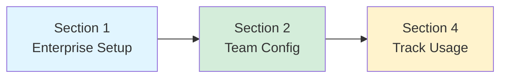
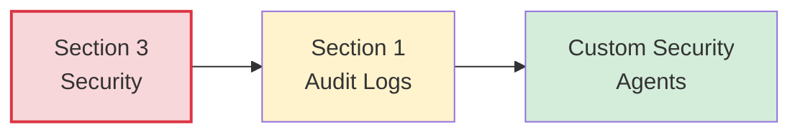
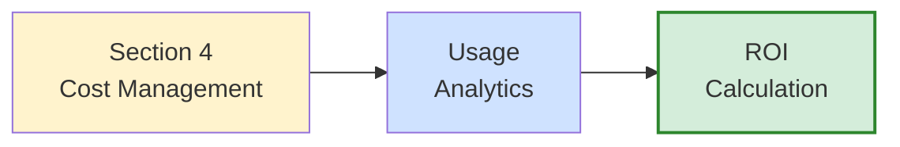

# Part 4: Enterprise & Team Collaboration

**Target Audience:** Tech leads, engineering managers, enterprise architects, DevOps teams  
**Time to Complete:** 3 hours  
**Difficulty:** Intermediate to Advanced

---

## 📋 Overview

This part covers everything you need to successfully deploy, manage, and scale GitHub Copilot across teams and enterprises. You'll learn how to:

- Deploy Copilot at enterprise scale with proper authentication and compliance
- Enable effective team collaboration through shared configurations
- Implement security best practices and meet compliance requirements
- Manage costs, track usage, and prove ROI to stakeholders

**Who This Part Is For:**
- 👥 **Tech Leads**: Setting up Copilot for your team
- 🏢 **Engineering Managers**: Rolling out Copilot organization-wide
- 🔒 **Security Teams**: Ensuring compliance and data protection
- 💰 **Finance/Operations**: Managing budgets and tracking ROI

---

## 🎯 Learning Outcomes

After completing this part, you will be able to:

- ✅ Deploy GitHub Copilot Business or Enterprise with SSO and proper access controls
- ✅ Create and maintain team-wide custom instructions and agents
- ✅ Implement security policies and audit workflows
- ✅ Track usage metrics and demonstrate ROI to stakeholders
- ✅ Optimize costs and manage premium request allowances
- ✅ Enable effective team collaboration patterns

---

## 📚 Sections

### [Section 1: GitHub Enterprise Integration](01-enterprise-integration.md)
**Time:** 45 minutes

Learn how to deploy and configure GitHub Copilot at enterprise scale:
- GitHub Enterprise Cloud vs Server
- Copilot Business ($19/user/mo) vs Enterprise ($39/user/mo)
- Organization-wide deployment strategies
- SSO/SAML authentication setup
- User and seat management
- Audit logs and compliance reporting

**Key Deliverable:** Fully configured enterprise Copilot deployment

---

### [Section 2: Team Collaboration Patterns](02-team-collaboration.md)
**Time:** 45 minutes

Master team-wide configuration and collaboration workflows:
- Shared workspace configurations
- Team custom instructions repository
- Prompt file libraries and agent sharing
- Code review workflows with Copilot
- Pair programming patterns
- Onboarding automation for new team members

**Key Deliverable:** Team collaboration playbook with shared configurations

---

### [Section 3: Security & Compliance](03-security-compliance.md)
**Time:** 45 minutes

Implement security best practices and meet compliance requirements:
- Code suggestion security
- Preventing secrets in code
- Data privacy and retention policies
- GitHub's training data policies
- GDPR and SOC2 compliance
- Security auditing workflows
- Custom security agents

**Key Deliverable:** Security policy document and audit workflow

---

### [Section 4: Cost Management & Usage Analytics](04-cost-management.md)
**Time:** 45 minutes

Track usage, optimize costs, and prove ROI:
- Pricing models and premium requests
- Usage analytics dashboard
- Cost optimization strategies
- ROI calculation and measurement
- Budget management and forecasting
- Usage reports and insights

**Key Deliverable:** Cost optimization plan and ROI report template

---

## 🚀 Quick Start: Enterprise Pilot Program

**Want to start immediately?** Follow this 4-week pilot program:

### Week 1: Planning & Setup
```bash
# Day 1-2: Business case and approval
- Define goals and success metrics
- Calculate ROI projection
- Get stakeholder approval

# Day 3-4: Technical setup
- Configure SSO/authentication
- Create pilot organization
- Assign licenses to 5-10 pilot users

# Day 5: Initial training
- 1-hour kickoff session
- Share "Quick Wins" guide
- Setup support channel
```

### Week 2: Pilot Execution
```bash
# Monitor adoption
- Check daily active users
- Review usage metrics
- Collect feedback

# Create shared resources
- Team custom instructions
- First custom agent (e.g., security reviewer)
- Prompt library

# Mid-week checkpoint
- 30-minute feedback session
- Address blockers
- Share early wins
```

### Week 3: Expand & Optimize
```bash
# Expand to 30% of team
- Additional training sessions
- Share pilot team success stories
- Refine configurations

# Build enablement materials
- Internal documentation
- Video tutorials
- FAQs and troubleshooting
```

### Week 4: Full Rollout & Measure
```bash
# Full team activation
- All-hands training
- Enable all licenses
- Launch internal Copilot community

# Measure and report
- Usage analytics review
- ROI calculation
- Executive presentation
```

---

## 💡 Key Concepts

### Subscription Tiers

| Feature | Business | Enterprise |
|---------|----------|------------|
| **Price** | $19/user/month | $39/user/month |
| **Premium Requests** | 800/month baseline | 1600/month baseline |
| **IDE Features** | ✅ Full | ✅ Full |
| **Chat on GitHub.com** | ✅ Basic | ✅ Advanced |
| **Usage Analytics** | ✅ Yes | ✅ Yes |
| **Audit Logs** | ✅ Yes | ✅ Yes |
| **SSO/SAML** | ✅ Yes | ✅ Yes |
| **Policy Controls** | ✅ Basic | ✅ Advanced |
| **Early Feature Access** | ❌ No | ✅ Yes |

### Premium Request Model

**What are premium requests?**
- Used by advanced features: Agent mode, Copilot coding agent, code review
- More powerful AI models (Claude Opus 4.5, GPT-5, Gemini 2.5 Pro)
- Each plan includes a baseline allowance
- Additional requests charged at $0.04/request

**Cost optimization:**
- Developers using >800 premium requests/month → Consider Enterprise upgrade
- Monitor usage via analytics dashboard
- Use Auto model selection for cost optimization
- Reserve premium models for complex tasks

---

## 🎓 Learning Paths

### For Tech Leads (2 hours)
**Goal:** Setup and enable your team



**Focus areas:**
1. Initial deployment (Section 1)
2. Team collaboration patterns (Section 2)
3. Usage tracking (Section 4)

**Skip:** Detailed security compliance if not your responsibility

---

### For Security Teams (1.5 hours)
**Goal:** Ensure compliance and security



**Focus areas:**
1. Security best practices (Section 3)
2. Audit log configuration (Section 1)
3. Policy enforcement

**Skip:** Team collaboration patterns (not security-focused)

---

### For Managers/Finance (1.5 hours)
**Goal:** Manage budget and prove ROI



**Focus areas:**
1. Pricing and cost models (Section 4)
2. Usage metrics and dashboards
3. ROI measurement

**Skip:** Technical implementation details

---

## 🏆 Success Metrics

### Track These KPIs

**Adoption Metrics:**
- Daily Active Users (DAU)
- Weekly Active Users (WAU)
- Feature adoption (inline, chat, agent mode)
- Time to first usage after license assignment

**Productivity Metrics:**
- Code acceptance rate (target: >30%)
- Pull requests per developer per week
- Time from feature start to PR submission
- Test coverage improvement

**Cost Metrics:**
- Cost per developer per month
- Premium request usage trends
- ROI percentage
- Payback period (target: <1 month)

**Quality Metrics:**
- Bugs per 1000 lines of code
- Code review cycles per PR
- Time to resolve security vulnerabilities

---

## 🔗 Prerequisites

Before starting this part, ensure you have:

- ✅ Completed Part 1 (Fundamentals) or equivalent Copilot experience
- ✅ GitHub organization owner or enterprise admin access
- ✅ Budget approval for Copilot Business or Enterprise
- ✅ Understanding of your organization's security/compliance requirements
- ✅ Access to usage analytics and billing information

---

## 📚 Additional Resources

**Official Documentation:**
- [GitHub Copilot for Business](https://docs.github.com/en/copilot/copilot-business)
- [GitHub Copilot for Enterprise](https://docs.github.com/en/copilot/github-copilot-enterprise)
- [Usage Metrics API](https://docs.github.com/en/rest/copilot/usage-metrics)
- [Audit Log Events](https://docs.github.com/en/organizations/keeping-your-organization-secure/audit-log-events)

**Community Resources:**
- [GitHub Community Forum](https://github.community/)
- [GitHub Copilot Feedback](https://github.com/orgs/community/discussions/categories/copilot)

---

## 🎯 Next Steps

1. **Choose your learning path** based on your role
2. **Start with Section 1** if deploying enterprise-wide
3. **Jump to Section 2** if you already have Copilot deployed
4. **Use the 4-week pilot program** for structured rollout

---

**Ready to deploy Copilot at scale?** → Start with [Section 1: GitHub Enterprise Integration](01-enterprise-integration.md)

**Already deployed?** → Jump to [Section 2: Team Collaboration Patterns](02-team-collaboration.md)

**Need ROI data?** → Go to [Section 4: Cost Management & Usage Analytics](04-cost-management.md)

