# Section 1: Frontend Development Workflows

**Part of:** [Part 5: Specialized Workflows & Domains](README.md)  
**Related:** [Core Workflows](../01-fundamentals-core-concepts/03-core-workflows.md) | [Custom Agents](../03-advanced-chat-agents/02-custom-agents-instructions.md)

---

## 📋 Overview

This section covers how to leverage GitHub Copilot for frontend development across modern frameworks and libraries. Whether you're building React applications, Vue.js interfaces, or Angular projects, Copilot accelerates your workflow from component generation to TypeScript interfaces, styling, and accessibility.

**What you'll learn:**
- React, Vue, and Angular component generation patterns
- TypeScript type generation and validation
- CSS and styling assistance (Tailwind, CSS Modules, styled-components)
- State management implementation (Redux, Zustand, Pinia)
- Form validation and handling
- Accessibility (a11y) best practices
- Responsive design patterns

**Time to master:** 45-60 minutes

---

## 🎯 Key Takeaways

1. **Component scaffolding:** Copilot excels at generating React/Vue/Angular components with proper structure
2. **TypeScript integration:** Auto-generate types, interfaces, and PropTypes with context awareness
3. **State management:** Copilot understands Redux, Zustand, Pinia patterns and generates boilerplate
4. **Styling shortcuts:** Generate responsive CSS, Tailwind classes, and styled-components
5. **Accessibility first:** Use custom prompts to enforce WCAG standards in generated components
6. **Framework-specific patterns:** Configure custom instructions for your framework's best practices

---

## 🚀 Quick Wins: Frontend Development

### Pattern 1: React Component Generation

**Scenario:** Generate a complete React component with TypeScript, hooks, and proper structure.

**Approach:**

```typescript
// 1. Start typing the component name and let Copilot suggest
// Type this and press Tab:

interface ProductCardProps {
  // Copilot will suggest:
  id: string;
  name: string;
  price: number;
  imageUrl: string;
  onAddToCart: (id: string) => void;
}

export const ProductCard: React.FC<ProductCardProps> = ({ 
  // Copilot completes the rest
  id, name, price, imageUrl, onAddToCart 
}) => {
  return (
    <div className="product-card">
      
      <h3>{name}</h3>
      <p>${price.toFixed(2)}</p>
      <button onClick={() => onAddToCart(id)}>Add to Cart</button>
    </div>
  );
};
```

**Using Chat for complex components:**

```
Ctrl+Alt+I (Chat)

"@workspace Generate a React component for a user profile card that:
- Accepts user data (name, avatar, bio, location)
- Has edit mode with form validation
- Uses TypeScript
- Implements loading and error states
- Follows our design system in @design-system.md"
```

**Result:** Complete component with PropTypes, state management, validation logic, and error handling.

---

### Pattern 2: Vue Component with Composition API

**Using Copilot inline:**

```vue
<script setup lang="ts">
// Start typing and Copilot completes
interface TodoItem {
  id: number;
  title: string;
  completed: boolean;
}

// Copilot suggests the reactive state
const todos = ref<TodoItem[]>([]);
const newTodo = ref('');

// Copilot generates CRUD functions
const addTodo = () => {
  if (!newTodo.value.trim()) return;
  todos.value.push({
    id: Date.now(),
    title: newTodo.value,
    completed: false
  });
  newTodo.value = '';
};

const toggleTodo = (id: number) => {
  const todo = todos.value.find(t => t.id === id);
  if (todo) todo.completed = !todo.completed;
};

const deleteTodo = (id: number) => {
  todos.value = todos.value.filter(t => t.id !== id);
};
</script>

<template>
  <div class="todo-app">
    <!-- Copilot suggests the template -->
    <input v-model="newTodo" @keyup.enter="addTodo" placeholder="New todo..." />
    <button @click="addTodo">Add</button>
    
    <ul>
      <li v-for="todo in todos" :key="todo.id">
        <input type="checkbox" :checked="todo.completed" @change="toggleTodo(todo.id)" />
        <span :class="{ completed: todo.completed }">{{ todo.title }}</span>
        <button @click="deleteTodo(todo.id)">Delete</button>
      </li>
    </ul>
  </div>
</template>

<style scoped>
.completed {
  text-decoration: line-through;
  opacity: 0.6;
}
</style>
```

**Using Chat for scaffolding:**

```
Chat → Agent mode

"Create a Vue 3 component using Composition API for a multi-step form:
1. Personal info (name, email)
2. Address details
3. Confirmation step
Include Vuelidate for validation and emit events for form submission"
```

---

### Pattern 3: Angular Component with Services

**Generate Angular service:**

```
Inline Chat (Ctrl+I) in empty file

"Generate Angular service for user authentication with methods:
- login(email, password)
- logout()
- getCurrentUser()
- isAuthenticated observable
Use HttpClient and handle errors"
```

**Result:**

```typescript
import { Injectable } from '@angular/core';
import { HttpClient, HttpErrorResponse } from '@angular/common/http';
import { BehaviorSubject, Observable, throwError } from 'rxjs';
import { catchError, map, tap } from 'rxjs/operators';

interface User {
  id: string;
  email: string;
  name: string;
}

@Injectable({
  providedIn: 'root'
})
export class AuthService {
  private currentUserSubject: BehaviorSubject<User | null>;
  public currentUser: Observable<User | null>;

  constructor(private http: HttpClient) {
    this.currentUserSubject = new BehaviorSubject<User | null>(
      JSON.parse(localStorage.getItem('currentUser') || 'null')
    );
    this.currentUser = this.currentUserSubject.asObservable();
  }

  public get currentUserValue(): User | null {
    return this.currentUserSubject.value;
  }

  login(email: string, password: string): Observable<User> {
    return this.http.post<User>('/api/auth/login', { email, password })
      .pipe(
        tap(user => {
          localStorage.setItem('currentUser', JSON.stringify(user));
          this.currentUserSubject.next(user);
        }),
        catchError(this.handleError)
      );
  }

  logout(): void {
    localStorage.removeItem('currentUser');
    this.currentUserSubject.next(null);
  }

  getCurrentUser(): Observable<User | null> {
    return this.currentUser;
  }

  isAuthenticated(): Observable<boolean> {
    return this.currentUser.pipe(map(user => !!user));
  }

  private handleError(error: HttpErrorResponse) {
    let errorMessage = 'An error occurred';
    if (error.error instanceof ErrorEvent) {
      errorMessage = `Error: ${error.error.message}`;
    } else {
      errorMessage = `Server Error: ${error.status} - ${error.message}`;
    }
    return throwError(() => new Error(errorMessage));
  }
}
```

---

## 🎨 TypeScript & Type Generation

### Pattern 4: Auto-Generate TypeScript Interfaces

**From API responses:**

```typescript
// Chat prompt:
"@workspace Based on the API response in @api-docs.md, generate TypeScript interfaces for:
- User object
- Product object
- Order object
Include nested types and optional fields"
```

**Result:**

```typescript
interface User {
  id: string;
  email: string;
  firstName: string;
  lastName: string;
  avatar?: string;
  role: 'admin' | 'user' | 'guest';
  createdAt: Date;
  preferences?: UserPreferences;
}

interface UserPreferences {
  theme: 'light' | 'dark' | 'auto';
  language: string;
  notifications: NotificationSettings;
}

interface NotificationSettings {
  email: boolean;
  push: boolean;
  sms: boolean;
}

interface Product {
  id: string;
  name: string;
  description: string;
  price: number;
  currency: string;
  images: string[];
  category: ProductCategory;
  inStock: boolean;
  inventory: number;
}

interface ProductCategory {
  id: string;
  name: string;
  slug: string;
}

interface Order {
  id: string;
  userId: string;
  items: OrderItem[];
  total: number;
  status: 'pending' | 'processing' | 'shipped' | 'delivered' | 'cancelled';
  shippingAddress: Address;
  createdAt: Date;
  updatedAt: Date;
}

interface OrderItem {
  productId: string;
  quantity: number;
  price: number;
}

interface Address {
  street: string;
  city: string;
  state: string;
  zipCode: string;
  country: string;
}
```

**Type guards and validators:**

```typescript
// Type in comment and let Copilot generate
// Generate type guard for User interface

function isUser(obj: any): obj is User {
  return (
    typeof obj === 'object' &&
    typeof obj.id === 'string' &&
    typeof obj.email === 'string' &&
    typeof obj.firstName === 'string' &&
    typeof obj.lastName === 'string' &&
    ['admin', 'user', 'guest'].includes(obj.role)
  );
}

// Generate Zod schema for runtime validation
import { z } from 'zod';

const UserSchema = z.object({
  id: z.string().uuid(),
  email: z.string().email(),
  firstName: z.string().min(1),
  lastName: z.string().min(1),
  avatar: z.string().url().optional(),
  role: z.enum(['admin', 'user', 'guest']),
  createdAt: z.date(),
  preferences: z.object({
    theme: z.enum(['light', 'dark', 'auto']),
    language: z.string(),
    notifications: z.object({
      email: z.boolean(),
      push: z.boolean(),
      sms: z.boolean()
    })
  }).optional()
});

type User = z.infer<typeof UserSchema>;
```

---

## 🎨 Styling & CSS

### Pattern 5: Generate Responsive CSS

**Tailwind CSS utility classes:**

```
Inline Chat (Ctrl+I) in component

"Add Tailwind classes for a responsive card layout:
- Mobile: full width, vertical stack
- Tablet: 2 columns
- Desktop: 3 columns
Include hover effects and shadows"
```

**Result:**

```jsx
<div className="grid grid-cols-1 md:grid-cols-2 lg:grid-cols-3 gap-6 p-4">
  {products.map(product => (
    <div 
      key={product.id}
      className="bg-white rounded-lg shadow-md hover:shadow-xl transition-shadow duration-300 overflow-hidden"
    >
      
      <div className="p-4">
        <h3 className="text-xl font-semibold mb-2 truncate">
          {product.name}
        </h3>
        <p className="text-gray-600 mb-4 line-clamp-2">
          {product.description}
        </p>
        <div className="flex justify-between items-center">
          <span className="text-2xl font-bold text-blue-600">
            ${product.price}
          </span>
          <button className="bg-blue-500 hover:bg-blue-600 text-white px-4 py-2 rounded-md transition-colors">
            Add to Cart
          </button>
        </div>
      </div>
    </div>
  ))}
</div>
```

**CSS Modules generation:**

```
Chat prompt:

"Generate CSS Module for a navigation bar with:
- Sticky positioning
- Transparent to solid background on scroll
- Mobile hamburger menu
- Smooth transitions"
```

**Result:**

```css
/* Navigation.module.css */
.nav {
  position: sticky;
  top: 0;
  z-index: 1000;
  transition: all 0.3s ease;
  background: transparent;
}

.nav.scrolled {
  background: rgba(255, 255, 255, 0.95);
  backdrop-filter: blur(10px);
  box-shadow: 0 2px 10px rgba(0, 0, 0, 0.1);
}

.container {
  max-width: 1200px;
  margin: 0 auto;
  padding: 1rem 2rem;
  display: flex;
  justify-content: space-between;
  align-items: center;
}

.logo {
  font-size: 1.5rem;
  font-weight: bold;
  color: #333;
}

.menu {
  display: flex;
  gap: 2rem;
  list-style: none;
}

.menuItem {
  transition: color 0.2s;
}

.menuItem:hover {
  color: #0066cc;
}

.hamburger {
  display: none;
  flex-direction: column;
  gap: 4px;
  cursor: pointer;
}

.hamburgerLine {
  width: 25px;
  height: 3px;
  background: #333;
  transition: all 0.3s ease;
}

@media (max-width: 768px) {
  .menu {
    position: fixed;
    top: 60px;
    right: -100%;
    flex-direction: column;
    background: white;
    width: 80%;
    max-width: 300px;
    padding: 2rem;
    box-shadow: -2px 0 10px rgba(0, 0, 0, 0.1);
    transition: right 0.3s ease;
  }
  
  .menu.open {
    right: 0;
  }
  
  .hamburger {
    display: flex;
  }
  
  .hamburger.open .hamburgerLine:nth-child(1) {
    transform: rotate(45deg) translate(5px, 5px);
  }
  
  .hamburger.open .hamburgerLine:nth-child(2) {
    opacity: 0;
  }
  
  .hamburger.open .hamburgerLine:nth-child(3) {
    transform: rotate(-45deg) translate(5px, -5px);
  }
}
```

**Styled-components:**

```typescript
// Chat: "Generate styled-components for a button with variants (primary, secondary, danger) and sizes"

import styled, { css } from 'styled-components';

interface ButtonProps {
  variant?: 'primary' | 'secondary' | 'danger';
  size?: 'small' | 'medium' | 'large';
}

const getVariantStyles = (variant: ButtonProps['variant']) => {
  switch (variant) {
    case 'primary':
      return css`
        background: #0066cc;
        color: white;
        &:hover {
          background: #0052a3;
        }
      `;
    case 'secondary':
      return css`
        background: #6c757d;
        color: white;
        &:hover {
          background: #5a6268;
        }
      `;
    case 'danger':
      return css`
        background: #dc3545;
        color: white;
        &:hover {
          background: #c82333;
        }
      `;
    default:
      return css`
        background: #007bff;
        color: white;
      `;
  }
};

const getSizeStyles = (size: ButtonProps['size']) => {
  switch (size) {
    case 'small':
      return css`
        padding: 0.25rem 0.5rem;
        font-size: 0.875rem;
      `;
    case 'large':
      return css`
        padding: 0.75rem 1.5rem;
        font-size: 1.25rem;
      `;
    default:
      return css`
        padding: 0.5rem 1rem;
        font-size: 1rem;
      `;
  }
};

export const Button = styled.button<ButtonProps>`
  border: none;
  border-radius: 4px;
  cursor: pointer;
  font-weight: 600;
  transition: all 0.2s ease;
  
  ${props => getVariantStyles(props.variant)}
  ${props => getSizeStyles(props.size)}
  
  &:disabled {
    opacity: 0.6;
    cursor: not-allowed;
  }
  
  &:focus {
    outline: 2px solid #0066cc;
    outline-offset: 2px;
  }
`;
```

---

## 📦 State Management

### Pattern 6: Redux Toolkit Setup

**Generate Redux slice:**

```
Chat → Agent mode

"Create a Redux Toolkit slice for shopping cart with:
- Add item
- Remove item
- Update quantity
- Clear cart
- Calculate total
Include TypeScript types and selectors"
```

**Result:**

```typescript
// features/cart/cartSlice.ts
import { createSlice, PayloadAction } from '@reduxjs/toolkit';
import type { RootState } from '../../app/store';

interface CartItem {
  id: string;
  name: string;
  price: number;
  quantity: number;
  image: string;
}

interface CartState {
  items: CartItem[];
  total: number;
}

const initialState: CartState = {
  items: [],
  total: 0
};

const calculateTotal = (items: CartItem[]): number => {
  return items.reduce((sum, item) => sum + item.price * item.quantity, 0);
};

export const cartSlice = createSlice({
  name: 'cart',
  initialState,
  reducers: {
    addItem: (state, action: PayloadAction<Omit<CartItem, 'quantity'>>) => {
      const existingItem = state.items.find(item => item.id === action.payload.id);
      
      if (existingItem) {
        existingItem.quantity += 1;
      } else {
        state.items.push({ ...action.payload, quantity: 1 });
      }
      
      state.total = calculateTotal(state.items);
    },
    
    removeItem: (state, action: PayloadAction<string>) => {
      state.items = state.items.filter(item => item.id !== action.payload);
      state.total = calculateTotal(state.items);
    },
    
    updateQuantity: (state, action: PayloadAction<{ id: string; quantity: number }>) => {
      const item = state.items.find(item => item.id === action.payload.id);
      
      if (item) {
        if (action.payload.quantity <= 0) {
          state.items = state.items.filter(i => i.id !== action.payload.id);
        } else {
          item.quantity = action.payload.quantity;
        }
      }
      
      state.total = calculateTotal(state.items);
    },
    
    clearCart: (state) => {
      state.items = [];
      state.total = 0;
    }
  }
});

export const { addItem, removeItem, updateQuantity, clearCart } = cartSlice.actions;

// Selectors
export const selectCartItems = (state: RootState) => state.cart.items;
export const selectCartTotal = (state: RootState) => state.cart.total;
export const selectCartItemCount = (state: RootState) => 
  state.cart.items.reduce((count, item) => count + item.quantity, 0);
export const selectCartItemById = (id: string) => (state: RootState) =>
  state.cart.items.find(item => item.id === id);

export default cartSlice.reducer;
```

### Pattern 7: Zustand Store

**Chat prompt:**

```
"Create a Zustand store for user preferences with:
- Theme (light/dark/system)
- Language selection
- Notification settings
- Persist to localStorage
Include TypeScript types"
```

**Result:**

```typescript
import { create } from 'zustand';
import { persist } from 'zustand/middleware';

type Theme = 'light' | 'dark' | 'system';

interface NotificationSettings {
  email: boolean;
  push: boolean;
  inApp: boolean;
}

interface PreferencesState {
  theme: Theme;
  language: string;
  notifications: NotificationSettings;
  
  // Actions
  setTheme: (theme: Theme) => void;
  setLanguage: (language: string) => void;
  updateNotifications: (settings: Partial<NotificationSettings>) => void;
  resetPreferences: () => void;
}

const defaultNotifications: NotificationSettings = {
  email: true,
  push: true,
  inApp: true
};

export const usePreferencesStore = create<PreferencesState>()(
  persist(
    (set) => ({
      theme: 'system',
      language: 'en',
      notifications: defaultNotifications,
      
      setTheme: (theme) => set({ theme }),
      
      setLanguage: (language) => set({ language }),
      
      updateNotifications: (settings) => 
        set((state) => ({
          notifications: { ...state.notifications, ...settings }
        })),
      
      resetPreferences: () => set({
        theme: 'system',
        language: 'en',
        notifications: defaultNotifications
      })
    }),
    {
      name: 'user-preferences'
    }
  )
);

// Usage hook
export const useTheme = () => usePreferencesStore((state) => state.theme);
export const useLanguage = () => usePreferencesStore((state) => state.language);
export const useNotifications = () => usePreferencesStore((state) => state.notifications);
```

---

## 📝 Form Validation

### Pattern 8: React Hook Form + Zod

**Generate form with validation:**

```
Chat:

"Create a registration form using react-hook-form and Zod with:
- Email (valid format)
- Password (min 8 chars, 1 uppercase, 1 number)
- Confirm password (must match)
- Terms acceptance
Show inline error messages"
```

**Result:**

```typescript
import { useForm } from 'react-hook-form';
import { zodResolver } from '@hookform/resolvers/zod';
import { z } from 'zod';

const registrationSchema = z.object({
  email: z.string().email('Invalid email address'),
  password: z
    .string()
    .min(8, 'Password must be at least 8 characters')
    .regex(/[A-Z]/, 'Password must contain at least one uppercase letter')
    .regex(/[0-9]/, 'Password must contain at least one number'),
  confirmPassword: z.string(),
  acceptTerms: z.boolean().refine(val => val === true, {
    message: 'You must accept the terms and conditions'
  })
}).refine(data => data.password === data.confirmPassword, {
  message: "Passwords don't match",
  path: ['confirmPassword']
});

type RegistrationFormData = z.infer<typeof registrationSchema>;

export const RegistrationForm: React.FC = () => {
  const {
    register,
    handleSubmit,
    formState: { errors, isSubmitting }
  } = useForm<RegistrationFormData>({
    resolver: zodResolver(registrationSchema)
  });

  const onSubmit = async (data: RegistrationFormData) => {
    try {
      // API call to register user
      await fetch('/api/register', {
        method: 'POST',
        headers: { 'Content-Type': 'application/json' },
        body: JSON.stringify(data)
      });
      
      console.log('Registration successful', data);
    } catch (error) {
      console.error('Registration failed', error);
    }
  };

  return (
    <form onSubmit={handleSubmit(onSubmit)} className="max-w-md mx-auto p-6">
      <div className="mb-4">
        <label htmlFor="email" className="block mb-2 font-medium">
          Email
        </label>
        <input
          {...register('email')}
          type="email"
          id="email"
          className="w-full px-3 py-2 border rounded-md"
        />
        {errors.email && (
          <p className="text-red-500 text-sm mt-1">{errors.email.message}</p>
        )}
      </div>

      <div className="mb-4">
        <label htmlFor="password" className="block mb-2 font-medium">
          Password
        </label>
        <input
          {...register('password')}
          type="password"
          id="password"
          className="w-full px-3 py-2 border rounded-md"
        />
        {errors.password && (
          <p className="text-red-500 text-sm mt-1">{errors.password.message}</p>
        )}
      </div>

      <div className="mb-4">
        <label htmlFor="confirmPassword" className="block mb-2 font-medium">
          Confirm Password
        </label>
        <input
          {...register('confirmPassword')}
          type="password"
          id="confirmPassword"
          className="w-full px-3 py-2 border rounded-md"
        />
        {errors.confirmPassword && (
          <p className="text-red-500 text-sm mt-1">{errors.confirmPassword.message}</p>
        )}
      </div>

      <div className="mb-6">
        <label className="flex items-center">
          <input
            {...register('acceptTerms')}
            type="checkbox"
            className="mr-2"
          />
          <span className="text-sm">I accept the terms and conditions</span>
        </label>
        {errors.acceptTerms && (
          <p className="text-red-500 text-sm mt-1">{errors.acceptTerms.message}</p>
        )}
      </div>

      <button
        type="submit"
        disabled={isSubmitting}
        className="w-full bg-blue-500 text-white py-2 rounded-md hover:bg-blue-600 disabled:opacity-50"
      >
        {isSubmitting ? 'Registering...' : 'Register'}
      </button>
    </form>
  );
};
```

---

## ♿ Accessibility (a11y)

### Pattern 9: Generate Accessible Components

**Custom agent for accessibility:**

Create `.vscode/agents/accessibility-checker.agent.md`:

```markdown
---
name: Accessibility Checker
description: Review components for WCAG 2.1 AA compliance
tools:
  - read_files
---

You are an accessibility expert reviewing React/Vue/Angular components.

## Check for:
- ✅ Semantic HTML elements
- ✅ ARIA labels and roles
- ✅ Keyboard navigation (tab order, focus management)
- ✅ Color contrast ratios (4.5:1 for text, 3:1 for UI)
- ✅ Alternative text for images
- ✅ Form labels and error associations
- ✅ Focus indicators
- ✅ Screen reader compatibility

## Output format:
- 🔴 Critical: WCAG violation (must fix)
- 🟡 Warning: Accessibility concern
- 🟢 Good: Follows best practices
- 💡 Suggestion: Enhancement opportunity
```

**Usage:**

```
Switch to Accessibility Checker agent
Chat:

"@workspace Review the ProductCard component for accessibility issues"
```

**Generate accessible modal:**

```
Chat:

"Create an accessible modal component with:
- Trap focus inside modal
- Close on Esc key
- Return focus to trigger button on close
- ARIA attributes for screen readers
- Click outside to close"
```

**Result:**

```typescript
import React, { useEffect, useRef, useCallback } from 'react';
import { createPortal } from 'react-dom';

interface ModalProps {
  isOpen: boolean;
  onClose: () => void;
  title: string;
  children: React.ReactNode;
}

export const AccessibleModal: React.FC<ModalProps> = ({
  isOpen,
  onClose,
  title,
  children
}) => {
  const modalRef = useRef<HTMLDivElement>(null);
  const previousFocusRef = useRef<HTMLElement | null>(null);

  // Store previously focused element
  useEffect(() => {
    if (isOpen) {
      previousFocusRef.current = document.activeElement as HTMLElement;
    }
  }, [isOpen]);

  // Return focus on close
  useEffect(() => {
    return () => {
      if (previousFocusRef.current) {
        previousFocusRef.current.focus();
      }
    };
  }, []);

  // Handle Escape key
  useEffect(() => {
    const handleEscape = (event: KeyboardEvent) => {
      if (event.key === 'Escape' && isOpen) {
        onClose();
      }
    };

    document.addEventListener('keydown', handleEscape);
    return () => document.removeEventListener('keydown', handleEscape);
  }, [isOpen, onClose]);

  // Trap focus inside modal
  useEffect(() => {
    if (!isOpen || !modalRef.current) return;

    const modal = modalRef.current;
    const focusableElements = modal.querySelectorAll(
      'button, [href], input, select, textarea, [tabindex]:not([tabindex="-1"])'
    );
    
    const firstElement = focusableElements[0] as HTMLElement;
    const lastElement = focusableElements[focusableElements.length - 1] as HTMLElement;

    const handleTab = (e: KeyboardEvent) => {
      if (e.key !== 'Tab') return;

      if (e.shiftKey) {
        if (document.activeElement === firstElement) {
          lastElement.focus();
          e.preventDefault();
        }
      } else {
        if (document.activeElement === lastElement) {
          firstElement.focus();
          e.preventDefault();
        }
      }
    };

    modal.addEventListener('keydown', handleTab);
    firstElement?.focus();

    return () => modal.removeEventListener('keydown', handleTab);
  }, [isOpen]);

  // Handle click outside
  const handleBackdropClick = useCallback((e: React.MouseEvent) => {
    if (e.target === e.currentTarget) {
      onClose();
    }
  }, [onClose]);

  if (!isOpen) return null;

  return createPortal(
    <div
      className="fixed inset-0 bg-black bg-opacity-50 flex items-center justify-center z-50"
      onClick={handleBackdropClick}
      role="dialog"
      aria-modal="true"
      aria-labelledby="modal-title"
    >
      <div
        ref={modalRef}
        className="bg-white rounded-lg shadow-xl max-w-2xl w-full m-4 p-6"
        role="document"
      >
        <div className="flex justify-between items-center mb-4">
          <h2 id="modal-title" className="text-2xl font-bold">
            {title}
          </h2>
          <button
            onClick={onClose}
            className="text-gray-500 hover:text-gray-700 text-2xl"
            aria-label="Close modal"
          >
            ×
          </button>
        </div>
        
        <div className="modal-content">
          {children}
        </div>
      </div>
    </div>,
    document.body
  );
};
```

---

## 🎨 Custom Instructions for Frontend

Create `.github/copilot-instructions.md` for team consistency:

```markdown
# Frontend Development Standards

## React Patterns
- Use functional components with hooks (no class components)
- Prefer named exports over default exports
- Extract reusable logic into custom hooks
- Use TypeScript for all new components
- PropTypes validation for all component props

## Component Structure
```tsx
// 1. Imports
import React, { useState, useEffect } from 'react';
import { ComponentProps } from './types';
import styles from './Component.module.css';

// 2. Types/Interfaces
interface Props {
  // ...
}

// 3. Component
export const Component: React.FC<Props> = ({ prop1, prop2 }) => {
  // 3a. State
  const [state, setState] = useState();
  
  // 3b. Effects
  useEffect(() => {}, []);
  
  // 3c. Handlers
  const handleClick = () => {};
  
  // 3d. Render
  return <div></div>;
};
```

## Styling
- Use Tailwind CSS for utility classes
- Use CSS Modules for complex component styles
- Mobile-first responsive design
- Follow design system tokens in `design-tokens.ts`

## State Management
- Local state: `useState` for component-level
- Global state: Zustand for app-level
- Server state: TanStack Query for API data
- Forms: React Hook Form + Zod validation

## Performance
- Lazy load routes and heavy components
- Memoize expensive computations with `useMemo`
- Prevent unnecessary re-renders with `React.memo`
- Virtualize long lists with `react-window`

## Accessibility
- All interactive elements must be keyboard accessible
- Provide ARIA labels for screen readers
- Maintain 4.5:1 color contrast for text
- Test with keyboard navigation and screen readers

## Testing
- Unit tests for all custom hooks
- Component tests for UI behavior
- Integration tests for user flows
- Aim for 80% code coverage
```

---

## 📊 Framework-Specific Workflows

### React Development Flow

```mermaid
graph LR
    PLAN["Plan Component<br/>━━━━━<br/>Define props & state"] --> SCAFFOLD["Generate<br/>Component<br/>━━━━━<br/>Copilot inline"]
    SCAFFOLD --> TYPES["Add TypeScript<br/>Types<br/>━━━━━<br/>Copilot suggests"]
    TYPES --> STYLE["Apply Styles<br/>━━━━━<br/>Tailwind/CSS"]
    STYLE --> STATE["Add State<br/>Management<br/>━━━━━<br/>useState/Zustand"]
    STATE --> TEST["Generate Tests<br/>━━━━━<br/>Chat: /tests"]
    TEST --> A11Y["Accessibility<br/>Check<br/>━━━━━<br/>Custom agent"]
    
    style PLAN fill:#cfe2ff
    style SCAFFOLD fill:#d4edda
    style TYPES fill:#fff3cd
    style STYLE fill:#e1f5ff
    style STATE fill:#f0e1ff
    style TEST fill:#d4edda
    style A11Y fill:#90EE90
```



### Vue Development Flow

```mermaid
graph TB
    START["Vue Component<br/>━━━━━<br/>Composition API"] --> SCRIPT["<br/>setup lang='ts'<br/>━━━━━<br/>Define reactive state"]
    SCRIPT --> TEMPLATE["<br/>template<br/>━━━━━<br/>Build UI structure"]
    TEMPLATE --> STYLEBLOCK["<br/>style scoped<br/>━━━━━<br/>Component styles"]
    STYLEBLOCK --> COMPOSABLE["Extract Logic<br/>━━━━━<br/>Create composable"]
    COMPOSABLE --> STORE["Pinia Store<br/>━━━━━<br/>Global state"]
    
    style START fill:#90EE90
    style SCRIPT fill:#cfe2ff
    style TEMPLATE fill:#fff3cd
    style STYLEBLOCK fill:#e1f5ff
    style COMPOSABLE fill:#f0e1ff
    style STORE fill:#d4edda
```



---

## 💡 Pro Tips

### 1. **Component Library Integration**

When using component libraries (Material-UI, Ant Design, Chakra UI), configure custom instructions:

```markdown
# Component Library: Material-UI v5

- Import components from @mui/material
- Use sx prop for inline styling
- Apply theme tokens from theme.ts
- Prefer composition over custom components
```

### 2. **Performance Optimization Prompts**

```
Chat:

"Analyze this React component for performance issues:
- Identify unnecessary re-renders
- Suggest useMemo/useCallback optimizations
- Find expensive operations
- Recommend code splitting opportunities"
```

### 3. **Responsive Design Generation**

```
Chat:

"Make this component responsive:
- Mobile: Stack vertically, full width
- Tablet: 2 columns, 768px+
- Desktop: 3 columns, 1024px+
- Add touch-friendly interactions for mobile"
```

### 4. **Dark Mode Implementation**

```
Chat:

"Add dark mode support:
- Use CSS custom properties for colors
- Create theme context
- Persist preference to localStorage
- Support system preference detection"
```

---

## 🚨 Common Pitfalls

### ❌ Don't:
- ❌ Generate components without TypeScript types
- ❌ Skip accessibility attributes (ARIA, alt text)
- ❌ Ignore responsive design breakpoints
- ❌ Hardcode colors/spacing (use design tokens)
- ❌ Create components without error boundaries
- ❌ Skip form validation

### ✅ Do:
- ✅ Use custom instructions for framework conventions
- ✅ Generate tests alongside components
- ✅ Run accessibility agent before PRs
- ✅ Extract reusable logic into hooks/composables
- ✅ Use TypeScript for all new code
- ✅ Follow component structure patterns

---

## 📚 Related Resources

**Official Documentation:**
- [React Docs](https://react.dev)
- [Vue.js Guide](https://vuejs.org/guide/)
- [Angular Documentation](https://angular.dev)
- [TypeScript Handbook](https://www.typescriptlang.org/docs/)
- [Tailwind CSS Docs](https://tailwindcss.com/docs)
- [WCAG 2.1 Guidelines](https://www.w3.org/WAI/WCAG21/quickref/)

**Copilot Features Used:**
- Inline completions for component generation
- Chat for complex components and refactoring
- Custom agents for accessibility checks
- Custom instructions for team standards

---

## 🎯 Next Steps

- **Continue to:** [Backend Development Workflows →](02-backend-development.md)
- **Related:** [Custom Agents](../03-advanced-chat-agents/02-custom-agents-instructions.md)
- **Practice:** Generate 3 components with different frameworks
- **Experiment:** Create custom accessibility agent

---

**Updated:** December 2025  
**Part 5, Section 1 of 4**

