# Part 5: Specialized Workflows & Domains

**Complete Technical Guide for Domain-Specific GitHub Copilot Usage**

---

## 📋 Overview

Part 5 provides domain-specific patterns and workflows for using GitHub Copilot across different software development disciplines. Each section contains real-world examples, best practices, and copy-paste patterns for immediate productivity gains in your specific domain.

**What this part covers:**
- Frontend development (React, Vue, Angular, TypeScript)
- Backend development (APIs, databases, authentication)
- Data engineering & SQL (queries, ETL, migrations)
- DevOps & infrastructure (Docker, Kubernetes, CI/CD, IaC)

**Target audience:** Developers working in specific domains who want to maximize Copilot's effectiveness for their daily workflows.

**Time to complete:** 3-4 hours (all sections)

---

## 🎯 Learning Path

```mermaid
graph TB
    START["Part 5 Start<br/>━━━━━<br/>Domain Workflows"] --> CHOOSE{"Choose Your<br/>Domain"}
    
    CHOOSE -->|"UI Development"| FRONTEND["Section 1:<br/>Frontend<br/>━━━━━<br/>React, Vue, Angular"]
    CHOOSE -->|"Server-side"| BACKEND["Section 2:<br/>Backend<br/>━━━━━<br/>APIs, Databases"]
    CHOOSE -->|"Data"| DATA["Section 3:<br/>Data & SQL<br/>━━━━━<br/>ETL, Queries"]
    CHOOSE -->|"Infrastructure"| DEVOPS["Section 4:<br/>DevOps<br/>━━━━━<br/>Docker, K8s, CI/CD"]
    
    FRONTEND --> PRACTICE["Practice<br/>━━━━━<br/>Build Projects"]
    BACKEND --> PRACTICE
    DATA --> PRACTICE
    DEVOPS --> PRACTICE
    
    PRACTICE --> ADVANCED["Advanced Topics<br/>━━━━━<br/>Part 6 & 7"]
    
    style START fill:#cfe2ff
    style CHOOSE fill:#fff3cd
    style FRONTEND fill:#e1f5ff
    style BACKEND fill:#d4edda
    style DATA fill:#f0e1ff
    style DEVOPS fill:#90EE90
    style PRACTICE fill:#fff4e1
    style ADVANCED fill:#f8d7da
```



---

## 📚 Sections Overview

### [Section 1: Frontend Development Workflows](01-frontend-development.md)

**Time:** 45-60 minutes  
**Focus:** UI frameworks, TypeScript, styling, state management

**What you'll master:**
- ✅ React/Vue/Angular component generation
- ✅ TypeScript type generation from API responses
- ✅ CSS and styling (Tailwind, CSS Modules, styled-components)
- ✅ State management (Redux, Zustand, Pinia)
- ✅ Form validation with Zod/Yup
- ✅ Accessibility (a11y) best practices

**Key patterns:**
- Component scaffolding with props and state
- Auto-generate TypeScript interfaces
- Responsive design with Tailwind
- Redux Toolkit slice generation
- Accessible modal components

**Use when:**
- Building user interfaces
- Working with React, Vue, or Angular
- Creating reusable UI components
- Implementing state management
- Ensuring accessibility compliance

---

### [Section 2: Backend Development Workflows](02-backend-development.md)

**Time:** 50-60 minutes  
**Focus:** REST APIs, databases, authentication, testing

**What you'll master:**
- ✅ Express/FastAPI endpoint generation
- ✅ Prisma schema and ORM queries
- ✅ JWT authentication systems
- ✅ Middleware and error handling
- ✅ OpenAPI/Swagger documentation
- ✅ Integration testing with Jest/Pytest

**Key patterns:**
- Complete CRUD API with validation
- Prisma service layer with transactions
- JWT auth with refresh tokens
- Multi-file API architecture
- Integration test suites

**Use when:**
- Building REST or GraphQL APIs
- Designing database schemas
- Implementing authentication
- Creating backend services
- Testing API endpoints

---

### [Section 3: Data Engineering & SQL](03-data-engineering-sql.md)

**Time:** 40-50 minutes  
**Focus:** SQL queries, ETL pipelines, data quality

**What you'll master:**
- ✅ Complex SQL query generation
- ✅ ETL pipeline development (Python/Node.js)
- ✅ Database migrations with rollback
- ✅ Query optimization and indexing
- ✅ Data quality validation
- ✅ Working with different SQL dialects

**Key patterns:**
- Analytics queries with window functions
- Python ETL pipeline with Pandas
- Prisma/Knex migrations
- Data validation with Great Expectations
- Query performance optimization

**Use when:**
- Writing complex SQL queries
- Building data pipelines
- Creating database migrations
- Optimizing query performance
- Ensuring data quality

---

### [Section 4: DevOps & Infrastructure](04-devops-infrastructure.md)

**Time:** 50-60 minutes  
**Focus:** Docker, Kubernetes, CI/CD, Infrastructure as Code

**What you'll master:**
- ✅ Multi-stage Dockerfile optimization
- ✅ Docker Compose for local development
- ✅ Kubernetes manifest generation
- ✅ GitHub Actions CI/CD pipelines
- ✅ Terraform infrastructure modules
- ✅ Helm charts and deployment strategies

**Key patterns:**
- Production-ready Dockerfiles
- Complete K8s deployment with HPA
- Full CI/CD pipeline with testing
- Terraform AWS infrastructure
- Multi-environment configurations

**Use when:**
- Containerizing applications
- Deploying to Kubernetes
- Setting up CI/CD pipelines
- Managing infrastructure as code
- Automating deployments

---

## 🎯 Quick Start Guide

### Choose Your Path

#### Path A: Full-Stack Developer
**Goal:** Master both frontend and backend workflows

1. **Section 1:** Frontend Development (React/TypeScript patterns)
2. **Section 2:** Backend Development (API + Database)
3. **Section 4:** DevOps (Docker + CI/CD basics)
4. **Practice:** Build and deploy a full-stack application

**Time:** 2.5-3 hours

---

#### Path B: Backend/Data Specialist
**Goal:** Master server-side and data workflows

1. **Section 2:** Backend Development (APIs + Auth)
2. **Section 3:** Data Engineering (SQL + ETL)
3. **Section 4:** DevOps (Docker + Kubernetes)
4. **Practice:** Build a data-driven API with ETL pipeline

**Time:** 2-2.5 hours

---

#### Path C: DevOps Engineer
**Goal:** Master infrastructure and deployment workflows

1. **Section 4:** DevOps & Infrastructure (complete)
2. **Section 2:** Backend Development (for app context)
3. **Section 3:** Data Engineering (for database management)
4. **Practice:** Set up complete CI/CD with IaC

**Time:** 2-3 hours

---

#### Path D: Frontend Specialist
**Goal:** Deep dive into modern frontend development

1. **Section 1:** Frontend Development (complete)
2. **Section 4:** DevOps (Docker for frontend apps)
3. **Practice:** Build production-ready React application
4. **Advanced:** Performance optimization and accessibility

**Time:** 1.5-2 hours

---

## 💡 Cross-Domain Patterns

### Pattern 1: Full-Stack Feature Development

**Scenario:** Build a complete user authentication system

```mermaid
graph LR
    FRONTEND["Frontend<br/>━━━━━<br/>Login Form<br/>JWT Storage"] --> BACKEND["Backend<br/>━━━━━<br/>Auth API<br/>JWT Generation"]
    BACKEND --> DATABASE["Database<br/>━━━━━<br/>User Schema<br/>Migrations"]
    DATABASE --> DEPLOY["Deploy<br/>━━━━━<br/>Docker<br/>K8s"]
    
    style FRONTEND fill:#e1f5ff
    style BACKEND fill:#d4edda
    style DATABASE fill:#f0e1ff
    style DEPLOY fill:#90EE90
```



**Steps:**
1. **Backend (Section 2):** Generate JWT auth service with Express + Prisma
2. **Database (Section 3):** Create user schema and migration
3. **Frontend (Section 1):** Build login form with React Hook Form + Zod
4. **Deploy (Section 4):** Containerize and deploy to Kubernetes

---

### Pattern 2: Data Dashboard Development

**Scenario:** Build analytics dashboard with real-time data

**Steps:**
1. **Data (Section 3):** Create SQL analytics queries and ETL pipeline
2. **Backend (Section 2):** Build REST API to expose data
3. **Frontend (Section 1):** Create React dashboard with charts
4. **Deploy (Section 4):** Set up CI/CD pipeline for automated deployment

---

### Pattern 3: Microservices Architecture

**Scenario:** Build event-driven microservices system

**Steps:**
1. **Backend (Section 2):** Create multiple service APIs
2. **DevOps (Section 4):** Containerize each service with Docker
3. **Infrastructure (Section 4):** Deploy to Kubernetes with service mesh
4. **Data (Section 3):** Set up data synchronization with ETL

---

## 🎨 Domain-Specific Custom Instructions

### Frontend Team

```markdown
# .github/copilot-instructions.md

## Frontend Standards
- Use React 18 with TypeScript
- Functional components with hooks only
- Tailwind CSS for styling
- React Query for server state
- Zustand for client state
- React Hook Form + Zod for forms
- All components must be accessible (WCAG 2.1 AA)
- 80% test coverage minimum
```

### Backend Team

```markdown
# .github/copilot-instructions.md

## Backend Standards
- Node.js 20 + Express + TypeScript
- Prisma ORM for database
- JWT for authentication
- OpenAPI documentation required
- Input validation with Zod
- Error handling with custom middleware
- Integration tests for all endpoints
- 80% code coverage
```

### Data Team

```markdown
# .github/copilot-instructions.md

## Data Engineering Standards
- Python 3.11 for ETL pipelines
- PostgreSQL for OLTP, Snowflake for OLAP
- Pandas for data transformation
- Great Expectations for data quality
- Airflow for orchestration
- dbt for data modeling
- All SQL queries must include EXPLAIN ANALYZE
```

### DevOps Team

```markdown
# .github/copilot-instructions.md

## DevOps Standards
- Multi-stage Dockerfiles (Alpine base)
- Non-root containers
- Kubernetes manifests with HPA
- GitHub Actions for CI/CD
- Terraform for infrastructure
- Security scanning in pipeline
- Zero-downtime deployments
```

---

## 🔧 Cross-Domain Tools & Techniques

### 1. **Shared Type Definitions**

Generate TypeScript types from database schema for full-stack type safety:

```
Chat:

"@workspace Generate TypeScript types from Prisma schema 
that can be shared between frontend and backend.
Include API request/response types."
```

### 2. **API Contract Testing**

Generate contract tests to ensure frontend and backend compatibility:

```
Chat:

"Create Pact contract tests between frontend and backend:
- User authentication endpoints
- Product CRUD operations
- Order processing
Include provider and consumer tests"
```

### 3. **End-to-End Testing**

Generate E2E tests that span multiple domains:

```
Chat:

"Create Playwright E2E test for checkout flow:
1. User logs in (frontend)
2. Adds products to cart (frontend + backend)
3. Completes payment (backend + payment API)
4. Verifies order in database (data layer)
Include proper waits and error handling"
```

---

## 📊 Success Metrics by Domain

### Frontend Development
- ✅ Component reusability: >70% shared components
- ✅ TypeScript coverage: 100% typed code
- ✅ Accessibility score: WCAG 2.1 AA compliance
- ✅ Test coverage: >80%
- ✅ Bundle size: <200KB initial load

### Backend Development
- ✅ API response time: <100ms for 95th percentile
- ✅ Test coverage: >80%
- ✅ Error handling: All endpoints have proper error responses
- ✅ Documentation: 100% of endpoints documented in OpenAPI
- ✅ Security: No high/critical vulnerabilities

### Data Engineering
- ✅ Data quality: >99.5% valid records
- ✅ Pipeline reliability: >99.9% uptime
- ✅ Query performance: <1s for analytics queries
- ✅ Data freshness: <15min lag for real-time data
- ✅ Test coverage: 100% of transformations tested

### DevOps & Infrastructure
- ✅ Deployment frequency: Daily or more
- ✅ Lead time: <1 hour from commit to production
- ✅ MTTR: <15 minutes
- ✅ Change failure rate: <5%
- ✅ Infrastructure as Code: 100% managed by IaC

---

## 🚀 Next Steps

### After Completing Part 5

1. **Practice:** Build a complete project using patterns from all sections
2. **Part 6:** [Testing, Quality & Performance](../06-quality-performance/README.md)
3. **Part 7:** [Reference & Advanced Topics](../07-reference-advanced/README.md)
4. **Customize:** Create domain-specific custom agents for your team

### Recommended Projects

**Beginner:**
- Todo app with authentication (Frontend + Backend + Deploy)
- Simple ETL pipeline (Data + Backend)
- Containerized static site (Frontend + DevOps)

**Intermediate:**
- E-commerce platform (All domains)
- Analytics dashboard (Backend + Data + Frontend)
- Microservices API gateway (Backend + DevOps)

**Advanced:**
- Real-time collaboration tool (All domains + WebSocket)
- Data pipeline orchestration (Data + Backend + DevOps)
- Multi-region deployment (DevOps + Infrastructure)

---

## 🎯 Domain-Specific Agents

Create specialized agents for each domain:

### Frontend Agent

```markdown
# .vscode/agents/frontend-expert.agent.md
---
name: Frontend Expert
description: React/TypeScript specialist with accessibility focus
tools:
  - read_files
  - list_directory
---

You are a senior frontend developer specializing in React, TypeScript, and accessibility.

## Expertise:
- React 18 best practices
- TypeScript advanced patterns
- Accessible component design
- Performance optimization
- State management patterns

## When generating code:
- Use functional components with hooks
- Implement proper TypeScript types
- Ensure WCAG 2.1 AA compliance
- Add proper ARIA labels
- Optimize for performance
```

### Backend Agent

```markdown
# .vscode/agents/backend-expert.agent.md
---
name: Backend Expert
description: API design and database specialist
tools:
  - read_files
  - list_directory
---

You are a senior backend developer specializing in Node.js, databases, and API design.

## Expertise:
- RESTful API design
- Database schema optimization
- Authentication & authorization
- Error handling patterns
- API documentation

## When generating code:
- Validate all inputs
- Use proper HTTP status codes
- Implement error handling
- Add OpenAPI documentation
- Optimize database queries
```

### Data Agent

```markdown
# .vscode/agents/data-expert.agent.md
---
name: Data Expert
description: SQL and ETL pipeline specialist
tools:
  - read_files
  - list_directory
---

You are a senior data engineer specializing in SQL, ETL, and data quality.

## Expertise:
- Complex SQL query optimization
- ETL pipeline architecture
- Data quality validation
- Database performance tuning
- Data modeling

## When generating code:
- Always include indexes
- Add EXPLAIN ANALYZE
- Validate data quality
- Handle edge cases
- Log transformations
```

### DevOps Agent

```markdown
# .vscode/agents/devops-expert.agent.md
---
name: DevOps Expert
description: Container, Kubernetes, and CI/CD specialist
tools:
  - read_files
  - list_directory
---

You are a senior DevOps engineer specializing in containers, Kubernetes, and automation.

## Expertise:
- Docker optimization
- Kubernetes best practices
- CI/CD pipeline design
- Infrastructure as Code
- Security scanning

## When generating code:
- Use multi-stage builds
- Non-root containers
- Proper health checks
- Resource limits
- Security scanning
```

---

## 📚 Additional Resources

### Official Documentation
- [React Docs](https://react.dev)
- [Express.js](https://expressjs.com/)
- [PostgreSQL](https://www.postgresql.org/docs/)
- [Docker](https://docs.docker.com/)
- [Kubernetes](https://kubernetes.io/docs/)
- [Terraform](https://www.terraform.io/docs)

### GitHub Copilot Features Used Across Domains
- **Inline completions:** For rapid code generation
- **Chat view:** For complex multi-file features
- **Agent mode:** For autonomous implementation
- **Custom instructions:** For team standards
- **Custom agents:** For specialized expertise
- **Slash commands:** For quick operations

---

## 🎓 Certification Path

### Domain Mastery Checklist

**Frontend Development:**
- [ ] Created 10+ React components with TypeScript
- [ ] Implemented state management (Redux/Zustand)
- [ ] Built accessible forms with validation
- [ ] Optimized bundle size and performance
- [ ] Created custom agent for frontend workflows

**Backend Development:**
- [ ] Built complete REST API with CRUD operations
- [ ] Implemented JWT authentication system
- [ ] Designed database schema with Prisma
- [ ] Added OpenAPI documentation
- [ ] Written integration tests (>80% coverage)

**Data Engineering:**
- [ ] Written 20+ complex SQL queries
- [ ] Built ETL pipeline with data validation
- [ ] Created database migrations
- [ ] Optimized query performance with indexes
- [ ] Implemented data quality checks

**DevOps & Infrastructure:**
- [ ] Created production-ready Dockerfiles
- [ ] Deployed application to Kubernetes
- [ ] Built complete CI/CD pipeline
- [ ] Managed infrastructure with Terraform
- [ ] Implemented zero-downtime deployments

---

## 💬 Community & Support

**Share your domain-specific patterns:**
- Create custom agents for your team
- Document specialized workflows
- Share optimization techniques
- Contribute domain-specific examples

**Get help:**
- GitHub Discussions
- Stack Overflow (tag: github-copilot)
- Official GitHub Copilot documentation

---

## 🎯 Summary

Part 5 equips you with domain-specific expertise for using GitHub Copilot effectively across:
- **Frontend:** React, Vue, Angular, TypeScript, styling
- **Backend:** APIs, databases, authentication, testing
- **Data:** SQL, ETL, migrations, data quality
- **DevOps:** Docker, Kubernetes, CI/CD, IaC

**Key takeaways:**
1. Each domain has unique patterns and best practices
2. Custom instructions ensure consistency within teams
3. Specialized agents provide domain expertise
4. Cross-domain patterns enable full-stack development
5. Practice with real projects solidifies learning

**Continue to:** [Part 6: Testing, Quality & Performance →](../06-quality-performance/README.md)

---

**Updated:** December 2025  
**Part 5: Complete** ✅

