# Section 1: Test Generation & TDD

**Part 6: Testing, Quality & Performance**  
**Target:** Master automated test generation and test-driven development with GitHub Copilot  
**Time to complete:** 1 hour  
**Prerequisites:** Part 1 (Fundamentals), Part 2 (VS Code Integration)

---

## 📋 Overview

GitHub Copilot transforms testing workflows by automating test generation, suggesting edge cases, and supporting test-driven development (TDD) practices. This section covers unit testing, integration testing, end-to-end testing, and how to integrate Copilot into a TDD workflow for maximum productivity.

**What you'll learn:**
- Generate unit tests for any programming language
- Create integration and end-to-end tests
- Implement TDD workflows with Copilot
- Generate test data and mocks
- Analyze and improve test coverage
- Debug failing tests efficiently

---

## 🎯 Key Concepts

### The Testing Pyramid with Copilot

```mermaid
graph TB
    E2E["E2E Tests<br/>━━━━━<br/>⚡ Copilot: Test flows<br/>🔧 Playwright, Cypress"]
    INT["Integration Tests<br/>━━━━━<br/>⚡ Copilot: API tests<br/>🔧 Mocking, fixtures"]
    UNIT["Unit Tests<br/>━━━━━<br/>⚡ Copilot: Fast generation<br/>🔧 Jest, Pytest, JUnit"]
    
    E2E --> INT --> UNIT
    
    style E2E fill:#cfe2ff
    style INT fill:#fff3cd
    style UNIT fill:#d4edda,stroke:#2d862d,stroke-width:3px
```



**Testing strategy:**
- **Unit tests** (70%): Fast, focused, Copilot excels here
- **Integration tests** (20%): Component interactions, good Copilot support
- **E2E tests** (10%): Full workflows, Copilot generates test scripts

---

## 🚀 Quick Start: Generate Your First Tests

### Pattern 1: Generate Unit Tests in Seconds

**For existing functions:**

```typescript
// Example: Your production code
function calculateMonthlyPayment(
  principal: number, 
  annualRate: number, 
  years: number
): number {
  const monthlyRate = annualRate / 12 / 100;
  const numPayments = years * 12;
  
  if (principal <= 0 || annualRate < 0 || years <= 0) {
    throw new Error('Invalid input parameters');
  }
  
  const payment = principal * 
    (monthlyRate * Math.pow(1 + monthlyRate, numPayments)) / 
    (Math.pow(1 + monthlyRate, numPayments) - 1);
    
  return Math.round(payment * 100) / 100;
}
```

**Step 1: Select the function**  
**Step 2: Open Chat (Ctrl+Alt+I)**  
**Step 3: Use `/tests` command**

```plaintext
/tests using Jest framework with edge cases
```

**Generated output:**

```typescript
import { calculateMonthlyPayment } from './mortgage';

describe('calculateMonthlyPayment', () => {
  test('calculates monthly payment correctly for valid inputs', () => {
    const result = calculateMonthlyPayment(200000, 4.5, 30);
    expect(result).toBeCloseTo(1013.37, 2);
  });

  test('throws error for zero principal', () => {
    expect(() => calculateMonthlyPayment(0, 4.5, 30))
      .toThrow('Invalid input parameters');
  });

  test('throws error for negative interest rate', () => {
    expect(() => calculateMonthlyPayment(200000, -1, 30))
      .toThrow('Invalid input parameters');
  });

  test('throws error for zero years', () => {
    expect(() => calculateMonthlyPayment(200000, 4.5, 0))
      .toThrow('Invalid input parameters');
  });

  test('handles zero interest rate', () => {
    const result = calculateMonthlyPayment(120000, 0, 10);
    expect(result).toBeCloseTo(1000, 2);
  });

  test('handles large principal amounts', () => {
    const result = calculateMonthlyPayment(10000000, 3.5, 30);
    expect(result).toBeGreaterThan(0);
  });

  test('handles short loan terms', () => {
    const result = calculateMonthlyPayment(100000, 5, 1);
    expect(result).toBeCloseTo(8560.75, 2);
  });
});
```

**Time saved:** 10-15 minutes → 30 seconds  
**What Copilot added automatically:**
- ✅ Happy path test
- ✅ Error condition tests
- ✅ Edge cases (zero interest, large numbers)
- ✅ Proper test structure and naming
- ✅ Accurate assertions

---

### Pattern 2: Test-Driven Development (TDD) Workflow

**TDD Cycle with Copilot:**

```mermaid
graph LR
    RED["1. Red<br/>━━━━━<br/>Write failing test<br/>with Copilot"]
    GREEN["2. Green<br/>━━━━━<br/>Implement code<br/>with Copilot"]
    REFACTOR["3. Refactor<br/>━━━━━<br/>Improve with<br/>Copilot"]
    
    RED --> GREEN --> REFACTOR --> RED
    
    style RED fill:#f8d7da
    style GREEN fill:#d4edda
    style REFACTOR fill:#fff3cd
```



**Real TDD example: Building a user validator**

**Step 1: Describe the test (Red phase)**

```typescript
// test/user-validator.test.ts
import { describe, test, expect } from 'vitest';
import { validateUser } from './user-validator';

describe('validateUser', () => {
  // Prompt to Copilot Chat:
  // "Write tests for a user validator function that should:
  // 1. Accept valid email and age >= 18
  // 2. Reject invalid email formats
  // 3. Reject age < 18
  // 4. Reject missing fields"
  
  test('accepts valid user with email and age >= 18', () => {
    const result = validateUser({ email: 'user@example.com', age: 25 });
    expect(result.valid).toBe(true);
    expect(result.errors).toHaveLength(0);
  });

  test('rejects invalid email format', () => {
    const result = validateUser({ email: 'invalid-email', age: 25 });
    expect(result.valid).toBe(false);
    expect(result.errors).toContain('Invalid email format');
  });

  test('rejects age below 18', () => {
    const result = validateUser({ email: 'user@example.com', age: 17 });
    expect(result.valid).toBe(false);
    expect(result.errors).toContain('Age must be at least 18');
  });

  test('rejects missing email', () => {
    const result = validateUser({ age: 25 } as any);
    expect(result.valid).toBe(false);
    expect(result.errors).toContain('Email is required');
  });

  test('rejects missing age', () => {
    const result = validateUser({ email: 'user@example.com' } as any);
    expect(result.valid).toBe(false);
    expect(result.errors).toContain('Age is required');
  });
});
```

**Tests fail** ❌ (Red phase complete)

**Step 2: Implement code to pass tests (Green phase)**

Prompt in Chat:
```plaintext
@workspace Implement the validateUser function in user-validator.ts 
to pass all tests in user-validator.test.ts
```

Generated implementation:

```typescript
// src/user-validator.ts
interface ValidationResult {
  valid: boolean;
  errors: string[];
}

interface User {
  email?: string;
  age?: number;
}

export function validateUser(user: User): ValidationResult {
  const errors: string[] = [];

  // Check email presence
  if (!user.email) {
    errors.push('Email is required');
  } else if (!isValidEmail(user.email)) {
    errors.push('Invalid email format');
  }

  // Check age presence and value
  if (user.age === undefined) {
    errors.push('Age is required');
  } else if (user.age < 18) {
    errors.push('Age must be at least 18');
  }

  return {
    valid: errors.length === 0,
    errors
  };
}

function isValidEmail(email: string): boolean {
  const emailRegex = /^[^\s@]+@[^\s@]+\.[^\s@]+$/;
  return emailRegex.test(email);
}
```

**Tests pass** ✅ (Green phase complete)

**Step 3: Refactor with Copilot (Refactor phase)**

Prompt in Inline Chat (Ctrl+I):
```plaintext
Refactor this to use a more robust email validation library like validator.js
```

Refactored code:

```typescript
import validator from 'validator';

export function validateUser(user: User): ValidationResult {
  const errors: string[] = [];

  if (!user.email) {
    errors.push('Email is required');
  } else if (!validator.isEmail(user.email)) {
    errors.push('Invalid email format');
  }

  if (user.age === undefined) {
    errors.push('Age is required');
  } else if (user.age < 18) {
    errors.push('Age must be at least 18');
  }

  return {
    valid: errors.length === 0,
    errors
  };
}
```

**Tests still pass** ✅ (Refactor complete)

---

## 🧪 Testing Frameworks & Language Support

### Copilot Supports All Major Testing Frameworks

| Language | Unit Testing | Integration | E2E | Copilot Support |
|----------|--------------|-------------|-----|-----------------|
| **JavaScript/TypeScript** | Jest, Vitest, Mocha | Supertest | Playwright, Cypress | ⭐⭐⭐⭐⭐ Excellent |
| **Python** | Pytest, unittest | pytest-mock | Selenium, Playwright | ⭐⭐⭐⭐⭐ Excellent |
| **Java** | JUnit, TestNG | Mockito | Selenium | ⭐⭐⭐⭐ Very Good |
| **C#** | xUnit, NUnit, MSTest | Moq | Selenium, Playwright | ⭐⭐⭐⭐ Very Good |
| **Go** | testing, testify | httptest | Playwright | ⭐⭐⭐⭐ Very Good |
| **Ruby** | RSpec, Minitest | FactoryBot | Capybara, Cypress | ⭐⭐⭐ Good |

---

## 🔥 Advanced Testing Patterns

### Pattern 3: Generate Integration Tests with Mocks

**Scenario:** Testing a service that depends on external APIs

**Production code:**

```typescript
// src/payment-service.ts
import { PaymentGateway } from './payment-gateway';
import { NotificationService } from './notification-service';

export class PaymentService {
  constructor(
    private gateway: PaymentGateway,
    private notifier: NotificationService
  ) {}

  async processPayment(userId: string, amount: number): Promise<boolean> {
    try {
      const result = await this.gateway.charge(userId, amount);
      
      if (result.success) {
        await this.notifier.send(userId, `Payment of $${amount} successful`);
        return true;
      }
      
      await this.notifier.send(userId, `Payment of $${amount} failed`);
      return false;
    } catch (error) {
      await this.notifier.send(userId, 'Payment processing error');
      throw error;
    }
  }
}
```

**Prompt to Copilot:**

```plaintext
@workspace Generate integration tests for PaymentService in payment-service.test.ts.
Mock PaymentGateway and NotificationService. Test success, failure, and error cases.
Use Jest with TypeScript.
```

**Generated integration tests:**

```typescript
import { PaymentService } from './payment-service';
import { PaymentGateway } from './payment-gateway';
import { NotificationService } from './notification-service';

// Mock the dependencies
jest.mock('./payment-gateway');
jest.mock('./notification-service');

describe('PaymentService Integration Tests', () => {
  let paymentService: PaymentService;
  let mockGateway: jest.Mocked<PaymentGateway>;
  let mockNotifier: jest.Mocked<NotificationService>;

  beforeEach(() => {
    mockGateway = new PaymentGateway() as jest.Mocked<PaymentGateway>;
    mockNotifier = new NotificationService() as jest.Mocked<NotificationService>;
    paymentService = new PaymentService(mockGateway, mockNotifier);
  });

  afterEach(() => {
    jest.clearAllMocks();
  });

  describe('processPayment', () => {
    test('successfully processes payment and sends notification', async () => {
      // Arrange
      mockGateway.charge.mockResolvedValue({ success: true, transactionId: '123' });
      mockNotifier.send.mockResolvedValue(undefined);

      // Act
      const result = await paymentService.processPayment('user-1', 100);

      // Assert
      expect(result).toBe(true);
      expect(mockGateway.charge).toHaveBeenCalledWith('user-1', 100);
      expect(mockNotifier.send).toHaveBeenCalledWith('user-1', 'Payment of $100 successful');
    });

    test('handles payment failure and notifies user', async () => {
      // Arrange
      mockGateway.charge.mockResolvedValue({ success: false, error: 'Insufficient funds' });
      mockNotifier.send.mockResolvedValue(undefined);

      // Act
      const result = await paymentService.processPayment('user-1', 100);

      // Assert
      expect(result).toBe(false);
      expect(mockGateway.charge).toHaveBeenCalledWith('user-1', 100);
      expect(mockNotifier.send).toHaveBeenCalledWith('user-1', 'Payment of $100 failed');
    });

    test('handles gateway errors and sends error notification', async () => {
      // Arrange
      mockGateway.charge.mockRejectedValue(new Error('Network timeout'));
      mockNotifier.send.mockResolvedValue(undefined);

      // Act & Assert
      await expect(paymentService.processPayment('user-1', 100))
        .rejects.toThrow('Network timeout');
      
      expect(mockNotifier.send).toHaveBeenCalledWith('user-1', 'Payment processing error');
    });

    test('processes multiple payments independently', async () => {
      // Arrange
      mockGateway.charge
        .mockResolvedValueOnce({ success: true, transactionId: '123' })
        .mockResolvedValueOnce({ success: false, error: 'Declined' });
      mockNotifier.send.mockResolvedValue(undefined);

      // Act
      const result1 = await paymentService.processPayment('user-1', 50);
      const result2 = await paymentService.processPayment('user-2', 75);

      // Assert
      expect(result1).toBe(true);
      expect(result2).toBe(false);
      expect(mockGateway.charge).toHaveBeenCalledTimes(2);
      expect(mockNotifier.send).toHaveBeenCalledTimes(2);
    });
  });
});
```

**What Copilot generated:**
- ✅ Complete mock setup with `jest.mock()`
- ✅ `beforeEach` and `afterEach` lifecycle hooks
- ✅ Arrange-Act-Assert pattern
- ✅ Multiple test scenarios (success, failure, error)
- ✅ Proper mock expectations and assertions

---

### Pattern 4: End-to-End Test Generation

**Scenario:** Testing a web application login flow

**Prompt to Copilot:**

```plaintext
Generate a Playwright E2E test for a login flow:
1. Navigate to /login
2. Fill in email and password
3. Click submit
4. Verify redirect to /dashboard
5. Test invalid credentials showing error message
```

**Generated E2E test:**

```typescript
import { test, expect } from '@playwright/test';

test.describe('Login Flow', () => {
  test.beforeEach(async ({ page }) => {
    await page.goto('/login');
  });

  test('successful login redirects to dashboard', async ({ page }) => {
    // Fill login form
    await page.fill('input[name="email"]', 'user@example.com');
    await page.fill('input[name="password"]', 'SecurePassword123');
    
    // Submit form
    await page.click('button[type="submit"]');
    
    // Wait for navigation and verify URL
    await page.waitForURL('/dashboard');
    expect(page.url()).toContain('/dashboard');
    
    // Verify dashboard content is visible
    await expect(page.locator('h1')).toContainText('Dashboard');
  });

  test('invalid credentials show error message', async ({ page }) => {
    // Fill login form with invalid credentials
    await page.fill('input[name="email"]', 'invalid@example.com');
    await page.fill('input[name="password"]', 'wrongpassword');
    
    // Submit form
    await page.click('button[type="submit"]');
    
    // Verify error message appears
    const errorMessage = page.locator('.error-message');
    await expect(errorMessage).toBeVisible();
    await expect(errorMessage).toContainText('Invalid credentials');
    
    // Verify still on login page
    expect(page.url()).toContain('/login');
  });

  test('empty form shows validation errors', async ({ page }) => {
    // Click submit without filling form
    await page.click('button[type="submit"]');
    
    // Verify validation errors
    await expect(page.locator('input[name="email"]:invalid')).toBeVisible();
    await expect(page.locator('input[name="password"]:invalid')).toBeVisible();
  });

  test('remember me checkbox persists session', async ({ page, context }) => {
    // Fill form and check remember me
    await page.fill('input[name="email"]', 'user@example.com');
    await page.fill('input[name="password"]', 'SecurePassword123');
    await page.check('input[name="rememberMe"]');
    
    // Submit and wait for redirect
    await page.click('button[type="submit"]');
    await page.waitForURL('/dashboard');
    
    // Close and reopen browser
    await page.close();
    const newPage = await context.newPage();
    await newPage.goto('/');
    
    // Should remain logged in
    expect(newPage.url()).toContain('/dashboard');
  });
});
```

---

## 📊 Test Coverage Analysis

### Pattern 5: Identify Missing Tests

**Prompt to Copilot:**

```plaintext
@workspace Analyze test coverage for src/auth/ directory. 
Identify which functions have no tests and suggest test cases.
```

**Example Copilot response:**

```markdown
## Test Coverage Analysis: src/auth/

### Files with No Tests (0% coverage):
1. **src/auth/token-refresh.ts**
   - `refreshAccessToken()` - No tests
   - `scheduleTokenRefresh()` - No tests
   - Suggested tests:
     - Test successful token refresh
     - Test expired refresh token handling
     - Test network failure during refresh

2. **src/auth/password-reset.ts**
   - `initiatePasswordReset()` - No tests
   - `validateResetToken()` - No tests
   - Suggested tests:
     - Test email sending on reset initiation
     - Test invalid email handling
     - Test expired token validation

### Files with Low Coverage (<50%):
1. **src/auth/login.ts** (35% coverage)
   - Missing tests for:
     - Rate limiting logic
     - Account lockout after failed attempts
     - Two-factor authentication flow
```

**Use this to generate missing tests:**

```plaintext
@workspace Generate comprehensive tests for src/auth/token-refresh.ts 
covering all suggested test cases.
```

---

## 🎯 Test Data Generation

### Pattern 6: Generate Realistic Test Data

**Prompt to Copilot:**

```plaintext
Generate test data fixtures for an e-commerce application:
- 10 sample users with varied data
- 20 sample products across different categories
- Sample orders with line items
Export as TypeScript fixtures for testing
```

**Generated test fixtures:**

```typescript
// test/fixtures/users.ts
export const testUsers = [
  {
    id: 'user-1',
    email: 'john.doe@example.com',
    name: 'John Doe',
    age: 32,
    role: 'customer',
    verified: true,
    createdAt: new Date('2023-01-15')
  },
  {
    id: 'user-2',
    email: 'jane.smith@example.com',
    name: 'Jane Smith',
    age: 28,
    role: 'customer',
    verified: true,
    createdAt: new Date('2023-03-20')
  },
  {
    id: 'user-3',
    email: 'admin@example.com',
    name: 'Admin User',
    age: 45,
    role: 'admin',
    verified: true,
    createdAt: new Date('2022-06-10')
  },
  // ... 7 more users
];

// test/fixtures/products.ts
export const testProducts = [
  {
    id: 'prod-1',
    name: 'Wireless Mouse',
    category: 'Electronics',
    price: 29.99,
    stock: 150,
    description: 'Ergonomic wireless mouse with 2.4GHz connectivity'
  },
  {
    id: 'prod-2',
    name: 'Mechanical Keyboard',
    category: 'Electronics',
    price: 89.99,
    stock: 75,
    description: 'RGB mechanical keyboard with blue switches'
  },
  // ... 18 more products
];

// test/fixtures/orders.ts
export const testOrders = [
  {
    id: 'order-1',
    userId: 'user-1',
    status: 'completed',
    total: 119.98,
    items: [
      { productId: 'prod-1', quantity: 2, price: 29.99 },
      { productId: 'prod-2', quantity: 1, price: 89.99 }
    ],
    createdAt: new Date('2024-01-10'),
    completedAt: new Date('2024-01-12')
  },
  // ... more orders
];
```

**Use in tests:**

```typescript
import { testUsers, testProducts } from './fixtures';

describe('OrderService', () => {
  test('creates order from fixtures', () => {
    const user = testUsers[0];
    const product = testProducts[0];
    
    const order = orderService.create(user.id, [
      { productId: product.id, quantity: 2 }
    ]);
    
    expect(order.userId).toBe(user.id);
    expect(order.items).toHaveLength(1);
  });
});
```

---

## 🐛 Debugging Failing Tests

### Pattern 7: Fix Failing Tests with Copilot

**When tests fail:**

```bash
FAIL  src/user-service.test.ts
  ● UserService › getUserById › returns null for non-existent user

    expect(received).toBeNull()

    Received: undefined

      45 |     const result = await userService.getUserById('non-existent');
      46 |     
    > 47 |     expect(result).toBeNull();
         |                    ^
      48 |   });
```

**Step 1: Select the failing test**  
**Step 2: Open Inline Chat (Ctrl+I)**  
**Step 3: Prompt:**

```plaintext
This test is failing because the function returns undefined instead of null. 
Fix the implementation to return null for non-existent users.
```

**Copilot analyzes and fixes:**

```typescript
// Before (in user-service.ts)
async getUserById(id: string): Promise<User | undefined> {
  return this.users.find(u => u.id === id);
}

// After (Copilot's fix)
async getUserById(id: string): Promise<User | null> {
  return this.users.find(u => u.id === id) ?? null;
}
```

**Test now passes** ✅

---

## 📝 Best Practices for Test Generation

### DO ✅

1. **Review generated tests before committing**
   - Copilot generates tests fast, but you must verify logic
   - Check that assertions match actual requirements

2. **Provide context for complex scenarios**
   ```plaintext
   @workspace Generate tests for payment-service.ts
   Context: We use Stripe API, payments can be pending/completed/failed
   Test all three states plus network errors
   ```

3. **Use `/tests` command for quick generation**
   - Select code → Type `/tests` → Get instant tests

4. **Specify testing framework explicitly**
   ```plaintext
   /tests using Pytest with fixtures
   ```

5. **Ask for edge cases**
   ```plaintext
   /tests include boundary conditions and error cases
   ```

6. **Iterate on generated tests**
   ```plaintext
   Add a test case for when the user has insufficient permissions
   ```

### DON'T ❌

1. **Don't accept tests without reviewing**
   - ❌ Generated tests might not cover business rules
   - ✅ Always review test logic and assertions

2. **Don't test only happy paths**
   - ❌ Missing error conditions risks bugs
   - ✅ Always test failures, edge cases, boundaries

3. **Don't skip integration tests**
   - ❌ Unit tests alone miss integration issues
   - ✅ Generate integration tests for critical flows

4. **Don't rely on Copilot for domain knowledge**
   - ❌ Copilot can't guess undocumented business rules
   - ✅ Provide business context in prompts

---

## 🔄 Complete TDD Workflow Example

### Building a Shopping Cart Feature

**Phase 1: Write Tests First (Red)**

```typescript
// cart.test.ts
describe('ShoppingCart', () => {
  // Prompt: "Generate test cases for a shopping cart that should:
  // - Add items with quantity
  // - Remove items
  // - Calculate total with tax
  // - Apply discount codes
  // - Clear cart"
  
  test('adds item to empty cart', () => {
    const cart = new ShoppingCart();
    cart.addItem('prod-1', 2, 19.99);
    
    expect(cart.getItemCount()).toBe(1);
    expect(cart.getItems()[0]).toMatchObject({
      productId: 'prod-1',
      quantity: 2,
      price: 19.99
    });
  });

  test('increases quantity when adding same item', () => {
    const cart = new ShoppingCart();
    cart.addItem('prod-1', 2, 19.99);
    cart.addItem('prod-1', 1, 19.99);
    
    expect(cart.getItemCount()).toBe(1);
    expect(cart.getItems()[0].quantity).toBe(3);
  });

  test('calculates total with tax', () => {
    const cart = new ShoppingCart();
    cart.addItem('prod-1', 2, 10.00); // $20
    cart.addItem('prod-2', 1, 30.00); // $30
    
    const total = cart.getTotal(0.08); // 8% tax
    expect(total).toBeCloseTo(54.00, 2); // $50 + $4 tax
  });

  test('applies valid discount code', () => {
    const cart = new ShoppingCart();
    cart.addItem('prod-1', 1, 100.00);
    cart.applyDiscount('SAVE20'); // 20% off
    
    const total = cart.getTotal(0);
    expect(total).toBe(80.00);
  });

  test('rejects invalid discount code', () => {
    const cart = new ShoppingCart();
    cart.addItem('prod-1', 1, 100.00);
    
    expect(() => cart.applyDiscount('INVALID'))
      .toThrow('Invalid discount code');
  });

  test('removes item from cart', () => {
    const cart = new ShoppingCart();
    cart.addItem('prod-1', 2, 19.99);
    cart.removeItem('prod-1');
    
    expect(cart.getItemCount()).toBe(0);
  });

  test('clears all items', () => {
    const cart = new ShoppingCart();
    cart.addItem('prod-1', 2, 19.99);
    cart.addItem('prod-2', 1, 29.99);
    cart.clear();
    
    expect(cart.getItemCount()).toBe(0);
  });
});
```

**Tests fail** ❌ (ShoppingCart doesn't exist yet)

**Phase 2: Generate Implementation (Green)**

Prompt to Chat:
```plaintext
@workspace Implement ShoppingCart class to pass all tests in cart.test.ts
Use TypeScript. The class should maintain items, calculate totals with tax,
and support discount codes: SAVE10 (10% off), SAVE20 (20% off)
```

Generated implementation:

```typescript
// cart.ts
interface CartItem {
  productId: string;
  quantity: number;
  price: number;
}

const VALID_DISCOUNTS: Record<string, number> = {
  'SAVE10': 0.10,
  'SAVE20': 0.20
};

export class ShoppingCart {
  private items: CartItem[] = [];
  private discountRate: number = 0;

  addItem(productId: string, quantity: number, price: number): void {
    const existingItem = this.items.find(item => item.productId === productId);
    
    if (existingItem) {
      existingItem.quantity += quantity;
    } else {
      this.items.push({ productId, quantity, price });
    }
  }

  removeItem(productId: string): void {
    this.items = this.items.filter(item => item.productId !== productId);
  }

  getItems(): CartItem[] {
    return [...this.items];
  }

  getItemCount(): number {
    return this.items.length;
  }

  applyDiscount(code: string): void {
    if (!VALID_DISCOUNTS[code]) {
      throw new Error('Invalid discount code');
    }
    this.discountRate = VALID_DISCOUNTS[code];
  }

  getTotal(taxRate: number): number {
    const subtotal = this.items.reduce(
      (sum, item) => sum + item.price * item.quantity,
      0
    );
    
    const discountedSubtotal = subtotal * (1 - this.discountRate);
    const total = discountedSubtotal * (1 + taxRate);
    
    return Math.round(total * 100) / 100;
  }

  clear(): void {
    this.items = [];
    this.discountRate = 0;
  }
}
```

**Tests pass** ✅

**Phase 3: Refactor (Optional)**

Prompt in Inline Chat:
```plaintext
Extract discount logic into a separate DiscountService class
```

---

## 📚 Language-Specific Examples

### Python with Pytest

**Generate tests:**

```python
# test_calculator.py
# Prompt: /tests using pytest with fixtures
import pytest
from calculator import Calculator

@pytest.fixture
def calc():
    return Calculator()

def test_add(calc):
    assert calc.add(2, 3) == 5

def test_divide_by_zero(calc):
    with pytest.raises(ValueError, match="Cannot divide by zero"):
        calc.divide(10, 0)

def test_chain_operations(calc):
    result = calc.add(5, 3)
    result = calc.multiply(result, 2)
    assert result == 16
```

### Java with JUnit

**Generate tests:**

```java
// UserServiceTest.java
// Prompt: /tests using JUnit 5 with Mockito
import org.junit.jupiter.api.Test;
import org.junit.jupiter.api.BeforeEach;
import org.mockito.Mock;
import org.mockito.MockitoAnnotations;
import static org.junit.jupiter.api.Assertions.*;
import static org.mockito.Mockito.*;

class UserServiceTest {
    @Mock
    private UserRepository repository;
    
    private UserService service;
    
    @BeforeEach
    void setUp() {
        MockitoAnnotations.openMocks(this);
        service = new UserService(repository);
    }
    
    @Test
    void testFindUserById_ExistingUser_ReturnsUser() {
        User mockUser = new User("1", "John Doe");
        when(repository.findById("1")).thenReturn(Optional.of(mockUser));
        
        Optional<User> result = service.findById("1");
        
        assertTrue(result.isPresent());
        assertEquals("John Doe", result.get().getName());
        verify(repository, times(1)).findById("1");
    }
}
```

---

## 🎯 Key Takeaways

### Essential Testing Patterns

1. **Use `/tests` command** for instant test generation
   - Select code → `/tests` → Review → Accept

2. **TDD workflow:** Tests first, implementation second
   - Red → Green → Refactor cycle
   - Copilot accelerates all three phases

3. **Generate comprehensive test suites**
   - Unit tests (fast, focused)
   - Integration tests (component interactions)
   - E2E tests (full workflows)

4. **Provide context for better tests**
   - Specify testing framework
   - Describe business rules
   - Request edge cases

5. **Always review generated tests**
   - Verify assertions match requirements
   - Ensure edge cases are covered
   - Check mock configurations

### Testing Time Savings

| Task | Manual Time | With Copilot | Savings |
|------|-------------|--------------|---------|
| Write 10 unit tests | 30-45 min | 5-10 min | 70-80% |
| Create integration tests | 45-60 min | 10-15 min | 75% |
| Generate test fixtures | 20-30 min | 2-5 min | 85% |
| Write E2E test | 30-40 min | 5-10 min | 75% |

---

## 🔗 What's Next

- **Section 2:** [Code Review & Quality](02-code-review-quality.md) - Automated code reviews and quality gates
- **Section 3:** [Performance Optimization](03-performance-optimization.md) - Profiling, optimization, and performance testing

---

## 📚 Additional Resources

### Official Documentation
- [GitHub Copilot: Writing Tests](https://docs.github.com/en/copilot/tutorials/writing-tests-with-github-copilot)
- [Testing Code Cookbook](https://docs.github.com/en/copilot/tutorials/copilot-chat-cookbook/testing-code)
- [VS Code Testing](https://code.visualstudio.com/docs/editor/testing)

### Testing Frameworks
- **JavaScript:** [Jest](https://jestjs.io/), [Vitest](https://vitest.dev/), [Playwright](https://playwright.dev/)
- **Python:** [Pytest](https://pytest.org/), [unittest](https://docs.python.org/3/library/unittest.html)
- **Java:** [JUnit](https://junit.org/), [Mockito](https://site.mockito.org/)

---

**Last Updated:** December 2025  
**Part 6, Section 1 of 3**

