# Section 2: Code Review & Quality

**Part 6: Testing, Quality & Performance**  
**Target:** Automate code reviews and enforce quality standards with GitHub Copilot  
**Time to complete:** 1 hour  
**Prerequisites:** Part 1 (Fundamentals), Part 3 (Custom Agents)

---

## 📋 Overview

GitHub Copilot can automate code review processes, detect quality issues, and enforce coding standards before code reaches production. This section covers automated code reviews, custom quality agents, pre-commit checks, and integrating Copilot into your quality assurance workflow.

**What you'll learn:**
- Perform automated code reviews with Copilot
- Create custom code review agents
- Detect security vulnerabilities and code smells
- Enforce coding standards and style guides
- Integrate quality checks into CI/CD
- Review pull requests efficiently

---

## 🎯 Key Concepts

### The Quality Assurance Workflow

```mermaid
graph LR
    WRITE["1. Write Code<br/>━━━━━<br/>With Copilot"]
    SELF["2. Self-Review<br/>━━━━━<br/>Review Selection"]
    COMMIT["3. Pre-Commit<br/>━━━━━<br/>Quality Agent"]
    PR["4. PR Review<br/>━━━━━<br/>Code Review"]
    MERGE["5. Merge<br/>━━━━━<br/>✅ Quality Gate"]
    
    WRITE --> SELF --> COMMIT --> PR --> MERGE
    
    style WRITE fill:#e1f5ff
    style SELF fill:#fff3cd
    style COMMIT fill:#cfe2ff
    style PR fill:#f0e1ff
    style MERGE fill:#d4edda,stroke:#2d862d,stroke-width:3px
```



**Quality gates at every stage:**
- **Self-review:** Quick inline review before committing
- **Pre-commit:** Automated checks before git commit
- **PR review:** Comprehensive review of all changes
- **Merge:** Final quality gate before production

---

## 🚀 Quick Start: Review Code in Seconds

### Pattern 1: Review Selection (Inline Review)

**Quick code review for selected code:**

**Step 1: Select code you want reviewed**

```typescript
// Example: Authentication function
async function authenticateUser(username: string, password: string) {
  const user = await db.query(`SELECT * FROM users WHERE username = '${username}'`);
  
  if (user && user.password === password) {
    return { token: generateToken(user.id) };
  }
  
  return null;
}
```

**Step 2: Right-click → "Generate Code" → "Review"**

Or use keyboard shortcut (if configured)

**Copilot's review comments:**

```markdown
🔴 Critical: SQL Injection Vulnerability
Line 3: String concatenation in SQL query allows SQL injection attacks.
Fix: Use parameterized queries instead.

🔴 Critical: Password Comparison
Line 5: Plain text password comparison is insecure.
Fix: Use bcrypt.compare() for hashed password verification.

🟡 Warning: Error Handling
Function doesn't handle database errors or connection failures.
Fix: Wrap in try-catch and return appropriate error responses.

🟡 Warning: Return Type
Inconsistent return types (object vs null) can cause TypeScript errors.
Fix: Use a consistent return type like Result<AuthToken, AuthError>.

🟢 Good: Async/Await
Proper use of async/await for database operations.
```

**Copilot provides inline comments** directly in your editor!

---

### Pattern 2: Full Workspace Review (Source Control)

**Review all uncommitted changes before committing:**

**Step 1: Make changes to multiple files**  
**Step 2: Open Source Control view (Ctrl+Shift+G)**  
**Step 3: Click "Code Review" button**

Copilot analyzes all staged and unstaged changes:

```markdown
## Review Summary: 12 files changed, 347 additions, 89 deletions

### Critical Issues (Must Fix):
1. **src/auth/login.ts** - SQL injection vulnerability
2. **src/api/users.ts** - Missing authentication middleware
3. **src/config/database.ts** - Database credentials in code

### Warnings (Should Fix):
1. **src/utils/helpers.ts** - Unused imports
2. **src/components/UserProfile.tsx** - Missing error boundaries
3. **test/auth.test.ts** - Incomplete test coverage (45%)

### Suggestions (Consider):
1. **src/services/payment.ts** - Consider extracting PaymentGateway interface
2. **src/models/User.ts** - Add JSDoc documentation
3. **package.json** - Update outdated dependencies

### Quality Metrics:
- Test Coverage: 67% (target: 80%)
- Code Complexity: 15 functions exceed complexity threshold
- Security Issues: 3 critical, 2 warnings
- Code Duplication: 4 instances found
```

---

## 🛡️ Custom Code Review Agents

### Pattern 3: Create a Security Reviewer Agent

**Create specialized agents for different review perspectives:**

```markdown
<!-- .github/agents/security-reviewer.agent.md -->
---
name: Security Reviewer
description: Expert code reviewer focused on security vulnerabilities and best practices
tools:
  - read_files
  - list_directory
---

You are a security-focused code reviewer with expertise in OWASP Top 10 vulnerabilities.

## Review Focus Areas

### 1. Injection Attacks
- ✅ Check for SQL injection in database queries
- ✅ Validate XSS prevention in user input handling
- ✅ Verify command injection protection in system calls

### 2. Authentication & Authorization
- ✅ Ensure proper authentication on all protected routes
- ✅ Verify authorization checks before data access
- ✅ Check for session management vulnerabilities
- ✅ Validate password hashing (bcrypt, argon2)

### 3. Data Protection
- ✅ Verify sensitive data encryption (in transit and at rest)
- ✅ Check for exposed API keys or secrets
- ✅ Ensure PII is properly handled
- ✅ Validate input sanitization

### 4. Security Misconfiguration
- ✅ Check for default credentials
- ✅ Verify CORS configuration
- ✅ Ensure HTTPS enforcement
- ✅ Review security headers

### 5. Dependencies
- ✅ Check for vulnerable dependencies
- ✅ Verify package versions are up to date
- ✅ Review package-lock.json for known vulnerabilities

## Review Output Format

For each issue found, provide:
1. **Severity**: 🔴 Critical | 🟡 Warning | 🟢 Info
2. **Location**: File path and line number
3. **Issue**: Clear description of the security concern
4. **Impact**: Potential consequences if exploited
5. **Fix**: Specific code changes to resolve the issue
6. **Reference**: Link to OWASP or CVE if applicable

## Review Guidelines

- Never approve code with 🔴 Critical issues
- Prioritize authentication and injection vulnerabilities
- Always suggest specific code fixes, not just descriptions
- Reference security best practices and standards
- Consider both common vulnerabilities and edge cases
```

**Usage:**

```plaintext
# In VS Code Chat, switch to "Security Reviewer" agent
@workspace Review all changes in the current PR for security vulnerabilities
```

**Security Reviewer output:**

```markdown
## Security Review: PR #234

### 🔴 Critical Issues (Block Merge):

#### 1. SQL Injection in User Search
**File:** `src/api/users.ts:45`
**Issue:** Raw string interpolation in SQL query
**Code:**
```typescript
const query = `SELECT * FROM users WHERE email = '${email}'`;
```
**Impact:** Attacker can execute arbitrary SQL commands, access/modify/delete data
**Fix:**
```typescript
const query = 'SELECT * FROM users WHERE email = $1';
const result = await db.query(query, [email]);
```
**Reference:** [OWASP SQL Injection](https://owasp.org/www-community/attacks/SQL_Injection)

#### 2. Weak Password Hashing
**File:** `src/auth/register.ts:23`
**Issue:** Using MD5 for password hashing
**Code:**
```typescript
const hashedPassword = md5(password);
```
**Impact:** MD5 is cryptographically broken, passwords easily crackable
**Fix:**
```typescript
import bcrypt from 'bcrypt';
const hashedPassword = await bcrypt.hash(password, 10);
```
**Reference:** [OWASP Password Storage](https://cheatsheetseries.owasp.org/cheatsheets/Password_Storage_Cheat_Sheet.html)

### 🟡 Warnings (Fix Before Merge):

#### 3. Missing Rate Limiting
**File:** `src/api/auth/login.ts`
**Issue:** No rate limiting on login endpoint
**Impact:** Vulnerable to brute force attacks
**Fix:** Add express-rate-limit middleware:
```typescript
import rateLimit from 'express-rate-limit';

const loginLimiter = rateLimit({
  windowMs: 15 * 60 * 1000, // 15 minutes
  max: 5, // 5 attempts
  message: 'Too many login attempts, please try again later'
});

app.post('/login', loginLimiter, loginController);
```

### ✅ Security Strengths:

1. Proper HTTPS enforcement in production config
2. CORS configured correctly with origin whitelist
3. JWT tokens use strong secret and short expiration
4. Input validation using Zod schemas

### Recommendation: ❌ Block merge until critical issues are fixed
```

---

### Pattern 4: Create a Performance Reviewer Agent

```markdown
<!-- .github/agents/performance-reviewer.agent.md -->
---
name: Performance Reviewer
description: Code reviewer focused on performance optimization and efficiency
tools:
  - read_files
  - list_directory
---

You are a performance optimization expert reviewing code for efficiency.

## Review Focus Areas

### 1. Algorithmic Complexity
- ✅ Identify O(n²) or worse algorithms
- ✅ Suggest more efficient data structures
- ✅ Flag nested loops and inefficient operations

### 2. Database Performance
- ✅ Check for N+1 query problems
- ✅ Verify proper indexing
- ✅ Suggest query optimizations
- ✅ Flag missing pagination

### 3. Frontend Performance
- ✅ Check for unnecessary re-renders
- ✅ Verify code splitting and lazy loading
- ✅ Flag large bundle sizes
- ✅ Suggest memoization opportunities

### 4. Memory Management
- ✅ Identify memory leaks
- ✅ Flag large object allocations in loops
- ✅ Suggest object pooling where appropriate

### 5. Caching Opportunities
- ✅ Identify expensive operations that should be cached
- ✅ Suggest appropriate caching strategies
- ✅ Check for cache invalidation logic

## Performance Severity Levels

- 🔴 **Critical**: Operations causing >1s delay or memory leaks
- 🟡 **Warning**: Inefficient but tolerable (>100ms delay)
- 🟢 **Optimization**: Minor improvements (<100ms gain)

## Review Output Format

For each issue:
1. **Severity**: 🔴 Critical | 🟡 Warning | 🟢 Optimization
2. **Location**: File and function name
3. **Issue**: What causes the performance problem
4. **Impact**: Measured or estimated performance impact
5. **Fix**: Optimized code example
6. **Benchmark**: Before/after performance comparison (if available)
```

**Usage:**

```plaintext
@workspace Review src/api/ directory for performance issues
```

---

### Pattern 5: Create a Code Style Reviewer Agent

```markdown
<!-- .github/agents/style-reviewer.agent.md -->
---
name: Style Reviewer
description: Enforces coding standards and style guide compliance
tools:
  - read_files
---

You enforce our team's coding standards and best practices.

## Style Guide Rules

### TypeScript/JavaScript
1. **Naming Conventions**
   - camelCase for variables and functions
   - PascalCase for classes and interfaces
   - UPPER_SNAKE_CASE for constants
   - Descriptive names (no single letters except loop counters)

2. **Code Structure**
   - Max function length: 50 lines
   - Max file length: 300 lines
   - Max parameters: 4 (use object for more)
   - One class/component per file

3. **Comments & Documentation**
   - JSDoc for all exported functions
   - Comment complex logic
   - No commented-out code
   - TODO comments must have JIRA ticket

4. **Error Handling**
   - Always use try-catch for async operations
   - Never silently catch errors
   - Use custom error classes
   - Log errors with context

5. **Testing**
   - All new functions require tests
   - Test file naming: `*.test.ts` or `*.spec.ts`
   - Min 80% code coverage

6. **Imports**
   - Absolute imports preferred
   - Group imports (external, internal, relative)
   - Remove unused imports

## Review Output

Report violations by severity:
- 🔴 **Violation**: Breaks team standards (must fix)
- 🟡 **Inconsistency**: Style inconsistency (should fix)
- 🟢 **Suggestion**: Nice-to-have improvements
```

---

## 🔍 Code Review Workflows

### Pattern 6: Pre-Commit Review Workflow

**Automate quality checks before every commit:**

**Step 1: Create pre-commit review script**

```bash
# .git/hooks/pre-commit
#!/bin/bash

echo "🔍 Running pre-commit code review..."

# Get list of staged files
STAGED_FILES=$(git diff --cached --name-only --diff-filter=ACM | grep -E '\.(ts|tsx|js|jsx)$')

if [ -z "$STAGED_FILES" ]; then
  echo "No code files to review"
  exit 0
fi

# Create temporary file with review prompt
cat > /tmp/copilot-review-prompt.txt << EOF
Review these staged files for:
- Security vulnerabilities
- Code smells
- Performance issues
- Style guide violations

Files:
$STAGED_FILES

Provide only critical issues (🔴) that should block commit.
Format: filename:line - issue description
EOF

# Note: This is a conceptual example
# In practice, you'd integrate with your CI/CD pipeline
echo "✅ Pre-commit review complete"
exit 0
```

**Step 2: Review results in VS Code**

Use Copilot Chat to review before committing:

```plaintext
@workspace Review all staged changes for critical issues before commit.
Only report 🔴 Critical issues that should block the commit.
```

---

### Pattern 7: Pull Request Review Workflow

**Comprehensive PR review with Copilot:**

**Step 1: Open PR in VS Code**
- Install GitHub Pull Requests extension
- Open PR from GitHub view

**Step 2: Request comprehensive review**

```plaintext
@workspace Review this pull request comprehensively:

1. Security analysis (using @security-reviewer)
2. Performance check (using @performance-reviewer)
3. Code style (using @style-reviewer)
4. Test coverage analysis

Provide summary with:
- Overall assessment (Approve/Request Changes/Block)
- Critical issues count
- Warnings count
- Estimated time to fix issues
```

**Example comprehensive PR review:**

```markdown
## Pull Request Review: Feature/Payment Integration (#456)

### 📊 Review Summary
- **Overall Assessment**: ⚠️ **Request Changes**
- **Critical Issues**: 2 (must fix)
- **Warnings**: 5 (should fix)
- **Style Issues**: 3 (nice to fix)
- **Estimated Fix Time**: 2-3 hours

### 🛡️ Security Analysis (by @security-reviewer)

#### 🔴 Critical:
1. **Payment Gateway API Key Exposed**
   - File: `src/config/payment.ts:12`
   - Issue: Stripe API key hardcoded in source
   - Fix: Move to environment variables
   ```typescript
   // Before
   const stripeKey = 'sk_live_...'; // ❌
   
   // After
   const stripeKey = process.env.STRIPE_SECRET_KEY; // ✅
   ```

2. **Missing Input Validation**
   - File: `src/api/payment.ts:34`
   - Issue: Payment amount not validated
   - Fix: Add validation schema
   ```typescript
   const paymentSchema = z.object({
     amount: z.number().min(0.01).max(999999),
     currency: z.enum(['USD', 'EUR', 'GBP'])
   });
   ```

### ⚡ Performance Analysis (by @performance-reviewer)

#### 🟡 Warning:
1. **N+1 Query in Payment History**
   - File: `src/services/payment-history.ts:23`
   - Issue: Fetching user details in loop
   - Impact: 100+ extra DB queries for 100 payments
   - Fix: Use JOIN or batch fetch
   ```typescript
   // Before: N+1 queries
   const payments = await getPayments();
   for (const payment of payments) {
     payment.user = await getUser(payment.userId); // ❌
   }
   
   // After: Single query with JOIN
   const payments = await db.query(`
     SELECT p.*, u.name, u.email 
     FROM payments p 
     JOIN users u ON p.user_id = u.id
   `); // ✅
   ```

2. **Missing Pagination**
   - File: `src/api/payment-history.ts:45`
   - Issue: Fetching all payments without limit
   - Impact: Slow for users with many payments
   - Fix: Add pagination
   ```typescript
   async getPaymentHistory(userId: string, page = 1, limit = 20) {
     const offset = (page - 1) * limit;
     return db.query(`
       SELECT * FROM payments 
       WHERE user_id = $1 
       ORDER BY created_at DESC 
       LIMIT $2 OFFSET $3
     `, [userId, limit, offset]);
   }
   ```

### 🎨 Code Style Analysis (by @style-reviewer)

#### 🟡 Inconsistencies:
1. **Missing JSDoc**: 3 exported functions lack documentation
2. **Inconsistent naming**: `process_payment` vs `processRefund` (use camelCase)
3. **Large function**: `handlePaymentWebhook` is 87 lines (max 50)

### 📊 Test Coverage Analysis

- **Overall Coverage**: 72% (target: 80%)
- **New Code Coverage**: 65%
- **Missing Tests**:
  - `src/services/payment-processor.ts` - 0% coverage
  - `src/services/refund-handler.ts` - 45% coverage

**Recommended**: Add tests before merging

### ✅ Positive Findings

1. ✅ Proper error handling with custom error classes
2. ✅ TypeScript types well-defined
3. ✅ Good separation of concerns (service/controller layers)
4. ✅ Logging implemented correctly

### 📝 Recommendations

**Before Merging:**
1. ✅ Fix both critical security issues
2. ✅ Address N+1 query performance issue
3. ✅ Add pagination to payment history
4. ✅ Increase test coverage to 80%
5. ⚠️ Consider: Refactor `handlePaymentWebhook` into smaller functions

**Estimated Time**: 2-3 hours

### 🎯 Merge Decision
**❌ Request Changes** - Critical security issues must be resolved before merge.

---
**Reviewed by**: GitHub Copilot (Security, Performance, Style Agents)  
**Review Date**: December 22, 2025
```

---

## 🎯 Specialized Review Scenarios

### Pattern 8: Accessibility Review

**Create accessibility reviewer agent:**

```markdown
<!-- .github/agents/accessibility-reviewer.agent.md -->
---
name: Accessibility Reviewer
description: Reviews code for WCAG 2.1 compliance and accessibility best practices
---

Review for accessibility compliance:

## WCAG 2.1 Checkpoints

### Level A (Critical):
- ✅ All images have alt text
- ✅ Form inputs have labels
- ✅ Semantic HTML elements used correctly
- ✅ Keyboard navigation works
- ✅ Focus indicators visible

### Level AA (Important):
- ✅ Color contrast ratio ≥ 4.5:1 for text
- ✅ Text resizable to 200%
- ✅ No flashing content (seizure risk)
- ✅ Page has descriptive title
- ✅ Headings in logical order

### Level AAA (Enhanced):
- ✅ Color contrast ratio ≥ 7:1
- ✅ Text spacing adjustable
- ✅ No keyboard trap
```

**Usage:**

```plaintext
@accessibility-reviewer Review src/components/ for WCAG 2.1 AA compliance
```

---

### Pattern 9: API Contract Review

**Review API changes for breaking changes:**

```plaintext
@workspace Compare the API endpoints in this PR with the main branch.
Identify any breaking changes:
- Removed endpoints
- Changed request/response schemas
- Removed or renamed fields
- Changed HTTP methods
- Changed authentication requirements

For each breaking change, suggest:
1. Migration path for existing clients
2. Versioning strategy (e.g., /v2/ endpoints)
3. Deprecation timeline
```

---

## 📋 Custom Instructions for Code Reviews

### Configure Review Instructions in settings.json

```json
{
  "github.copilot.chat.reviewSelection.instructions": [
    {
      "text": "Focus on security, performance, and code style."
    },
    {
      "text": "Check for OWASP Top 10 vulnerabilities."
    },
    {
      "text": "Ensure all functions have JSDoc documentation."
    },
    {
      "text": "Verify test coverage for new code."
    }
  ],
  "chat.tools.edits.autoApprove": {
    "**/*": false,
    "**/.vscode/*.json": false,
    "**/.env": false,
    "**/test/**": true
  }
}
```

---

## 🔄 Continuous Quality Improvement

### Pattern 10: Track Quality Metrics Over Time

**Prompt to analyze quality trends:**

```plaintext
@workspace Analyze the last 10 commits in src/ directory:
1. Average code complexity trend
2. Test coverage changes
3. Most common code smells
4. Security issues by severity
5. Refactoring opportunities

Present as a report with actionable recommendations.
```

**Example quality report:**

```markdown
## Code Quality Report: Last 10 Commits (Dec 1-22, 2025)

### 📊 Metrics Trends

| Metric | Current | Previous | Change |
|--------|---------|----------|--------|
| Test Coverage | 78% | 72% | +6% 📈 |
| Avg Complexity | 8.2 | 9.1 | -0.9 📈 |
| Code Duplication | 3.2% | 4.5% | -1.3% 📈 |
| Security Issues | 2 | 5 | -3 📈 |

### 🏆 Improvements

1. ✅ Test coverage improved significantly (+6%)
2. ✅ Reduced cyclomatic complexity in auth module
3. ✅ Fixed 3 security vulnerabilities
4. ✅ Removed duplicate validation logic

### 🚨 Areas Needing Attention

1. **High Complexity Functions** (>15):
   - `processPaymentWebhook` (complexity: 22)
   - `validateOrderRequest` (complexity: 18)
   - **Action**: Refactor into smaller functions

2. **Low Test Coverage** (<60%):
   - `src/services/notification.ts` (42%)
   - `src/utils/encryption.ts` (55%)
   - **Action**: Add unit tests

3. **Recurring Code Smells**:
   - 12 instances of long parameter lists (>4 params)
   - 8 functions exceeding 50 lines
   - **Action**: Refactor to use parameter objects

### 📝 Recommendations

**This Sprint**:
1. Refactor `processPaymentWebhook` (3 hours)
2. Add tests to `notification.ts` (2 hours)
3. Address long parameter lists (1 hour)

**Next Sprint**:
1. Continue improving test coverage to 85%
2. Set up automated complexity monitoring
3. Create reusable validation utilities
```

---

## 🎯 Key Takeaways

### Essential Code Review Patterns

1. **Use Review Selection** for quick inline reviews
   - Select code → Right-click → Generate Code → Review

2. **Use Code Review button** for full workspace review
   - Review all changes before committing

3. **Create custom review agents** for specialized perspectives
   - Security Reviewer
   - Performance Reviewer
   - Accessibility Reviewer
   - Style Reviewer

4. **Integrate reviews into workflow**
   - Pre-commit: Self-review with inline review
   - Pre-PR: Full workspace review
   - PR review: Comprehensive multi-agent review

5. **Track quality metrics over time**
   - Monitor test coverage
   - Track complexity trends
   - Identify recurring issues

### Code Review Time Savings

| Task | Manual Time | With Copilot | Savings |
|------|-------------|--------------|---------|
| Self-review (before commit) | 10-15 min | 2-3 min | 75-80% |
| PR review (full analysis) | 30-45 min | 8-12 min | 70-75% |
| Security audit | 45-60 min | 10-15 min | 75-80% |
| Style guide enforcement | 20-30 min | 3-5 min | 85% |

---

## 🔗 What's Next

- **Section 3:** [Performance Optimization](03-performance-optimization.md) - Profiling, bottleneck detection, and optimization strategies
- **Part 7:** [Reference & Troubleshooting](../07-reference-advanced/) - Complete reference guides

---

## 📚 Additional Resources

### Official Documentation
- [VS Code: Review Code](https://code.visualstudio.com/docs/copilot/copilot-smart-actions#_review-code)
- [GitHub Copilot: Code Review Settings](https://code.visualstudio.com/docs/copilot/reference/copilot-settings)
- [Custom Agents Guide](https://code.visualstudio.com/docs/copilot/getting-started#_create-a-custom-agent-for-code-reviews)

### Security Resources
- [OWASP Top 10](https://owasp.org/www-project-top-ten/)
- [OWASP Cheat Sheets](https://cheatsheetseries.owasp.org/)
- [CWE Top 25](https://cwe.mitre.org/top25/)

### Code Quality Tools
- [ESLint](https://eslint.org/) - JavaScript linting
- [SonarQube](https://www.sonarqube.org/) - Code quality analysis
- [CodeClimate](https://codeclimate.com/) - Automated code review

---

**Last Updated:** December 2025  
**Part 6, Section 2 of 3**

