# Section 3: Performance Optimization

**Part 6: Testing, Quality & Performance**  
**Target:** Optimize code performance with AI-assisted profiling and optimization  
**Time to complete:** 1 hour  
**Prerequisites:** Part 1 (Fundamentals), Part 5 (Domain Workflows)

---

## 📋 Overview

GitHub Copilot can identify performance bottlenecks, suggest algorithmic optimizations, optimize database queries, and improve frontend performance. This section covers profiling workflows, optimization patterns, and measuring performance improvements with Copilot.

**What you'll learn:**
- Identify performance bottlenecks with Copilot
- Optimize algorithms and data structures
- Improve database query performance
- Optimize frontend rendering and bundle size
- Profile and benchmark code changes
- Fix memory leaks and resource issues

---

## 🎯 Key Concepts

### The Performance Optimization Workflow

```mermaid
graph LR
    MEASURE["1. Measure<br/>━━━━━<br/>Profile & Benchmark"]
    IDENTIFY["2. Identify<br/>━━━━━<br/>Find Bottlenecks"]
    OPTIMIZE["3. Optimize<br/>━━━━━<br/>Apply Fixes"]
    VERIFY["4. Verify<br/>━━━━━<br/>Re-measure"]
    
    MEASURE --> IDENTIFY --> OPTIMIZE --> VERIFY
    VERIFY -.-> MEASURE
    
    style MEASURE fill:#e1f5ff
    style IDENTIFY fill:#fff3cd
    style OPTIMIZE fill:#cfe2ff
    style VERIFY fill:#d4edda,stroke:#2d862d,stroke-width:3px
```



**Performance optimization cycle:**
1. **Measure**: Establish baseline metrics
2. **Identify**: Find the slowest operations
3. **Optimize**: Apply Copilot-suggested improvements
4. **Verify**: Confirm performance gains

**Golden Rule:** Always measure before and after optimization!

---

## 🚀 Quick Start: Optimize Code in Minutes

### Pattern 1: Algorithmic Optimization

**Scenario:** Slow prime number calculation

**Original inefficient code:**

```python
import time

def is_prime(n):
    """Check if n is prime using trial division"""
    if n <= 1:
        return False
    for i in range(2, n):  # ❌ Checking all numbers up to n
        if n % i == 0:
            return False
    return True

def every_1000th_prime():
    """Get every 1000th prime up to the 10,000th prime"""
    primes = []
    num = 2
    while len(primes) < 10000:
        if is_prime(num):
            primes.append(num)
        num += 1
    return [primes[i] for i in range(999, 10000, 1000)]

if __name__ == "__main__":
    start_time = time.time()
    primes = every_1000th_prime()
    for prime in primes:
        print(prime)
    end_time = time.time()
    print(f"Time taken: {end_time - start_time:.2f} seconds")
    # Output: Time taken: 47.32 seconds ⏱️ SLOW!
```

**Step 1: Identify the bottleneck**

Prompt to Copilot Chat:
```plaintext
@workspace Analyze the performance of this prime number calculation.
Identify the bottleneck and suggest algorithmic improvements.
```

**Copilot's analysis:**

```markdown
## Performance Analysis

### Bottleneck Identified:
**Function**: `is_prime(n)`
**Issue**: O(n) time complexity - checking all numbers from 2 to n

### Performance Impact:
- For n = 100,000: ~100,000 operations per check
- Total operations for 10,000 primes: ~500 billion operations
- **Estimated time**: 45-60 seconds

### Optimization Opportunities:

1. **Sieve of Eratosthenes** (Best for finding many primes)
   - Time complexity: O(n log log n)
   - Space complexity: O(n)
   - **Expected speedup**: 100-200x faster

2. **Optimized trial division** (Moderate improvement)
   - Only check up to √n
   - Skip even numbers
   - **Expected speedup**: 10-20x faster

3. **Miller-Rabin primality test** (Best for large numbers)
   - Probabilistic algorithm
   - Time complexity: O(k log³ n)
   - **Expected speedup**: 50-100x faster for large primes

### Recommended: Sieve of Eratosthenes
Best for generating many primes sequentially.
```

**Step 2: Request optimized implementation**

Prompt:
```plaintext
Refactor using Sieve of Eratosthenes algorithm for optimal performance.
Include timing comparison.
```

**Copilot's optimized code:**

```python
import time

def sieve_of_eratosthenes(limit):
    """
    Generate all primes up to limit using Sieve of Eratosthenes
    Time complexity: O(n log log n)
    """
    sieve = [True] * (limit + 1)
    sieve[0] = sieve[1] = False
    
    # Only need to check up to √limit
    for start in range(2, int(limit**0.5) + 1):
        if sieve[start]:
            # Mark all multiples as non-prime
            for multiple in range(start*start, limit + 1, start):
                sieve[multiple] = False
    
    # Extract prime numbers
    return [num for num, is_prime in enumerate(sieve) if is_prime]

def every_1000th_prime():
    """Get every 1000th prime up to the 10,000th prime"""
    limit = 105000  # Sufficient to ensure 10,000 primes
    primes = sieve_of_eratosthenes(limit)
    return [primes[i] for i in range(999, 10000, 1000)]

if __name__ == "__main__":
    start_time = time.time()
    primes = every_1000th_prime()
    for prime in primes:
        print(prime)
    end_time = time.time()
    elapsed_time = end_time - start_time
    print(f"Time taken: {elapsed_time:.10f} seconds")
    # Output: Time taken: 0.0234 seconds ⚡ 2000x FASTER!
```

**Performance improvement:**
- **Before:** 47.32 seconds
- **After:** 0.02 seconds
- **Speedup:** ~2,000x faster 🚀

---

### Pattern 2: Database Query Optimization

**Scenario:** Slow API endpoint fetching user orders

**Original code with N+1 query problem:**

```typescript
// ❌ Inefficient: N+1 queries
async function getUserOrders(userId: string) {
  // Query 1: Get all orders
  const orders = await db.query(
    'SELECT * FROM orders WHERE user_id = $1',
    [userId]
  );
  
  // Query 2, 3, 4, ... N+1: Get user details for each order
  for (const order of orders) {
    order.user = await db.query(
      'SELECT name, email FROM users WHERE id = $1',
      [order.user_id]
    );
    
    // Query N+2, N+3, ...: Get items for each order
    order.items = await db.query(
      'SELECT * FROM order_items WHERE order_id = $1',
      [order.id]
    );
  }
  
  return orders;
}

// Performance: 100 orders = 201 database queries! 😱
// Average time: 2.5 seconds
```

**Step 1: Identify the problem**

Prompt to Copilot:
```plaintext
@workspace This getUserOrders function is slow (2.5s for 100 orders).
Analyze for N+1 query problems and suggest optimizations.
```

**Copilot's analysis:**

```markdown
## Performance Analysis: getUserOrders

### Problem: Classic N+1 Query Pattern

**Current behavior:**
1. 1 query to fetch orders
2. N queries to fetch user details (1 per order)
3. N queries to fetch order items (1 per order)
4. **Total: 2N + 1 queries** for N orders

**For 100 orders:**
- 201 database queries
- Average query time: ~12ms
- **Total time: 2.4 seconds**

### Optimization Strategy:

**Solution 1: Single JOIN query** (Best)
- Fetch all data in 1 query
- Use SQL JOIN to combine tables
- **Expected: 201 queries → 1 query (200x reduction)**
- **Estimated time: 12ms (200x faster)**

**Solution 2: Batch queries with IN clause**
- 3 total queries: orders, users, items
- Use WHERE IN to batch fetch related data
- **Expected: 201 queries → 3 queries (67x reduction)**
- **Estimated time: 36ms (67x faster)**

**Solution 3: DataLoader pattern** (for GraphQL/complex scenarios)
- Batch and cache database requests
- Deduplicates queries automatically
- **Expected: Similar to Solution 2**

### Recommended: Solution 1 (Single JOIN query)
Simplest and fastest for this use case.
```

**Step 2: Request optimized implementation**

Prompt:
```plaintext
Refactor to use a single JOIN query. Include proper TypeScript types.
```

**Copilot's optimized code:**

```typescript
// ✅ Optimized: Single JOIN query
interface Order {
  id: string;
  total: number;
  status: string;
  created_at: Date;
  user: {
    name: string;
    email: string;
  };
  items: OrderItem[];
}

interface OrderItem {
  id: string;
  product_id: string;
  quantity: number;
  price: number;
}

async function getUserOrders(userId: string): Promise<Order[]> {
  // Single query with JOINs
  const result = await db.query(`
    SELECT 
      o.id AS order_id,
      o.total,
      o.status,
      o.created_at,
      u.name AS user_name,
      u.email AS user_email,
      oi.id AS item_id,
      oi.product_id,
      oi.quantity,
      oi.price
    FROM orders o
    INNER JOIN users u ON o.user_id = u.id
    LEFT JOIN order_items oi ON o.id = oi.order_id
    WHERE o.user_id = $1
    ORDER BY o.created_at DESC, oi.id
  `, [userId]);
  
  // Transform flat results into nested structure
  const ordersMap = new Map<string, Order>();
  
  for (const row of result.rows) {
    if (!ordersMap.has(row.order_id)) {
      ordersMap.set(row.order_id, {
        id: row.order_id,
        total: row.total,
        status: row.status,
        created_at: row.created_at,
        user: {
          name: row.user_name,
          email: row.user_email
        },
        items: []
      });
    }
    
    // Add item to order
    if (row.item_id) {
      ordersMap.get(row.order_id)!.items.push({
        id: row.item_id,
        product_id: row.product_id,
        quantity: row.quantity,
        price: row.price
      });
    }
  }
  
  return Array.from(ordersMap.values());
}

// Performance: 100 orders = 1 database query! ⚡
// Average time: 12ms (200x faster!)
```

**Performance improvement:**
- **Before:** 201 queries, 2.5 seconds
- **After:** 1 query, 12ms
- **Speedup:** 208x faster 🚀

**Alternative: Add database indexes**

```sql
-- Copilot suggests adding indexes for further optimization
CREATE INDEX idx_orders_user_id ON orders(user_id);
CREATE INDEX idx_order_items_order_id ON order_items(order_id);

-- Additional speedup: 12ms → 5ms (2.4x faster)
```

---

### Pattern 3: Frontend React Performance

**Scenario:** Slow re-rendering in React component

**Original inefficient component:**

```typescript
// ❌ Inefficient: Unnecessary re-renders
import React, { useState } from 'react';

function ProductList({ products }) {
  const [searchTerm, setSearchTerm] = useState('');
  
  // Problem 1: Filtering on every render
  const filteredProducts = products.filter(product =>
    product.name.toLowerCase().includes(searchTerm.toLowerCase())
  );
  
  // Problem 2: Inline function creates new reference each render
  const handleClick = (productId) => {
    console.log('Clicked:', productId);
  };
  
  return (
    <div>
      <input 
        value={searchTerm}
        onChange={(e) => setSearchTerm(e.target.value)}
        placeholder="Search products..."
      />
      
      {/* Problem 3: Each ProductCard re-renders on every search */}
      {filteredProducts.map(product => (
        <ProductCard 
          key={product.id}
          product={product}
          onClick={handleClick}  {/* New function reference each render */}
        />
      ))}
    </div>
  );
}

// Child component re-renders unnecessarily
function ProductCard({ product, onClick }) {
  console.log('Rendering:', product.name);
  return (
    <div onClick={() => onClick(product.id)}>
      <h3>{product.name}</h3>
      <p>${product.price}</p>
    </div>
  );
}

// Performance: Typing 1 character = 1000+ component renders for 100 products!
```

**Prompt to Copilot:**

```plaintext
@workspace This ProductList component is slow when typing in search.
Optimize for React performance using useMemo, useCallback, and React.memo.
```

**Copilot's optimized code:**

```typescript
// ✅ Optimized: Minimized re-renders
import React, { useState, useMemo, useCallback } from 'react';

interface Product {
  id: string;
  name: string;
  price: number;
}

interface ProductListProps {
  products: Product[];
}

function ProductList({ products }: ProductListProps) {
  const [searchTerm, setSearchTerm] = useState('');
  
  // Optimization 1: useMemo - only re-filter when dependencies change
  const filteredProducts = useMemo(() => {
    return products.filter(product =>
      product.name.toLowerCase().includes(searchTerm.toLowerCase())
    );
  }, [products, searchTerm]);
  
  // Optimization 2: useCallback - stable function reference
  const handleClick = useCallback((productId: string) => {
    console.log('Clicked:', productId);
  }, []); // Empty deps = function never changes
  
  return (
    <div>
      <input 
        value={searchTerm}
        onChange={(e) => setSearchTerm(e.target.value)}
        placeholder="Search products..."
      />
      
      {/* Optimization 3: React.memo prevents unnecessary child re-renders */}
      {filteredProducts.map(product => (
        <ProductCard 
          key={product.id}
          product={product}
          onClick={handleClick}  {/* Same reference every render */}
        />
      ))}
    </div>
  );
}

// Optimization 4: React.memo with custom comparison
const ProductCard = React.memo(({ 
  product, 
  onClick 
}: { 
  product: Product; 
  onClick: (id: string) => void;
}) => {
  console.log('Rendering:', product.name); // Only logs when product changes
  return (
    <div onClick={() => onClick(product.id)}>
      <h3>{product.name}</h3>
      <p>${product.price}</p>
    </div>
  );
}, (prevProps, nextProps) => {
  // Custom comparison: only re-render if product data changed
  return prevProps.product.id === nextProps.product.id &&
         prevProps.product.name === nextProps.product.name &&
         prevProps.product.price === nextProps.product.price;
});

// Performance: Typing 1 character = ~1-2 component renders! 🚀
// 500x fewer renders!
```

**Performance improvement:**
- **Before:** 1000+ renders per keystroke
- **After:** 1-2 renders per keystroke
- **Speedup:** 500x fewer renders 🚀

---

## 🔍 Advanced Performance Patterns

### Pattern 4: Memory Leak Detection

**Prompt to Copilot:**

```plaintext
@workspace Analyze this React component for potential memory leaks.
Check for:
- Uncleared timers/intervals
- Unremoved event listeners
- Uncancelled subscriptions
- Unreleased references
```

**Example component with memory leaks:**

```typescript
// ❌ Memory leaks
function UserActivity() {
  const [activity, setActivity] = useState([]);
  
  useEffect(() => {
    // Leak 1: Interval not cleared on unmount
    setInterval(() => {
      fetchActivityData().then(setActivity);
    }, 5000);
    
    // Leak 2: Event listener not removed
    window.addEventListener('resize', handleResize);
    
    // Leak 3: WebSocket not closed
    const ws = new WebSocket('ws://example.com');
    ws.onmessage = (e) => setActivity(JSON.parse(e.data));
    
  }, []); // Missing cleanup!
  
  const handleResize = () => {
    console.log('Resized');
  };
  
  return <div>{activity.length} activities</div>;
}
```

**Copilot's fixed version:**

```typescript
// ✅ No memory leaks
function UserActivity() {
  const [activity, setActivity] = useState([]);
  
  useEffect(() => {
    let isMounted = true;
    
    // Fix 1: Clear interval on unmount
    const intervalId = setInterval(() => {
      if (isMounted) {
        fetchActivityData().then(data => {
          if (isMounted) setActivity(data);
        });
      }
    }, 5000);
    
    // Fix 2: Remove event listener on unmount
    const handleResize = () => {
      if (isMounted) console.log('Resized');
    };
    window.addEventListener('resize', handleResize);
    
    // Fix 3: Close WebSocket on unmount
    const ws = new WebSocket('ws://example.com');
    ws.onmessage = (e) => {
      if (isMounted) setActivity(JSON.parse(e.data));
    };
    
    // Cleanup function
    return () => {
      isMounted = false;
      clearInterval(intervalId);
      window.removeEventListener('resize', handleResize);
      ws.close();
    };
  }, []);
  
  return <div>{activity.length} activities</div>;
}
```

---

### Pattern 5: Bundle Size Optimization

**Prompt to Copilot:**

```plaintext
@workspace Analyze package.json and suggest ways to reduce bundle size:
- Identify large dependencies
- Suggest lighter alternatives
- Recommend code splitting strategies
- Check for duplicate dependencies
```

**Example Copilot analysis:**

```markdown
## Bundle Size Analysis

### Large Dependencies Found:

1. **moment.js** (72 KB)
   - Used for: Date formatting
   - **Recommendation**: Replace with day.js (2 KB) or date-fns (tree-shakeable)
   - **Savings**: 70 KB

2. **lodash** (71 KB)
   - Currently: `import _ from 'lodash'`
   - **Recommendation**: Use lodash-es with tree-shaking
   - Import only needed functions: `import { debounce } from 'lodash-es'`
   - **Savings**: 60 KB (you only use 3 functions)

3. **react-icons** (3.2 MB source)
   - Used: 5 icons
   - **Recommendation**: Import icons individually or use heroicons
   - **Savings**: Reduces initial bundle by removing unused icons

### Code Splitting Opportunities:

```typescript
// Before: Large admin panel in main bundle
import AdminPanel from './AdminPanel';

// After: Lazy load admin panel (saves 200 KB in main bundle)
const AdminPanel = React.lazy(() => import('./AdminPanel'));

function App() {
  return (
    <Suspense fallback={<Spinner />}>
      <AdminPanel />
    </Suspense>
  );
}
```

### Duplicate Dependencies:

- `react` found in 2 versions (18.2.0 and 17.0.2)
  - **Fix**: Update package-lock.json
  - **Savings**: 120 KB

### Total Potential Savings: 370 KB (35% reduction)
```

**Apply Copilot's suggestions:**

```bash
# Replace moment with day.js
npm uninstall moment
npm install dayjs

# Replace lodash with tree-shakeable lodash-es
npm uninstall lodash
npm install lodash-es

# Update code to use new libraries
```

```typescript
// Before
import moment from 'moment';
import _ from 'lodash';

const date = moment().format('YYYY-MM-DD');
const unique = _.uniq(array);

// After (Copilot helps refactor)
import dayjs from 'dayjs';
import { uniq } from 'lodash-es';

const date = dayjs().format('YYYY-MM-DD');
const unique = uniq(array);
```

---

### Pattern 6: Database Indexing Strategy

**Prompt to Copilot:**

```plaintext
@workspace Analyze our database schema and queries.
Suggest indexes to improve query performance.
Consider:
- Slow queries from logs
- JOIN operations
- WHERE clauses
- ORDER BY usage
```

**Copilot's index recommendations:**

```sql
-- Analysis of slow queries from logs

-- Slow Query 1: User search by email (avg 450ms)
-- Current: Full table scan on users table
-- Solution: Add index on email column
CREATE INDEX idx_users_email ON users(email);
-- Expected speedup: 450ms → 8ms (56x faster)

-- Slow Query 2: Orders by user and date (avg 320ms)
-- Current: Sequential scan + sort
-- Solution: Composite index on user_id and created_at
CREATE INDEX idx_orders_user_date ON orders(user_id, created_at DESC);
-- Expected speedup: 320ms → 12ms (27x faster)

-- Slow Query 3: Product search by category and stock (avg 280ms)
-- Solution: Covering index (includes columns used in SELECT)
CREATE INDEX idx_products_category_stock ON products(category, in_stock, name, price);
-- Expected speedup: 280ms → 5ms (56x faster)

-- Slow Query 4: Full-text search in posts (avg 1200ms)
-- Solution: GIN index for full-text search (PostgreSQL)
CREATE INDEX idx_posts_search ON posts USING GIN(to_tsvector('english', title || ' ' || content));
-- Expected speedup: 1200ms → 25ms (48x faster)

-- Warning: Don't over-index!
-- Each index adds ~10-15% write overhead
-- Recommended: Monitor query patterns and add indexes strategically
```

---

## 📊 Performance Profiling with Copilot

### Pattern 7: Generate Performance Benchmarks

**Prompt:**

```plaintext
Generate a benchmark suite to compare the performance of these two implementations:
1. Original bubble sort
2. Optimized quicksort

Measure execution time, memory usage, and operations count for arrays of size 100, 1000, 10000.
Use Node.js with performance.now() for timing.
```

**Generated benchmark:**

```typescript
import { performance } from 'perf_hooks';

// Bubble sort (O(n²))
function bubbleSort(arr: number[]): number[] {
  const sorted = [...arr];
  for (let i = 0; i < sorted.length; i++) {
    for (let j = 0; j < sorted.length - i - 1; j++) {
      if (sorted[j] > sorted[j + 1]) {
        [sorted[j], sorted[j + 1]] = [sorted[j + 1], sorted[j]];
      }
    }
  }
  return sorted;
}

// Quicksort (O(n log n))
function quickSort(arr: number[]): number[] {
  if (arr.length <= 1) return arr;
  
  const pivot = arr[Math.floor(arr.length / 2)];
  const left = arr.filter(x => x < pivot);
  const middle = arr.filter(x => x === pivot);
  const right = arr.filter(x => x > pivot);
  
  return [...quickSort(left), ...middle, ...quickSort(right)];
}

// Benchmark suite
interface BenchmarkResult {
  size: number;
  algorithm: string;
  timeMs: number;
  opsPerSecond: number;
}

function benchmark(
  name: string, 
  fn: (arr: number[]) => number[], 
  arr: number[]
): BenchmarkResult {
  const start = performance.now();
  fn(arr);
  const end = performance.now();
  const timeMs = end - start;
  
  return {
    size: arr.length,
    algorithm: name,
    timeMs: timeMs,
    opsPerSecond: arr.length / (timeMs / 1000)
  };
}

function runBenchmarks() {
  const sizes = [100, 1000, 10000];
  const results: BenchmarkResult[] = [];
  
  for (const size of sizes) {
    const arr = Array.from({ length: size }, () => Math.floor(Math.random() * 10000));
    
    console.log(`\n📊 Benchmarking array size: ${size}`);
    
    // Benchmark bubble sort
    const bubbleResult = benchmark('Bubble Sort', bubbleSort, arr);
    results.push(bubbleResult);
    console.log(`  Bubble Sort: ${bubbleResult.timeMs.toFixed(2)}ms`);
    
    // Benchmark quicksort
    const quickResult = benchmark('Quicksort', quickSort, arr);
    results.push(quickResult);
    console.log(`  Quicksort: ${quickResult.timeMs.toFixed(2)}ms`);
    
    // Calculate speedup
    const speedup = bubbleResult.timeMs / quickResult.timeMs;
    console.log(`  ⚡ Speedup: ${speedup.toFixed(1)}x faster`);
  }
  
  // Summary table
  console.log('\n📈 Performance Summary:');
  console.table(results);
}

runBenchmarks();

/* Output:
📊 Benchmarking array size: 100
  Bubble Sort: 0.82ms
  Quicksort: 0.15ms
  ⚡ Speedup: 5.5x faster

📊 Benchmarking array size: 1000
  Bubble Sort: 68.43ms
  Quicksort: 0.89ms
  ⚡ Speedup: 76.9x faster

📊 Benchmarking array size: 10000
  Bubble Sort: 6834.21ms
  Quicksort: 9.87ms
  ⚡ Speedup: 692.4x faster
*/
```

---

## 🎯 Performance Checklist

### Frontend Performance (React/Vue/Angular)

**Prompt to Copilot:**

```plaintext
@workspace Review our frontend application for performance issues:
- Unnecessary re-renders
- Large bundle size
- Unoptimized images
- Missing code splitting
- Inefficient state management
- Lack of lazy loading
```

**Copilot's checklist:**

```markdown
## Frontend Performance Audit

### ✅ Optimization Checklist:

#### React Rendering
- [ ] Use React.memo for expensive components
- [ ] Use useMemo for expensive calculations
- [ ] Use useCallback for event handlers passed to children
- [ ] Implement virtualization for long lists (react-window)
- [ ] Use React.lazy() for code splitting

#### Bundle Optimization
- [ ] Code splitting by route
- [ ] Tree-shaking enabled
- [ ] Remove unused dependencies
- [ ] Use lighter alternatives (moment → dayjs)
- [ ] Import only needed modules (lodash-es)

#### Assets
- [ ] Images optimized (WebP, lazy loading)
- [ ] Use CDN for static assets
- [ ] Implement progressive image loading
- [ ] Compress text assets (Brotli/Gzip)

#### Network
- [ ] API response caching
- [ ] GraphQL query batching
- [ ] Debounce search/autocomplete
- [ ] Use HTTP/2 or HTTP/3
- [ ] Implement service worker for offline support

#### Monitoring
- [ ] Core Web Vitals tracking (LCP, FID, CLS)
- [ ] Performance budgets enforced
- [ ] Real User Monitoring (RUM)
```

---

## 🎯 Key Takeaways

### Essential Performance Patterns

1. **Always measure before optimizing**
   - Establish baseline metrics
   - Profile to find actual bottlenecks
   - Verify improvements after changes

2. **Use Copilot for algorithmic optimization**
   - Request time complexity analysis
   - Ask for more efficient algorithms
   - Compare multiple approaches

3. **Optimize database queries**
   - Eliminate N+1 queries with JOINs
   - Add indexes for slow queries
   - Use query profiling tools

4. **Frontend performance matters**
   - Minimize re-renders (React.memo, useMemo)
   - Code splitting for large apps
   - Lazy loading for images and components

5. **Memory leaks are silent killers**
   - Always cleanup in useEffect
   - Cancel subscriptions on unmount
   - Close connections properly

### Performance Gains Summary

| Optimization Type | Typical Speedup | Example |
|-------------------|-----------------|---------|
| Algorithmic (O(n²) → O(n log n)) | 10-1000x | Sorting, searching |
| Database (N+1 → JOIN) | 50-200x | Query optimization |
| Frontend (useMemo/memo) | 5-100x | React re-renders |
| Bundle size reduction | 2-5x load time | Code splitting |
| Memory leak fixes | Prevents OOM | Cleanup functions |

---

## 🔗 What's Next

- **Part 7:** [Reference & Advanced Topics](../07-reference-advanced/) - Complete reference guides and troubleshooting
- **Back to Section 1:** [Test Generation & TDD](01-test-generation-tdd.md)
- **Back to Section 2:** [Code Review & Quality](02-code-review-quality.md)

---

## 📚 Additional Resources

### Official Documentation
- [GitHub Copilot: Refactoring Code](https://docs.github.com/en/copilot/tutorials/refactor-code)
- [Performance Optimization Cookbook](https://docs.github.com/en/copilot/tutorials/copilot-chat-cookbook/refactor-code)

### Performance Tools
- **Frontend:** [Lighthouse](https://developers.google.com/web/tools/lighthouse), [Web Vitals](https://web.dev/vitals/)
- **Backend:** [New Relic](https://newrelic.com/), [DataDog](https://www.datadoghq.com/)
- **Database:** [PgAdmin](https://www.pgadmin.org/), [MySQL Workbench](https://www.mysql.com/products/workbench/)

### Profiling Tools
- **Node.js:** [clinic.js](https://clinicjs.org/), [0x](https://github.com/davidmarkclements/0x)
- **Python:** [cProfile](https://docs.python.org/3/library/profile.html), [py-spy](https://github.com/benfred/py-spy)
- **Browser:** Chrome DevTools, Firefox Profiler

---

**Last Updated:** December 2025  
**Part 6, Section 3 of 3**

