# Part 6: Testing, Quality & Performance

**Complete guide to quality assurance and performance optimization with GitHub Copilot**

---

## 📚 Overview

Part 6 focuses on using GitHub Copilot to improve code quality, automate testing workflows, and optimize application performance. Learn how to generate comprehensive test suites, conduct automated code reviews, and identify performance bottlenecks with AI assistance.

**Target audience:** Developers who want to improve code quality and application performance  
**Time to complete:** 3 hours (1 hour per section)  
**Prerequisites:** Part 1 (Fundamentals), Part 2 (VS Code Integration), Part 3 (Custom Agents)

---

## 🎯 What You'll Learn

### Section 1: Test Generation & TDD
- ⚡ Generate unit tests instantly with `/tests` command
- 🧪 Create integration and E2E tests
- 🔄 Implement test-driven development (TDD) workflows
- 🎲 Generate test data and mocks
- 📊 Analyze and improve test coverage
- 🐛 Debug failing tests efficiently

**Key takeaway:** Copilot can generate 70-85% of your test code, saving hours per feature.

### Section 2: Code Review & Quality
- 🔍 Perform automated code reviews
- 🛡️ Create custom quality assurance agents
- 🔒 Detect security vulnerabilities
- 📏 Enforce coding standards
- ✅ Review pull requests comprehensively
- 📈 Track code quality metrics

**Key takeaway:** Automated reviews catch 80% of common issues before human review.

### Section 3: Performance Optimization
- 🎯 Identify performance bottlenecks
- ⚡ Optimize algorithms and data structures
- 🗄️ Improve database query performance
- 🎨 Optimize frontend rendering
- 📦 Reduce bundle size
- 🔍 Profile and benchmark code changes

**Key takeaway:** Copilot can suggest optimizations that improve performance by 10-1000x.

---

## 📖 Sections

### [Section 1: Test Generation & TDD](01-test-generation-tdd.md)

**Focus:** Automated test generation and test-driven development

```mermaid
graph LR
    WRITE["Write Tests<br/>━━━━━<br/>with Copilot"]
    CODE["Implement<br/>━━━━━<br/>Code"]
    REFACTOR["Refactor<br/>━━━━━<br/>& Optimize"]
    
    WRITE --> CODE --> REFACTOR -.-> WRITE
    
    style WRITE fill:#f8d7da
    style CODE fill:#d4edda
    style REFACTOR fill:#fff3cd
```



**Core concepts:**
- Unit, integration, and E2E test generation
- Test-driven development (TDD) cycle with Copilot
- Test data and mock generation
- Coverage analysis and gap identification
- Language-specific testing frameworks

**Quick wins:**
- Generate complete test suite in 30 seconds
- TDD workflow: Red → Green → Refactor
- Automatic edge case suggestions
- Test data fixture generation

---

### [Section 2: Code Review & Quality](02-code-review-quality.md)

**Focus:** Automated code reviews and quality enforcement

```mermaid
graph LR
    SELF["Self Review<br/>━━━━━<br/>Inline"]
    COMMIT["Pre-Commit<br/>━━━━━<br/>Quality Check"]
    PR["PR Review<br/>━━━━━<br/>Comprehensive"]
    MERGE["Merge<br/>━━━━━<br/>✅ Approved"]
    
    SELF --> COMMIT --> PR --> MERGE
    
    style SELF fill:#fff3cd
    style COMMIT fill:#cfe2ff
    style PR fill:#f0e1ff
    style MERGE fill:#d4edda,stroke:#2d862d,stroke-width:3px
```



**Core concepts:**
- Review Selection (inline code review)
- Full workspace code review
- Custom review agents (Security, Performance, Accessibility)
- Pre-commit quality gates
- PR review automation

**Quick wins:**
- Inline review in 10 seconds
- Security vulnerability detection
- Style guide enforcement
- PR review in 10 minutes (vs 30-45 manually)

---

### [Section 3: Performance Optimization](03-performance-optimization.md)

**Focus:** Performance profiling and optimization

```mermaid
graph LR
    MEASURE["Measure<br/>━━━━━<br/>Baseline"]
    IDENTIFY["Identify<br/>━━━━━<br/>Bottlenecks"]
    OPTIMIZE["Optimize<br/>━━━━━<br/>Fix Issues"]
    VERIFY["Verify<br/>━━━━━<br/>Results"]
    
    MEASURE --> IDENTIFY --> OPTIMIZE --> VERIFY -.-> MEASURE
    
    style MEASURE fill:#e1f5ff
    style IDENTIFY fill:#fff3cd
    style OPTIMIZE fill:#cfe2ff
    style VERIFY fill:#d4edda,stroke:#2d862d,stroke-width:3px
```



**Core concepts:**
- Algorithmic optimization (O(n²) → O(n log n))
- Database query optimization (N+1 fixes)
- Frontend performance (React.memo, useMemo)
- Bundle size reduction
- Memory leak detection
- Performance benchmarking

**Quick wins:**
- Identify bottlenecks in seconds
- Algorithmic improvements (10-1000x speedup)
- Database query optimization (50-200x faster)
- Frontend render optimization (5-100x fewer renders)

---

## 🚀 Quick Start Guide

### 1. Generate Your First Test (2 minutes)

```typescript
// Select this function
function calculateDiscount(price: number, percent: number): number {
  return price * (1 - percent / 100);
}

// Open Chat (Ctrl+Alt+I)
// Type: /tests using Jest with edge cases
// ✅ Complete test suite generated!
```

### 2. Review Code Before Committing (2 minutes)

```plaintext
1. Make changes to files
2. Right-click on code → Generate Code → Review
3. Fix critical issues highlighted
4. Commit with confidence
```

### 3. Optimize Slow Function (3 minutes)

```typescript
// Select slow function
// Open Inline Chat (Ctrl+I)
// Type: "Optimize this function for better performance"
// ✅ Improved algorithm suggested with benchmarks!
```

---

## 💡 Key Patterns to Master

### Pattern 1: TDD Workflow
```
1. Write failing test with Copilot
2. Generate implementation with Copilot
3. Refactor with Copilot
4. Repeat
```

### Pattern 2: Multi-Agent Code Review
```
1. @security-reviewer: Find vulnerabilities
2. @performance-reviewer: Optimize bottlenecks
3. @style-reviewer: Enforce standards
4. Combine findings into comprehensive report
```

### Pattern 3: Performance Optimization Cycle
```
1. Measure baseline (profiling tools)
2. Identify bottleneck (Copilot analysis)
3. Apply optimization (Copilot suggestions)
4. Verify improvement (benchmarks)
```

---

## 📊 Expected Time Savings

| Activity | Manual Time | With Copilot | Savings |
|----------|-------------|--------------|---------|
| **Write 10 unit tests** | 30-45 min | 5-10 min | 75-80% |
| **Integration tests** | 45-60 min | 10-15 min | 75% |
| **Self code review** | 10-15 min | 2-3 min | 80% |
| **PR review** | 30-45 min | 8-12 min | 70-75% |
| **Performance analysis** | 60-90 min | 15-20 min | 75-80% |

**Total time savings:** ~70-80% on quality assurance tasks

---

## 🎯 Learning Paths

### Path 1: Testing Focus (1 hour)
1. Complete Section 1 (Test Generation & TDD)
2. Generate tests for your current project
3. Set up TDD workflow

**Outcome:** Automated test generation, 2-3x faster testing workflow

### Path 2: Quality Focus (1 hour)
1. Complete Section 2 (Code Review & Quality)
2. Create custom review agents
3. Review current codebase

**Outcome:** Automated code reviews, security vulnerability detection

### Path 3: Performance Focus (1 hour)
1. Complete Section 3 (Performance Optimization)
2. Profile your application
3. Optimize bottlenecks

**Outcome:** 10-100x performance improvements in critical paths

### Path 4: Complete Quality Pipeline (3 hours)
1. All three sections
2. Integrate into CI/CD
3. Establish quality metrics

**Outcome:** End-to-end quality assurance automation

---

## 🛠️ Tools & Technologies Covered

### Testing Frameworks
- **JavaScript/TypeScript:** Jest, Vitest, Mocha, Playwright, Cypress
- **Python:** Pytest, unittest, Selenium
- **Java:** JUnit, TestNG, Mockito
- **C#:** xUnit, NUnit, MSTest

### Code Quality Tools
- **Linters:** ESLint, Pylint, RuboCop
- **Security:** OWASP, Snyk, npm audit
- **Formatters:** Prettier, Black, Autopep8

### Performance Tools
- **Frontend:** Lighthouse, Web Vitals, Chrome DevTools
- **Backend:** New Relic, DataDog, Application Performance Monitoring (APM)
- **Database:** Query profilers, EXPLAIN ANALYZE

---

## 📈 Success Metrics

### After Completing Part 6:

**Quality Improvements:**
- ✅ Test coverage increased by 20-40%
- ✅ Security vulnerabilities reduced by 80%
- ✅ Code review time reduced by 70%
- ✅ Style violations reduced by 90%

**Performance Gains:**
- ✅ API response times improved by 50-200%
- ✅ Frontend render times reduced by 40-80%
- ✅ Database queries optimized (50-200x faster)
- ✅ Bundle size reduced by 30-50%

**Productivity Wins:**
- ✅ 75% less time writing tests
- ✅ 70% faster code reviews
- ✅ 80% faster performance optimization
- ✅ 2-3x overall QA productivity

---

## 🔗 Related Parts

- **[Part 1: Fundamentals](../01-fundamentals-core-concepts/)** - Core Copilot concepts
- **[Part 2: VS Code Integration](../02-vscode-integration/)** - Workspace optimization
- **[Part 3: Advanced Chat & Agents](../03-advanced-chat-agents/)** - Custom agent creation
- **[Part 4: Enterprise & Team](../04-enterprise-team/)** - Team collaboration
- **[Part 5: Domain Workflows](../05-domain-workflows/)** - Specialized development patterns
- **[Part 7: Reference & Advanced](../07-reference-advanced/)** - Complete reference

---

## 📚 Additional Resources

### Official Documentation
- [GitHub Copilot: Writing Tests](https://docs.github.com/en/copilot/tutorials/writing-tests-with-github-copilot)
- [GitHub Copilot: Refactoring Code](https://docs.github.com/en/copilot/tutorials/refactor-code)
- [VS Code: Code Review](https://code.visualstudio.com/docs/copilot/copilot-smart-actions#_review-code)

### Testing Resources
- [Testing Best Practices](https://testingjavascript.com/)
- [Test Automation University](https://testautomationu.applitools.com/)

### Performance Resources
- [Web.dev Performance](https://web.dev/performance/)
- [Database Performance Tuning](https://use-the-index-luke.com/)

---

## 🎓 Next Steps

**After completing Part 6:**

1. **Integrate into workflow**
   - Add automated tests to CI/CD
   - Set up pre-commit review hooks
   - Monitor performance metrics

2. **Team adoption**
   - Share custom review agents
   - Establish quality standards
   - Track team-wide metrics

3. **Continuous improvement**
   - Monitor test coverage trends
   - Track performance over time
   - Refine review agents based on findings

4. **Move to Part 7**
   - Complete reference guides
   - Troubleshooting common issues
   - Advanced topics and patterns

---

**Start with:** [Section 1: Test Generation & TDD →](01-test-generation-tdd.md)

---

**Last Updated:** December 2025  
**Part 6 of 7**

