```mermaid
graph LR
    GENERIC["Generic Prompt"]
    DOMAIN["Domain-Specific Prompt"]
    
    GENERIC -->|"Simple code"| RESULT1["❌ Floating-point errors<br/>❌ No validation<br/>❌ Missing edge cases"]
    DOMAIN -->|"Production-ready code"| RESULT2["✅ Precise calculations<br/>✅ Input validation<br/>✅ Error handling<br/>✅ Documentation"]
    
    style GENERIC fill:#f8d7da
    style DOMAIN fill:#90EE90,stroke:#2d862d,stroke-width:3px
    style RESULT1 fill:#fff3cd
    style RESULT2 fill:#d4edda
```

# Fine-Tuning Prompts for Domain-Specific Code

**Part 8, Section 3: Advanced Customization**  
**Target:** Senior developers and domain experts  
**Time to complete:** 2-3 hours

---

## 📋 Overview

Domain-specific prompts enable GitHub Copilot to generate code that follows your industry's patterns, regulations, and best practices. This section teaches you how to create, refine, and maintain prompts that produce high-quality, domain-appropriate code for specialized fields like finance, healthcare, e-commerce, and more.

**What you'll learn:**
- Prompt engineering fundamentals for domain code
- Creating reusable prompt templates
- Domain-specific pattern libraries
- Regulatory compliance in prompts
- Testing and validating domain prompts
- Maintaining prompt libraries over time

---

## 🎯 Why Domain-Specific Prompts Matter

### The Generic AI Problem

**Without Domain Prompts:**
```typescript
// Generic Copilot suggestion
function calculatePrice(price: number, discount: number) {
  return price - (price * discount);
}
```

**With Domain Prompts (E-commerce):**
```typescript
// E-commerce domain-aware suggestion
import Decimal from 'decimal.js';

/**
 * Calculates final price with discount, following e-commerce best practices.
 * Uses Decimal.js to avoid floating-point precision errors.
 * 
 * @param basePrice - Base price in cents (integer)
 * @param discountPercent - Discount percentage (0-100)
 * @returns Final price in cents
 */
function calculateDiscountedPrice(
  basePrice: number,
  discountPercent: number
): number {
  if (discountPercent < 0 || discountPercent > 100) {
    throw new Error('Discount must be between 0 and 100');
  }
  
  const price = new Decimal(basePrice);
  const discount = new Decimal(discountPercent).div(100);
  const finalPrice = price.times(new Decimal(1).minus(discount));
  
  return Math.round(finalPrice.toNumber());
}
```



---

## 🏗️ Prompt Engineering Fundamentals

### Anatomy of an Effective Prompt

**1. Context (What)**
- Domain/industry
- Technology stack
- Business requirements

**2. Constraints (How)**
- Coding standards
- Libraries to use/avoid
- Performance requirements

**3. Examples (Show)**
- Good patterns
- Bad patterns to avoid
- Edge cases

**4. Output Format (Structure)**
- Code structure
- Documentation style
- Test requirements

### Prompt Template Structure

```markdown
# [Domain] [Task Type] Prompt

## Context
[What domain, what problem, what technology]

## Requirements
- [Requirement 1]
- [Requirement 2]

## Constraints
- [Constraint 1]
- [Constraint 2]

## Examples

### Good Pattern
```[language]
[Example code]
```

### Anti-Pattern (Avoid)
```[language]
[What not to do]
```

## Expected Output
[Description of expected code structure]
```

---

## 💼 Domain-Specific Prompt Libraries

### Financial Services (FinTech)

**File:** `.github/prompts/fintech-transaction.prompt.md`

```markdown
---
name: fintech-transaction
description: Generate financial transaction handling code
---

# Financial Transaction Processing

Generate code for handling financial transactions following industry best practices and regulatory requirements.

## Context
- Financial services application
- Must comply with PCI-DSS, SOX, and GDPR
- High-reliability requirements (99.99% uptime)
- Audit trail mandatory

## Requirements

### 1. Money Handling
- **NEVER use floating-point for money calculations**
- Use integers (cents/smallest currency unit) or Decimal library
- Round using banker's rounding (round half to even)
- Support multi-currency with proper conversion

### 2. Transaction Integrity
- All transactions must be atomic (ACID compliance)
- Implement idempotency (duplicate prevention)
- Use optimistic locking for concurrency
- Maintain transaction history (immutable)

### 3. Security
- Encrypt sensitive data at rest (AES-256)
- Use TLS 1.3 for data in transit
- Implement rate limiting (100 req/min per user)
- Log all financial operations (audit trail)

### 4. Error Handling
- Graceful degradation
- Retry logic with exponential backoff
- Circuit breaker pattern for external services
- Detailed error logging (no sensitive data in logs)

## Technology Stack
- **Language:** TypeScript/Node.js
- **Database:** PostgreSQL with row-level security
- **Decimal Math:** decimal.js or big.js
- **Validation:** zod
- **Encryption:** crypto (Node.js built-in)

## Code Patterns

### ✅ Correct Money Handling
```typescript
import Decimal from 'decimal.js';

interface Transaction {
  id: string;
  fromAccount: string;
  toAccount: string;
  amountCents: number; // Store as integer cents
  currency: string;
  timestamp: Date;
  status: 'pending' | 'completed' | 'failed';
}

async function transferFunds(
  fromAccount: string,
  toAccount: string,
  amountCents: number,
  currency: string
): Promise<Transaction> {
  // Validate inputs
  if (amountCents <= 0) {
    throw new Error('Amount must be positive');
  }
  
  if (!['USD', 'EUR', 'GBP'].includes(currency)) {
    throw new Error('Unsupported currency');
  }
  
  // Use database transaction for atomicity
  return await db.transaction(async (trx) => {
    // Lock accounts for update (prevent race conditions)
    const fromAcct = await trx('accounts')
      .where({ id: fromAccount })
      .forUpdate()
      .first();
    
    const toAcct = await trx('accounts')
      .where({ id: toAccount })
      .forUpdate()
      .first();
    
    // Check sufficient balance
    if (fromAcct.balanceCents < amountCents) {
      throw new Error('Insufficient funds');
    }
    
    // Perform transfer
    await trx('accounts')
      .where({ id: fromAccount })
      .decrement('balanceCents', amountCents);
    
    await trx('accounts')
      .where({ id: toAccount })
      .increment('balanceCents', amountCents);
    
    // Create transaction record
    const transaction = await trx('transactions').insert({
      id: generateIdempotencyKey(),
      fromAccount,
      toAccount,
      amountCents,
      currency,
      timestamp: new Date(),
      status: 'completed',
    }).returning('*');
    
    // Audit log
    await trx('audit_log').insert({
      action: 'TRANSFER',
      userId: getCurrentUserId(),
      details: {
        transactionId: transaction.id,
        fromAccount,
        toAccount,
        amount: amountCents,
        currency,
      },
      timestamp: new Date(),
    });
    
    return transaction[0];
  });
}
```

### ❌ Anti-Pattern (Never Do This)
```typescript
// WRONG: Floating-point arithmetic
function transferFunds(from, to, amount) {
  const balance = getBalance(from);
  if (balance >= amount) {
    setBalance(from, balance - amount); // Race condition!
    setBalance(to, getBalance(to) + amount); // Not atomic!
  }
}

// WRONG: No validation, no audit trail, no error handling
```

## Compliance Checklist

When generating financial transaction code, ensure:

- [ ] Money stored as integers (cents) or Decimal
- [ ] Atomic transactions (all-or-nothing)
- [ ] Idempotency key for duplicate prevention
- [ ] Optimistic locking or row-level locks
- [ ] Audit trail for all operations
- [ ] Input validation (amount, currency, accounts)
- [ ] Error handling with proper rollback
- [ ] Rate limiting implemented
- [ ] Sensitive data encrypted
- [ ] No sensitive data in logs

## Testing Requirements

Generate tests covering:
- Happy path (successful transfer)
- Insufficient funds
- Invalid currency
- Concurrent transfers (race conditions)
- Idempotency (duplicate requests)
- Database failures (rollback)
- Audit log verification
```

### Healthcare (HIPAA Compliance)

**File:** `.github/prompts/healthcare-patient-data.prompt.md`

```markdown
---
name: healthcare-patient-data
description: Generate HIPAA-compliant patient data handling code
---

# Healthcare Patient Data Handling

Generate code for handling Protected Health Information (PHI) in compliance with HIPAA regulations.

## Context
- Healthcare application handling PHI
- Must comply with HIPAA Privacy and Security Rules
- Subject to HITECH Act penalties
- Regular audits required

## HIPAA Requirements

### 1. Access Control
- Role-based access control (RBAC)
- Minimum necessary principle
- Audit all PHI access
- Session timeouts (15 minutes idle)

### 2. Data Encryption
- At rest: AES-256 encryption
- In transit: TLS 1.2+ only
- Encrypt backups
- Secure key management

### 3. Audit Logging
- Log all PHI access (read, write, delete)
- Include: who, what, when, where
- Retain logs for 6 years
- Regular audit reviews

### 4. Data Integrity
- Prevent unauthorized modification
- Digital signatures for critical data
- Checksums for data validation
- Version control for medical records

## Code Patterns

### ✅ Correct PHI Access
```typescript
import { encrypt, decrypt } from './crypto';
import { auditLog } from './audit';

interface PatientRecord {
  id: string;
  // PHI fields (encrypted at rest)
  firstName: string;
  lastName: string;
  dateOfBirth: Date;
  ssn: string; // Encrypted
  medicalRecordNumber: string;
  // Medical data
  diagnoses: Diagnosis[];
  medications: Medication[];
  // Audit fields
  createdAt: Date;
  updatedAt: Date;
  lastAccessedBy: string;
  lastAccessedAt: Date;
}

async function getPatientRecord(
  patientId: string,
  requestingUserId: string
): Promise<PatientRecord | null> {
  // 1. Verify authorization
  const hasAccess = await checkAccess(requestingUserId, patientId);
  if (!hasAccess) {
    await auditLog.logUnauthorizedAccess({
      userId: requestingUserId,
      resource: 'patient_record',
      resourceId: patientId,
      action: 'READ',
      result: 'DENIED',
      timestamp: new Date(),
    });
    throw new Error('Unauthorized access to patient record');
  }
  
  // 2. Retrieve encrypted record
  const encryptedRecord = await db('patient_records')
    .where({ id: patientId })
    .first();
  
  if (!encryptedRecord) {
    return null;
  }
  
  // 3. Decrypt PHI fields
  const record: PatientRecord = {
    ...encryptedRecord,
    ssn: decrypt(encryptedRecord.ssn),
    // Other encrypted fields...
  };
  
  // 4. Update last accessed
  await db('patient_records')
    .where({ id: patientId })
    .update({
      lastAccessedBy: requestingUserId,
      lastAccessedAt: new Date(),
    });
  
  // 5. Audit log (successful access)
  await auditLog.logPHIAccess({
    userId: requestingUserId,
    resource: 'patient_record',
    resourceId: patientId,
    action: 'READ',
    result: 'SUCCESS',
    timestamp: new Date(),
    ipAddress: getCurrentIPAddress(),
  });
  
  return record;
}

async function updatePatientRecord(
  patientId: string,
  updates: Partial<PatientRecord>,
  requestingUserId: string
): Promise<PatientRecord> {
  // 1. Verify authorization (write permission)
  const hasWriteAccess = await checkWriteAccess(requestingUserId, patientId);
  if (!hasWriteAccess) {
    await auditLog.logUnauthorizedAccess({
      userId: requestingUserId,
      resource: 'patient_record',
      resourceId: patientId,
      action: 'UPDATE',
      result: 'DENIED',
      timestamp: new Date(),
    });
    throw new Error('Unauthorized modification of patient record');
  }
  
  // 2. Encrypt PHI fields
  const encryptedUpdates = {
    ...updates,
    ssn: updates.ssn ? encrypt(updates.ssn) : undefined,
    updatedAt: new Date(),
  };
  
  // 3. Update with version control
  const updated = await db.transaction(async (trx) => {
    // Create version history
    const currentRecord = await trx('patient_records')
      .where({ id: patientId })
      .first();
    
    await trx('patient_record_history').insert({
      ...currentRecord,
      versionTimestamp: new Date(),
      modifiedBy: requestingUserId,
    });
    
    // Update current record
    return await trx('patient_records')
      .where({ id: patientId })
      .update(encryptedUpdates)
      .returning('*');
  });
  
  // 4. Audit log
  await auditLog.logPHIAccess({
    userId: requestingUserId,
    resource: 'patient_record',
    resourceId: patientId,
    action: 'UPDATE',
    result: 'SUCCESS',
    changes: Object.keys(updates),
    timestamp: new Date(),
    ipAddress: getCurrentIPAddress(),
  });
  
  return updated[0];
}
```

### ❌ Anti-Pattern (HIPAA Violation)
```typescript
// WRONG: No access control
function getPatient(id) {
  return db.query('SELECT * FROM patients WHERE id = ?', [id]);
}

// WRONG: PHI in logs
console.log('Patient SSN:', patient.ssn);

// WRONG: No encryption
function savePatient(patient) {
  db.insert('patients', patient); // Stored in plain text!
}

// WRONG: No audit trail
function deletePatient(id) {
  db.delete('patients', { id }); // Who deleted? When? Why?
}
```

## HIPAA Compliance Checklist

- [ ] Role-based access control implemented
- [ ] All PHI encrypted at rest (AES-256)
- [ ] TLS 1.2+ for data in transit
- [ ] Audit log for all PHI access
- [ ] Session timeout (15 min idle)
- [ ] No PHI in application logs
- [ ] Minimum necessary access principle
- [ ] Data integrity checks (checksums)
- [ ] Version history for medical records
- [ ] Secure key management

## Testing Requirements

Generate tests covering:
- Authorized access (success)
- Unauthorized access (denied + logged)
- Encryption/decryption of PHI
- Audit log creation
- Session timeout enforcement
- Data integrity validation
- Concurrent access handling
```

### E-Commerce

**File:** `.github/prompts/ecommerce-checkout.prompt.md`

```markdown
---
name: ecommerce-checkout
description: Generate e-commerce checkout and payment processing code
---

# E-Commerce Checkout Flow

Generate code for handling e-commerce checkout, cart management, and payment processing.

## Context
- E-commerce platform
- Must comply with PCI-DSS (never store full credit card numbers)
- Support multiple payment providers (Stripe, PayPal)
- Handle inventory management and order fulfillment

## Requirements

### 1. Cart Management
- Session-based or user-based carts
- Handle concurrent cart modifications
- Validate product availability
- Calculate taxes and shipping

### 2. Payment Processing
- PCI-DSS compliance (use tokenization)
- Support multiple payment methods
- Handle payment failures gracefully
- Implement retry logic

### 3. Order Management
- Atomic order creation
- Inventory reservation
- Order status tracking
- Email notifications

### 4. Security
- CSRF protection on checkout
- Rate limiting (prevent abuse)
- Fraud detection
- Secure session management

## Code Patterns

### ✅ Correct Checkout Implementation
```typescript
import Stripe from 'stripe';
import Decimal from 'decimal.js';

interface CartItem {
  productId: string;
  quantity: number;
  priceAtAddCents: number; // Price when added to cart
}

interface CheckoutSession {
  cartId: string;
  userId: string;
  items: CartItem[];
  subtotalCents: number;
  taxCents: number;
  shippingCents: number;
  totalCents: number;
  shippingAddress: Address;
  billingAddress: Address;
}

async function processCheckout(
  session: CheckoutSession,
  paymentMethodId: string
): Promise<Order> {
  // 1. Validate cart and inventory
  await validateCartInventory(session.items);
  
  // 2. Calculate final amounts (prices may have changed)
  const pricing = await calculatePricing(session);
  
  // 3. Create order and reserve inventory atomically
  const order = await db.transaction(async (trx) => {
    // Create order
    const [orderId] = await trx('orders').insert({
      userId: session.userId,
      subtotalCents: pricing.subtotalCents,
      taxCents: pricing.taxCents,
      shippingCents: pricing.shippingCents,
      totalCents: pricing.totalCents,
      status: 'pending',
      createdAt: new Date(),
    }).returning('id');
    
    // Create order items
    for (const item of session.items) {
      await trx('order_items').insert({
        orderId,
        productId: item.productId,
        quantity: item.quantity,
        priceAtPurchaseCents: item.priceAtAddCents,
      });
      
      // Reserve inventory
      const updated = await trx('products')
        .where({ id: item.productId })
        .where('stockQuantity', '>=', item.quantity)
        .decrement('stockQuantity', item.quantity)
        .returning('stockQuantity');
      
      if (updated.length === 0) {
        throw new Error(`Insufficient stock for product ${item.productId}`);
      }
    }
    
    return { orderId, ...pricing };
  });
  
  // 4. Process payment (outside transaction - can be retried)
  const stripe = new Stripe(process.env.STRIPE_SECRET_KEY);
  
  try {
    const paymentIntent = await stripe.paymentIntents.create({
      amount: order.totalCents,
      currency: 'usd',
      payment_method: paymentMethodId,
      confirm: true,
      metadata: {
        orderId: order.orderId,
        userId: session.userId,
      },
    });
    
    // 5. Update order status
    await db('orders')
      .where({ id: order.orderId })
      .update({
        status: 'paid',
        paymentIntentId: paymentIntent.id,
        paidAt: new Date(),
      });
    
    // 6. Clear cart
    await db('cart_items')
      .where({ cartId: session.cartId })
      .delete();
    
    // 7. Send confirmation email
    await sendOrderConfirmationEmail(order.orderId);
    
    return order;
    
  } catch (paymentError) {
    // Payment failed - release inventory
    await db.transaction(async (trx) => {
      for (const item of session.items) {
        await trx('products')
          .where({ id: item.productId })
          .increment('stockQuantity', item.quantity);
      }
      
      await trx('orders')
        .where({ id: order.orderId })
        .update({ status: 'payment_failed' });
    });
    
    throw new Error(`Payment failed: ${paymentError.message}`);
  }
}

async function calculatePricing(session: CheckoutSession) {
  let subtotal = new Decimal(0);
  
  // Calculate subtotal with current prices
  for (const item of session.items) {
    const product = await db('products')
      .where({ id: item.productId })
      .first();
    
    const itemTotal = new Decimal(product.priceCents)
      .times(item.quantity);
    subtotal = subtotal.plus(itemTotal);
  }
  
  // Calculate tax (example: 8% sales tax)
  const tax = subtotal.times('0.08');
  
  // Calculate shipping (example: flat rate)
  const shipping = new Decimal(999); // $9.99
  
  // Total
  const total = subtotal.plus(tax).plus(shipping);
  
  return {
    subtotalCents: Math.round(subtotal.toNumber()),
    taxCents: Math.round(tax.toNumber()),
    shippingCents: Math.round(shipping.toNumber()),
    totalCents: Math.round(total.toNumber()),
  };
}
```

### ❌ Anti-Pattern (Avoid)
```typescript
// WRONG: Storing credit card numbers
function savePayment(cardNumber, cvv, expiry) {
  db.insert('payments', { cardNumber, cvv, expiry }); // PCI-DSS violation!
}

// WRONG: No inventory check
function checkout(cart) {
  createOrder(cart);
  chargeCard(cart.total); // What if out of stock?
}

// WRONG: Race condition
function purchaseProduct(productId, quantity) {
  const stock = getStock(productId);
  if (stock >= quantity) {
    updateStock(productId, stock - quantity); // Race condition!
    createOrder(productId, quantity);
  }
}
```

## E-Commerce Best Practices

- [ ] Never store full credit card numbers (use tokens)
- [ ] Use atomic transactions for order + inventory
- [ ] Validate inventory before payment
- [ ] Handle payment failures gracefully
- [ ] Implement idempotency for checkout
- [ ] Calculate prices at checkout (not cart)
- [ ] Use decimal arithmetic for money
- [ ] Implement fraud detection
- [ ] Send order confirmation emails
- [ ] Log all transactions for audit

## Testing Requirements

Generate tests covering:
- Successful checkout flow
- Insufficient inventory
- Payment failure (rollback)
- Concurrent purchases (race conditions)
- Price changes between cart and checkout
- Invalid payment methods
- Fraud detection triggers
```

---

## 🔧 Advanced Prompt Patterns

### Pattern 1: Multi-Shot Examples

**Technique:** Provide multiple examples to teach patterns

```markdown
---
name: api-endpoint-generator
description: Generate REST API endpoints with validation
---

# REST API Endpoint Generator

Generate production-ready REST API endpoints.

## Examples

### Example 1: Simple GET endpoint
```typescript
/**
 * GET /api/users/:id
 * Retrieves a user by ID
 */
app.get('/api/users/:id', async (req, res) => {
  const userId = parseInt(req.params.id);
  
  if (isNaN(userId)) {
    return res.status(400).json({ error: 'Invalid user ID' });
  }
  
  const user = await db('users').where({ id: userId }).first();
  
  if (!user) {
    return res.status(404).json({ error: 'User not found' });
  }
  
  res.json(user);
});
```

### Example 2: POST endpoint with validation
```typescript
import { z } from 'zod';

const CreateUserSchema = z.object({
  email: z.string().email(),
  name: z.string().min(1).max(100),
  age: z.number().int().min(18).max(120).optional(),
});

/**
 * POST /api/users
 * Creates a new user
 */
app.post('/api/users', async (req, res) => {
  try {
    const validated = CreateUserSchema.parse(req.body);
    
    const [userId] = await db('users').insert(validated).returning('id');
    const user = await db('users').where({ id: userId }).first();
    
    res.status(201).json(user);
  } catch (error) {
    if (error instanceof z.ZodError) {
      return res.status(400).json({ errors: error.errors });
    }
    throw error;
  }
});
```

### Example 3: PATCH endpoint with partial updates
```typescript
const UpdateUserSchema = z.object({
  email: z.string().email().optional(),
  name: z.string().min(1).max(100).optional(),
  age: z.number().int().min(18).max(120).optional(),
}).refine(data => Object.keys(data).length > 0, {
  message: 'At least one field must be provided',
});

/**
 * PATCH /api/users/:id
 * Updates user fields
 */
app.patch('/api/users/:id', async (req, res) => {
  const userId = parseInt(req.params.id);
  
  if (isNaN(userId)) {
    return res.status(400).json({ error: 'Invalid user ID' });
  }
  
  try {
    const validated = UpdateUserSchema.parse(req.body);
    
    const updated = await db('users')
      .where({ id: userId })
      .update(validated)
      .returning('*');
    
    if (updated.length === 0) {
      return res.status(404).json({ error: 'User not found' });
    }
    
    res.json(updated[0]);
  } catch (error) {
    if (error instanceof z.ZodError) {
      return res.status(400).json({ errors: error.errors });
    }
    throw error;
  }
});
```

Now generate similar endpoints following these patterns.
```

### Pattern 2: Constraint-Based Prompts

**Technique:** Specify what NOT to do

```markdown
---
name: secure-database-query
description: Generate secure database queries
---

# Secure Database Query Generator

Generate database queries that are safe from SQL injection.

## CONSTRAINTS (Must Follow)

### ✅ ALWAYS Use
- Parameterized queries with placeholders
- ORM methods (Prisma, TypeORM, Knex)
- Input validation before queries
- Prepared statements

### ❌ NEVER Use
- String concatenation for queries
- User input directly in SQL
- `eval()` or `Function()` constructor
- Raw SQL without parameters

## Examples

### ✅ CORRECT: Parameterized Query
```typescript
// Using Knex.js
const users = await db('users')
  .where({ email: userInput })
  .select('*');

// Using raw SQL with parameters
const users = await db.raw(
  'SELECT * FROM users WHERE email = ?',
  [userInput]
);
```

### ❌ WRONG: String Concatenation
```typescript
// SQL INJECTION VULNERABILITY!
const query = `SELECT * FROM users WHERE email = '${userInput}'`;
const users = await db.raw(query);
```

## Validation Pattern

Always validate inputs before queries:

```typescript
import { z } from 'zod';

const EmailSchema = z.string().email();

async function getUserByEmail(email: string) {
  // Validate first
  const validatedEmail = EmailSchema.parse(email);
  
  // Then query
  return await db('users')
    .where({ email: validatedEmail })
    .first();
}
```
```

### Pattern 3: Progressive Complexity

**Technique:** Start simple, build complexity

```markdown
---
name: authentication-system
description: Generate authentication system with increasing complexity
---

# Authentication System Generator

Generate authentication code with progressive complexity.

## Level 1: Basic Authentication

Start with simple username/password authentication:

```typescript
import bcrypt from 'bcrypt';

async function registerUser(email: string, password: string) {
  // Hash password
  const hashedPassword = await bcrypt.hash(password, 12);
  
  // Store user
  const [userId] = await db('users').insert({
    email,
    password: hashedPassword,
  }).returning('id');
  
  return userId;
}

async function loginUser(email: string, password: string) {
  const user = await db('users').where({ email }).first();
  
  if (!user) {
    throw new Error('Invalid credentials');
  }
  
  const valid = await bcrypt.compare(password, user.password);
  
  if (!valid) {
    throw new Error('Invalid credentials');
  }
  
  return user;
}
```

## Level 2: Add JWT Tokens

Extend with JWT-based sessions:

```typescript
import jwt from 'jsonwebtoken';

async function loginUser(email: string, password: string) {
  // ... authentication logic from Level 1 ...
  
  // Generate JWT
  const token = jwt.sign(
    { userId: user.id, email: user.email },
    process.env.JWT_SECRET,
    { expiresIn: '1h' }
  );
  
  return { user, token };
}

function verifyToken(token: string) {
  try {
    return jwt.verify(token, process.env.JWT_SECRET);
  } catch (error) {
    throw new Error('Invalid token');
  }
}
```

## Level 3: Add Refresh Tokens

Extend with refresh token rotation:

```typescript
async function loginUser(email: string, password: string) {
  // ... authentication logic from Level 2 ...
  
  // Generate access token (short-lived)
  const accessToken = jwt.sign(
    { userId: user.id, email: user.email },
    process.env.JWT_SECRET,
    { expiresIn: '15m' }
  );
  
  // Generate refresh token (long-lived)
  const refreshToken = jwt.sign(
    { userId: user.id, type: 'refresh' },
    process.env.REFRESH_SECRET,
    { expiresIn: '7d' }
  );
  
  // Store refresh token
  await db('refresh_tokens').insert({
    userId: user.id,
    token: refreshToken,
    expiresAt: new Date(Date.now() + 7 * 24 * 60 * 60 * 1000),
  });
  
  return { user, accessToken, refreshToken };
}

async function refreshAccessToken(refreshToken: string) {
  // Verify refresh token
  const payload = jwt.verify(refreshToken, process.env.REFRESH_SECRET);
  
  // Check if token exists in database
  const storedToken = await db('refresh_tokens')
    .where({ token: refreshToken, userId: payload.userId })
    .first();
  
  if (!storedToken || storedToken.expiresAt < new Date()) {
    throw new Error('Invalid refresh token');
  }
  
  // Generate new access token
  const accessToken = jwt.sign(
    { userId: payload.userId },
    process.env.JWT_SECRET,
    { expiresIn: '15m' }
  );
  
  return { accessToken };
}
```

## Level 4: Add Two-Factor Authentication

Extend with 2FA using TOTP:

```typescript
import speakeasy from 'speakeasy';
import QRCode from 'qrcode';

async function enable2FA(userId: string) {
  // Generate secret
  const secret = speakeasy.generateSecret({
    name: `MyApp (${user.email})`,
  });
  
  // Store secret
  await db('users')
    .where({ id: userId })
    .update({ twoFactorSecret: secret.base32 });
  
  // Generate QR code
  const qrCode = await QRCode.toDataURL(secret.otpauth_url);
  
  return { secret: secret.base32, qrCode };
}

async function verify2FA(userId: string, token: string): Promise<boolean> {
  const user = await db('users').where({ id: userId }).first();
  
  return speakeasy.totp.verify({
    secret: user.twoFactorSecret,
    encoding: 'base32',
    token,
    window: 1, // Allow 1 step before/after
  });
}

async function loginWith2FA(
  email: string,
  password: string,
  twoFactorToken: string
) {
  // ... Level 3 authentication ...
  
  // Verify 2FA token
  if (user.twoFactorEnabled) {
    const valid2FA = await verify2FA(user.id, twoFactorToken);
    if (!valid2FA) {
      throw new Error('Invalid 2FA token');
    }
  }
  
  return { user, accessToken, refreshToken };
}
```

Generate authentication code at the appropriate complexity level.
```

---

## 📊 Testing Domain Prompts

### Validation Framework

```typescript
// test-prompts.ts
import { describe, it, expect } from 'vitest';

describe('Domain Prompt Validation', () => {
  describe('FinTech Transaction Prompt', () => {
    it('should generate code using Decimal for money', async () => {
      const code = await generateWithPrompt('fintech-transaction', {
        task: 'Calculate transaction fee',
      });
      
      expect(code).toContain('Decimal');
      expect(code).not.toContain('parseFloat');
      expect(code).not.toContain('Number(');
    });
    
    it('should include audit logging', async () => {
      const code = await generateWithPrompt('fintech-transaction', {
        task: 'Transfer funds',
      });
      
      expect(code).toContain('audit');
      expect(code).toContain('log');
    });
    
    it('should use database transactions', async () => {
      const code = await generateWithPrompt('fintech-transaction', {
        task: 'Transfer funds',
      });
      
      expect(code).toContain('transaction');
      expect(code).toContain('trx');
    });
  });
  
  describe('Healthcare HIPAA Prompt', () => {
    it('should include access control checks', async () => {
      const code = await generateWithPrompt('healthcare-patient-data', {
        task: 'Get patient record',
      });
      
      expect(code).toContain('checkAccess');
      expect(code).toContain('authorization');
    });
    
    it('should encrypt PHI fields', async () => {
      const code = await generateWithPrompt('healthcare-patient-data', {
        task: 'Save patient data',
      });
      
      expect(code).toContain('encrypt');
      expect(code).toMatch(/ssn.*encrypt/i);
    });
    
    it('should create audit logs', async () => {
      const code = await generateWithPrompt('healthcare-patient-data', {
        task: 'Update patient record',
      });
      
      expect(code).toContain('auditLog');
      expect(code).toContain('PHI');
    });
  });
});
```

---

## ✅ Key Takeaways

**Prompt Engineering Essentials:**
- Provide clear context, constraints, and examples
- Use multi-shot examples to teach patterns
- Specify what NOT to do (anti-patterns)
- Include domain-specific requirements and regulations

**Domain-Specific Patterns:**
- Financial: Decimal math, atomic transactions, audit trails
- Healthcare: Access control, encryption, HIPAA compliance
- E-Commerce: Inventory management, payment processing, PCI-DSS

**Prompt Organization:**
- Store prompts in `.github/prompts/` directory
- Use descriptive names (e.g., `fintech-transaction.prompt.md`)
- Version control all prompts
- Test prompts regularly

**Maintenance:**
- Update prompts based on team feedback
- Add new examples as patterns emerge
- Review regulatory compliance regularly
- Share successful prompts across teams

---

## 🚀 Next Steps

1. **Identify your domain** and key requirements
2. **Create prompt templates** for common tasks
3. **Test prompts** with real use cases
4. **Gather feedback** from team members
5. **Iterate and improve** based on results

**Continue to:** [Section 4: Telemetry and Analytics Deep Dive](04-telemetry-analytics.md)

---

**Resources:**
- [Prompt Engineering Guide](https://docs.github.com/en/copilot/using-github-copilot/best-practices-for-using-github-copilot)
- [Custom Instructions](https://docs.github.com/en/copilot/customizing-copilot/adding-repository-custom-instructions-for-github-copilot)
- [Prompt Files Reference](https://code.visualstudio.com/docs/copilot/customization/custom-instructions)

