# Telemetry and Analytics Deep Dive

**Part 8, Section 4: Advanced Customization**  
**Target:** Engineering managers and team leads  
**Time to complete:** 2-3 hours

---

## 📋 Overview

GitHub Copilot telemetry and usage analytics provide critical insights into how your team uses AI assistance, enabling data-driven decisions about adoption, training, and optimization. This section teaches you how to collect, analyze, and act on Copilot usage data.

**What you'll learn:**
- Understanding Copilot telemetry architecture
- Accessing usage metrics (dashboard, API, exports)
- Analyzing adoption and engagement patterns
- Measuring productivity impact
- Creating custom analytics dashboards
- Privacy and compliance considerations
- Optimizing based on usage data

---

## 🏗️ Telemetry Architecture

### How Copilot Telemetry Works


### What Data is Collected?

**✅ Telemetry Includes:**
- Code completion suggestions (shown, accepted, rejected)
- Chat requests and responses
- Agent mode usage
- Model selection
- Language and file type usage
- Session duration
- Error rates

**❌ Telemetry Does NOT Include:**
- Your actual source code
- File contents or names
- Prompt text or chat messages
- User credentials
- Repository names (in some plans)

### Data Sources

**1. IDE Telemetry (Primary Source)**
- Sent from VS Code, Visual Studio, JetBrains, etc.
- Requires telemetry enabled in IDE settings
- Updates in near real-time
- Aggregated daily (3-day lag for final data)

**2. License Management Data**
- Seat assignments
- User activations
- Subscription status
- Not included in usage metrics

**Important:** If a developer disables telemetry in their IDE, their activity will NOT appear in metrics.

---

## 📊 Accessing Usage Metrics

### Method 1: Usage Metrics Dashboard

**Access:** GitHub.com → Enterprise Settings → Copilot → Usage Metrics

**Features:**
- Visual charts and graphs
- 28-day rolling window
- Enterprise-level aggregation
- Filterable by organization
- Exportable as CSV

**Key Metrics Displayed:**

```mermaid
graph LR
    DASHBOARD["Usage Dashboard"]
    
    DASHBOARD --> ADOPTION["Adoption Metrics<br/>━━━━━<br/>• Total active users<br/>• Daily active users<br/>• Weekly active users"]
    DASHBOARD --> ENGAGEMENT["Engagement Metrics<br/>━━━━━<br/>• Acceptance rate<br/>• Chat requests/user<br/>• Agent adoption"]
    DASHBOARD --> USAGE["Usage Patterns<br/>━━━━━<br/>• Language breakdown<br/>• Model usage<br/>• Chat mode usage"]
    
    style DASHBOARD fill:#0066cc,color:#fff,stroke:#003d7a,stroke-width:3px
    style ADOPTION fill:#d4edda
    style ENGAGEMENT fill:#cfe2ff
    style USAGE fill:#fff4e1
```



### Method 2: Metrics API

**Access:** REST API endpoints for programmatic access

**Available Endpoints:**

```bash
# Enterprise-level metrics
GET /enterprises/{enterprise}/copilot/usage

# Organization-level metrics
GET /orgs/{org}/copilot/usage

# User-level metrics (detailed)
GET /orgs/{org}/copilot/usage/users
```

**Example: Fetch Enterprise Metrics**

```bash
curl -H "Authorization: Bearer YOUR_TOKEN" \
     -H "Accept: application/vnd.github+json" \
     "https://api.github.com/enterprises/acme-corp/copilot/usage?since=2025-01-01&until=2025-01-31"
```

**Response:**

```json
{
  "day": "2025-01-15",
  "total_suggestions_count": 15234,
  "total_acceptances_count": 8456,
  "total_lines_suggested": 45678,
  "total_lines_accepted": 23456,
  "total_active_users": 127,
  "total_chat_acceptances": 3456,
  "total_chat_turns": 5678,
  "total_active_chat_users": 89,
  "breakdown": [
    {
      "language": "typescript",
      "editor": "vscode",
      "suggestions_count": 5234,
      "acceptances_count": 3456,
      "lines_suggested": 15678,
      "lines_accepted": 9876,
      "active_users": 67
    }
  ]
}
```

### Method 3: NDJSON Export

**Access:** Dashboard → Export button → Download NDJSON file

**Use Cases:**
- Custom analytics in data warehouse
- Long-term trend analysis
- Integration with BI tools (Tableau, Power BI)
- Compliance and audit requirements

**NDJSON Format:**

```json
{"date":"2025-01-15","user_id":"user123","suggestions":45,"acceptances":32,"language":"typescript","editor":"vscode"}
{"date":"2025-01-15","user_id":"user456","suggestions":67,"acceptances":48,"language":"python","editor":"vscode"}
```

---

## 📈 Key Metrics Explained

### 1. Adoption Metrics

**Total Active Users**
- Definition: Users who used Copilot at least once in the period
- Formula: `COUNT(DISTINCT user_id WHERE activity > 0)`
- Target: 80%+ of licensed users

**Daily Active Users (DAU)**
- Definition: Unique users active each day
- Formula: `COUNT(DISTINCT user_id per day)`
- Target: 50%+ of licensed users

**Weekly Active Users (WAU)**
- Definition: Unique users active in a 7-day period
- Formula: `COUNT(DISTINCT user_id in 7 days)`
- Target: 70%+ of licensed users

**Adoption Rate**
- Definition: Percentage of licensed users who are active
- Formula: `(Active Users / Total Licensed Users) × 100`
- Target: >80% within 30 days of rollout

```typescript
// Calculate adoption metrics
interface AdoptionMetrics {
  totalLicensedUsers: number;
  totalActiveUsers: number;
  dailyActiveUsers: number;
  weeklyActiveUsers: number;
  adoptionRate: number;
}

function calculateAdoption(data: UsageData[]): AdoptionMetrics {
  const uniqueUsers = new Set(data.map(d => d.userId));
  const last7Days = data.filter(d => 
    d.date >= new Date(Date.now() - 7 * 24 * 60 * 60 * 1000)
  );
  const today = data.filter(d => 
    d.date.toDateString() === new Date().toDateString()
  );
  
  return {
    totalLicensedUsers: getTotalLicenses(),
    totalActiveUsers: uniqueUsers.size,
    dailyActiveUsers: new Set(today.map(d => d.userId)).size,
    weeklyActiveUsers: new Set(last7Days.map(d => d.userId)).size,
    adoptionRate: (uniqueUsers.size / getTotalLicenses()) * 100,
  };
}
```

### 2. Engagement Metrics

**Acceptance Rate**
- Definition: Percentage of suggestions accepted by users
- Formula: `(Accepted Suggestions / Total Suggestions) × 100`
- Target: >25% (industry average: 26-35%)
- High acceptance rate = relevant suggestions

**Chat Requests per Active User**
- Definition: Average number of chat interactions per user
- Formula: `Total Chat Requests / Active Chat Users`
- Target: >10 requests/user/week
- Indicates chat feature adoption

**Agent Adoption**
- Definition: Percentage of users using agent mode
- Formula: `(Users Using Agent / Total Active Users) × 100`
- Target: >40% for advanced teams
- Shows adoption of advanced features

```typescript
// Calculate engagement metrics
interface EngagementMetrics {
  acceptanceRate: number;
  chatRequestsPerUser: number;
  agentAdoption: number;
  averageSessionDuration: number;
}

function calculateEngagement(data: UsageData[]): EngagementMetrics {
  const totalSuggestions = data.reduce((sum, d) => sum + d.suggestions, 0);
  const totalAcceptances = data.reduce((sum, d) => sum + d.acceptances, 0);
  const totalChatRequests = data.reduce((sum, d) => sum + d.chatRequests, 0);
  const chatUsers = new Set(data.filter(d => d.chatRequests > 0).map(d => d.userId));
  const agentUsers = new Set(data.filter(d => d.agentUsage > 0).map(d => d.userId));
  const activeUsers = new Set(data.map(d => d.userId));
  
  return {
    acceptanceRate: (totalAcceptances / totalSuggestions) * 100,
    chatRequestsPerUser: totalChatRequests / chatUsers.size,
    agentAdoption: (agentUsers.size / activeUsers.size) * 100,
    averageSessionDuration: data.reduce((sum, d) => sum + d.sessionMinutes, 0) / data.length,
  };
}
```

### 3. Usage Pattern Metrics

**Language Distribution**
- Shows which programming languages are most used
- Helps identify training needs
- Informs custom instruction priorities

**Model Usage**
- Tracks which AI models are selected
- Shows preference for speed vs quality
- Helps optimize costs

**Chat Mode Usage**
- Ask, Edit, Plan, Agent mode breakdown
- Shows feature adoption patterns
- Guides training focus

```typescript
// Analyze usage patterns
interface UsagePatterns {
  languageDistribution: Record<string, number>;
  modelUsage: Record<string, number>;
  chatModeUsage: Record<string, number>;
}

function analyzePatterns(data: UsageData[]): UsagePatterns {
  const languages: Record<string, number> = {};
  const models: Record<string, number> = {};
  const chatModes: Record<string, number> = {};
  
  for (const entry of data) {
    // Language distribution
    languages[entry.language] = (languages[entry.language] || 0) + 1;
    
    // Model usage
    models[entry.model] = (models[entry.model] || 0) + 1;
    
    // Chat mode usage
    chatModes[entry.chatMode] = (chatModes[entry.chatMode] || 0) + 1;
  }
  
  return { languageDistribution: languages, modelUsage: models, chatModeUsage: chatModes };
}
```

---

## 🔍 Advanced Analytics

### Custom Dashboard with API

**Build a custom analytics dashboard:**

```typescript
// analytics-dashboard.ts
import express from 'express';
import { Octokit } from '@octokit/rest';

const app = express();
const octokit = new Octokit({ auth: process.env.GITHUB_TOKEN });

// Fetch metrics for date range
async function fetchMetrics(org: string, since: string, until: string) {
  const response = await octokit.request(
    'GET /orgs/{org}/copilot/usage',
    {
      org,
      since,
      until,
    }
  );
  
  return response.data;
}

// Calculate key metrics
async function calculateKPIs(org: string) {
  const today = new Date().toISOString().split('T')[0];
  const thirtyDaysAgo = new Date(Date.now() - 30 * 24 * 60 * 60 * 1000)
    .toISOString()
    .split('T')[0];
  
  const data = await fetchMetrics(org, thirtyDaysAgo, today);
  
  // Aggregate metrics
  const totalSuggestions = data.reduce((sum, day) => 
    sum + day.total_suggestions_count, 0
  );
  const totalAcceptances = data.reduce((sum, day) => 
    sum + day.total_acceptances_count, 0
  );
  const uniqueUsers = new Set(
    data.flatMap(day => day.breakdown.map(b => b.active_users))
  );
  
  return {
    acceptanceRate: (totalAcceptances / totalSuggestions) * 100,
    activeUsers: uniqueUsers.size,
    totalSuggestions,
    totalAcceptances,
    averageSuggestionsPerUser: totalSuggestions / uniqueUsers.size,
  };
}

// API endpoint
app.get('/api/copilot/kpis', async (req, res) => {
  const org = req.query.org as string;
  const kpis = await calculateKPIs(org);
  res.json(kpis);
});

app.listen(3000, () => {
  console.log('Analytics dashboard running on port 3000');
});
```

### Trend Analysis

**Track metrics over time:**

```typescript
// trend-analysis.ts
interface TrendData {
  date: string;
  value: number;
}

function calculateTrend(data: TrendData[]): {
  direction: 'up' | 'down' | 'stable';
  percentChange: number;
  movingAverage: number;
} {
  if (data.length < 2) {
    return { direction: 'stable', percentChange: 0, movingAverage: 0 };
  }
  
  // Sort by date
  const sorted = [...data].sort((a, b) => 
    new Date(a.date).getTime() - new Date(b.date).getTime()
  );
  
  // Calculate percent change (first vs last)
  const first = sorted[0].value;
  const last = sorted[sorted.length - 1].value;
  const percentChange = ((last - first) / first) * 100;
  
  // Calculate 7-day moving average
  const last7Days = sorted.slice(-7);
  const movingAverage = last7Days.reduce((sum, d) => sum + d.value, 0) / last7Days.length;
  
  // Determine direction
  let direction: 'up' | 'down' | 'stable' = 'stable';
  if (percentChange > 5) direction = 'up';
  else if (percentChange < -5) direction = 'down';
  
  return { direction, percentChange, movingAverage };
}

// Example usage
const acceptanceRateTrend = calculateTrend([
  { date: '2025-01-01', value: 28.5 },
  { date: '2025-01-02', value: 29.1 },
  { date: '2025-01-03', value: 30.2 },
  // ... more data
]);

console.log(`Acceptance rate trend: ${acceptanceRateTrend.direction}`);
console.log(`Change: ${acceptanceRateTrend.percentChange.toFixed(1)}%`);
```

### Cohort Analysis

**Track user cohorts over time:**

```typescript
// cohort-analysis.ts
interface UserCohort {
  cohortMonth: string; // Month user first activated
  users: string[];
}

interface CohortRetention {
  cohortMonth: string;
  month0: number; // Initial users
  month1: number; // Active in month 1
  month2: number; // Active in month 2
  month3: number; // Active in month 3
}

function analyzeCohortRetention(
  cohorts: UserCohort[],
  activityData: UsageData[]
): CohortRetention[] {
  return cohorts.map(cohort => {
    const cohortDate = new Date(cohort.cohortMonth);
    
    // Count active users in each month
    const month0 = cohort.users.length;
    const month1 = countActiveUsers(cohort.users, activityData, cohortDate, 1);
    const month2 = countActiveUsers(cohort.users, activityData, cohortDate, 2);
    const month3 = countActiveUsers(cohort.users, activityData, cohortDate, 3);
    
    return {
      cohortMonth: cohort.cohortMonth,
      month0,
      month1,
      month2,
      month3,
    };
  });
}

function countActiveUsers(
  users: string[],
  activityData: UsageData[],
  cohortDate: Date,
  monthOffset: number
): number {
  const targetMonth = new Date(cohortDate);
  targetMonth.setMonth(targetMonth.getMonth() + monthOffset);
  
  const activeInMonth = activityData.filter(d => {
    const activityMonth = new Date(d.date).getMonth();
    const targetMonthNum = targetMonth.getMonth();
    return activityMonth === targetMonthNum && users.includes(d.userId);
  });
  
  return new Set(activeInMonth.map(d => d.userId)).size;
}
```

---

## 📊 Measuring Productivity Impact

### Before/After Analysis

**Compare metrics before and after Copilot adoption:**

```typescript
// productivity-impact.ts
interface ProductivityMetrics {
  period: 'before' | 'after';
  avgPRsPerDev: number;
  avgLinesPerPR: number;
  avgTimeToMerge: number; // hours
  avgReviewCycles: number;
  testCoverage: number; // percentage
}

function calculateProductivityImpact(
  before: ProductivityMetrics,
  after: ProductivityMetrics
) {
  return {
    prVelocityChange: ((after.avgPRsPerDev - before.avgPRsPerDev) / before.avgPRsPerDev) * 100,
    codeVolumeChange: ((after.avgLinesPerPR - before.avgLinesPerPR) / before.avgLinesPerPR) * 100,
    timeToMergeChange: ((before.avgTimeToMerge - after.avgTimeToMerge) / before.avgTimeToMerge) * 100,
    reviewCyclesChange: ((before.avgReviewCycles - after.avgReviewCycles) / before.avgReviewCycles) * 100,
    testCoverageChange: after.testCoverage - before.testCoverage,
  };
}

// Example
const impact = calculateProductivityImpact(
  {
    period: 'before',
    avgPRsPerDev: 8,
    avgLinesPerPR: 150,
    avgTimeToMerge: 48,
    avgReviewCycles: 2.5,
    testCoverage: 65,
  },
  {
    period: 'after',
    avgPRsPerDev: 12,
    avgLinesPerPR: 180,
    avgTimeToMerge: 36,
    avgReviewCycles: 1.8,
    testCoverage: 78,
  }
);

console.log(`PR velocity improved by ${impact.prVelocityChange.toFixed(1)}%`);
console.log(`Time to merge reduced by ${impact.timeToMergeChange.toFixed(1)}%`);
console.log(`Test coverage increased by ${impact.testCoverageChange.toFixed(1)}%`);
```

### ROI Calculation

**Calculate return on investment:**

```typescript
// roi-calculator.ts
interface ROIInputs {
  numberOfDevelopers: number;
  averageSalary: number;
  copilotCostPerUser: number; // monthly
  productivityGainPercent: number;
  hoursPerMonth: number;
}

function calculateROI(inputs: ROIInputs): {
  monthlyCost: number;
  monthlyValue: number;
  monthlyROI: number;
  annualROI: number;
  paybackDays: number;
} {
  const monthlyCost = inputs.numberOfDevelopers * inputs.copilotCostPerUser;
  
  const hourlyRate = inputs.averageSalary / (inputs.hoursPerMonth * 12);
  const timeSavedHours = inputs.hoursPerMonth * (inputs.productivityGainPercent / 100);
  const monthlyValue = inputs.numberOfDevelopers * timeSavedHours * hourlyRate;
  
  const monthlyROI = ((monthlyValue - monthlyCost) / monthlyCost) * 100;
  const annualROI = monthlyROI; // Same percentage
  
  const paybackDays = (monthlyCost / monthlyValue) * 30;
  
  return {
    monthlyCost,
    monthlyValue,
    monthlyROI,
    annualROI,
    paybackDays,
  };
}

// Example: Team of 20 developers
const roi = calculateROI({
  numberOfDevelopers: 20,
  averageSalary: 120000,
  copilotCostPerUser: 19, // Business plan
  productivityGainPercent: 30,
  hoursPerMonth: 160,
});

console.log(`Monthly cost: $${roi.monthlyCost}`);
console.log(`Monthly value: $${roi.monthlyValue.toFixed(0)}`);
console.log(`Monthly ROI: ${roi.monthlyROI.toFixed(0)}%`);
console.log(`Payback period: ${roi.paybackDays.toFixed(0)} days`);
```

---

## 🔒 Privacy and Compliance

### Telemetry Settings

**User-level telemetry control:**

```json
// VS Code settings.json
{
  "github.copilot.telemetry.enabled": false
}
```

**Organization-level control:**
- Enterprise admins can disable telemetry collection
- Affects all users in the organization
- No usage metrics available if disabled

### Data Retention

**GitHub's retention policy:**
- Usage metrics: Retained for 24 months
- Audit logs: Retained for 90 days (Enterprise)
- NDJSON exports: Retained indefinitely (your responsibility)

### GDPR Compliance

**User rights:**
- Right to access: Users can request their data
- Right to erasure: Users can request deletion
- Right to portability: Export via NDJSON

**Implementation:**

```typescript
// gdpr-compliance.ts
async function handleGDPRRequest(
  userId: string,
  requestType: 'access' | 'erasure' | 'portability'
) {
  switch (requestType) {
    case 'access':
      // Provide user with their data
      const userData = await fetchUserTelemetry(userId);
      return userData;
    
    case 'erasure':
      // Delete user data (if permitted)
      await deleteUserTelemetry(userId);
      return { success: true, message: 'Data deleted' };
    
    case 'portability':
      // Export user data in machine-readable format
      const exportData = await exportUserTelemetry(userId);
      return exportData;
  }
}
```

---

## 📈 Actionable Insights

### Low Adoption? Try This

**If adoption rate < 50% after 30 days:**

1. **Check telemetry settings**
   - Verify users have telemetry enabled
   - Check for network/firewall issues

2. **Improve onboarding**
   - Run training sessions
   - Share success stories
   - Create quick-start guides

3. **Identify blockers**
   - Survey non-users
   - Check for technical issues
   - Address concerns

```typescript
// identify-inactive-users.ts
async function identifyInactiveUsers(
  licensedUsers: string[],
  activeUsers: string[]
): Promise<string[]> {
  return licensedUsers.filter(user => !activeUsers.includes(user));
}

// Send reminder emails
async function sendAdoptionReminders(inactiveUsers: string[]) {
  for (const userId of inactiveUsers) {
    await sendEmail({
      to: userId,
      subject: 'Get started with GitHub Copilot',
      body: `
        Hi! We noticed you haven't used GitHub Copilot yet.
        
        Here are some quick wins to get started:
        1. Try inline suggestions (just start typing!)
        2. Use Ctrl+I for inline chat
        3. Ask Copilot to explain code
        
        Need help? Join our #copilot-help Slack channel.
      `,
    });
  }
}
```

### Low Acceptance Rate? Try This

**If acceptance rate < 20%:**

1. **Improve context**
   - Add custom instructions
   - Update .gitignore to exclude noise
   - Use better variable names

2. **Train users**
   - Teach prompt engineering
   - Show how to refine suggestions
   - Demonstrate keyboard shortcuts

3. **Check for issues**
   - Slow suggestions?
   - Irrelevant suggestions?
   - Language support issues?

### Low Chat Usage? Try This

**If chat requests < 5 per user per week:**

1. **Promote chat features**
   - Demo agent mode
   - Show complex refactoring examples
   - Share chat success stories

2. **Create custom agents**
   - Build domain-specific agents
   - Share agent library
   - Encourage experimentation

3. **Provide templates**
   - Create prompt files
   - Share effective prompts
   - Build team prompt library

---

## ✅ Key Takeaways

**Telemetry Fundamentals:**
- Telemetry comes from IDE (must be enabled)
- Data aggregated daily with 3-day lag
- Access via dashboard, API, or NDJSON export
- No source code or sensitive data collected

**Key Metrics to Track:**
- Adoption rate (target: >80%)
- Acceptance rate (target: >25%)
- Chat requests per user (target: >10/week)
- Agent adoption (target: >40% for advanced teams)

**Analytics Best Practices:**
- Build custom dashboards for your needs
- Track trends over time (not just snapshots)
- Measure productivity impact (before/after)
- Calculate ROI to justify investment

**Privacy and Compliance:**
- Respect user privacy settings
- Comply with GDPR and data protection laws
- Retain data according to policy
- Provide transparency to users

---

## 🚀 Next Steps

1. **Access your usage dashboard** and review current metrics
2. **Set up API access** for programmatic data retrieval
3. **Build custom analytics** for your team's needs
4. **Measure productivity impact** before and after Copilot
5. **Calculate ROI** to demonstrate value to leadership

**Continue to:** [Part 8 README](README.md) for overview and next steps

---

**Resources:**
- [Copilot Usage Metrics Documentation](https://docs.github.com/en/copilot/managing-copilot/managing-copilot-for-your-enterprise/reviewing-usage-data-for-github-copilot-in-your-enterprise)
- [Copilot Metrics API Reference](https://docs.github.com/en/rest/copilot/copilot-usage)
- [Data Protection and Privacy](https://docs.github.com/en/site-policy/privacy-policies/github-copilot-privacy-statement)

