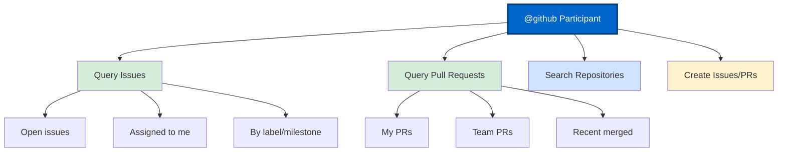
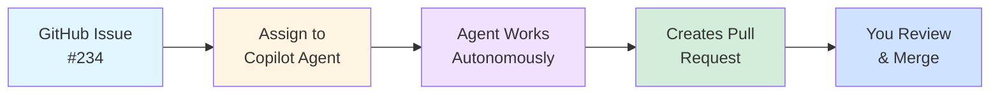
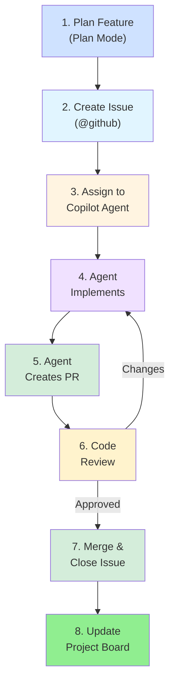

# Section 2: GitHub Issues and Projects Integration

**Connect Copilot with GitHub's project management capabilities**

---

## 📋 Overview

GitHub Copilot can seamlessly integrate with GitHub Issues and Projects, enabling powerful project management workflows. This section explores how to use Copilot to manage issues, create pull requests, query project data, and automate project tracking—all from within VS Code.

**What you'll learn:**
- Using `@github` participant in Copilot Chat
- Querying issues and pull requests from VS Code
- Creating issues and PRs with Copilot
- Assigning issues to Copilot agent for autonomous work
- Integrating with GitHub Projects for tracking
- Automating issue-driven development workflows

**Time to complete:** 1-2 hours

---

## 🎯 The `@github` Participant

The `@github` participant in Copilot Chat provides direct access to GitHub's issue tracking and project management features.

### Available Commands



---

## 🚀 Quick Start Examples

### Example 1: Query Your Open Issues

```plaintext
@github What are all of the open issues assigned to me?
```

**Response:**
```
You have 5 open issues assigned to you:

1. #234: Add user authentication to API
   Labels: enhancement, backend
   Milestone: Q1 2025
   
2. #189: Fix memory leak in data processing
   Labels: bug, priority:high
   
3. #156: Improve test coverage for auth module
   Labels: testing
   
...
```

---

### Example 2: Query Pull Requests

```plaintext
@github Show me the recent merged PRs from @dancing-mona
```

**Response:**
```
Recent merged PRs from @dancing-mona:

1. PR #401: Refactor authentication middleware
   Merged: 2 days ago
   +156 -89 lines changed
   
2. PR #389: Add rate limiting to API endpoints
   Merged: 1 week ago
   +234 -12 lines changed
   
...
```

---

### Example 3: Search for Issues by Label

```plaintext
@github Find all open issues with label "bug" and priority:high
```

**Response:**
```
Found 8 high-priority bug issues:

1. #290: Critical: User login fails on Safari
   Assignee: @john-dev
   Created: 3 days ago
   
2. #278: API returns 500 on invalid input
   Assignee: Unassigned
   Created: 1 week ago
   
...
```

---

## 🤖 Assigning Issues to Copilot Agent

GitHub Copilot can work on issues autonomously as the **Copilot coding agent**.

### How It Works



---

### Method 1: Via GitHub Web UI

1. **Navigate to issue:** `https://github.com/OWNER/REPO/issues/NUMBER`
2. **Click "Assignees"** → **"Assign Copilot agent"**
3. **Configure:**
   - Target repository
   - Base branch
   - Any special instructions
4. **Confirm assignment**

**Agent will:**
- Analyze the issue description
- Review relevant code
- Implement the requested changes
- Create a pull request
- Add description and test results

---

### Method 2: Via GitHub CLI

```bash
# Assign issue to Copilot agent
gh api \
  --method POST \
  -H "Accept: application/vnd.github+json" \
  -H "X-GitHub-Api-Version: 2022-11-28" \
  /repos/OWNER/REPO/issues/ISSUE_NUMBER/assignees \
  --input - <<< '{
  "assignees": ["copilot-swe-agent[bot]"],
  "agent_assignment": {
    "target_repo": "OWNER/REPO",
    "base_branch": "main",
    "instructions": "Follow test-driven development practices"
  }
}'
```

---

### Method 3: Via Copilot Chat

```plaintext
@github Assign issue #234 to Copilot agent to implement the authentication feature
```

---

## 📝 Creating Issues from Copilot Chat

### Example 1: Create Bug Report

**Prompt:**
```plaintext
@github Create an issue titled "Fix memory leak in data processor" with the following details:

When processing large datasets (>10GB), the application consumes increasing memory and eventually crashes.

Steps to reproduce:
1. Load dataset with 15GB of data
2. Run data processor
3. Monitor memory usage
4. Observe crash after ~30 minutes

Expected: Memory should stabilize
Actual: Memory continuously increases until crash

Label: bug, priority:high
Assign: @john-dev
```

**Copilot will:**
- Create the issue with formatted description
- Add specified labels
- Assign to user
- Link related code if detected in conversation

---

### Example 2: Create Feature Request

**Prompt:**
```plaintext
@github Create a feature request for OAuth2 social login support:

Add support for social login providers:
- Google OAuth2
- GitHub OAuth2
- Facebook OAuth2

Acceptance criteria:
- Users can sign in with any provider
- Profile data synced on first login
- Existing accounts can link social providers
- Security best practices followed

Label: enhancement, good first issue
Milestone: Q1 2025
```

---

## 🔗 Creating Pull Requests

### From Issue Description

**Workflow:**

1. **Ask Copilot to implement:**
```plaintext
@workspace Implement the OAuth2 authentication feature described in issue #234
```

2. **Copilot will:**
   - Analyze the issue
   - Create implementation plan
   - Write code across multiple files
   - Generate tests

3. **Create PR:**
```plaintext
@github Create a PR for issue #234 with the changes I just made
```

4. **Copilot generates:**
   - PR title from issue
   - Description with implementation details
   - Checklist of changes
   - Links to issue
   - Test results

---

### Example PR Description Generated by Copilot

````markdown
# Fix memory leak in data processor

Closes #234

## Changes
- Implemented batch processing to limit memory usage
- Added memory monitoring and cleanup
- Refactored data loader to use streaming
- Added tests for large dataset processing

## Testing
- ✅ Tested with 15GB dataset - no memory leak
- ✅ Performance improved by 40%
- ✅ All existing tests pass
- ✅ New integration tests added

## Checklist
- [x] Code follows project style guide
- [x] Tests added/updated
- [x] Documentation updated
- [x] No breaking changes
````

---

## 📊 GitHub Projects Integration

GitHub Projects (both classic and new) can be integrated with Copilot workflows.

### Query Project Status

```plaintext
@github What's the status of items in project "Q1 Sprint" assigned to me?
```

**Response:**
```
Q1 Sprint - Your Items:

📋 To Do (2 items):
- Issue #234: OAuth2 implementation
- Issue #189: Fix memory leak

🚧 In Progress (1 item):
- Issue #156: Test coverage improvement
  Status: 60% complete

✅ Done (3 items):
- PR #401: Refactor auth middleware (merged)
- PR #389: Rate limiting (merged)
- Issue #145: Documentation update (closed)
```

---

### Update Project Fields

```plaintext
@github Update issue #234 in project "Q1 Sprint":
- Status: In Progress
- Priority: High
- Estimated effort: 5 days
```

---

### Automated Project Updates

**GitHub Actions Workflow:** `.github/workflows/update-projects.yml`

```yaml
name: Update Project on PR

on:
  pull_request:
    types: [opened, closed]

jobs:
  update-project:
    runs-on: ubuntu-latest
    steps:
      - name: Update project status
        uses: actions/github-script@v7
        with:
          script: |
            const issue_number = context.payload.pull_request.number;
            
            // Get linked issues
            const { data: timeline } = await github.rest.issues.listEventsForTimeline({
              owner: context.repo.owner,
              repo: context.repo.repo,
              issue_number: issue_number,
            });
            
            // Update project cards for linked issues
            const linkedIssues = timeline
              .filter(event => event.event === 'cross-referenced')
              .map(event => event.source.issue.number);
            
            for (const issueNum of linkedIssues) {
              // Update project status
              await github.graphql(`
                mutation {
                  updateProjectV2ItemFieldValue(input: {
                    projectId: "${process.env.PROJECT_ID}"
                    itemId: "${issueNum}"
                    fieldId: "${process.env.STATUS_FIELD_ID}"
                    value: { 
                      singleSelectOptionId: "${context.payload.action === 'opened' ? process.env.IN_PROGRESS_ID : process.env.DONE_ID}"
                    }
                  }) {
                    projectV2Item {
                      id
                    }
                  }
                }
              `);
            }
```

---

## 🔍 Advanced Issue Queries

### Complex Queries with Filters

```plaintext
@github Find all issues in the current repository that:
- Are open
- Have label "enhancement" OR "feature"
- Were created in the last 30 days
- Are not assigned to anyone
- Have no linked pull requests

Sort by reactions (👍) descending
```

---

### Cross-Repository Queries

```plaintext
@github Search all repositories in the organization for open security vulnerabilities
```

---

### Milestone Progress

```plaintext
@github Show progress for milestone "Q1 2025" - how many issues are complete vs remaining?
```

**Response:**
```
Milestone: Q1 2025
Progress: 12/20 issues complete (60%)

✅ Completed (12):
- #234: OAuth2 implementation
- #189: Fix memory leak
...

🚧 In Progress (5):
- #156: Test coverage
- #201: API refactoring
...

📋 Not Started (3):
- #298: Performance optimization
- #305: Mobile UI updates
...
```

---

## 🛠️ MCP Server for Advanced GitHub Integration

For more advanced automation, build a custom MCP server.

### Example: GitHub MCP Server

**Configuration:** `.vscode/mcp.json`

```json
{
  "servers": {
    "github-mcp": {
      "type": "stdio",
      "command": "node",
      "args": ["./mcp-servers/github-server.js"],
      "env": {
        "GITHUB_TOKEN": "${env:GITHUB_TOKEN}"
      }
    }
  }
}
```

---

**Server Implementation:** `mcp-servers/github-server.js`

```javascript
const { MCPServer } = require('@modelcontextprotocol/sdk');
const { Octokit } = require('@octokit/rest');

const server = new MCPServer({
  name: 'github-mcp',
  version: '1.0.0'
});

const octokit = new Octokit({
  auth: process.env.GITHUB_TOKEN
});

// Tool: Create Issue
server.addTool({
  name: 'create_issue',
  description: 'Create a new GitHub issue',
  parameters: {
    type: 'object',
    properties: {
      owner: { type: 'string', description: 'Repository owner' },
      repo: { type: 'string', description: 'Repository name' },
      title: { type: 'string', description: 'Issue title' },
      body: { type: 'string', description: 'Issue description' },
      labels: { 
        type: 'array', 
        items: { type: 'string' },
        description: 'Issue labels'
      },
      assignees: {
        type: 'array',
        items: { type: 'string' },
        description: 'Assignees'
      }
    },
    required: ['owner', 'repo', 'title', 'body']
  },
  handler: async (params) => {
    const { owner, repo, title, body, labels, assignees } = params;
    
    const { data } = await octokit.rest.issues.create({
      owner,
      repo,
      title,
      body,
      labels: labels || [],
      assignees: assignees || []
    });
    
    return {
      content: [
        {
          type: 'text',
          text: `Created issue #${data.number}: ${data.html_url}`
        }
      ]
    };
  }
});

// Tool: Get Issue
server.addTool({
  name: 'get_issue',
  description: 'Get details of a GitHub issue',
  parameters: {
    type: 'object',
    properties: {
      owner: { type: 'string' },
      repo: { type: 'string' },
      issue_number: { type: 'number' }
    },
    required: ['owner', 'repo', 'issue_number']
  },
  handler: async (params) => {
    const { owner, repo, issue_number } = params;
    
    const { data } = await octokit.rest.issues.get({
      owner,
      repo,
      issue_number
    });
    
    return {
      content: [
        {
          type: 'text',
          text: JSON.stringify({
            number: data.number,
            title: data.title,
            state: data.state,
            body: data.body,
            labels: data.labels.map(l => l.name),
            assignees: data.assignees.map(a => a.login),
            created_at: data.created_at,
            updated_at: data.updated_at
          }, null, 2)
        }
      ]
    };
  }
});

// Tool: List Issues
server.addTool({
  name: 'list_issues',
  description: 'List GitHub issues with filters',
  parameters: {
    type: 'object',
    properties: {
      owner: { type: 'string' },
      repo: { type: 'string' },
      state: { 
        type: 'string', 
        enum: ['open', 'closed', 'all'],
        default: 'open'
      },
      labels: { type: 'string', description: 'Comma-separated labels' },
      assignee: { type: 'string' },
      sort: { 
        type: 'string',
        enum: ['created', 'updated', 'comments'],
        default: 'created'
      }
    },
    required: ['owner', 'repo']
  },
  handler: async (params) => {
    const { owner, repo, state, labels, assignee, sort } = params;
    
    const { data } = await octokit.rest.issues.listForRepo({
      owner,
      repo,
      state: state || 'open',
      labels: labels || undefined,
      assignee: assignee || undefined,
      sort: sort || 'created',
      per_page: 30
    });
    
    const issueList = data.map(issue => 
      `#${issue.number}: ${issue.title} (${issue.state})`
    ).join('\n');
    
    return {
      content: [
        {
          type: 'text',
          text: `Found ${data.length} issues:\n\n${issueList}`
        }
      ]
    };
  }
});

// Tool: Create Pull Request
server.addTool({
  name: 'create_pull_request',
  description: 'Create a new pull request',
  parameters: {
    type: 'object',
    properties: {
      owner: { type: 'string' },
      repo: { type: 'string' },
      title: { type: 'string' },
      head: { type: 'string', description: 'Source branch' },
      base: { type: 'string', description: 'Target branch' },
      body: { type: 'string', description: 'PR description' }
    },
    required: ['owner', 'repo', 'title', 'head', 'base']
  },
  handler: async (params) => {
    const { owner, repo, title, head, base, body } = params;
    
    const { data } = await octokit.rest.pulls.create({
      owner,
      repo,
      title,
      head,
      base,
      body: body || ''
    });
    
    return {
      content: [
        {
          type: 'text',
          text: `Created PR #${data.number}: ${data.html_url}`
        }
      ]
    };
  }
});

server.start();
```

---

### Using the MCP Server

```plaintext
@workspace Using the github-mcp server, create an issue in my repository:
- Title: "Add dark mode support"
- Description: "Implement dark mode theme with user preference storage"
- Labels: enhancement, ui
- Assign to: @me
```

---

## 📈 Issue-Driven Development Workflow

### Complete Workflow Example



---

### Step-by-Step

**1. Plan Feature (Plan Mode)**
```plaintext
Switch to Plan mode in Copilot Chat

"Plan implementation of user authentication with OAuth2 providers (Google, GitHub). Include architecture, security considerations, and testing strategy."
```

**2. Create Issue**
```plaintext
@github Create an issue from this implementation plan with:
- Title: "Implement OAuth2 authentication"
- Milestone: Q1 2025
- Labels: enhancement, backend, security
- Estimate: 5 days
```

**3. Assign to Agent**
```plaintext
@github Assign issue #234 to Copilot agent
```

**4-5. Agent Works & Creates PR**
- Copilot agent analyzes requirements
- Implements across multiple files
- Writes tests
- Creates pull request
- Links back to issue

**6. Review**
```plaintext
@github Review PR #456 for:
- Code quality
- Security best practices
- Test coverage
- Performance implications
```

**7. Merge**
```bash
gh pr merge 456 --squash
```

**8. Update Project**
- Automatic via GitHub Actions
- Issue moves to "Done"
- Metrics updated

---

## 🎯 Best Practices

### Issue Creation
- ✅ Use clear, descriptive titles
- ✅ Include acceptance criteria
- ✅ Add relevant labels immediately
- ✅ Link related issues/PRs
- ✅ Provide context and examples

### Working with Copilot Agent
- ✅ Write detailed issue descriptions
- ✅ Include code examples in issues
- ✅ Specify testing requirements
- ✅ Review agent PRs thoroughly
- ✅ Provide clear feedback for iterations

### Project Management
- ✅ Keep project boards up-to-date
- ✅ Use automation rules
- ✅ Review and triage regularly
- ✅ Track velocity and completion rates
- ✅ Document decisions in issues

---

## 🔧 Automation Scripts

### Script: Bulk Issue Creation

```javascript
// scripts/create-issues-from-todos.js
const { Octokit } = require('@octokit/rest');
const fs = require('fs');

const octokit = new Octokit({ auth: process.env.GITHUB_TOKEN });

// Parse TODO comments from codebase
const todos = [
  {
    file: 'src/auth.ts',
    line: 45,
    todo: 'TODO: Implement rate limiting',
    label: 'enhancement'
  },
  // ... more todos
];

async function createIssuesFromTodos() {
  for (const todo of todos) {
    const { data } = await octokit.rest.issues.create({
      owner: 'your-org',
      repo: 'your-repo',
      title: todo.todo.replace('TODO: ', ''),
      body: `Found in ${todo.file}:${todo.line}\n\n\`\`\`\nContext from code\n\`\`\``,
      labels: [todo.label, 'tech-debt']
    });
    
    console.log(`Created issue #${data.number}`);
  }
}

createIssuesFromTodos();
```

---

### Script: Close Stale Issues

```javascript
// scripts/close-stale-issues.js
const { Octokit } = require('@octokit/rest');

const octokit = new Octokit({ auth: process.env.GITHUB_TOKEN });

async function closeStaleIssues() {
  const sixtyDaysAgo = new Date();
  sixtyDaysAgo.setDate(sixtyDaysAgo.getDate() - 60);
  
  const { data: issues } = await octokit.rest.issues.listForRepo({
    owner: 'your-org',
    repo: 'your-repo',
    state: 'open',
    labels: 'stale',
    sort: 'updated',
    direction: 'asc'
  });
  
  for (const issue of issues) {
    const updatedAt = new Date(issue.updated_at);
    
    if (updatedAt < sixtyDaysAgo) {
      await octokit.rest.issues.update({
        owner: 'your-org',
        repo: 'your-repo',
        issue_number: issue.number,
        state: 'closed',
        state_reason: 'not_planned'
      });
      
      await octokit.rest.issues.createComment({
        owner: 'your-org',
        repo: 'your-repo',
        issue_number: issue.number,
        body: 'Closing due to inactivity. Feel free to reopen if still relevant.'
      });
      
      console.log(`Closed issue #${issue.number}`);
    }
  }
}

closeStaleIssues();
```

---

## 📊 Analytics and Reporting

### Issue Metrics Script

```javascript
// scripts/issue-metrics.js
const { Octokit } = require('@octokit/rest');

const octokit = new Octokit({ auth: process.env.GITHUB_TOKEN });

async function getIssueMetrics() {
  const { data: issues } = await octokit.rest.issues.listForRepo({
    owner: 'your-org',
    repo: 'your-repo',
    state: 'all',
    since: new Date(Date.now() - 30 * 24 * 60 * 60 * 1000).toISOString()
  });
  
  const metrics = {
    total: issues.length,
    open: issues.filter(i => i.state === 'open').length,
    closed: issues.filter(i => i.state === 'closed').length,
    avgTimeToClose: 0,
    byLabel: {}
  };
  
  // Calculate average time to close
  const closedIssues = issues.filter(i => i.state === 'closed');
  if (closedIssues.length > 0) {
    const totalTime = closedIssues.reduce((sum, issue) => {
      const created = new Date(issue.created_at);
      const closed = new Date(issue.closed_at);
      return sum + (closed - created);
    }, 0);
    
    metrics.avgTimeToClose = Math.round(
      totalTime / closedIssues.length / (1000 * 60 * 60 * 24)
    ); // days
  }
  
  // Count by label
  issues.forEach(issue => {
    issue.labels.forEach(label => {
      const name = label.name;
      metrics.byLabel[name] = (metrics.byLabel[name] || 0) + 1;
    });
  });
  
  console.log('Issue Metrics (Last 30 Days)');
  console.log('============================');
  console.log(`Total Issues: ${metrics.total}`);
  console.log(`Open: ${metrics.open}`);
  console.log(`Closed: ${metrics.closed}`);
  console.log(`Avg Time to Close: ${metrics.avgTimeToClose} days`);
  console.log('\nBy Label:');
  Object.entries(metrics.byLabel)
    .sort((a, b) => b[1] - a[1])
    .forEach(([label, count]) => {
      console.log(`  ${label}: ${count}`);
    });
}

getIssueMetrics();
```

---

## 📚 Additional Resources

### Official Documentation
- [GitHub Issues Documentation](https://docs.github.com/en/issues)
- [GitHub Projects Documentation](https://docs.github.com/en/issues/planning-and-tracking-with-projects)
- [GitHub REST API](https://docs.github.com/en/rest)
- [Copilot Agent Documentation](https://docs.github.com/en/copilot/using-github-copilot/using-github-copilot-agent)

### Community Resources
- [GitHub Community Forum](https://github.community)
- [Copilot Discussions](https://github.com/orgs/community/discussions/categories/copilot)

---

## ✅ Checklist: Issues & Projects Integration

- [ ] Understand `@github` participant commands
- [ ] Can query issues and PRs from Copilot Chat
- [ ] Can create issues with proper formatting
- [ ] Know how to assign issues to Copilot agent
- [ ] Can create PRs that link to issues
- [ ] Set up GitHub Projects integration
- [ ] Implemented automation workflows
- [ ] Created issue metrics dashboard
- [ ] Documented team workflows

---

## 🎓 Practice Exercises

### Exercise 1: Query and Organize Issues
**Goal:** Master issue queries with `@github`  
**Time:** 15 minutes

1. Query all open issues assigned to you
2. Find high-priority bugs
3. Check milestone progress
4. Identify issues without assignees

---

### Exercise 2: Copilot Agent Workflow
**Goal:** Complete issue-to-merge workflow with Copilot agent  
**Time:** 1 hour

1. Create a feature request issue
2. Assign to Copilot agent
3. Monitor agent progress
4. Review generated PR
5. Provide feedback or merge

---

### Exercise 3: Build Automation
**Goal:** Create issue automation scripts  
**Time:** 1 hour

1. Write script to create issues from TODOs
2. Implement stale issue detection
3. Build issue metrics dashboard
4. Share results with team

---

**Next:** [Section 3: Jira Integration via MCP](03-jira-integration-mcp.md)

---

**Last Updated:** December 2025  
**Version:** 1.0

