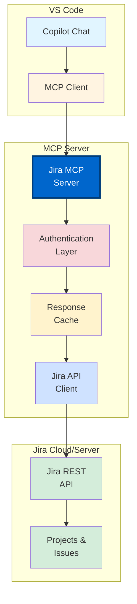

# Section 3: Jira Integration via MCP

**Connect GitHub Copilot with Jira for enterprise project management**

---

## 📋 Overview

Jira is the de facto standard for enterprise project management. By building a Model Context Protocol (MCP) server, you can integrate Jira directly into GitHub Copilot Chat, enabling developers to create issues, query project status, and update tickets without leaving VS Code.

**What you'll learn:**
- MCP server architecture for Jira integration
- Implementing Jira REST API client
- Authentication strategies (API tokens, OAuth2)
- Building tools for create, read, update operations
- Handling Jira-specific data models
- Performance optimization and caching
- Security best practices

**Time to complete:** 2-3 hours

---

## 🎯 Architecture Overview



---

## 🚀 Quick Start

### Prerequisites

1. **Jira Account:** Cloud or Server instance
2. **API Token:** Generate from Jira settings
3. **Node.js:** v18.0.0 or higher
4. **MCP SDK:** `@modelcontextprotocol/sdk`

---

### Step 1: Project Setup

```bash
# Create MCP server directory
mkdir mcp-jira-server
cd mcp-jira-server

# Initialize project
npm init -y

# Install dependencies
npm install @modelcontextprotocol/sdk
npm install axios
npm install dotenv
```

---

### Step 2: Basic Server Structure

**File:** `src/index.js`

```javascript
#!/usr/bin/env node
import { MCPServer } from '@modelcontextprotocol/sdk';
import axios from 'axios';
import dotenv from 'dotenv';

dotenv.config();

// Jira configuration
const JIRA_BASE_URL = process.env.JIRA_BASE_URL; // e.g., https://yourcompany.atlassian.net
const JIRA_EMAIL = process.env.JIRA_EMAIL;
const JIRA_API_TOKEN = process.env.JIRA_API_TOKEN;

// Create Jira API client
const jiraClient = axios.create({
  baseURL: `${JIRA_BASE_URL}/rest/api/3`,
  auth: {
    username: JIRA_EMAIL,
    password: JIRA_API_TOKEN
  },
  headers: {
    'Accept': 'application/json',
    'Content-Type': 'application/json'
  }
});

// Initialize MCP server
const server = new MCPServer({
  name: 'jira-mcp',
  version: '1.0.0',
  description: 'Jira integration for GitHub Copilot'
});

// Add tools (we'll implement these next)
// ...

// Start server
server.start({
  transportType: 'stdio'
});

console.error('Jira MCP server started');
```

---

### Step 3: Environment Configuration

**File:** `.env`

```env
# Jira Configuration
JIRA_BASE_URL=https://yourcompany.atlassian.net
JIRA_EMAIL=your-email@company.com
JIRA_API_TOKEN=your-api-token-here

# Optional: Default project
JIRA_DEFAULT_PROJECT=PROJ
```

**Generate API Token:**
1. Go to https://id.atlassian.com/manage-profile/security/api-tokens
2. Click "Create API token"
3. Copy and save in `.env` file

---

## 🛠️ Implementing Jira Tools

### Tool 1: Search Issues

```javascript
server.addTool({
  name: 'jira_search_issues',
  description: 'Search for Jira issues using JQL (Jira Query Language)',
  parameters: {
    type: 'object',
    properties: {
      jql: {
        type: 'string',
        description: 'JQL query string (e.g., "project = PROJ AND status = Open")'
      },
      maxResults: {
        type: 'number',
        description: 'Maximum number of results to return',
        default: 50
      },
      fields: {
        type: 'array',
        items: { type: 'string' },
        description: 'Fields to include in response',
        default: ['summary', 'status', 'assignee', 'priority', 'created']
      }
    },
    required: ['jql']
  },
  handler: async (params) => {
    try {
      const { jql, maxResults = 50, fields } = params;
      
      const response = await jiraClient.get('/search', {
        params: {
          jql,
          maxResults,
          fields: fields ? fields.join(',') : undefined
        }
      });
      
      const issues = response.data.issues.map(issue => ({
        key: issue.key,
        summary: issue.fields.summary,
        status: issue.fields.status.name,
        assignee: issue.fields.assignee?.displayName || 'Unassigned',
        priority: issue.fields.priority?.name || 'None',
        created: issue.fields.created,
        url: `${JIRA_BASE_URL}/browse/${issue.key}`
      }));
      
      return {
        content: [
          {
            type: 'text',
            text: JSON.stringify({
              total: response.data.total,
              count: issues.length,
              issues: issues
            }, null, 2)
          }
        ]
      };
    } catch (error) {
      return {
        content: [
          {
            type: 'text',
            text: `Error searching issues: ${error.message}`
          }
        ],
        isError: true
      };
    }
  }
});
```

---

### Tool 2: Get Issue Details

```javascript
server.addTool({
  name: 'jira_get_issue',
  description: 'Get detailed information about a specific Jira issue',
  parameters: {
    type: 'object',
    properties: {
      issueKey: {
        type: 'string',
        description: 'Issue key (e.g., PROJ-123)'
      }
    },
    required: ['issueKey']
  },
  handler: async (params) => {
    try {
      const { issueKey } = params;
      
      const response = await jiraClient.get(`/issue/${issueKey}`);
      const issue = response.data;
      
      const details = {
        key: issue.key,
        summary: issue.fields.summary,
        description: issue.fields.description,
        status: issue.fields.status.name,
        assignee: issue.fields.assignee?.displayName || 'Unassigned',
        reporter: issue.fields.reporter.displayName,
        priority: issue.fields.priority?.name || 'None',
        labels: issue.fields.labels,
        created: issue.fields.created,
        updated: issue.fields.updated,
        components: issue.fields.components.map(c => c.name),
        url: `${JIRA_BASE_URL}/browse/${issue.key}`
      };
      
      // Include comments if available
      if (issue.fields.comment && issue.fields.comment.comments.length > 0) {
        details.recentComments = issue.fields.comment.comments
          .slice(-3)
          .map(c => ({
            author: c.author.displayName,
            body: c.body,
            created: c.created
          }));
      }
      
      return {
        content: [
          {
            type: 'text',
            text: JSON.stringify(details, null, 2)
          }
        ]
      };
    } catch (error) {
      return {
        content: [
          {
            type: 'text',
            text: `Error fetching issue: ${error.message}`
          }
        ],
        isError: true
      };
    }
  }
});
```

---

### Tool 3: Create Issue

```javascript
server.addTool({
  name: 'jira_create_issue',
  description: 'Create a new Jira issue',
  parameters: {
    type: 'object',
    properties: {
      project: {
        type: 'string',
        description: 'Project key (e.g., PROJ)'
      },
      summary: {
        type: 'string',
        description: 'Issue summary/title'
      },
      description: {
        type: 'string',
        description: 'Issue description (supports Atlassian Document Format)'
      },
      issueType: {
        type: 'string',
        description: 'Issue type (e.g., Bug, Task, Story)',
        default: 'Task'
      },
      priority: {
        type: 'string',
        description: 'Priority (e.g., Highest, High, Medium, Low, Lowest)',
        default: 'Medium'
      },
      assignee: {
        type: 'string',
        description: 'Assignee account ID or email'
      },
      labels: {
        type: 'array',
        items: { type: 'string' },
        description: 'Issue labels'
      }
    },
    required: ['project', 'summary', 'description']
  },
  handler: async (params) => {
    try {
      const { 
        project, 
        summary, 
        description, 
        issueType = 'Task',
        priority = 'Medium',
        assignee,
        labels 
      } = params;
      
      // Get project details to find issue type ID
      const projectResponse = await jiraClient.get(`/project/${project}`);
      const issueTypes = projectResponse.data.issueTypes;
      const selectedIssueType = issueTypes.find(
        t => t.name.toLowerCase() === issueType.toLowerCase()
      ) || issueTypes[0];
      
      // Build issue data
      const issueData = {
        fields: {
          project: { key: project },
          summary: summary,
          description: {
            type: 'doc',
            version: 1,
            content: [
              {
                type: 'paragraph',
                content: [
                  {
                    type: 'text',
                    text: description
                  }
                ]
              }
            ]
          },
          issuetype: { id: selectedIssueType.id }
        }
      };
      
      // Add optional fields
      if (priority) {
        issueData.fields.priority = { name: priority };
      }
      
      if (assignee) {
        // Try to find user by email or account ID
        try {
          const userResponse = await jiraClient.get('/user/search', {
            params: { query: assignee }
          });
          if (userResponse.data.length > 0) {
            issueData.fields.assignee = { 
              accountId: userResponse.data[0].accountId 
            };
          }
        } catch (err) {
          console.error('Could not find assignee:', err.message);
        }
      }
      
      if (labels && labels.length > 0) {
        issueData.fields.labels = labels;
      }
      
      // Create issue
      const response = await jiraClient.post('/issue', issueData);
      
      const createdIssue = {
        key: response.data.key,
        id: response.data.id,
        url: `${JIRA_BASE_URL}/browse/${response.data.key}`
      };
      
      return {
        content: [
          {
            type: 'text',
            text: `Created issue ${createdIssue.key}\nURL: ${createdIssue.url}`
          }
        ]
      };
    } catch (error) {
      return {
        content: [
          {
            type: 'text',
            text: `Error creating issue: ${error.response?.data?.errors || error.message}`
          }
        ],
        isError: true
      };
    }
  }
});
```

---

### Tool 4: Update Issue

```javascript
server.addTool({
  name: 'jira_update_issue',
  description: 'Update an existing Jira issue',
  parameters: {
    type: 'object',
    properties: {
      issueKey: {
        type: 'string',
        description: 'Issue key (e.g., PROJ-123)'
      },
      fields: {
        type: 'object',
        description: 'Fields to update',
        properties: {
          summary: { type: 'string' },
          description: { type: 'string' },
          status: { type: 'string' },
          assignee: { type: 'string' },
          priority: { type: 'string' },
          labels: { 
            type: 'array',
            items: { type: 'string' }
          }
        }
      }
    },
    required: ['issueKey', 'fields']
  },
  handler: async (params) => {
    try {
      const { issueKey, fields } = params;
      
      const updateData = { fields: {} };
      
      // Map simple fields
      if (fields.summary) {
        updateData.fields.summary = fields.summary;
      }
      
      if (fields.description) {
        updateData.fields.description = {
          type: 'doc',
          version: 1,
          content: [
            {
              type: 'paragraph',
              content: [{ type: 'text', text: fields.description }]
            }
          ]
        };
      }
      
      if (fields.priority) {
        updateData.fields.priority = { name: fields.priority };
      }
      
      if (fields.labels) {
        updateData.fields.labels = fields.labels;
      }
      
      // Handle status transition separately
      if (fields.status) {
        const transitionsResponse = await jiraClient.get(
          `/issue/${issueKey}/transitions`
        );
        
        const transition = transitionsResponse.data.transitions.find(
          t => t.name.toLowerCase() === fields.status.toLowerCase()
        );
        
        if (transition) {
          await jiraClient.post(`/issue/${issueKey}/transitions`, {
            transition: { id: transition.id }
          });
        }
      }
      
      // Update other fields
      if (Object.keys(updateData.fields).length > 0) {
        await jiraClient.put(`/issue/${issueKey}`, updateData);
      }
      
      return {
        content: [
          {
            type: 'text',
            text: `Successfully updated ${issueKey}`
          }
        ]
      };
    } catch (error) {
      return {
        content: [
          {
            type: 'text',
            text: `Error updating issue: ${error.message}`
          }
        ],
        isError: true
      };
    }
  }
});
```

---

### Tool 5: Add Comment

```javascript
server.addTool({
  name: 'jira_add_comment',
  description: 'Add a comment to a Jira issue',
  parameters: {
    type: 'object',
    properties: {
      issueKey: {
        type: 'string',
        description: 'Issue key (e.g., PROJ-123)'
      },
      comment: {
        type: 'string',
        description: 'Comment text'
      }
    },
    required: ['issueKey', 'comment']
  },
  handler: async (params) => {
    try {
      const { issueKey, comment } = params;
      
      const commentData = {
        body: {
          type: 'doc',
          version: 1,
          content: [
            {
              type: 'paragraph',
              content: [
                {
                  type: 'text',
                  text: comment
                }
              ]
            }
          ]
        }
      };
      
      await jiraClient.post(`/issue/${issueKey}/comment`, commentData);
      
      return {
        content: [
          {
            type: 'text',
            text: `Added comment to ${issueKey}`
          }
        ]
      };
    } catch (error) {
      return {
        content: [
          {
            type: 'text',
            text: `Error adding comment: ${error.message}`
          }
        ],
        isError: true
      };
    }
  }
});
```

---

## ⚙️ VS Code Configuration

**File:** `.vscode/mcp.json`

```json
{
  "servers": {
    "jira": {
      "type": "stdio",
      "command": "node",
      "args": ["${workspaceFolder}/mcp-jira-server/src/index.js"],
      "env": {
        "JIRA_BASE_URL": "https://yourcompany.atlassian.net",
        "JIRA_EMAIL": "${env:JIRA_EMAIL}",
        "JIRA_API_TOKEN": "${env:JIRA_API_TOKEN}"
      }
    }
  }
}
```

**Alternative: Global Configuration**

**File:** `~/.cursor/mcp.json` or `~/.vscode/mcp.json`

```json
{
  "servers": {
    "jira": {
      "type": "stdio",
      "command": "npx",
      "args": ["-y", "@yourcompany/mcp-jira-server@latest"],
      "env": {
        "JIRA_BASE_URL": "https://yourcompany.atlassian.net",
        "JIRA_EMAIL": "${env:JIRA_EMAIL}",
        "JIRA_API_TOKEN": "${env:JIRA_API_TOKEN}"
      }
    }
  }
}
```

---

## 🎨 Usage Examples

### Example 1: Search My Open Issues

**In Copilot Chat:**

```plaintext
@workspace Using the Jira MCP server, search for all open issues assigned to me
```

**Copilot will:**
- Call `jira_search_issues` with JQL: `assignee = currentUser() AND status != Done`
- Display results with issue keys, summaries, and priorities

---

### Example 2: Create Bug from Code

**Workflow:**

```plaintext
I found a bug in the authentication code. Create a Jira issue:

Title: "Fix authentication token expiration handling"
Description:
- Current behavior: Tokens expire silently causing auth failures
- Expected: Refresh tokens automatically before expiration
- Impact: High - affects all users
Priority: High
Labels: bug, authentication, security
Assign to: john.doe@company.com
```

**Copilot will:**
- Extract relevant information
- Call `jira_create_issue` with appropriate parameters
- Return issue key and URL

---

### Example 3: Update Issue from PR

**When creating a PR:**

```plaintext
@workspace I've implemented the fix for PROJ-456. Update the Jira issue:
- Status: In Review
- Add comment: "PR #789 created with implementation. Includes unit tests and integration tests."
```

**Copilot will:**
- Call `jira_update_issue` to transition status
- Call `jira_add_comment` to add PR reference
- Confirm update

---

### Example 4: Sprint Planning Query

```plaintext
@workspace Show me all issues in project PROJ for the current sprint that are:
- Not assigned
- High or critical priority
- Type: Bug or Task

Format as a prioritized list for sprint planning.
```

---

## 🔒 Security Best Practices

### 1. Credential Management

✅ **Best Practices:**
- Store credentials in environment variables
- Use VS Code secrets API for tokens
- Never commit `.env` files
- Rotate API tokens regularly
- Use service accounts for automation

**Example: VS Code Secrets**

```javascript
import { window } from 'vscode';

// Store token
await window.showInputBox({
  prompt: 'Enter Jira API token',
  password: true
}).then(token => {
  context.secrets.store('jira-api-token', token);
});

// Retrieve token
const token = await context.secrets.get('jira-api-token');
```

---

### 2. Rate Limiting

Implement rate limiting to avoid hitting Jira API limits.

```javascript
import pLimit from 'p-limit';

// Limit concurrent requests
const limit = pLimit(5);

// Rate limiter
class RateLimiter {
  constructor(maxRequests, timeWindow) {
    this.maxRequests = maxRequests;
    this.timeWindow = timeWindow;
    this.requests = [];
  }
  
  async acquire() {
    const now = Date.now();
    this.requests = this.requests.filter(
      time => now - time < this.timeWindow
    );
    
    if (this.requests.length >= this.maxRequests) {
      const oldestRequest = Math.min(...this.requests);
      const waitTime = this.timeWindow - (now - oldestRequest);
      await new Promise(resolve => setTimeout(resolve, waitTime));
      return this.acquire();
    }
    
    this.requests.push(now);
  }
}

// Use in API client
const rateLimiter = new RateLimiter(100, 60000); // 100 requests per minute

jiraClient.interceptors.request.use(async (config) => {
  await rateLimiter.acquire();
  return config;
});
```

---

### 3. Input Validation

Always validate user inputs before making API calls.

```javascript
function validateIssueKey(key) {
  const pattern = /^[A-Z]+-\d+$/;
  if (!pattern.test(key)) {
    throw new Error('Invalid issue key format. Expected: PROJ-123');
  }
  return key;
}

function sanitizeJQL(jql) {
  // Remove potentially dangerous characters
  const dangerous = [';', '--', '/*', '*/'];
  for (const char of dangerous) {
    if (jql.includes(char)) {
      throw new Error('JQL contains potentially dangerous characters');
    }
  }
  return jql;
}
```

---

## ⚡ Performance Optimization

### 1. Response Caching

```javascript
import NodeCache from 'node-cache';

// Cache with 5-minute TTL
const cache = new NodeCache({ stdTTL: 300, checkperiod: 60 });

async function getCachedIssue(issueKey) {
  const cacheKey = `issue:${issueKey}`;
  
  // Check cache
  const cached = cache.get(cacheKey);
  if (cached) {
    return cached;
  }
  
  // Fetch from API
  const response = await jiraClient.get(`/issue/${issueKey}`);
  const issue = response.data;
  
  // Store in cache
  cache.set(cacheKey, issue);
  
  return issue;
}
```

---

### 2. Batch Requests

```javascript
async function getMultipleIssues(issueKeys) {
  // Batch into single JQL query
  const jql = `key in (${issueKeys.join(',')})`;
  
  const response = await jiraClient.get('/search', {
    params: { jql, maxResults: issueKeys.length }
  });
  
  return response.data.issues;
}
```

---

### 3. Field Selection

Only request fields you need:

```javascript
// ❌ Bad: Fetches all fields
await jiraClient.get('/issue/PROJ-123');

// ✅ Good: Only fetch needed fields
await jiraClient.get('/issue/PROJ-123', {
  params: {
    fields: 'summary,status,assignee,priority'
  }
});
```

---

## 🧪 Testing

### Unit Tests

```javascript
import { jest } from '@jest/globals';
import { MCPServer } from '@modelcontextprotocol/sdk';

describe('Jira MCP Server', () => {
  let server;
  let mockJiraClient;
  
  beforeEach(() => {
    mockJiraClient = {
      get: jest.fn(),
      post: jest.fn(),
      put: jest.fn()
    };
    
    server = new MCPServer({ name: 'test' });
  });
  
  test('jira_search_issues returns formatted results', async () => {
    mockJiraClient.get.mockResolvedValue({
      data: {
        total: 2,
        issues: [
          {
            key: 'PROJ-123',
            fields: {
              summary: 'Test issue',
              status: { name: 'Open' },
              assignee: { displayName: 'John Doe' },
              priority: { name: 'High' },
              created: '2025-01-01T00:00:00Z'
            }
          }
        ]
      }
    });
    
    const result = await searchIssues({
      jql: 'project = PROJ',
      maxResults: 50
    });
    
    expect(result.content[0].type).toBe('text');
    expect(JSON.parse(result.content[0].text).count).toBe(1);
  });
});
```

---

## 📊 Monitoring and Logging

```javascript
import winston from 'winston';

const logger = winston.createLogger({
  level: 'info',
  format: winston.format.json(),
  transports: [
    new winston.transports.File({ filename: 'error.log', level: 'error' }),
    new winston.transports.File({ filename: 'combined.log' })
  ]
});

// Log API calls
jiraClient.interceptors.request.use((config) => {
  logger.info('Jira API Request', {
    method: config.method,
    url: config.url,
    timestamp: new Date().toISOString()
  });
  return config;
});

// Log API responses
jiraClient.interceptors.response.use(
  (response) => {
    logger.info('Jira API Response', {
      status: response.status,
      url: response.config.url,
      duration: response.config.metadata.endTime - response.config.metadata.startTime
    });
    return response;
  },
  (error) => {
    logger.error('Jira API Error', {
      message: error.message,
      url: error.config?.url,
      status: error.response?.status
    });
    return Promise.reject(error);
  }
);
```

---

## 📦 Packaging and Distribution

### Create NPM Package

**File:** `package.json`

```json
{
  "name": "@yourcompany/mcp-jira-server",
  "version": "1.0.0",
  "description": "MCP server for Jira integration with GitHub Copilot",
  "main": "src/index.js",
  "type": "module",
  "bin": {
    "mcp-jira-server": "./src/index.js"
  },
  "scripts": {
    "start": "node src/index.js",
    "test": "jest"
  },
  "keywords": ["mcp", "jira", "copilot", "github"],
  "author": "Your Company",
  "license": "MIT",
  "dependencies": {
    "@modelcontextprotocol/sdk": "^1.0.0",
    "axios": "^1.6.0",
    "dotenv": "^16.0.0",
    "node-cache": "^5.1.0",
    "p-limit": "^5.0.0"
  },
  "devDependencies": {
    "@jest/globals": "^29.0.0",
    "jest": "^29.0.0"
  }
}
```

### Publish to NPM

```bash
# Login to NPM
npm login

# Publish package
npm publish --access public

# Install globally
npm install -g @yourcompany/mcp-jira-server
```

---

## 🎯 Best Practices

### MCP Server Development
- ✅ Implement comprehensive error handling
- ✅ Validate all inputs
- ✅ Cache frequently accessed data
- ✅ Log all operations for debugging
- ✅ Support both Jira Cloud and Server
- ✅ Provide clear tool descriptions
- ✅ Return structured, parseable responses

### Jira API Usage
- ✅ Use JQL for efficient queries
- ✅ Batch requests when possible
- ✅ Only fetch required fields
- ✅ Implement pagination for large results
- ✅ Handle API rate limits gracefully
- ✅ Use webhooks for real-time updates

### Security
- ✅ Never log sensitive data
- ✅ Use service accounts for automation
- ✅ Implement least-privilege access
- ✅ Rotate credentials regularly
- ✅ Validate all user inputs
- ✅ Use HTTPS for all connections

---

## 📚 Additional Resources

### Official Documentation
- [Jira REST API Documentation](https://developer.atlassian.com/cloud/jira/platform/rest/v3/)
- [Jira Query Language (JQL)](https://support.atlassian.com/jira-software-cloud/docs/use-advanced-search-with-jira-query-language-jql/)
- [Model Context Protocol Specification](https://modelcontextprotocol.io)

### Community Resources
- [Atlassian Community](https://community.atlassian.com/)
- [MCP Server Examples](https://github.com/modelcontextprotocol/servers)

---

## ✅ Checklist: Jira Integration

- [ ] Jira API token generated and secured
- [ ] MCP server project set up
- [ ] All core tools implemented (search, get, create, update, comment)
- [ ] Authentication configured
- [ ] Rate limiting implemented
- [ ] Caching configured
- [ ] Error handling comprehensive
- [ ] Logging enabled
- [ ] Tests written and passing
- [ ] Documentation complete
- [ ] Deployed to team
- [ ] Team trained on usage

---

## 🎓 Practice Exercises

### Exercise 1: Basic Integration
**Goal:** Set up and test Jira MCP server  
**Time:** 1 hour

1. Set up MCP server project
2. Implement search and get tools
3. Configure in VS Code
4. Test queries from Copilot Chat

---

### Exercise 2: Create Issue Workflow
**Goal:** Implement create and update tools  
**Time:** 1 hour

1. Add create_issue tool
2. Add update_issue tool
3. Test creating issues from Copilot
4. Test status transitions

---

### Exercise 3: Advanced Features
**Goal:** Add caching, rate limiting, and monitoring  
**Time:** 2 hours

1. Implement response caching
2. Add rate limiting
3. Set up logging
4. Add performance metrics
5. Document for team

---

**Next:** [Section 4: Custom API Integrations](04-custom-api-integrations.md)

---

**Last Updated:** December 2025  
**Version:** 1.0

