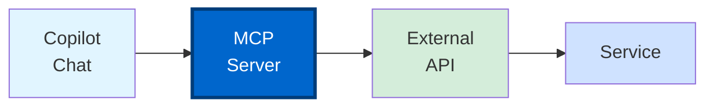
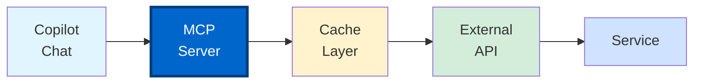
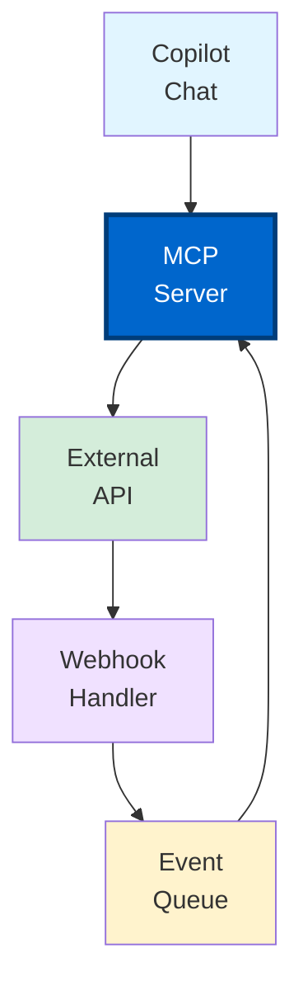

# Section 4: Custom API Integrations

**Build MCP servers to connect Copilot with any API**

---

## 📋 Overview

Beyond GitHub and Jira, your team likely uses many other tools and services. This section teaches you how to build custom MCP servers to integrate GitHub Copilot with any REST or GraphQL API, enabling a unified development experience within VS Code.

**What you'll learn:**
- MCP server patterns for API integration
- REST and GraphQL API integration strategies
- Authentication methods (API keys, OAuth2, JWT, Basic Auth)
- Rate limiting and error handling
- Webhook integration patterns
- Real-time data synchronization
- Testing and monitoring custom integrations
- Deployment strategies for teams

**Time to complete:** 2-3 hours

---

## 🎯 Integration Architecture Patterns

### Pattern 1: Direct API Integration



**Use when:** Simple, direct API calls with minimal processing

---

### Pattern 2: Cached Integration



**Use when:** API has rate limits or slow responses

---

### Pattern 3: Event-Driven Integration



**Use when:** Need real-time updates from external services

---

## 🚀 REST API Integration

### Example: Slack Integration

**File:** `mcp-slack-server/src/index.js`

```javascript
#!/usr/bin/env node
import { MCPServer } from '@modelcontextprotocol/sdk';
import axios from 'axios';
import dotenv from 'dotenv';

dotenv.config();

const SLACK_TOKEN = process.env.SLACK_BOT_TOKEN;

const slackClient = axios.create({
  baseURL: 'https://slack.com/api',
  headers: {
    'Authorization': `Bearer ${SLACK_TOKEN}`,
    'Content-Type': 'application/json'
  }
});

const server = new MCPServer({
  name: 'slack-mcp',
  version: '1.0.0',
  description: 'Slack integration for GitHub Copilot'
});

// Tool: Send Message
server.addTool({
  name: 'slack_send_message',
  description: 'Send a message to a Slack channel',
  parameters: {
    type: 'object',
    properties: {
      channel: {
        type: 'string',
        description: 'Channel ID or name (e.g., #general)'
      },
      text: {
        type: 'string',
        description: 'Message text (supports markdown)'
      },
      thread_ts: {
        type: 'string',
        description: 'Thread timestamp for threaded replies'
      }
    },
    required: ['channel', 'text']
  },
  handler: async (params) => {
    try {
      const { channel, text, thread_ts } = params;
      
      const response = await slackClient.post('/chat.postMessage', {
        channel: channel.startsWith('#') ? channel.substring(1) : channel,
        text,
        thread_ts
      });
      
      if (!response.data.ok) {
        throw new Error(response.data.error);
      }
      
      return {
        content: [
          {
            type: 'text',
            text: `Message sent to ${channel}\nTimestamp: ${response.data.ts}`
          }
        ]
      };
    } catch (error) {
      return {
        content: [
          {
            type: 'text',
            text: `Error sending message: ${error.message}`
          }
        ],
        isError: true
      };
    }
  }
});

// Tool: Get Channel History
server.addTool({
  name: 'slack_get_history',
  description: 'Get recent messages from a Slack channel',
  parameters: {
    type: 'object',
    properties: {
      channel: {
        type: 'string',
        description: 'Channel ID or name'
      },
      limit: {
        type: 'number',
        description: 'Number of messages to retrieve',
        default: 10
      }
    },
    required: ['channel']
  },
  handler: async (params) => {
    try {
      const { channel, limit = 10 } = params;
      
      // Get channel ID if name provided
      let channelId = channel;
      if (channel.startsWith('#')) {
        const channelsResponse = await slackClient.get('/conversations.list');
        const foundChannel = channelsResponse.data.channels.find(
          c => c.name === channel.substring(1)
        );
        channelId = foundChannel?.id || channel;
      }
      
      const response = await slackClient.get('/conversations.history', {
        params: { channel: channelId, limit }
      });
      
      if (!response.data.ok) {
        throw new Error(response.data.error);
      }
      
      const messages = response.data.messages.map(msg => ({
        text: msg.text,
        user: msg.user,
        timestamp: new Date(msg.ts * 1000).toISOString(),
        thread_ts: msg.thread_ts
      }));
      
      return {
        content: [
          {
            type: 'text',
            text: JSON.stringify(messages, null, 2)
          }
        ]
      };
    } catch (error) {
      return {
        content: [
          {
            type: 'text',
            text: `Error fetching history: ${error.message}`
          }
        ],
        isError: true
      };
    }
  }
});

// Tool: Search Messages
server.addTool({
  name: 'slack_search',
  description: 'Search for messages in Slack workspace',
  parameters: {
    type: 'object',
    properties: {
      query: {
        type: 'string',
        description: 'Search query'
      },
      sort: {
        type: 'string',
        enum: ['score', 'timestamp'],
        default: 'score'
      },
      count: {
        type: 'number',
        description: 'Number of results',
        default: 20
      }
    },
    required: ['query']
  },
  handler: async (params) => {
    try {
      const { query, sort = 'score', count = 20 } = params;
      
      const response = await slackClient.get('/search.messages', {
        params: { query, sort, count }
      });
      
      if (!response.data.ok) {
        throw new Error(response.data.error);
      }
      
      const results = response.data.messages.matches.map(match => ({
        text: match.text,
        channel: match.channel.name,
        user: match.username,
        timestamp: match.ts,
        permalink: match.permalink
      }));
      
      return {
        content: [
          {
            type: 'text',
            text: JSON.stringify({
              total: response.data.messages.total,
              results
            }, null, 2)
          }
        ]
      };
    } catch (error) {
      return {
        content: [
          {
            type: 'text',
            text: `Error searching: ${error.message}`
          }
        ],
        isError: true
      };
    }
  }
});

server.start({ transportType: 'stdio' });
```

---

## 🔐 Authentication Strategies

### Strategy 1: API Key Authentication

```javascript
// Simple API key in header
const apiClient = axios.create({
  baseURL: 'https://api.example.com',
  headers: {
    'X-API-Key': process.env.API_KEY
  }
});
```

---

### Strategy 2: Bearer Token Authentication

```javascript
// Bearer token (JWT or OAuth)
const apiClient = axios.create({
  baseURL: 'https://api.example.com',
  headers: {
    'Authorization': `Bearer ${process.env.ACCESS_TOKEN}`
  }
});
```

---

### Strategy 3: OAuth2 Flow

```javascript
import { AuthorizationCode } from 'simple-oauth2';

const oauth2Client = new AuthorizationCode({
  client: {
    id: process.env.CLIENT_ID,
    secret: process.env.CLIENT_SECRET
  },
  auth: {
    tokenHost: 'https://oauth.example.com',
    tokenPath: '/oauth/token',
    authorizePath: '/oauth/authorize'
  }
});

// Get authorization URL
const authorizationUri = oauth2Client.authorizeURL({
  redirect_uri: 'http://localhost:3000/callback',
  scope: 'read:data write:data',
  state: 'random-state-string'
});

// Exchange code for token
const tokenParams = {
  code: 'authorization-code-from-callback',
  redirect_uri: 'http://localhost:3000/callback'
};

const accessToken = await oauth2Client.getToken(tokenParams);

// Refresh token when expired
if (accessToken.expired()) {
  const refreshedToken = await accessToken.refresh();
}

// Use access token
const apiClient = axios.create({
  baseURL: 'https://api.example.com',
  headers: {
    'Authorization': `Bearer ${accessToken.token.access_token}`
  }
});
```

---

### Strategy 4: Basic Authentication

```javascript
// Basic auth with username and password
const apiClient = axios.create({
  baseURL: 'https://api.example.com',
  auth: {
    username: process.env.API_USERNAME,
    password: process.env.API_PASSWORD
  }
});
```

---

### Strategy 5: Custom Authentication

```javascript
// Custom auth header or signature
import crypto from 'crypto';

function generateSignature(method, url, timestamp, body) {
  const message = `${method}\n${url}\n${timestamp}\n${body}`;
  return crypto
    .createHmac('sha256', process.env.API_SECRET)
    .update(message)
    .digest('hex');
}

const apiClient = axios.create({
  baseURL: 'https://api.example.com'
});

apiClient.interceptors.request.use((config) => {
  const timestamp = Date.now();
  const signature = generateSignature(
    config.method,
    config.url,
    timestamp,
    JSON.stringify(config.data)
  );
  
  config.headers['X-Timestamp'] = timestamp;
  config.headers['X-Signature'] = signature;
  config.headers['X-API-Key'] = process.env.API_KEY;
  
  return config;
});
```

---

## ⚡ Rate Limiting Strategies

### Strategy 1: Token Bucket Algorithm

```javascript
class TokenBucket {
  constructor(capacity, refillRate) {
    this.capacity = capacity; // Max tokens
    this.tokens = capacity; // Current tokens
    this.refillRate = refillRate; // Tokens per second
    this.lastRefill = Date.now();
  }
  
  async consume(tokens = 1) {
    this.refill();
    
    if (this.tokens >= tokens) {
      this.tokens -= tokens;
      return true;
    }
    
    // Wait until enough tokens available
    const waitTime = ((tokens - this.tokens) / this.refillRate) * 1000;
    await new Promise(resolve => setTimeout(resolve, waitTime));
    
    this.refill();
    this.tokens -= tokens;
    return true;
  }
  
  refill() {
    const now = Date.now();
    const elapsed = (now - this.lastRefill) / 1000;
    const tokensToAdd = elapsed * this.refillRate;
    
    this.tokens = Math.min(this.capacity, this.tokens + tokensToAdd);
    this.lastRefill = now;
  }
}

// Usage
const rateLimiter = new TokenBucket(100, 10); // 100 capacity, 10/sec refill

apiClient.interceptors.request.use(async (config) => {
  await rateLimiter.consume(1);
  return config;
});
```

---

### Strategy 2: Sliding Window Rate Limiter

```javascript
class SlidingWindowRateLimiter {
  constructor(maxRequests, windowMs) {
    this.maxRequests = maxRequests;
    this.windowMs = windowMs;
    this.requests = [];
  }
  
  async acquire() {
    const now = Date.now();
    
    // Remove requests outside window
    this.requests = this.requests.filter(
      time => now - time < this.windowMs
    );
    
    if (this.requests.length < this.maxRequests) {
      this.requests.push(now);
      return true;
    }
    
    // Wait until oldest request expires
    const oldestRequest = Math.min(...this.requests);
    const waitTime = this.windowMs - (now - oldestRequest) + 10;
    
    await new Promise(resolve => setTimeout(resolve, waitTime));
    return this.acquire();
  }
}

// Usage: 100 requests per minute
const rateLimiter = new SlidingWindowRateLimiter(100, 60000);

apiClient.interceptors.request.use(async (config) => {
  await rateLimiter.acquire();
  return config;
});
```

---

### Strategy 3: Respect API Response Headers

```javascript
apiClient.interceptors.response.use(
  (response) => {
    // Read rate limit headers
    const remaining = parseInt(response.headers['x-ratelimit-remaining'] || '0');
    const reset = parseInt(response.headers['x-ratelimit-reset'] || '0');
    
    if (remaining === 0) {
      const waitTime = (reset * 1000) - Date.now();
      console.log(`Rate limit hit. Waiting ${waitTime}ms`);
      
      // Pause requests until reset
      return new Promise((resolve) => {
        setTimeout(() => resolve(response), waitTime);
      });
    }
    
    return response;
  },
  async (error) => {
    if (error.response?.status === 429) {
      // Too Many Requests
      const retryAfter = parseInt(
        error.response.headers['retry-after'] || '60'
      );
      
      console.log(`Rate limited. Retrying after ${retryAfter}s`);
      await new Promise(resolve => setTimeout(resolve, retryAfter * 1000));
      
      // Retry request
      return apiClient.request(error.config);
    }
    
    return Promise.reject(error);
  }
);
```

---

## 🔄 GraphQL API Integration

### Example: GitHub GraphQL API

```javascript
import { MCPServer } from '@modelcontextprotocol/sdk';
import { graphql } from '@octokit/graphql';

const graphqlClient = graphql.defaults({
  headers: {
    authorization: `bearer ${process.env.GITHUB_TOKEN}`
  }
});

const server = new MCPServer({
  name: 'github-graphql-mcp',
  version: '1.0.0'
});

// Tool: Get Repository Info
server.addTool({
  name: 'github_get_repo',
  description: 'Get repository information using GraphQL',
  parameters: {
    type: 'object',
    properties: {
      owner: { type: 'string' },
      name: { type: 'string' }
    },
    required: ['owner', 'name']
  },
  handler: async (params) => {
    try {
      const { owner, name } = params;
      
      const query = `
        query($owner: String!, $name: String!) {
          repository(owner: $owner, name: $name) {
            name
            description
            stargazerCount
            forkCount
            issues(states: OPEN) {
              totalCount
            }
            pullRequests(states: OPEN) {
              totalCount
            }
            primaryLanguage {
              name
            }
            languages(first: 5) {
              edges {
                size
                node {
                  name
                }
              }
            }
          }
        }
      `;
      
      const result = await graphqlClient(query, { owner, name });
      
      const repo = result.repository;
      const response = {
        name: repo.name,
        description: repo.description,
        stars: repo.stargazerCount,
        forks: repo.forkCount,
        openIssues: repo.issues.totalCount,
        openPRs: repo.pullRequests.totalCount,
        primaryLanguage: repo.primaryLanguage?.name,
        languages: repo.languages.edges.map(e => ({
          name: e.node.name,
          size: e.size
        }))
      };
      
      return {
        content: [
          {
            type: 'text',
            text: JSON.stringify(response, null, 2)
          }
        ]
      };
    } catch (error) {
      return {
        content: [
          {
            type: 'text',
            text: `Error fetching repository: ${error.message}`
          }
        ],
        isError: true
      };
    }
  }
});

// Tool: Search Repositories
server.addTool({
  name: 'github_search_repos',
  description: 'Search GitHub repositories',
  parameters: {
    type: 'object',
    properties: {
      query: {
        type: 'string',
        description: 'Search query (e.g., "language:javascript stars:>1000")'
      },
      first: {
        type: 'number',
        description: 'Number of results',
        default: 10
      }
    },
    required: ['query']
  },
  handler: async (params) => {
    try {
      const { query, first = 10 } = params;
      
      const gqlQuery = `
        query($query: String!, $first: Int!) {
          search(query: $query, type: REPOSITORY, first: $first) {
            repositoryCount
            edges {
              node {
                ... on Repository {
                  name
                  owner {
                    login
                  }
                  description
                  stargazerCount
                  primaryLanguage {
                    name
                  }
                  url
                }
              }
            }
          }
        }
      `;
      
      const result = await graphqlClient(gqlQuery, { query, first });
      
      const repositories = result.search.edges.map(edge => ({
        name: edge.node.name,
        owner: edge.node.owner.login,
        description: edge.node.description,
        stars: edge.node.stargazerCount,
        language: edge.node.primaryLanguage?.name,
        url: edge.node.url
      }));
      
      return {
        content: [
          {
            type: 'text',
            text: JSON.stringify({
              total: result.search.repositoryCount,
              results: repositories
            }, null, 2)
          }
        ]
      };
    } catch (error) {
      return {
        content: [
          {
            type: 'text',
            text: `Error searching repositories: ${error.message}`
          }
        ],
        isError: true
      };
    }
  }
});

server.start({ transportType: 'stdio' });
```

---

## 🪝 Webhook Integration

### Example: Incoming Webhooks

```javascript
import express from 'express';
import crypto from 'crypto';
import { EventEmitter } from 'events';

const app = express();
const webhookEvents = new EventEmitter();

app.use(express.json());

// Verify webhook signature
function verifySignature(payload, signature, secret) {
  const hash = crypto
    .createHmac('sha256', secret)
    .update(JSON.stringify(payload))
    .digest('hex');
  
  return crypto.timingSafeEqual(
    Buffer.from(signature),
    Buffer.from(hash)
  );
}

// Webhook endpoint
app.post('/webhooks/:service', (req, res) => {
  const { service } = req.params;
  const signature = req.headers['x-signature'];
  const secret = process.env[`${service.toUpperCase()}_WEBHOOK_SECRET`];
  
  // Verify signature
  if (secret && !verifySignature(req.body, signature, secret)) {
    return res.status(401).json({ error: 'Invalid signature' });
  }
  
  // Emit event
  webhookEvents.emit(service, req.body);
  
  res.status(200).json({ received: true });
});

// Start webhook server
app.listen(3000, () => {
  console.log('Webhook server listening on port 3000');
});

// Subscribe to webhook events in MCP server
webhookEvents.on('github', (data) => {
  console.log('GitHub webhook received:', data);
  // Process GitHub webhook
});

webhookEvents.on('jira', (data) => {
  console.log('Jira webhook received:', data);
  // Process Jira webhook
});
```

---

## 📦 Advanced Patterns

### Pattern 1: Request Retry with Exponential Backoff

```javascript
async function retryWithBackoff(fn, maxRetries = 3, baseDelay = 1000) {
  for (let attempt = 0; attempt <= maxRetries; attempt++) {
    try {
      return await fn();
    } catch (error) {
      if (attempt === maxRetries) {
        throw error;
      }
      
      // Exponential backoff: 1s, 2s, 4s, 8s...
      const delay = baseDelay * Math.pow(2, attempt);
      const jitter = Math.random() * 1000; // Add jitter
      
      console.log(`Retry ${attempt + 1}/${maxRetries} after ${delay}ms`);
      await new Promise(resolve => setTimeout(resolve, delay + jitter));
    }
  }
}

// Usage
apiClient.interceptors.response.use(
  response => response,
  async (error) => {
    const config = error.config;
    
    // Retry on network errors or 5xx status codes
    if (!config.__retryCount) {
      config.__retryCount = 0;
    }
    
    if (
      config.__retryCount < 3 &&
      (error.code === 'ECONNRESET' || 
       (error.response && error.response.status >= 500))
    ) {
      config.__retryCount++;
      
      const delay = 1000 * Math.pow(2, config.__retryCount);
      await new Promise(resolve => setTimeout(resolve, delay));
      
      return apiClient.request(config);
    }
    
    return Promise.reject(error);
  }
);
```

---

### Pattern 2: Request Deduplication

```javascript
class RequestDeduplicator {
  constructor() {
    this.pending = new Map();
  }
  
  async deduplicate(key, fn) {
    // If request already pending, return existing promise
    if (this.pending.has(key)) {
      return this.pending.get(key);
    }
    
    // Execute new request
    const promise = fn().finally(() => {
      this.pending.delete(key);
    });
    
    this.pending.set(key, promise);
    return promise;
  }
}

const deduplicator = new RequestDeduplicator();

// Usage in MCP tool
server.addTool({
  name: 'get_data',
  handler: async (params) => {
    const key = `get_data:${params.id}`;
    
    return deduplicator.deduplicate(key, async () => {
      const response = await apiClient.get(`/data/${params.id}`);
      return {
        content: [
          {
            type: 'text',
            text: JSON.stringify(response.data)
          }
        ]
      };
    });
  }
});
```

---

### Pattern 3: Response Streaming

```javascript
import { Readable } from 'stream';

server.addTool({
  name: 'stream_large_dataset',
  description: 'Stream large dataset from API',
  parameters: {
    type: 'object',
    properties: {
      datasetId: { type: 'string' }
    },
    required: ['datasetId']
  },
  handler: async (params) => {
    try {
      const { datasetId } = params;
      
      // Create readable stream
      const stream = new Readable({
        async read() {
          // Fetch data in chunks
          let page = 1;
          let hasMore = true;
          
          while (hasMore) {
            const response = await apiClient.get(`/datasets/${datasetId}`, {
              params: { page, per_page: 100 }
            });
            
            const chunk = JSON.stringify(response.data.items) + '\n';
            this.push(chunk);
            
            hasMore = response.data.has_more;
            page++;
          }
          
          this.push(null); // End stream
        }
      });
      
      return {
        content: [
          {
            type: 'resource',
            resource: {
              uri: `stream://${datasetId}`,
              mimeType: 'application/x-ndjson',
              text: stream
            }
          }
        ]
      };
    } catch (error) {
      return {
        content: [
          {
            type: 'text',
            text: `Error streaming data: ${error.message}`
          }
        ],
        isError: true
      };
    }
  }
});
```

---

## 🧪 Testing Custom Integrations

### Unit Tests

```javascript
import { jest } from '@jest/globals';
import axios from 'axios';

jest.mock('axios');

describe('Custom API Integration', () => {
  beforeEach(() => {
    jest.clearAllMocks();
  });
  
  test('successful API call returns formatted data', async () => {
    const mockData = {
      id: 1,
      name: 'Test Item',
      status: 'active'
    };
    
    axios.create.mockReturnValue({
      get: jest.fn().mockResolvedValue({ data: mockData })
    });
    
    const result = await fetchData({ id: 1 });
    
    expect(result).toEqual(mockData);
  });
  
  test('rate limiting delays requests', async () => {
    const rateLimiter = new TokenBucket(2, 1);
    
    const start = Date.now();
    
    await rateLimiter.consume(1);
    await rateLimiter.consume(1);
    await rateLimiter.consume(1); // Should wait
    
    const elapsed = Date.now() - start;
    
    expect(elapsed).toBeGreaterThan(900);
  });
  
  test('retry logic works on failure', async () => {
    const apiCall = jest.fn()
      .mockRejectedValueOnce(new Error('Network error'))
      .mockRejectedValueOnce(new Error('Network error'))
      .mockResolvedValueOnce({ data: 'success' });
    
    const result = await retryWithBackoff(apiCall, 3);
    
    expect(apiCall).toHaveBeenCalledTimes(3);
    expect(result.data).toBe('success');
  });
});
```

---

### Integration Tests

```javascript
import { MCPServer } from '@modelcontextprotocol/sdk';
import { startServer } from './index.js';

describe('MCP Server Integration', () => {
  let server;
  
  beforeAll(async () => {
    server = await startServer();
  });
  
  afterAll(async () => {
    await server.stop();
  });
  
  test('tool executes and returns valid response', async () => {
    const result = await server.executeTool('get_data', {
      id: 'test-123'
    });
    
    expect(result.content).toHaveLength(1);
    expect(result.content[0].type).toBe('text');
    expect(JSON.parse(result.content[0].text)).toHaveProperty('id');
  });
  
  test('authentication failure returns error', async () => {
    process.env.API_KEY = 'invalid';
    
    const result = await server.executeTool('get_data', {
      id: 'test-123'
    });
    
    expect(result.isError).toBe(true);
    expect(result.content[0].text).toContain('authentication');
  });
});
```

---

## 📊 Monitoring and Observability

### Metrics Collection

```javascript
class MetricsCollector {
  constructor() {
    this.metrics = {
      requests: 0,
      errors: 0,
      latencies: [],
      statusCodes: {}
    };
  }
  
  recordRequest(duration, statusCode, error = null) {
    this.metrics.requests++;
    
    if (error) {
      this.metrics.errors++;
    }
    
    this.metrics.latencies.push(duration);
    
    this.metrics.statusCodes[statusCode] = 
      (this.metrics.statusCodes[statusCode] || 0) + 1;
  }
  
  getStats() {
    const latencies = this.metrics.latencies.sort((a, b) => a - b);
    
    return {
      totalRequests: this.metrics.requests,
      errorRate: (this.metrics.errors / this.metrics.requests * 100).toFixed(2),
      avgLatency: (latencies.reduce((a, b) => a + b, 0) / latencies.length).toFixed(2),
      p50Latency: latencies[Math.floor(latencies.length * 0.5)],
      p95Latency: latencies[Math.floor(latencies.length * 0.95)],
      p99Latency: latencies[Math.floor(latencies.length * 0.99)],
      statusCodes: this.metrics.statusCodes
    };
  }
}

const metrics = new MetricsCollector();

// Track metrics in interceptor
apiClient.interceptors.request.use((config) => {
  config.metadata = { startTime: Date.now() };
  return config;
});

apiClient.interceptors.response.use(
  (response) => {
    const duration = Date.now() - response.config.metadata.startTime;
    metrics.recordRequest(duration, response.status);
    return response;
  },
  (error) => {
    const duration = Date.now() - error.config.metadata.startTime;
    metrics.recordRequest(duration, error.response?.status || 0, error);
    return Promise.reject(error);
  }
);

// Expose metrics endpoint
app.get('/metrics', (req, res) => {
  res.json(metrics.getStats());
});
```

---

## 📚 Example: Complete Datadog Integration

```javascript
#!/usr/bin/env node
import { MCPServer } from '@modelcontextprotocol/sdk';
import axios from 'axios';
import dotenv from 'dotenv';

dotenv.config();

const datadogClient = axios.create({
  baseURL: 'https://api.datadoghq.com/api/v1',
  headers: {
    'DD-API-KEY': process.env.DATADOG_API_KEY,
    'DD-APPLICATION-KEY': process.env.DATADOG_APP_KEY,
    'Content-Type': 'application/json'
  }
});

const server = new MCPServer({
  name: 'datadog-mcp',
  version: '1.0.0',
  description: 'Datadog monitoring integration'
});

// Tool: Query Metrics
server.addTool({
  name: 'datadog_query_metrics',
  description: 'Query metrics from Datadog',
  parameters: {
    type: 'object',
    properties: {
      query: {
        type: 'string',
        description: 'Metrics query (e.g., "avg:system.cpu.user{*}")'
      },
      from: {
        type: 'number',
        description: 'Unix timestamp for start'
      },
      to: {
        type: 'number',
        description: 'Unix timestamp for end'
      }
    },
    required: ['query', 'from', 'to']
  },
  handler: async (params) => {
    try {
      const { query, from, to } = params;
      
      const response = await datadogClient.get('/query', {
        params: { query, from, to }
      });
      
      const series = response.data.series.map(s => ({
        metric: s.metric,
        points: s.pointlist.map(([timestamp, value]) => ({
          timestamp: new Date(timestamp).toISOString(),
          value
        })),
        tags: s.tags
      }));
      
      return {
        content: [
          {
            type: 'text',
            text: JSON.stringify({ series }, null, 2)
          }
        ]
      };
    } catch (error) {
      return {
        content: [
          {
            type: 'text',
            text: `Error querying metrics: ${error.message}`
          }
        ],
        isError: true
      };
    }
  }
});

// Tool: Create Alert
server.addTool({
  name: 'datadog_create_alert',
  description: 'Create a new Datadog monitor/alert',
  parameters: {
    type: 'object',
    properties: {
      name: { type: 'string' },
      type: { 
        type: 'string',
        enum: ['metric alert', 'service check', 'event alert']
      },
      query: { type: 'string' },
      message: { type: 'string' },
      tags: {
        type: 'array',
        items: { type: 'string' }
      }
    },
    required: ['name', 'type', 'query', 'message']
  },
  handler: async (params) => {
    try {
      const { name, type, query, message, tags } = params;
      
      const response = await datadogClient.post('/monitor', {
        name,
        type,
        query,
        message,
        tags: tags || [],
        options: {
          notify_no_data: true,
          no_data_timeframe: 20
        }
      });
      
      return {
        content: [
          {
            type: 'text',
            text: `Created monitor ${response.data.id}: ${response.data.name}`
          }
        ]
      };
    } catch (error) {
      return {
        content: [
          {
            type: 'text',
            text: `Error creating monitor: ${error.message}`
          }
        ],
        isError: true
      };
    }
  }
});

server.start({ transportType: 'stdio' });
```

---

## ✅ Best Practices Checklist

### API Integration
- [ ] Implement proper authentication
- [ ] Handle rate limiting gracefully
- [ ] Add retry logic with exponential backoff
- [ ] Validate all inputs
- [ ] Parse and format API responses
- [ ] Log all API calls for debugging
- [ ] Cache responses when appropriate
- [ ] Handle pagination for large datasets

### Error Handling
- [ ] Catch and handle all errors
- [ ] Provide meaningful error messages
- [ ] Differentiate between client and server errors
- [ ] Implement circuit breaker pattern
- [ ] Log errors with context
- [ ] Return structured error responses

### Security
- [ ] Never log sensitive data
- [ ] Use environment variables for secrets
- [ ] Implement request signing when available
- [ ] Validate webhook signatures
- [ ] Use HTTPS for all connections
- [ ] Implement least-privilege access
- [ ] Rotate credentials regularly

### Performance
- [ ] Implement caching strategy
- [ ] Use connection pooling
- [ ] Batch requests when possible
- [ ] Stream large responses
- [ ] Set appropriate timeouts
- [ ] Monitor latency and throughput
- [ ] Optimize JSON parsing

---

## 📚 Additional Resources

### Official Documentation
- [Model Context Protocol Specification](https://modelcontextprotocol.io)
- [Axios Documentation](https://axios-http.com/docs/intro)
- [OAuth 2.0 Specification](https://oauth.net/2/)

### Community Resources
- [MCP Server Examples](https://github.com/modelcontextprotocol/servers)
- [REST API Best Practices](https://restfulapi.net/)

---

**Next:** [Section 5: Third-Party Extension Ecosystem](05-third-party-extensions.md)

---

**Last Updated:** December 2025  
**Version:** 1.0

