# Section 5: Third-Party Extension Ecosystem

**Discover and leverage extensions that enhance GitHub Copilot**

---

## 📋 Overview

The GitHub Copilot ecosystem is rapidly growing with third-party extensions, MCP servers, and complementary tools. This section explores the ecosystem, teaches you how to evaluate and integrate third-party extensions safely, and guides you in contributing your own extensions to the community.

**What you'll learn:**
- Discovering MCP servers and VS Code extensions
- Evaluating extension quality and security
- Popular third-party integrations and their use cases
- Installing and configuring third-party tools
- Contributing to the ecosystem
- Building and publishing your own extensions
- Managing extension updates and compatibility

**Time to complete:** 1-2 hours

---

## 🌐 The Ecosystem Landscape


---

## 🔍 Discovering Extensions

### Official Sources

#### 1. MCP Server Registry
**URL:** https://modelcontextprotocol.io/servers

**Categories:**
- File System Operations
- Database Integrations
- API Clients
- Cloud Services
- Development Tools
- Project Management
- AI/ML Tools

---

#### 2. VS Code Marketplace
**URL:** https://marketplace.visualstudio.com

**Search Tips:**
- Use keywords: "Copilot", "MCP", "AI", "assistant"
- Filter by: Ratings, Downloads, Last Updated
- Check: Reviews, Documentation, Source Code

**Popular Tags:**
- `copilot`
- `ai-assistant`
- `mcp-server`
- `code-generation`
- `productivity`

---

#### 3. GitHub Topics
**URL:** https://github.com/topics

**Relevant Topics:**
- `mcp-server`
- `github-copilot`
- `copilot-extension`
- `vscode-extension`
- `ai-coding-assistant`

---

### Community Sources

#### 1. Awesome Lists
- [Awesome MCP Servers](https://github.com/punkpeye/awesome-mcp-servers)
- [Awesome Copilot](https://github.com/jmatthiesen/awesome-copilot)
- [Awesome VS Code](https://github.com/viatsko/awesome-vscode)

---

#### 2. Community Forums
- [GitHub Community Discussions](https://github.com/orgs/community/discussions)
- [VS Code Discussions](https://github.com/microsoft/vscode/discussions)
- [Reddit: r/vscode](https://reddit.com/r/vscode)
- [Reddit: r/github](https://reddit.com/r/github)

---

#### 3. Social Media
- Twitter: [@GitHubCopilot](https://twitter.com/GitHubCopilot), [@code](https://twitter.com/code)
- LinkedIn: GitHub Copilot groups
- Dev.to: #copilot, #vscode tags
- Hashnode: Copilot community

---

## ⭐ Popular Extensions by Category

### Development Tools

#### 1. **Context7 MCP Server** ⭐⭐⭐⭐⭐
**Purpose:** Up-to-date documentation for 6000+ libraries  
**Type:** MCP Server  
**Installation:**
```json
{
  "servers": {
    "context7": {
      "type": "stdio",
      "command": "npx",
      "args": ["-y", "@upstash/context7-mcp@latest"]
    }
  }
}
```

**Use Cases:**
- Get latest API documentation
- Version-specific code examples
- Reduce hallucinated APIs
- Framework-specific guidance

**Usage:**
```plaintext
@workspace Create a React component with TypeScript. use context7
```

---

#### 2. **PostgreSQL MCP Server**
**Purpose:** Database operations from Copilot Chat  
**Type:** MCP Server  
**Source:** https://github.com/benborla29/mcp-server-postgres

**Features:**
- Execute SQL queries
- Schema inspection
- Query optimization suggestions
- Database migrations

**Configuration:**
```json
{
  "servers": {
    "postgres": {
      "type": "stdio",
      "command": "npx",
      "args": ["-y", "mcp-server-postgres"],
      "env": {
        "DATABASE_URL": "${env:DATABASE_URL}"
      }
    }
  }
}
```

---

#### 3. **File System MCP Server**
**Purpose:** Advanced file operations  
**Type:** MCP Server  
**Source:** Built-in or community versions

**Features:**
- Recursive directory search
- File content analysis
- Batch file operations
- File type detection
- Symbolic link handling

---

### Collaboration & Project Management

#### 1. **GitHub MCP Server**
**Purpose:** Enhanced GitHub integration  
**Type:** MCP Server  
**Source:** Official GitHub MCP

**Features:**
- Repository management
- Issue tracking
- Pull request operations
- Code review workflows
- Organization management

---

#### 2. **Trello MCP Server**
**Purpose:** Trello board integration  
**Type:** MCP Server  
**Source:** Community

**Features:**
- Create/update cards
- Board management
- List operations
- Label management
- Due date tracking

---

### Data & Analytics

#### 1. **MongoDB MCP Server**
**Purpose:** MongoDB database operations  
**Type:** MCP Server

**Features:**
- Query execution
- Collection management
- Index optimization
- Aggregation pipelines

**Configuration:**
```json
{
  "servers": {
    "mongodb": {
      "type": "stdio",
      "command": "npx",
      "args": ["-y", "mcp-server-mongodb"],
      "env": {
        "MONGODB_URI": "${env:MONGODB_URI}"
      }
    }
  }
}
```

---

#### 2. **Redis MCP Server**
**Purpose:** Redis cache operations  
**Type:** MCP Server

**Features:**
- Key-value operations
- Cache management
- Pub/sub messaging
- Performance monitoring

---

### Cloud & Infrastructure

#### 1. **AWS MCP Server**
**Purpose:** AWS service integration  
**Type:** MCP Server

**Features:**
- EC2 management
- S3 operations
- Lambda deployment
- CloudWatch logs
- IAM management

**Configuration:**
```json
{
  "servers": {
    "aws": {
      "type": "stdio",
      "command": "npx",
      "args": ["-y", "mcp-server-aws"],
      "env": {
        "AWS_ACCESS_KEY_ID": "${env:AWS_ACCESS_KEY_ID}",
        "AWS_SECRET_ACCESS_KEY": "${env:AWS_SECRET_ACCESS_KEY}",
        "AWS_REGION": "us-east-1"
      }
    }
  }
}
```

---

#### 2. **Docker MCP Server**
**Purpose:** Docker container management  
**Type:** MCP Server

**Features:**
- Container operations
- Image management
- Docker Compose support
- Log viewing
- Resource monitoring

---

#### 3. **Kubernetes MCP Server**
**Purpose:** Kubernetes cluster management  
**Type:** MCP Server

**Features:**
- Pod management
- Deployment operations
- Service configuration
- ConfigMap/Secret management
- Cluster diagnostics

---

### AI & ML Tools

#### 1. **Jupyter MCP Server**
**Purpose:** Jupyter notebook integration  
**Type:** MCP Server

**Features:**
- Execute cells from Copilot
- Notebook creation
- Kernel management
- Data visualization

---

#### 2. **Hugging Face MCP Server**
**Purpose:** Hugging Face model integration  
**Type:** MCP Server

**Features:**
- Model search
- Inference API
- Dataset operations
- Model fine-tuning

---

## 🔒 Security Evaluation Checklist

### Before Installing ANY Extension

```mermaid
graph TD
    START["Evaluate<br/>Extension"] --> SOURCE["Check<br/>Source"]
    SOURCE --> |Trusted| AUTH["Verify<br/>Author"]
    SOURCE --> |Unknown| STOP1["❌ Do Not<br/>Install"]
    
    AUTH --> |Known| PERMS["Review<br/>Permissions"]
    AUTH --> |Unknown| REVIEW["Deep<br/>Review"]
    
    REVIEW --> CODE["Read<br/>Code"]
    CODE --> |Safe| PERMS
    CODE --> |Suspicious| STOP2["❌ Do Not<br/>Install"]
    
    PERMS --> |Minimal| TEST["Test in<br/>Sandbox"]
    PERMS --> |Excessive| STOP3["❌ Do Not<br/>Install"]
    
    TEST --> |Safe| INSTALL["✅ Install"]
    TEST --> |Issues| STOP4["❌ Do Not<br/>Install"]
    
    style START fill:#e1f5ff
    style INSTALL fill:#90EE90
    style STOP1 fill:#f8d7da
    style STOP2 fill:#f8d7da
    style STOP3 fill:#f8d7da
    style STOP4 fill:#f8d7da
```



### Security Checklist

#### ✅ Source Code Review
- [ ] Source code publicly available
- [ ] License clearly stated (preferably MIT, Apache 2.0)
- [ ] No obfuscated code
- [ ] Clear documentation
- [ ] Active maintenance (recent commits)
- [ ] Responsive to security issues

#### ✅ Author Verification
- [ ] Known/trusted author or organization
- [ ] Verified GitHub/VS Code Marketplace profile
- [ ] History of quality contributions
- [ ] Transparent contact information
- [ ] Community reputation

#### ✅ Permission Analysis
- [ ] Minimal permissions requested
- [ ] Permissions match functionality
- [ ] No network access if unnecessary
- [ ] No file system access beyond workspace
- [ ] Clear explanation of permissions

#### ✅ Community Trust Signals
- [ ] High download count (VS Code extensions)
- [ ] Positive reviews and ratings
- [ ] Active issues/discussions
- [ ] Security policy in place
- [ ] Dependency audit clean

#### ✅ Code Quality
- [ ] Tests included
- [ ] CI/CD pipeline
- [ ] Code follows best practices
- [ ] Dependencies up-to-date
- [ ] No known vulnerabilities

---

## 📦 Installation Methods

### Method 1: VS Code MCP Configuration

**Global Configuration:** `~/.cursor/mcp.json` or `~/.vscode/mcp.json`

```json
{
  "servers": {
    "extension-name": {
      "type": "stdio",
      "command": "npx",
      "args": ["-y", "package-name@latest"],
      "env": {
        "API_KEY": "${env:API_KEY}"
      }
    }
  }
}
```

---

### Method 2: Workspace Configuration

**File:** `.vscode/mcp.json` (in project root)

```json
{
  "servers": {
    "project-specific-server": {
      "type": "stdio",
      "command": "node",
      "args": ["${workspaceFolder}/mcp-servers/custom-server.js"]
    }
  }
}
```

---

### Method 3: Via Smithery (MCP Package Manager)

```bash
# Install Smithery CLI
npm install -g @smithery/cli

# Search for MCP servers
smithery search postgres

# Install MCP server
smithery install mcp-server-postgres

# List installed servers
smithery list

# Update all servers
smithery update
```

---

### Method 4: Manual Installation

```bash
# Clone repository
git clone https://github.com/author/mcp-server-name
cd mcp-server-name

# Install dependencies
npm install

# Build (if needed)
npm run build

# Configure in VS Code MCP settings
```

---

## 🎯 Usage Examples

### Example 1: Using Context7 for Up-to-Date Documentation

**Scenario:** Need to use latest Next.js 15 features

**Prompt:**
```plaintext
@workspace Create a Next.js 15 app router page with server components and streaming. use context7
```

**What Context7 Does:**
1. Fetches latest Next.js 15 documentation
2. Provides current API syntax
3. Includes server component patterns
4. Shows streaming examples
5. Copilot generates accurate code

---

### Example 2: Database Operations with PostgreSQL MCP

**Scenario:** Need to query database from Copilot

**Prompt:**
```plaintext
@workspace Query the users table for all users created in the last 7 days, include their email and signup source
```

**What PostgreSQL MCP Does:**
1. Connects to configured database
2. Executes query with proper filters
3. Returns formatted results
4. Suggests indexes if slow

---

### Example 3: AWS Operations with AWS MCP

**Scenario:** Deploy Lambda function

**Prompt:**
```plaintext
@workspace Deploy the processOrders function as an AWS Lambda with:
- Runtime: Node.js 20
- Memory: 512MB
- Timeout: 30 seconds
- Environment: production
- Trigger: SQS queue
```

**What AWS MCP Does:**
1. Creates Lambda function
2. Configures runtime and resources
3. Sets up IAM role
4. Connects SQS trigger
5. Returns function ARN

---

## 🛠️ Creating Custom Extensions

### Quick Start: MCP Server Template

```bash
# Clone template
git clone https://github.com/modelcontextprotocol/typescript-server-template
cd typescript-server-template

# Install dependencies
npm install

# Rename and customize
npm run init -- --name my-custom-server
```

---

### Minimal MCP Server Example

**File:** `src/index.ts`

```typescript
#!/usr/bin/env node
import { MCPServer } from '@modelcontextprotocol/sdk';

const server = new MCPServer({
  name: 'my-custom-server',
  version: '1.0.0',
  description: 'My custom MCP server'
});

// Add a simple tool
server.addTool({
  name: 'greet',
  description: 'Greet a user',
  parameters: {
    type: 'object',
    properties: {
      name: {
        type: 'string',
        description: 'Name to greet'
      }
    },
    required: ['name']
  },
  handler: async (params) => {
    const { name } = params;
    
    return {
      content: [
        {
          type: 'text',
          text: `Hello, ${name}! 👋`
        }
      ]
    };
  }
});

// Start server
server.start({ transportType: 'stdio' });

console.error('Custom MCP server started');
```

---

### Publishing to NPM

```bash
# Update package.json
{
  "name": "@yourorg/mcp-server-custom",
  "version": "1.0.0",
  "description": "Custom MCP server for...",
  "bin": {
    "mcp-server-custom": "./dist/index.js"
  },
  "keywords": ["mcp", "copilot", "custom"]
}

# Build
npm run build

# Test locally
npm link
npx mcp-server-custom

# Publish
npm login
npm publish --access public
```

---

## 🔄 Extension Management

### Update Management

**Check for Updates:**
```bash
# For NPM-based MCP servers
npm outdated -g

# Update specific server
npm update -g @package/mcp-server

# Update all
npm update -g
```

---

### Compatibility Checking

```javascript
// In your MCP server
const MIN_MCP_VERSION = '1.0.0';
const MCP_VERSION = process.env.MCP_VERSION;

if (semver.lt(MCP_VERSION, MIN_MCP_VERSION)) {
  console.error(`MCP version ${MIN_MCP_VERSION} or higher required`);
  process.exit(1);
}
```

---

### Rollback Strategy

**Keep Previous Versions:**
```json
{
  "servers": {
    "my-server": {
      "type": "stdio",
      "command": "npx",
      "args": ["-y", "@org/mcp-server@1.2.3"],
      "env": {}
    }
  }
}
```

**Pin to Specific Version:** Use `@version` in NPM package name

---

## 📊 Extension Performance Monitoring

### Performance Metrics to Track

```javascript
class ExtensionMonitor {
  constructor() {
    this.metrics = {
      toolCalls: new Map(),
      errors: new Map(),
      latencies: []
    };
  }
  
  recordToolCall(toolName, duration, error = null) {
    // Record call count
    const calls = this.metrics.toolCalls.get(toolName) || 0;
    this.metrics.toolCalls.set(toolName, calls + 1);
    
    // Record errors
    if (error) {
      const errors = this.metrics.errors.get(toolName) || 0;
      this.metrics.errors.set(toolName, errors + 1);
    }
    
    // Record latency
    this.metrics.latencies.push({
      tool: toolName,
      duration,
      timestamp: Date.now()
    });
  }
  
  getReport() {
    const report = {
      totalCalls: Array.from(this.metrics.toolCalls.values())
        .reduce((a, b) => a + b, 0),
      totalErrors: Array.from(this.metrics.errors.values())
        .reduce((a, b) => a + b, 0),
      avgLatency: this.metrics.latencies
        .reduce((sum, m) => sum + m.duration, 0) / this.metrics.latencies.length,
      byTool: {}
    };
    
    for (const [tool, calls] of this.metrics.toolCalls) {
      const errors = this.metrics.errors.get(tool) || 0;
      const toolLatencies = this.metrics.latencies
        .filter(m => m.tool === tool)
        .map(m => m.duration);
      
      report.byTool[tool] = {
        calls,
        errors,
        errorRate: (errors / calls * 100).toFixed(2),
        avgLatency: (toolLatencies.reduce((a, b) => a + b, 0) / toolLatencies.length).toFixed(2)
      };
    }
    
    return report;
  }
}

const monitor = new ExtensionMonitor();

// Use in tool handlers
server.addTool({
  name: 'my_tool',
  handler: async (params) => {
    const start = Date.now();
    
    try {
      const result = await doWork(params);
      monitor.recordToolCall('my_tool', Date.now() - start);
      return result;
    } catch (error) {
      monitor.recordToolCall('my_tool', Date.now() - start, error);
      throw error;
    }
  }
});

// Export metrics
setInterval(() => {
  console.log('Extension Metrics:', monitor.getReport());
}, 60000); // Every minute
```

---

## 🌟 Contributing to the Ecosystem

### How to Contribute

#### 1. Build Quality Extensions
- Solve real problems
- Follow best practices
- Document thoroughly
- Provide examples
- Include tests

#### 2. Share with Community
- Publish to NPM
- List in MCP registry
- Submit to VS Code Marketplace
- Add to Awesome lists
- Write blog posts

#### 3. Support Users
- Respond to issues
- Update documentation
- Fix bugs promptly
- Accept contributions
- Maintain actively

#### 4. Evangelize
- Present at meetups
- Write tutorials
- Create videos
- Share on social media
- Help others learn

---

## 📚 Extension Discovery Tools

### 1. MCP Server Explorer (VS Code Extension)

**Features:**
- Browse available MCP servers
- One-click installation
- Configuration management
- Update notifications

---

### 2. Smithery

**Features:**
- MCP package manager
- Search and discovery
- Dependency management
- Version control

**Commands:**
```bash
smithery search <query>
smithery install <package>
smithery update [package]
smithery remove <package>
smithery list
```

---

## ✅ Best Practices

### For Users
- ✅ Always review source code before installing
- ✅ Start with well-known, trusted extensions
- ✅ Test in non-production environment first
- ✅ Keep extensions updated
- ✅ Monitor extension performance
- ✅ Report security issues responsibly
- ✅ Contribute feedback to maintainers

### For Developers
- ✅ Follow MCP specification strictly
- ✅ Implement comprehensive error handling
- ✅ Provide clear documentation
- ✅ Include usage examples
- ✅ Write tests (unit + integration)
- ✅ Set up CI/CD pipeline
- ✅ Version semantically (semver)
- ✅ Maintain security policy
- ✅ Respond to community feedback
- ✅ Keep dependencies updated

---

## 📊 Popular Extensions Comparison

| Extension | Category | Difficulty | Use Case | Security |
|-----------|----------|------------|----------|----------|
| **Context7** | Dev Tools | Easy | Up-to-date docs | ⭐⭐⭐⭐⭐ |
| **PostgreSQL MCP** | Database | Medium | DB operations | ⭐⭐⭐⭐ |
| **GitHub MCP** | Collaboration | Easy | GitHub integration | ⭐⭐⭐⭐⭐ |
| **AWS MCP** | Cloud | Advanced | AWS management | ⭐⭐⭐⭐ |
| **Docker MCP** | DevOps | Medium | Container mgmt | ⭐⭐⭐⭐ |
| **Slack MCP** | Collaboration | Easy | Team communication | ⭐⭐⭐⭐ |
| **MongoDB MCP** | Database | Medium | NoSQL operations | ⭐⭐⭐⭐ |
| **Kubernetes MCP** | Cloud | Advanced | K8s management | ⭐⭐⭐ |

---

## 📚 Additional Resources

### Official Resources
- [Model Context Protocol Documentation](https://modelcontextprotocol.io)
- [VS Code Extension API](https://code.visualstudio.com/api)
- [GitHub Copilot Documentation](https://docs.github.com/copilot)

### Community Resources
- [MCP Server Examples](https://github.com/modelcontextprotocol/servers)
- [Awesome MCP Servers](https://github.com/punkpeye/awesome-mcp-servers)
- [VS Code Extension Samples](https://github.com/microsoft/vscode-extension-samples)

### Learning Resources
- [Building MCP Servers Tutorial](https://modelcontextprotocol.io/tutorial)
- [VS Code Extension Development](https://code.visualstudio.com/api/get-started/your-first-extension)
- [GitHub Copilot Best Practices](https://github.blog/tag/copilot/)

---

## ✅ Checklist: Extension Ecosystem

- [ ] Explored MCP server registry
- [ ] Evaluated 3+ extensions for quality and security
- [ ] Installed at least 1 trusted extension
- [ ] Tested extension in safe environment
- [ ] Configured extension for team
- [ ] Monitored extension performance
- [ ] Documented extension usage
- [ ] Shared findings with team
- [ ] Contributed feedback to maintainers

---

## 🎓 Practice Exercises

### Exercise 1: Extension Discovery
**Goal:** Find and evaluate 5 extensions  
**Time:** 30 minutes

1. Browse MCP server registry
2. Find 5 extensions relevant to your work
3. Evaluate each using security checklist
4. Document findings
5. Share recommendations with team

---

### Exercise 2: Install and Test Extension
**Goal:** Install Context7 and test it  
**Time:** 30 minutes

1. Add Context7 to MCP configuration
2. Restart VS Code
3. Test with multiple prompts
4. Compare results with/without Context7
5. Document improvements

---

### Exercise 3: Create Custom Extension
**Goal:** Build a simple MCP server  
**Time:** 2 hours

1. Clone MCP server template
2. Implement 2-3 simple tools
3. Test locally
4. Configure in VS Code
5. Document usage
6. (Optional) Publish to NPM

---

**Congratulations!** You've completed Part 9: Integrations & Ecosystem.

---

## 🚀 Next Steps

After completing this part:

1. **Identify Integration Needs**
   - Map team tools and services
   - Prioritize by impact
   - Plan implementation timeline

2. **Start with Quick Wins**
   - Install Context7 immediately
   - Set up GitHub Actions automation
   - Enable GitHub Issues integration

3. **Build Custom Integrations**
   - Create MCP servers for team tools
   - Automate repetitive workflows
   - Share with organization

4. **Contribute Back**
   - Open source useful integrations
   - Document learnings
   - Help community grow

---

**Continue to:** [Part 7: Reference, Troubleshooting & Advanced](../07-reference-advanced/) for complete reference materials and troubleshooting guides.

---

**Last Updated:** December 2025  
**Version:** 1.0

